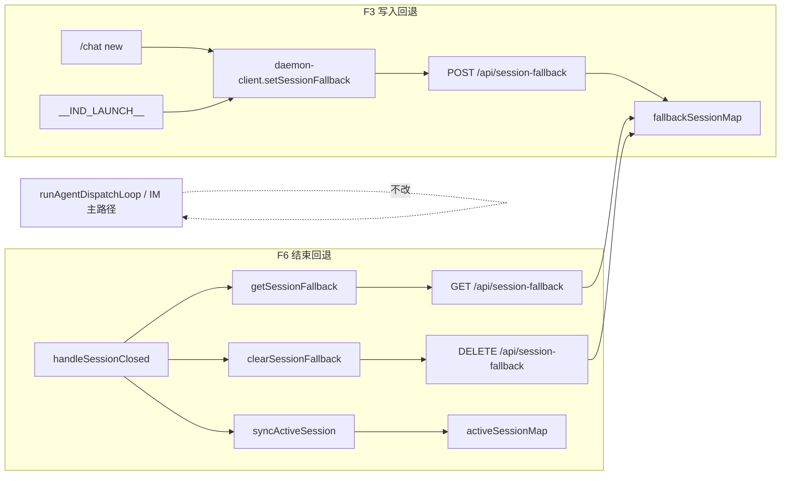

# Orchestrator 会话路由 SSOT 收尾 - 代码评审报告

## 1、审查范围

- **变更类型**: apply 产出的未提交变更（Daemon 回退栈 SSOT + Electron 改调 + dead code/KB 同步）
- **评审等级**: full-review
- **涉及文件**: 8 个实现/知识文件 + 变更文档（T1～T3 done，T4 deferred）
- **设计文档**: `02-design.md`（对照基准）
- **CodeGraph**: 工作区未初始化 `.codegraph/`，本次以 diff + Grep + 源码通读替代调用链复核

| 文件 | 行数 | 备注 |
|------|------|------|
| `src/daemon/daemon-session-routing.ts` | 21 | 新建 ✅ |
| `src/daemon/daemon-http-routes.ts` | 461 | 历史超限（机械拆分遗留），本次 +42 行路由 |
| `electron/daemon/daemon-client.ts` | 161 | ✅ |
| `electron/session/session-dispatcher.ts` | 677 | 历史超限，未扩 scope |
| `electron/daemon/daemon-manager.ts` | 1600 | 历史超限，未扩 scope |

## 2、严重（必须处理）

无

## 3、警告（建议处理）

1. **`daemon-session-routing.ts` helper 未接入 HTTP 路由**
   - 位置: `src/daemon/daemon-session-routing.ts:9-21`；`src/daemon/daemon-http-routes.ts:324-349`
   - 说明: 模块导出 `set/get/clearSessionFallback`，但路由 handler 直接操作 `deps.fallbackSessionMap`，helper 成为 dead code。建议路由改调 helper（便于 T4 持久化 hook）或删除 helper 仅保留 Map 导出。评分 ~55，不阻断 archive。
   - Ponytail: `shrink:` 路由三处 `.set/.get/.delete` → 调 `daemon-session-routing` helper；`net: -0 lines`（语义集中，非删行）

2. **`daemon-http-routes.ts` 仍超 300 行**
   - 位置: `src/daemon/daemon-http-routes.ts`（461 行）
   - 说明: 02-design 与 AGENTS 已注明历史债务；本次仅追加 session-fallback 三路由，未恶化结构。后续独立变更继续拆分。评分 ~50。

3. **01 §六 验收 1～4 未在评审环境手动回归**
   - 位置: 端到端（`/chat new`、Electron 重启、`__IND_LAUNCH__`、容错分支）
   - 说明: 代码路径与 02 F3/F6 门控一致，`npm run build` 通过；跨进程行为须 archive 前或发布前手动点验。评分 ~50，记入 §7 遗留。

## 4、设计偏差

1. **路由层 bypass session-routing helper**
   - 设计预期: 02 §三「服务层 set/get/clear 读写 Map」；`daemon-session-routing.ts` 提供 helper。
   - 实际实现: `daemon.ts` 仅 import `fallbackSessionMap` 注入 deps；HTTP 路由直接 Map 操作，helper 未被引用。
   - 影响: 功能等价；若 T4 持久化需在写路径统一 hook，当前需改路由或改注入方式。

无其他与 02-design 实质偏差。T4 持久化按 design 标 `deferred`，manifest 已记录。

## 5、验收标准检查

| 任务 | 验收条件 | 状态 |
|------|---------|------|
| T1 | 三路由与 02 §四 契约一致（POST/GET/DELETE、400/幂等） | ✅ |
| T1 | `activeSessionMap` 既有行为无回归 | ✅ |
| T1 | 新增 `daemon-session-routing.ts` ≤300 行 | ✅ |
| T1 | 中文注释 | ✅ |
| T2 | `rg previousActiveSessionMap` 源码零命中 | ✅ |
| T2 | `handleSessionClosed` 经 Daemon API 读写，不读 Electron Map | ✅ |
| T2 | `/chat new` 与 `__IND_LAUNCH__` 写 `setSessionFallback` | ✅ |
| T2 | IM 主路径无 Electron 队列扫描回归 | ✅ |
| T2 | 01 验收 1～4 手动场景 | ⏳ 待手动（见 §7） |
| T3 | `rg dispatchSessionAgents` 源码零命中 | ✅ |
| T3 | `02-多会话模型.md` SSOT 描述更新 | ✅ |
| T3 | `05-定时任务.md` → `runAgentDispatchLoop` | ✅ |
| T3 | `npm run build` 通过 | ✅ |
| T4 | session-routing 持久化 | ⏸ deferred（符合 design） |

**工程补充（02 §八·二）**

| 项 | 状态 |
|----|------|
| `rg dispatchSessionAgents` 源码零命中 | ✅ |
| `rg previousActiveSessionMap` 源码零命中 | ✅ |
| `npm run build` | ✅ |
| 单文件 ≤300（新增/修改） | ⚠️ `daemon-http-routes` 历史超限已注明 |
| T4 manifest deferred | ✅ |

## 6、调用链与回归风险

| 回归点 | 风险 | 缓解 |
|--------|------|------|
| Daemon/Electron 版本不一致，新 API 404 | 低 | client catch 静默，等同现网「无回退」 |
| `getSessionFallback` 失败误判无回退 | 低 | 与 `syncActiveSession` 同策略 |
| Daemon 重启丢失回退栈 | 已知 | 01 非目标；T4 deferred |
| IM 调度回归 Electron | 无 | 源码无 `dispatchSessionAgents`；Electron 无 dispatch loop |

## 7、遗留债务

- **手动 E2E**：01 §六 验收 1～4（含 Electron 重启场景 B）建议在 `/kb-archive` 前或发布 checklist 中执行一次。
- **T4 持久化**：`session-routing.json` 未实现，manifest `T4` 为 `deferred`，与 01 非目标一致。
- **`daemon-http-routes.ts` 行数**：461 行，属前序「巨型单体拆分」债务，非本变更引入。

## 8、修复任务建议

| 问题 ID | 建议动作 | 关联任务 |
|---------|----------|----------|
| — | 无 open 阻断项；可选：路由接入 `daemon-session-routing` helper 或删 unused helper | 可并入 T4 或独立 ponytail |

## 9、结论

**通过**，可进入 `/kb-archive`。

实现与 02-design / 03-tasks（T1～T3）一致：回退栈 SSOT 已迁至 Daemon，`previousActiveSessionMap` 与 `dispatchSessionAgents` 已从源码清除，知识库已同步，`npm run build` 通过。无评分 ≥75 的阻断问题；§3 警告与 §7 手动回归建议在归档或发布前消化，不阻止 archive 流程。
