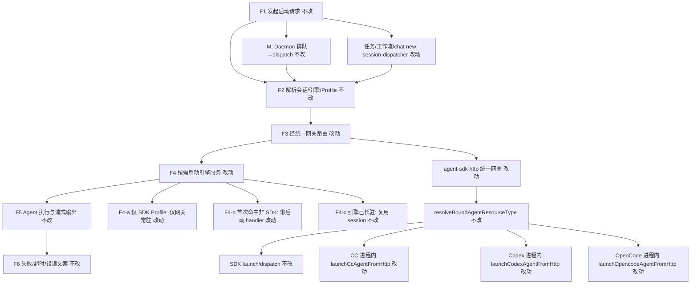
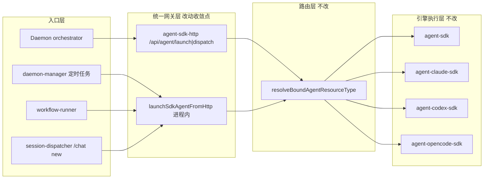

# Agent 启动路径收敛 - 实现设计

> **业务 PRD**：见同目录 `01-proposal.md`（验收标准以 01 为准）

## 一、业务流程与改动范围

> 业务口径以 `01-proposal.md` §四「业务流程」为准；下图覆盖主流程 F1～F6 与关键分支 F4-a/b/c。

### （一）业务流程图

**图例**：`不改` 行为与现网一致；`改动` 需改代码；`新增` 本变更无新增产品节点；`删除` 移除 session-dispatcher 四引擎直连分支及 init 无条件 ensure*HttpServer。

### （二）流程步骤与改动对照

| 步骤 ID | 业务含义 | 改动 | 落点（模块/文件） | 01 验收关联 |
|---------|----------|------|-------------------|-------------|
| F1 | 用户/系统发起 Agent 启动（IM、定时任务、工作流、chat new） | 不改 | 各入口保持：`src/daemon/daemon-orchestrator.ts`、`electron/session/session-dispatcher.ts`、`electron/daemon/daemon-manager.ts` | 验收 2（四入口行为） |
| F2 | 解析目标会话、引擎类型与 Profile | 不改 | `electron/agent/cursor-sdk/agent-sdk-http.ts` `resolveBoundAgentResourceType`；`session-dispatcher.ts` `launchAgent` 前置校验 | 验收 2 |
| F3 | 请求统一经统一网关路由 | 改动 | **删除** `session-dispatcher.ts:372-401` CC/Codex/OpenCode 直连 POST；**改为** 进程内 `launchSdkAgentFromHttp` 或 `http://127.0.0.1:{agentApiPort}/api/agent/launch`（`agent-sdk-http.ts`）；SDK 分支**删除**经 Daemon 三角跳转（`session-dispatcher.ts:362-370`） | 验收 1、2；R1 |
| F3-IM | IM 入站经 Daemon `forwardElectronAgentApi` → 统一网关 | 不改 | `src/daemon/daemon-orchestrator.ts:91-104`、`224`；`agent-sdk-http.ts:217-220` | 验收 2 场景 B |
| F4 | 目标引擎服务未运行且需要时按需启动 | 改动 | **删除** `initSessionDispatcher` 内 `ensureClaudeCodeHttpServer/ensureCodexHttpServer/ensureOpencodeHttpServer`（`session-dispatcher.ts:674-676`）；首次 launch 经 `launchSdkAgentFromHttp` 进程内委托各引擎 handler，**不**再依赖各引擎独立 HTTP server 监听 | 验收 1、3；R2、R4 |
| F4-a | 仅 SDK Profile：进程内仅 1 个 Agent 服务实例（统一网关） | 改动 | `electron/daemon/daemon-manager.ts:1243` 保留 `ensureAgentSdkHttpServer`；`initSessionDispatcher` 不再拉起 CC/Codex/OpenCode server | 验收 1；R3 |
| F4-b | 多引擎 Profile 首次命中非 SDK 引擎 | 改动 | `agent-sdk-http.ts:124-130` 进程内 `launch*AgentFromHttp`；各 `agent-*-sdk.ts` 模块加载时已 `register*LaunchHandler` | 验收 2 场景 F；R4 |
| F4-c | 引擎已长驻，跳过启动直接进入执行 | 不改 | 各引擎 session registry + resident 语义（`agent-sdk.ts`、`agent-claude-sdk.ts` 等） | 验收 2 |
| F5 | Agent 执行 Prompt/Run，流式输出与完成通知 | 不改 | 四引擎既有 Run 链；Daemon Presentation/stream-text | 验收 2；R5 |
| F6 | 失败、超时、watchdog 与用户可见错误文案 | 不改 | 各引擎 failure-messages / finalizer | 验收 2；R5 |
| INV-1 | IM 入站 → Daemon 排队 → Orchestrator dispatch | 不改 | `daemon-orchestrator.ts`、`daemon-http-routes.ts` | 01 非目标 |
| INV-2 | 会话活跃路由与临时会话回退 | 不改 | Daemon SSOT（前序归档变更） | 01 非目标 |

### （三）改动汇总

- **改动**：
  - `session-dispatcher.launchAgent` 全引擎统一走 `agent-sdk-http`（进程内 `launchSdkAgentFromHttp` 优先，避免 SDK 任务 Electron→Daemon→Electron 三角跳转）。
  - 删除 `launchAgent` 内 CC/Codex/OpenCode 按端口直连分支（`session-dispatcher.ts:372-401`）。
  - `initSessionDispatcher` 移除无条件 `ensureClaudeCodeHttpServer/ensureCodexHttpServer/ensureOpencodeHttpServer`。
  - `ensureAgentSdkHttpServer` 仍在 `initDaemonManager` 常驻（Daemon IM 依赖 `agent-api-port.json`）。
- **新增**：无（复用既有 `launchSdkAgentFromHttp` / `dispatchAgentFromHttp`）。
- **删除**：session-dispatcher 四引擎分叉 HTTP 客户端路径；应用启动时无条件拉起三非 SDK 引擎 HTTP server。
- **不改（显式列出）**：
  - Daemon `POST /api/agent/launch|dispatch` 对外契约与 `forwardElectronAgentApi` 转发逻辑。
  - `resolveBoundAgentResourceType` 路由规则与各引擎 launch/dispatch handler 实现。
  - 四引擎长驻、watchdog、ContextRotation、失败 notify 语义。
  - 飞书卡片、Electron UI、`/chat new` 指令语法。

## 二、整体思路

**根因**（见 01 §一）：四引擎增量接入后，`session-dispatcher.launchAgent` 对 CC/Codex/OpenCode 走各引擎独立 HTTP 端口，且 `initSessionDispatcher` 无条件 `ensure*HttpServer`，导致仅 SDK 用户仍常驻 4 个 HTTP 服务；任务/工作流/chat new 与 IM 路径不一致。

**方案要点**（双方向，见本变更推荐方案）：

1. **统一网关 SSOT**：所有 launch 经 `agent-sdk-http` 的 `/api/agent/launch`（或同进程 `launchSdkAgentFromHttp`）。`resolveBoundAgentResourceType` 已在网关内按通道资源委托 `launchCcAgentFromHttp` / `launchCodexAgentFromHttp` / `launchOpencodeAgentFromHttp`（`agent-sdk-http.ts:107-130`），IM 路径已满足；本变更补齐 **Electron 侧本地入口**（定时任务、工作流、`/chat new`）。
2. **引擎服务懒加载**：应用 init 仅 `ensureAgentSdkHttpServer`；非 SDK 引擎在 **首次实际 launch** 时由进程内 handler 启动 Run（无需先起独立 HTTP server）。各 `ensure*HttpServer` 可从 init 热路径移除；若后续无外部调用方，per-engine HTTP server 可择机下线（非本期必做）。

**边界**：不迁移 IM 调度出 Daemon；不改动 Orchestrator 会话路由 SSOT；T3「shared launch-request 解析」scope 过大，**defer** 至后续变更。

**最小方案三问**：

1. **复用现有模块？** 是。统一入口复用 `launchSdkAgentFromHttp` / `dispatchAgentFromHttp` 与 `resolveBoundAgentResourceType`，不新建网关抽象层。
2. **新增抽象/依赖？** 否。01 未要求新 HTTP 契约或 shared 解析模块；T3 defer，YAGNI。
3. **合并到已有文件？** 是。改动集中在 `session-dispatcher.ts`（删除分支 + 改调用）与 `initSessionDispatcher`（删 ensure 三行）；`agent-sdk-http.ts` 仅必要时补懒加载注释或 ensure 钩子，不预建 `shared/launch-request.ts`。

## 三、分层设计

- **端点层**：Daemon `forwardElectronAgentApi`（`daemon-orchestrator.ts:91`）读 `agent-api-port.json` 转发；Electron 本地入口改调进程内 `launchSdkAgentFromHttp`。
- **服务层**：`agent-sdk-http.ts` 为 launch/dispatch SSOT；`session-dispatcher.ts` 仅组装 `launchBody` 并委托网关。
- **数据层**：无 schema 变更；端口文件仍仅 `agent-api-port.json` 在仅 SDK Profile 下写入。

## 四、接口设计

无新增对外 HTTP 契约。沿用：

| 方法 | 路径 | 说明 |
|------|------|------|
| POST | `/api/agent/launch` | Daemon 与 Electron 统一网关；body 字段与现网 `launchBody` 一致（`session_key`、`chat_type`、`task_text`、`channel_id` 等） |
| POST | `/api/agent/dispatch` | IM 二次调度；`dispatchAgentFromHttp` 按路由委托 |

**内部变更**：`session-dispatcher.launchAgent` 不再调用 `/api/cc/agent/launch`、`/api/codex/agent/launch`、`/api/opencode/agent/launch` 及 Daemon 侧 SDK 绕路。

## 五、数据结构

无。`LaunchMeta`、`launchBody` 字段与 `session-dispatcher.ts:340-360` 现网组装保持一致；不新增 DB/配置文件。

## 六、实现步骤

实现顺序供 `03-tasks` 引用；每步回溯「一·（二）」步骤 ID。

1. **T1 / 统一 launchAgent 网关**（F3、F3-IM 对齐本地入口）：在 `session-dispatcher.launchAgent` 删除 `resource.type` 四分支（`362-401`）；统一 `import { launchSdkAgentFromHttp } from "../agent/cursor-sdk/agent-sdk-http"` 并 `return launchSdkAgentFromHttp(launchBody)`。清理不再使用的 `getCcAgentApiPort` 等 import。
2. **T2 / init 懒加载**（F4、F4-a、F4-b）：从 `initSessionDispatcher`（`664-677`）移除三行 `ensure*HttpServer`；确认 `initDaemonManager`（`1237-1243`）仍调用 `ensureAgentSdkHttpServer`。验证仅 SDK Profile 冷启动后仅存在 `agent-api-port.json` 对应 1 个监听进程。
3. **T3 / shared launch-request（deferred）**：本期不实施；body 解析仍分散在 `session-dispatcher` 与 `agent-sdk-http`，待后续变更收敛。
4. **T4 / 知识库**（R6）：archive 阶段更新 `knowledge/业务域/Agent调度/03-启动与自动重连.md` §二为全路径统一网关描述。
5. **T5 / AGENTS 沉淀**：同步 `electron/session/AGENTS.md`、`electron/AGENTS.md` 中「任务/工作流经 Daemon launch」表述为「经统一网关」。
6. **回归验证**（F5、F6）：四引擎 × IM/任务/工作流/chat new；`npm run build`（01 验收 4）。

## 七、参考实现

CodeGraph 未初始化，以下经源码核实（`projectPath: /home/suveng/doger/cursor-claw`）：

| 符号 | 路径 | 职责 |
|------|------|------|
| `launchAgent` 四引擎分支 | `electron/session/session-dispatcher.ts:362-401` | **待删除**直连分支 |
| `initSessionDispatcher` | `electron/session/session-dispatcher.ts:664-677` | **待移除**无条件 ensure 三引擎 |
| `launchSdkAgentFromHttp` | `electron/agent/cursor-sdk/agent-sdk-http.ts:107-187` | 统一 launch SSOT |
| `resolveBoundAgentResourceType` | `electron/agent/cursor-sdk/agent-sdk-http.ts:67-89` | 通道→引擎路由 |
| `dispatchAgentFromHttp` | `electron/agent/cursor-sdk/agent-sdk-http.ts:91-105` | 统一 dispatch |
| `ensureAgentSdkHttpServer` | `electron/agent/cursor-sdk/agent-sdk-http.ts:194-233` | 网关常驻 |
| `forwardElectronAgentApi` | `src/daemon/daemon-orchestrator.ts:91-104` | Daemon→Electron 转发 |
| `initDaemonManager` | `electron/daemon/daemon-manager.ts:1237-1243` | init 调 `initSessionDispatcher` + `ensureAgentSdkHttpServer` |
| `launchIndependentAgent` / `launchWorkflowAgent` | `session-dispatcher.ts:412-430` | 任务/工作流入口，经 `launchAgent` |
| `registerCcLaunchHandler` 等 | `agent-claude-sdk.ts:253`、`agent-codex-sdk.ts:279`、`agent-opencode-sdk.ts:253` | 模块加载注册，支撑进程内 launch |

## 八、技术影响

### （一）影响范围

- **涉及模块**：`electron/session/session-dispatcher.ts`、`electron/daemon/daemon-manager.ts`（仅 init 顺序确认）、`electron/agent/cursor-sdk/agent-sdk-http.ts`（只读/极小注释）、知识库 `03-启动与自动重连.md`。
- **接口/proto 变更**：无对外契约变更。
- **数据变更**：无。
- **风险**：
  - 首次非 SDK launch 若 handler 未注册会返回「launch handler 未注册」——须保证各 `agent-*-sdk.ts` 在 `launchSdkAgentFromHttp` 可达前已 import（现网 `agent-sdk-http.ts` 已静态 import）。
  - 删除 per-engine HTTP server 后，若有隐藏调用方 POST 各引擎端口将 404——grep 显示仅 `session-dispatcher` 调用，风险低。
  - SDK 任务路径改进程内后，须保持与 Daemon 转发路径相同的 `launchBody` 字段，避免行为回归。

### （二）工程补充验收项

- [ ] 仅 SDK Profile 冷启动：进程内 HTTP 监听仅 `agent-api-port.json` 对应 1 实例；无 `cc-agent-api-port.json` / `codex-agent-api-port.json` / `opencode-agent-api-port.json` 写入（除非后续手动触发该引擎）。
- [ ] `launchAgent` 源码中不存在 `getCcAgentApiPort` / `getCodexAgentApiPort` / `getOpencodeAgentApiPort` 调用。
- [ ] 定时任务、工作流、`/chat new` 触发 CC/Codex/OpenCode 时，日志可见统一网关路由而非独立端口 POST。
- [ ] IM 路径 `forwardElectronAgentApi("/api/agent/launch")` 行为与变更前一致（冒烟）。

## 九、知识库影响

- `knowledge/业务域/Agent调度/03-启动与自动重连.md` — §二「四引擎路由」与现网双轨描述冲突，须更新（01 R6）。
- `knowledge/业务域/Agent调度/06-CursorSDK执行引擎.md` — 可补充「本地入口亦经 agent-sdk-http」一句（视 archive 篇幅）。
- `knowledge/业务域/Agent调度/00-README.md` — 若 §二 变更后阅读路径变化可轻量索引。
- 两级索引：本次为局部架构收敛，**不必**改根 `知识索引.md`。

## 十、知识库更新计划

### （一）必须更新

- `knowledge/业务域/Agent调度/03-启动与自动重连.md` §二：改为「全路径（IM + 任务 + 工作流 + chat new）经 `agent-sdk-http` 统一网关；应用 init 仅常驻 SDK 网关；非 SDK 引擎首次 launch 进程内委托」。

### （二）可能更新（视实现结果）

- `electron/session/AGENTS.md`、`electron/AGENTS.md` — launch 路径表述与 init 懒加载约定。
- `knowledge/业务域/Agent调度/06-CursorSDK执行引擎.md` — 统一网关边界补充（若 T5 未完全覆盖）。

### （三）不需要更新

- `knowledge/业务域/Agent调度/02-多会话模型.md` — 会话路由 SSOT 正交，本变更不触及。
- `knowledge/业务域/消息桥接/` — 飞书展示与入队语义不变。
- 各引擎子模块知识（07–09）— launch handler 实现不变，仅到达路径收敛。
