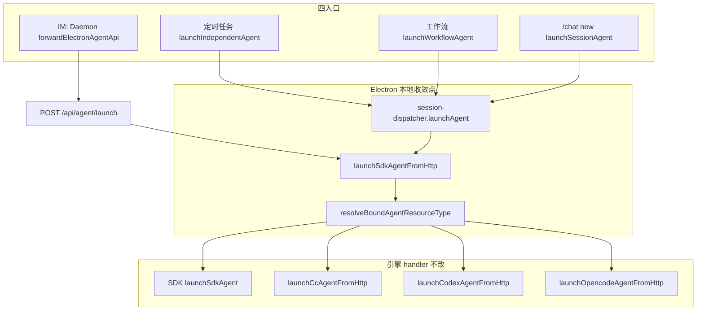

# Agent 启动路径收敛 - 代码评审报告

## 1、审查范围

- **变更类型**: apply 产出的未提交变更（`launchAgent` 统一网关 + init 懒加载 + 知识库/AGENTS 同步）
- **评审等级**: focused-review
- **涉及文件**: 8 个（1 代码 + 2 知识 + 4 AGENTS + 变更文档）
- **设计文档**: `02-design.md`（对照基准）
- **CodeGraph**: 工作区未初始化 `.codegraph/`，本次以 diff + Grep + 源码通读替代调用链复核

| 文件 | 行数 | 备注 |
|------|------|------|
| `electron/session/session-dispatcher.ts` | 637 | 历史超限，本次净删 ~40 行直连分支 |
| `electron/daemon/daemon-manager.ts` | — | 仅确认 `ensureAgentSdkHttpServer` 未动 |
| `knowledge/业务域/Agent调度/03-启动与自动重连.md` | — | §二/§四/§五/§十 已同步 |
| `electron/*/AGENTS.md`（4 处） | — | 统一网关口径已沉淀 |

## 2、严重（必须处理）

无

## 3、警告（建议处理）

1. **`cursor-sdk/AGENTS.md` 统一网关描述轻微重复**
   - 位置: `electron/agent/cursor-sdk/AGENTS.md:13` 与 `:31`（「SDK 长驻 Agent」段末「Daemon 统一入口路由」）
   - 说明: T5 新增 §「统一网关 SSOT」后，长驻段仍保留旧版路由一句，语义一致但重复。评分 ~50，不阻断 archive；archive 时可合并为单处引用。
   - Ponytail: `shrink:` 长驻段路由句 → 引用 L13「统一网关 SSOT」；`net: -1 句`

2. **01 §六 验收 2 四引擎 × 四入口未在评审环境手动回归**
   - 位置: 端到端（IM / 定时任务 / 工作流 / `/chat new` × SDK/CC/Codex/OpenCode）
   - 说明: 代码路径已收敛至 `launchSdkAgentFromHttp` → `resolveBoundAgentResourceType` → 各 handler；`npm run build` 通过。跨引擎行为须在 archive 前或发布 checklist 点验。评分 ~50，记入 §7。

无评分 ≥75 的警告项。

## 4、设计偏差

无实质偏差。

- T1：`launchAgent` 已删除四引擎分叉（含 SDK Daemon 三角跳转、CC/Codex/OpenCode 独立端口 POST），统一 `return launchSdkAgentFromHttp(launchBody)`（`session-dispatcher.ts:362-363`）。
- T2：`initSessionDispatcher` 已移除三行 `ensure*HttpServer`；`initDaemonManager` 仍调用 `ensureAgentSdkHttpServer()`（`daemon-manager.ts:1243`）。
- T3：按 design defer，diff 无 `launch-request` 新建文件。
- T4 在 apply 阶段提前完成（01 原写 archive 验收知识库，提前满足验收 3，属正向）。

## 5、验收标准检查

| 任务 | 验收条件 | 状态 |
|------|---------|------|
| T1 | `launchAgent` 无 `getCc/Codex/OpencodeAgentApiPort` 调用 | ✅ Grep 零命中 |
| T1 | 统一 `launchSdkAgentFromHttp`，含中文注释 | ✅ |
| T1 | 四引擎四入口行为不回归 | ⏳ 待手动（见 §7） |
| T1 | IM `forwardElectronAgentApi` 路径未改 | ✅ Daemon 源码无 diff |
| T1 | `npm run build` | ✅ 评审复验通过 |
| T2 | `initSessionDispatcher` 无 `ensureClaudeCode/Codex/OpencodeHttpServer` | ✅ |
| T2 | `initDaemonManager` 仍 `ensureAgentSdkHttpServer` | ✅ |
| T2 | 仅 SDK Profile 冷启动仅 1 网关实例 | ✅ 逻辑满足（init 仅网关） |
| T2 | 四引擎行为不回归 | ⏳ 待手动 |
| T3 | manifest `deferred`、无 launch-request 文件 | ✅ |
| T4 | `03-启动与自动重连.md` §二 全路径统一网关 | ✅ |
| T4 | 不再描述任务/工作流双轨直 POST | ✅ |
| T5 | `electron/session/AGENTS.md` 统一网关表述 | ✅ |
| T5 | `electron/AGENTS.md` 四入口 + init 懒加载 | ✅ |
| T5 | `electron/agent/cursor-sdk/AGENTS.md` 双入口汇入 | ✅ |
| T5 | `electron/daemon/AGENTS.md` Daemon 桥接一句 | ✅ |

**01 验收标准**

| 编号 | 条件 | 状态 |
|------|------|------|
| 1 | 仅 SDK Profile 常驻 1 个 Agent 服务实例 | ✅ init 路径已收敛 |
| 2 | 四引擎 IM+任务+工作流+chat new 不回归 | ⏳ 待手动 E2E |
| 3 | 知识库 §二 与实现一致 | ✅ T4 已落地 |
| 4 | `npm run build` 通过 | ✅ |

**工程补充（02 §八·二）**

| 项 | 状态 |
|----|------|
| `launchAgent` 无 per-engine 端口 getter 调用 | ✅ |
| init 仅网关常驻 | ✅ |
| `npm run build` | ✅ |
| 单文件 ≤300 | ⚠️ `session-dispatcher.ts` 637 行 → §7 accepted_debt |
| T3 deferred | ✅ |

## 6、调用链与回归风险

| 回归点 | 风险 | 缓解 |
|--------|------|------|
| 首次非 SDK launch handler 未注册 | 低 | `agent-sdk-http.ts` 静态 import 各 `agent-*-sdk.ts`，模块加载即 `register*LaunchHandler` |
| 隐藏调用方仍 POST per-engine 端口 | 低 | Grep 仅 `agent-*-http.ts` 定义路由，无其他调用方 |
| SDK 任务路径改进程内后 `launchBody` 字段漂移 | 低 | `launchBody` 组装未变，网关内二次解析与 IM 路径同源 |
| 仅 SDK 用户仍被拉起三引擎 HTTP server | 无 | init 三行 ensure 已删 |
| IM 路径行为变化 | 无 | Daemon/orchestrator 无 diff |

## 7、遗留债务

| ID | 描述 | 状态 |
|----|------|------|
| R-DEBT-01 | `session-dispatcher.ts` 637 行，超 AGENTS ≤300 规范；与 Orchestrator 变更同类，本期仅删分支未拆分 | **accepted_debt** |
| — | 01 验收 2 四引擎 × 四入口手动 E2E | 建议 archive/发布 checklist 执行，不阻断 archive |
| — | T3 `shared/launch-request` 解析收敛 | **deferred**（manifest T3，符合 02 §二 YAGNI） |

## 8、修复任务建议

| 问题 ID | 建议动作 | 关联任务 |
|---------|----------|----------|
| — | 无 open 阻断项 | — |
| R-DEBT-01 | 后续独立变更按设计模式拆分 `session-dispatcher.ts` | 可并入「巨型单体拆分」变更 |

## 9、结论

**通过**，可进入 `/kb-archive`。

实现与 `02-design.md` / `03-tasks.md`（T1/T2/T4/T5 done，T3 deferred）一致：`launchAgent` 已统一经 `launchSdkAgentFromHttp`，`initSessionDispatcher` 已移除三引擎无条件 ensure，`ensureAgentSdkHttpServer` 仍由 `daemon-manager` 常驻，知识库 §二与 AGENTS 已与代码对齐，`npm run build` 通过。无 open 阻断项；`session-dispatcher.ts` 行数债务已记为 accepted_debt。
