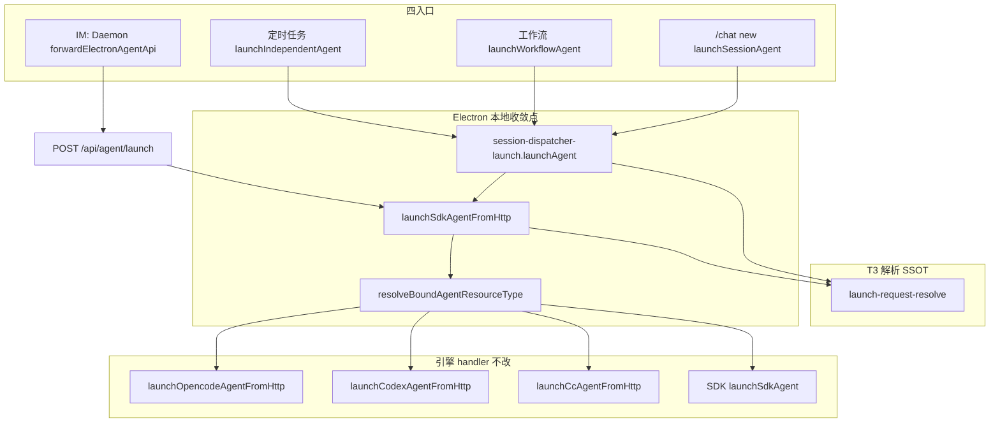

# Agent 启动路径收敛 - 代码评审报告

> **复评（2026-07-11）**：用户不接受债务；T-DEBT-1（session-dispatcher 拆分）与 T3（launch-request-resolve 五处收敛）已落地。本次对照 `02-design.md` / `03-tasks.md` 与实现 diff 复评。

## 1、审查范围

- **变更类型**: apply 产出的未提交变更（T1/T2 网关收敛 + T-DEBT-1 拆分 + T3 解析 SSOT + T4/T5 知识/AGENTS）
- **评审等级**: focused-review
- **涉及文件**: 16 个（7 代码 + 2 知识 + 4 AGENTS + 3 变更文档）
- **设计文档**: `02-design.md`（对照基准；T3 以 `03-tasks.md` 为准已纳入本期）
- **CodeGraph**: 工作区未初始化 `.codegraph/`（`codegraph init` 未执行）；本次以 Grep + 源码通读 + `npm run build` 替代调用链复核

| 文件 | 行数 | 备注 |
|------|------|------|
| `electron/session/session-dispatcher.ts` | 46 | 薄 re-export 入口 |
| `electron/session/session-dispatcher-launch.ts` | 159 | `launchAgent` → `launchSdkAgentFromHttp` |
| `electron/session/session-dispatcher-chat.ts` | 174 | `/chat` 命令，委托 `launch-request-resolve` |
| `electron/session/session-dispatcher-lifecycle.ts` | 212 | `initSessionDispatcher` 无三引擎 ensure |
| `electron/session/session-dispatcher-runtime.ts` | 62 | 运行态查询 |
| `electron/session/session-dispatcher-shared.ts` | 32 | 共享工具 |
| `electron/agent/shared/launch-request-resolve.ts` | 234 | T3 解析 SSOT（新建） |
| `electron/agent/cursor-sdk/agent-sdk-http.ts` | 200 | 改调共享解析 |
| `electron/agent/claude-code/agent-cc-http.ts` | 256 | 改调共享解析 |
| `electron/agent/codex/agent-codex-http.ts` | 187 | 改调共享解析 |
| `electron/agent/opencode/agent-opencode-http.ts` | 182 | 改调共享解析 |

**行数合规**：上述代码文件均 ≤300 行（AGENTS 规范）。

## 2、严重（必须处理）

无

## 3、警告（建议处理）

1. **01 §六 验收 2 四引擎 × 四入口未在评审环境手动回归**
   - 位置: 端到端（IM / 定时任务 / 工作流 / `/chat new` × SDK/CC/Codex/OpenCode）
   - 说明: 代码路径已收敛至 `launchSdkAgentFromHttp` → `resolveBoundAgentResourceType` → 各 handler；五处 body 解析已 SSOT。`npm run build` 复验通过。跨引擎行为须在 archive 前或发布 checklist 点验。评分 ~50，不阻断 archive。

2. **`cursor-sdk/AGENTS.md` 统一网关描述轻微重复**
   - 位置: `electron/agent/cursor-sdk/AGENTS.md:13` 与长驻 Agent 段末路由句
   - 说明: 语义一致，T5 后 §「统一网关 SSOT」与长驻段各有一句。评分 ~50，archive 时可合并引用。Ponytail: `shrink:` 长驻段 → 引用 L13；`net: -1 句`

无评分 ≥75 的警告项。

## 4、设计偏差

无实质偏差（正向扩展已纳入 `03-tasks.md`）。

- **T1**：`session-dispatcher-launch.ts` 内 `launchAgent` 组装 `launchBody` 后统一 `return launchSdkAgentFromHttp(launchBody)`（L105-106）；Grep `electron/session/**` 无 `getCc/Codex/OpencodeAgentApiPort`。
- **T2**：`initSessionDispatcher`（`session-dispatcher-lifecycle.ts:203-212`）仅注册 resolver/observability，**无** `ensureClaudeCode/Codex/OpencodeHttpServer`；`daemon-manager.ts:1243` 仍 `ensureAgentSdkHttpServer()`。
- **T-DEBT-1**：637 行单体已拆为 6 文件 + 46 行 re-export；对外 import 路径不变（`daemon-manager`、`workflow-runner` 仍 `from '../session/session-dispatcher'`）。
- **T3**：`launch-request-resolve.ts` 为五入口唯一 body/workDir/model 解析 SSOT；`02-design.md` §六 原写 defer，以 `03-tasks.md` T3 任务为准本期已实施。
- **T4/T5**：知识库 §二与 AGENTS 口径与代码一致（前次评审已验，本次拆分后 `session/AGENTS.md` 已同步子模块边界）。

## 5、验收标准检查

| 任务 | 验收条件 | 状态 |
|------|---------|------|
| T1 | `launchAgent` 无 per-engine 端口 getter | ✅ Grep 零命中 |
| T1 | 统一 `launchSdkAgentFromHttp`，含中文注释 | ✅ `session-dispatcher-launch.ts:3,105-106` |
| T1 | 四引擎四入口行为不回归 | ⏳ 待手动 E2E（见 §3） |
| T1 | IM `forwardElectronAgentApi` 路径未改 | ✅ Daemon 无相关 diff |
| T1 | `npm run build` | ✅ 复验通过 |
| T2 | `initSessionDispatcher` 无三引擎 ensure | ✅ |
| T2 | `initDaemonManager` 仍 `ensureAgentSdkHttpServer` | ✅ `daemon-manager.ts:1243` |
| T2 | 仅 SDK Profile 冷启动仅 1 网关实例 | ✅ init 路径逻辑满足 |
| T2 | 四引擎行为不回归 | ⏳ 待手动 E2E |
| T-DEBT-1 | 各文件 ≤300 行 | ✅ 最高 212 行（lifecycle） |
| T-DEBT-1 | re-export 兼容、无调用方改 import | ✅ |
| T-DEBT-1 | R-DEBT-01 关闭 | ✅ `fixed` |
| T3 | 五处改调 `launch-request-resolve` | ✅ sdk-http + 3×engine-http + launch |
| T3 | 单文件 ≤300 行 | ✅ 234 行 |
| T3 | 四引擎四入口不回归 | ⏳ 待手动 E2E |
| T3 | `npm run build` | ✅ |
| T4 | `03-启动与自动重连.md` §二 全路径统一网关 | ✅ |
| T5 | 四处 AGENTS 统一网关口径 | ✅ |

**01 验收标准**

| 编号 | 条件 | 状态 |
|------|------|------|
| 1 | 仅 SDK Profile 常驻 1 个 Agent 服务实例 | ✅ |
| 2 | 四引擎 IM+任务+工作流+chat new 不回归 | ⏳ 待手动 E2E |
| 3 | 知识库 §二 与实现一致 | ✅ |
| 4 | `npm run build` 通过 | ✅ |

**工程补充（02 §八·二）**

| 项 | 状态 |
|----|------|
| `launchAgent` 无 per-engine 端口 getter | ✅ |
| init 仅网关常驻 | ✅ |
| 单文件 ≤300 | ✅（含拆分与 T3 新文件） |
| `npm run build` | ✅ |

## 6、调用链与回归风险

| 回归点 | 风险 | 缓解 |
|--------|------|------|
| 拆分后 export 遗漏 | 无 | `session-dispatcher.ts` 完整 re-export；调用方 grep 仅 2 处 import 未变 |
| T3 解析与旧内联逻辑漂移 | 低 | 五入口均 import 同一模块；`buildLaunchRequestBody` 字段与现网一致 |
| 首次非 SDK launch handler 未注册 | 低 | `agent-sdk-http.ts` 静态 import 各 `agent-*-sdk.ts` |
| 仅 SDK 用户仍被拉起三引擎 HTTP server | 无 | init 三行 ensure 已删且拆分后未回退 |
| IM 路径行为变化 | 无 | Daemon/orchestrator 无 diff |

## 7、遗留债务

无 accepted_debt。

- **R-DEBT-01**：已随 T-DEBT-1 拆分关闭（`fixed`）。
- **T3**：已实施，非 deferred。
- **01 验收 2 手动 E2E**：建议 archive/发布 checklist 执行，不阻断 archive。

## 8、修复任务建议

| 问题 ID | 建议动作 | 关联任务 |
|---------|----------|----------|
| — | 无 open 阻断项 | — |

## 9、结论

**通过**，可进入 `/kb-archive`。

T1/T2 行为未回退：`launchAgent` 统一经 `launchSdkAgentFromHttp`，`initSessionDispatcher` 不无条件 ensure 三引擎 HTTP；T-DEBT-1 清债完成（6 文件均 ≤300 行）；T3 五处 body 解析已收敛至 `launch-request-resolve.ts`；`npm run build` 通过。无 open 阻断项；无 accepted_debt。
