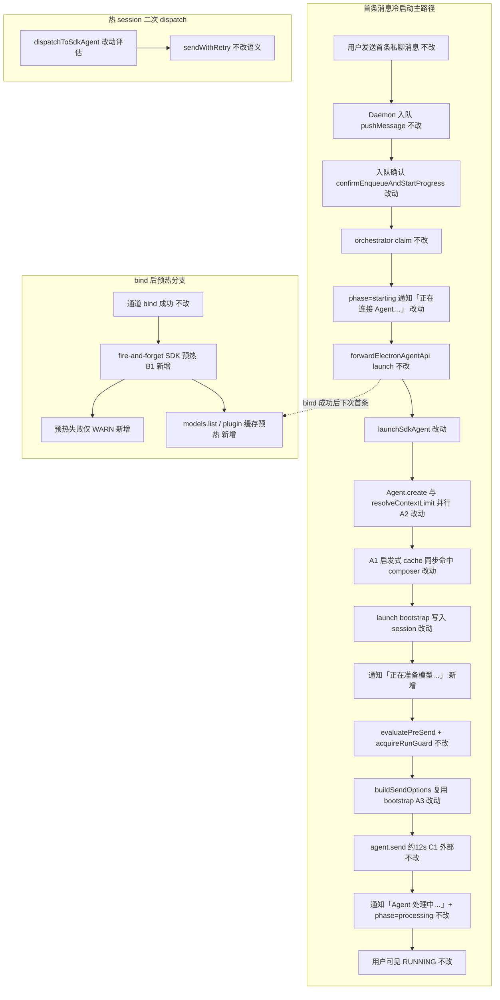
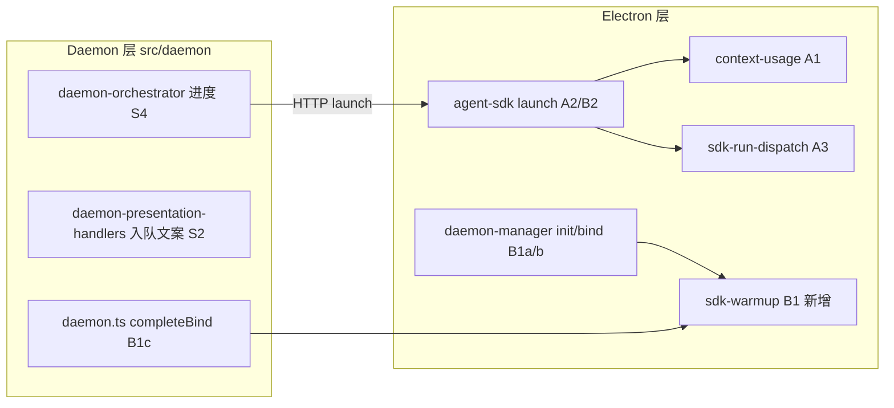

# SDK 首条冷启动优化 - 实现设计

> **业务 PRD**：见同目录 `01-proposal.md`（验收标准以 01 为准）

## 一、业务流程与改动范围

> 业务口径以 `01-proposal.md` 背景、方案说明与验收标准为准；下图覆盖首条冷启动主路径、bind 预热分支与失败回退。

### （一）业务流程图



**图例**：`不改` 行为与现网一致；`改动` 需改代码；`新增` 新节点或分支；`删除` 本期无删除路径。

### （二）流程步骤与改动对照

| 步骤 ID | 业务含义 | 改动 | 落点（模块/文件） | 01 验收关联 |
|---------|----------|------|-------------------|-------------|
| S1 | 用户首条消息入队 | 不改 | `src/daemon/daemon.ts` `pushMessage` | 验收 6 无回归 |
| S2 | 入队确认文案（phase=starting 时） | 改动 | `src/daemon/daemon-presentation-handlers.ts` `buildEnqueueStatusText` | 验收 5 B2 |
| S3 | orchestrator claim 合并批次 | 不改 | `src/daemon/daemon-orchestrator.ts` `claimForOrchestratorDispatch` | 验收 6 |
| S4 | launch 前进度 phase=starting | 改动 | `daemon-orchestrator.ts` `dispatchSessionToAgent` | 验收 5 B2 |
| S4a | 阶段 1 文案「正在连接 Agent…」 | 改动 | 同上 `notifySessionUser` | 验收 5 |
| S5 | HTTP 转发 launch | 不改 | `daemon-orchestrator.ts` `forwardElectronAgentApi` | 验收 1 |
| S6 | 启发式 context limit 同步 cache | 改动 | `electron/agent/cursor-sdk/context-usage.ts` `resolveModelContextLimit` | 验收 1、2 |
| S6b | models.list 后台 refresh | 改动 | 同上（fire-and-forget，不 await send 路径） | 验收 2 |
| S7 | Agent.create ∥ resolveContextLimit | 改动 | `electron/agent/cursor-sdk/agent-sdk.ts` `launchSdkAgent` | 验收 1 |
| S7b | send 前 Promise.all 边界 | 改动 | 同上（见 §二 A2 边界） | 验收 1、6 |
| S8 | launch 时 bootstrap 一次 | 改动 | `agent-sdk.ts` `bootstrapSdkPluginWorkspace` | 验收 3 |
| S8a | 阶段 2 文案「正在准备模型…」 | 新增 | `agent-sdk.ts` → `notifySessionChat`（create+limit 完成后、send 前） | 验收 5 |
| S9 | buildSendOptions 复用 bootstrap | 改动 | `electron/agent/cursor-sdk/sdk-run-dispatch.ts` `buildSendOptions` | 验收 3 |
| S9opt | session 缓存 launch bootstrap 元数据 | 改动（可选） | `electron/agent/cursor-sdk/sdk-session-types.ts` | 验收 3 |
| S10 | pre-send 阻断 / context footer | 不改 | `context-usage.ts` `evaluatePreSendContextPressure` 等 | 验收 6 |
| S11 | agent.send（外部耗时） | 不改（C1 外部） | `@cursor/sdk` | 01 非目标 |
| S12 | processing 通知与 RUNNING | 不改 | `sdk-run-lifecycle.ts` `startSdkRun` | 验收 6 |
| S13 | 热 session dispatch | 改动（评估） | `agent-sdk.ts` `dispatchToSdkAgent` | 验收 6 |
| B1a | 应用 init 后可选预热挂点 | 新增 | `electron/daemon/daemon-manager.ts` `initDaemonManager` | 验收 4 |
| B1b | Electron bind 成功回调预热 | 新增 | `daemon-manager.ts` `resolveBindWaiter` | 验收 4 |
| B1c | Daemon bind 写回侧预热 | 新增 | `src/daemon/daemon.ts` `completeBind` | 验收 4 |
| B1d | 预热实现与日志 | 新增 | 新建 `electron/agent/cursor-sdk/sdk-warmup.ts`（≤300 行） | 验收 4、7 |

### （三）改动汇总

- **改动**：A1 启发式优先 + 后台 `models.list`；A2 `launchSdkAgent` 并行 create/limit；A3 `buildSendOptions` 复用 launch bootstrap；B2 两阶段进度文案；`buildEnqueueStatusText` 对齐新文案。
- **新增**：`sdk-warmup.ts` 统一预热入口；launch 完成后 send 前的「正在准备模型…」通知；bind/init 三挂点 fire-and-forget 调用。
- **不改（显式列出）**：`agent.send` 本体（C1）；飞书卡片布局；`pre-send` 阻断阈值与 `context footer` 格式；`startSdkRun` 后「Agent 处理中…」；orchestrator 300ms debounce / busy 重排；热 session `resident-refresh` / `opaque_retry` 语义。

## 二、整体思路

根因见 01 §一：首条冷路径在 send 前**串行** `Agent.create`（~5s）→ `resolveContextLimitForSession`/`Cursor.models.list`（~5s）→ 二次 `bootstrapSdkPluginWorkspace`（~5s 级日志）→ `agent.send`（~12s，外部）。Daemon 调度 ~1.3s 非瓶颈。

方案要点（对齐 01 §三）：

1. **A1**：composer 等命中 `MODEL_LIMIT_HEURISTICS` 时同步写 `modelLimitCache` 并立即返回；`Cursor.models.list` 改后台 refresh，校正 cache，失败不阻断 send。
2. **A2**：`launchSdkAgent` 在 `ensureSdkBinaryPaths` 之后，用临时 `{ modelId, apiKey }` 与 `Agent.create` **并行**启动 `resolveContextLimitForSession`；**仅在** `Promise.all` 完成后组装 `session`、写入 `sdkSessions`，再 `evaluatePreSendContextPressure` → `acquireRunGuard` → `sendWithRetry`。**禁止**在 create 完成前调用 `agent.send` 或 `evaluatePreSendContextPressure`（依赖 session 对象）。
3. **A3**：launch 已将 `pluginBoot.mcpServers` 写入 `session.lastInjectedMcpServers`；`buildSendOptions` 优先复用该字段，跳过 `logSdkConfigSources` 内二次 `bootstrapSdkPluginWorkspace`（`detailed` 日志仅 launch 一次）。
4. **B1**：抽取 `warmupSdkAfterBind(opts)`，`void` 调用；内容：`ensureAgentSdkHttpServer` 已就绪前提下，对主工作区可选 `bootstrapSdkPluginWorkspace`（非 detailed）+ 后台 `resolveModelContextLimit("composer-2", apiKey)`；三挂点：`initDaemonManager`（已 bind 通道）、`resolveBindWaiter`、`completeBind`。
5. **B2 阶段与文案**（≥2 阶段，本期固定）：

| 阶段 key | 触发时机 | 用户可见文案 | 落点 |
|----------|----------|--------------|------|
| `starting_connect` | orchestrator `dispatchSessionToAgent` claim 后、HTTP launch 前 | **正在连接 Agent…** | `daemon-orchestrator.ts` |
| `starting_prepare` | Electron `launchSdkAgent`：`Promise.all(create, limit)` 成功后、`sendWithRetry` 前 | **正在准备模型…** | `agent-sdk.ts` `notifySessionChat` |
| `processing` | `agent.send` 成功后（现网） | **Agent 处理中…** | `sdk-run-lifecycle.ts`（不改） |

入队确认 `buildEnqueueStatusText`：当 `phase === "starting"` 时改为「已收到。正在连接 Agent，你的消息已排队」，与 S4a 一致。

**A2 并行 await 边界（实现硬约束）**：

```
ensureSdkBinaryPaths()
  ├─ createPromise = Agent.create({...})   // 含 launch bootstrap + mcpServers
  └─ limitPromise = resolveContextLimitForSession({ modelId, apiKey })
await Promise.all([createPromise, limitPromise])
// 此后才：构造 session → sdkSessions.set → evaluatePreSendContextPressure → send
```

- `limitPromise` **不得**依赖 `session.agent`；仅读写 `contextLimitTokens` 到即将构造的 session 字段。
- `createPromise` 失败则整段 launch 失败，**不**单独 send。
- `dispatchToSdkAgent`：若 `session.contextLimitTokens` 已缓存则 limit 为 no-op；**不**与 `maybeRefreshStaleResidentAgent` 强行并行（避免 resident 重建竞态）；仅记录「热路径收益有限，保持串行」。

**最小方案三问**（Ponytail）：

1. **能否复用现有模块？** 能。改动集中在 `context-usage.ts`、`agent-sdk.ts`、`sdk-run-dispatch.ts` 与 daemon 三文件；预热逻辑可复用 `ensureAgentSdkHttpServer`、`bootstrapSdkPluginWorkspace`、`resolveModelContextLimit`，不新建抽象层。
2. **新增抽象/依赖是否 PRD 要求？** 仅可选新增 `sdk-warmup.ts`（单文件函数导出，非 trait/通用层），因 B1 三挂点需 DRY 且单文件 ≤300 行；不新增 npm 依赖。
3. **能否合并到已有文件？** A1–A3、B2 均 inline 于 propose 所列文件；B1 预热抽出 `sdk-warmup.ts` 是为避免 `daemon-manager.ts` 再膨胀（历史超限文件，diff 最小化）。

## 三、分层设计



- **端点层**：无新 HTTP 路由；沿用 `POST /api/agent/launch`、现有 notify / `session-agent-phase`。
- **服务层**：Electron SDK 冷启动编排（A1–A3）；Daemon orchestrator 进度（B2）；预热（B1）。
- **数据层**：内存 `modelLimitCache`、`session.contextLimitTokens`、`session.lastInjectedMcpServers`；无持久化 schema 变更。

## 四、接口设计

无新增对外 HTTP/proto 接口。内部新增：

| 符号 | 签名（要点） | 说明 |
|------|--------------|------|
| `warmupSdkAfterBind` | `(opts: { apiKey?: string; workspaceDir?: string; source: string }) => void` | fire-and-forget；`source` 用于日志（`init`/`bind-electron`/`bind-daemon`） |
| `resolveModelContextLimit` | 行为变更：启发式命中同步返回 + 后台 `refreshModelLimitFromList` | 对外签名不变 |
| `buildSendOptions` | 行为变更：有 `lastInjectedMcpServers` 则跳过 bootstrap | 对外签名不变 |

沿用：`notifySessionChat`、`reportSessionAgentPhase`、`forwardElectronAgentApi`。

## 五、数据结构

| 位置 | 字段 | 变更 |
|------|------|------|
| `sdk-session-types.ts` `SdkSessionAgent` | `lastInjectedMcpServers` | 已有；launch 必须写入，A3 消费 |
| 同上（可选） | `launchBootstrapDone?: boolean` | 标记 launch 已 detailed bootstrap，供 `buildSendOptions` 断言 |
| `context-usage.ts` | `modelLimitCache` | 已有；A1 启发式同步写入 |
| 同上（新增模块级） | `refreshInflight: Set<string>` | 防止同一 `apiKey:modelId` 重复后台 list |

无 DB / proto 变更。

## 六、实现步骤

1. **A1**（S6、S6b）：`resolveModelContextLimit` 先查 cache → 启发式同步写 cache 并返回；未命中则启动 `void refreshModelLimitFromList(...)` 同时尝试启发式兜底；Claude 短路保持。`resolveContextLimitForSession` 不变签名。
2. **A2**（S7、S7b）：重构 `launchSdkAgent` create/limit 并行与 `Promise.all` 边界；失败路径保持 `pendingLaunches` / `failedCooldowns` 清理。
3. **A3**（S8、S9）：`buildSendOptions` 若 `session.lastInjectedMcpServers` 非空则直接 `appendInlineMcpToSendOptions`，否则 fallback 现网 bootstrap（兼容 recover / rotation 路径）。
4. **B2**（S2、S4a、S8a）：orchestrator 文案改为「正在连接 Agent…」；`launchSdkAgent` send 前 `notifySessionChat(..., "正在准备模型…")`；更新 `buildEnqueueStatusText`。
5. **B1**（B1a–d）：实现 `sdk-warmup.ts`；三挂点 `void warmupSdkAfterBind(...).catch(WARN)`；日志关键字 `sdk_warmup` 可检索。
6. **S13 评估**：`dispatchToSdkAgent` 保持串行 `resolveContextLimitForSession`（缓存命中即 no-op）；代码注释说明热路径不并行原因。
7. **验收**：`tsc --noEmit`；composer 首条冷启动对比 `daemon.log` 时间戳。

## 七、参考实现

> CodeGraph 未初始化（`.codegraph/` 缺失）；以下经源码检索（2026-07-11），路径为 SSOT。

| 符号 | 路径 | 现网职责 | 本期 |
|------|------|----------|------|
| `launchSdkAgent` | `electron/agent/cursor-sdk/agent-sdk.ts:92` | 串行 create→`resolveContextLimitForSession`→send | A2 并行 |
| `dispatchToSdkAgent` | 同上 `:227` | 热 dispatch；send 前 resolve limit | 评估，保持串行 |
| `resolveModelContextLimit` | `electron/agent/cursor-sdk/context-usage.ts:139` | await `Cursor.models.list` 阻塞 | A1 启发式+后台 |
| `resolveContextLimitForSession` | 同上 `:181` | 写 `session.contextLimitTokens` | 与 create 并行入参 |
| `buildSendOptions` | `electron/agent/cursor-sdk/sdk-run-dispatch.ts:41` | 内调 `bootstrapSdkPluginWorkspace` | A3 复用 |
| `logSdkConfigSources` | 同上 `:34` | 二次 bootstrap | launch 后跳过 |
| `bootstrapSdkPluginWorkspace` | `electron/mcp/loaders/plugin-sdk-bootstrap` | MCP 插件工作区引导 | launch 一次 + B1 预热 |
| `dispatchSessionToAgent` | `src/daemon/daemon-orchestrator.ts:188` | `phase=starting` +「正在启动」 | B2 S4a |
| `buildEnqueueStatusText` | `src/daemon/daemon-presentation-handlers.ts:116` | starting 文案 | B2 S2 |
| `confirmEnqueueAndStartProgress` | 同上 `:292` | 入队确认 | 间接 B2 |
| `initDaemonManager` | `electron/daemon/daemon-manager.ts:1237` | 已调 `ensureAgentSdkHttpServer` | B1a |
| `resolveBindWaiter` | 同上 `:192` | bind 成功 resolve | B1b |
| `completeBind` | `src/daemon/daemon.ts:203` | `__BIND_RESULT__` 写回 | B1c |
| `ensureAgentSdkHttpServer` | `electron/agent/cursor-sdk/agent-sdk-http.ts:161` | HTTP 网关 | B1 前置 |
| `startSdkRun` | `electron/agent/cursor-sdk/sdk-run-lifecycle.ts` | processing 通知 | 不改 |
| `MODEL_LIMIT_HEURISTICS` | `context-usage.ts:45` | composer 200k 等 | A1 优先 |

## 八、技术影响

### （一）影响范围

- **涉及模块**：Electron `agent/cursor-sdk`、`daemon/daemon-manager`；Daemon `daemon-orchestrator`、`daemon-presentation-handlers`、`daemon.ts`。
- **接口/proto 变更**：无。
- **数据变更**：无；仅内存 cache。
- **风险**：
  - A1 后台 list 与 send 竞态：send 路径不 await list；footer 可能暂用启发式 limit，list 回来后下条消息校正。
  - A2 create 失败但 limit 已完成：无害，launch 整体失败。
  - A3 recover/rotation 未写 `lastInjectedMcpServers` 时 fallback bootstrap，行为与现网一致。
  - B1 预热与首条 launch 并发：bootstrap 幂等；仅多一次 WARN 级竞争可能。
  - C1：`agent.send` ~12s 仍为下限，目标 ~15s 内 RUNNING 需 A1+A2+A3 合计省 ≥8s。

### （二）工程补充验收项

- [ ] `daemon.log` / UI 日志出现 `sdk_warmup` 且 bind 后触发（验收 4）
- [ ] composer 首条路径：`create` 与 `models.list` 时间戳重叠或 list 出现在 send 之后（验收 2）
- [ ] 同次 launch 仅一条 `bootstrapSdkPluginWorkspace` detailed config（验收 3）
- [ ] `phase=starting` 期间用户至少看到 S4a、S8a 两阶段不同文案（验收 5）
- [ ] `dispatchToSdkAgent` 二次发信、`context_blocked`、`appendContextFooter` 行为 spot check（验收 6）
- [ ] `tsc --noEmit` 通过（验收 7）
- [ ] 改动文件均 ≤300 行或已拆子模块（仓库 AGENTS）

## 九、知识库影响

- `knowledge/业务域/Agent调度/06-CursorSDK执行引擎.md` — 冷启动时序、并行与 bootstrap 复用、预热挂点（**主**）。
- `knowledge/业务域/Agent调度/03-启动与自动重连.md` — Daemon 三态进度文案扩展（B2）；bind 后预热（B1）。
- 两级索引：若 06 结构性变更，archive 时检查 `Agent调度/00-README.md` 摘要是否需一句指向；`知识索引.md` 通常无需改。

## 十、知识库更新计划

### （一）必须更新

- `knowledge/业务域/Agent调度/06-CursorSDK执行引擎.md`：补充冷启动并行时序（create ∥ limit）、启发式 cache + 后台 list、`buildSendOptions` bootstrap 复用、bind 预热与日志关键字。

### （二）可能更新（视实现结果）

- `knowledge/业务域/Agent调度/03-启动与自动重连.md`：若 B2 三态文案（连接 / 准备 / 处理中）落盘稳定，更新「会话进行中指示」与 orchestrator 段落；B1 若仅日志可观测则简短一句。

### （三）不需要更新

- 飞书通道、消息桥接域文档（无卡片/layout 变更）。
- `knowledge/工程平台/**`（无构建/部署变更）。
- `10-SDK上下文保护与失败归因.md`（pre-send 逻辑不变）。
