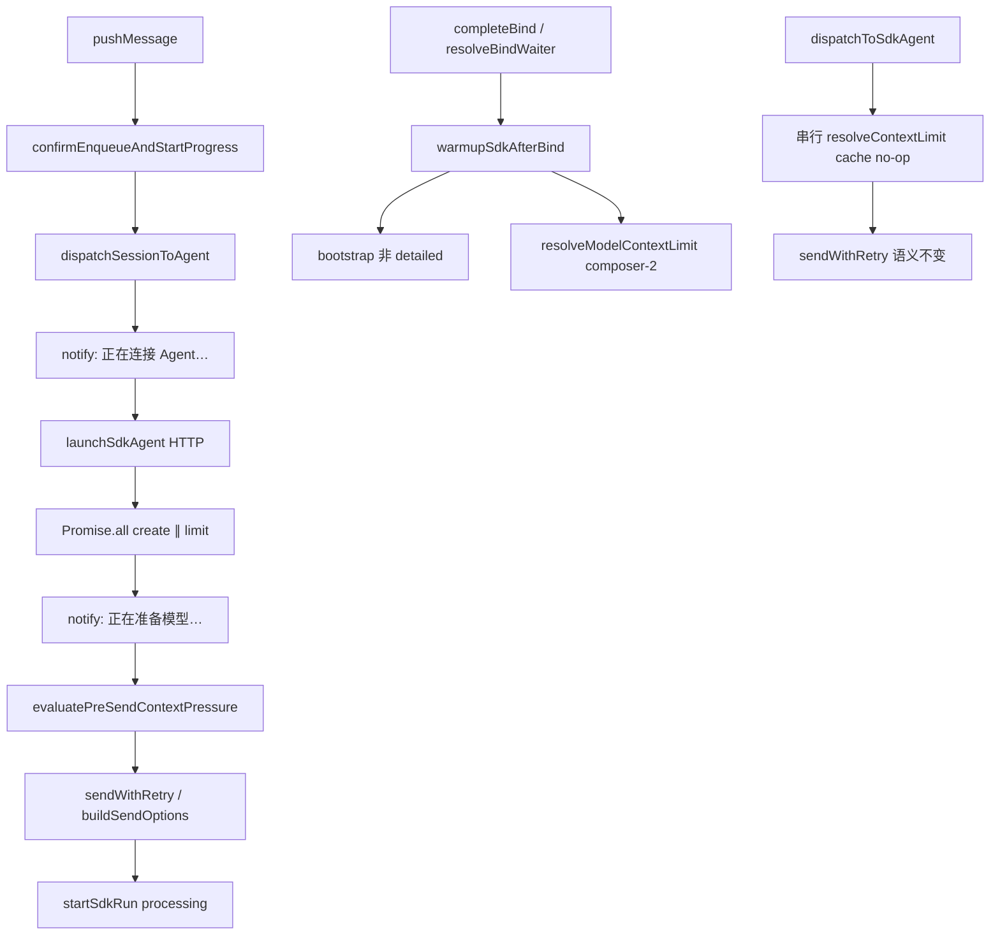

# SDK 首条冷启动优化 - 代码评审报告

## 1、审查范围

- **变更类型**: apply 产出的未提交变更（T1–T7 全部 done，`npm run build` 已通过）
- **评审等级**: focused-review（局部性能优化、无 proto/DB/权限契约变更；按 02 §八 风险可收敛）
- **涉及文件**: 12 个代码文件 + 1 个新增模块（`context-usage-model-limit.ts` 自 `context-usage.ts` 拆分）
- **设计文档**: `02-design.md`（对照基准）；验收以 `01-proposal.md` §四 与 `03-tasks.md` 各 T 验收项为准
- **CodeGraph**: 索引未加载（`.codegraph/` 缺失）；调用链经源码 diff + grep 复核

| 文件 | 变更项 | 行数 |
|------|--------|------|
| `electron/agent/cursor-sdk/context-usage-model-limit.ts` | A1 新增 | 120 |
| `electron/agent/cursor-sdk/context-usage.ts` | A1 拆分 re-export | 199 |
| `electron/agent/cursor-sdk/agent-sdk.ts` | A2/B2 | 295 |
| `electron/agent/cursor-sdk/sdk-run-dispatch.ts` | A3 | 134 |
| `electron/agent/cursor-sdk/sdk-session-types.ts` | T2 字段 | ≤300 |
| `electron/agent/cursor-sdk/sdk-warmup.ts` | B1 新增 | 50 |
| `electron/agent/cursor-sdk/agent-sdk-http.ts` | B1c HTTP 路由 | — |
| `electron/daemon/daemon-manager.ts` | B1a/b | 历史超限 |
| `src/daemon/daemon.ts` | B1c HTTP 客户端 | 历史超限 |
| `src/daemon/daemon-orchestrator.ts` | B2 S4a | 274 |
| `src/daemon/daemon-presentation-handlers.ts` | B2 S2 | **338** |

## 2、严重（必须处理）

无

## 3、警告（建议处理）

1. **`daemon-presentation-handlers.ts` 单文件 338 行，超过 AGENTS「≤300 行」**
   - 位置: `src/daemon/daemon-presentation-handlers.ts`（全文件）
   - 说明: 本次 B2 仅改 `buildEnqueueStatusText` 一行文案，超限为巨型单体拆分遗留；与评审重点 #7 一致。建议归档后随 `20260711203953-巨型单体拆分` 继续拆分，**不阻断本期 archive**。
   - 评分: 50（既有债务，非本次引入）

2. **A1 冷门 model 首条 `contextLimitTokens` 可能暂缺**
   - 位置: `electron/agent/cursor-sdk/context-usage-model-limit.ts:104-105`
   - 说明: 未命中启发式且无 cache 时同步返回 `null`，仅 fire-and-forget `refreshModelLimitFromList`；首条 pre-send/footer 可能暂无数值上限。与 02 §八·（一）A1 风险一致，composer 主路径不受影响。
   - 评分: 50

3. **B1 `completeBind` 经 HTTP `/api/sdk-warmup` 间接预热（设计未显式列出端点）**
   - 位置: `src/daemon/daemon.ts:postSdkWarmupRequest`、`electron/agent/cursor-sdk/agent-sdk-http.ts:189`
   - 说明: Daemon 与 Electron 分进程，HTTP 代理合理；行为仍为 fire-and-forget + WARN，不阻断 bind。建议在 archive 知识库补充端点说明。
   - 评分: 50

4. **Ponytail 精简轴**
   - `shrink:` `context-usage-model-limit.ts` 自 `context-usage.ts` 拆出 — 符合单文件 ≤300 与 A1 职责分离，**保留**。
   - `yagni:` `/api/sdk-warmup` 为跨进程必要，非过度抽象。
   - **Lean already. Ship.**（net: 0 lines to delete）

## 4、设计偏差

1. **B1c 预热调用方式**
   - 设计预期: `02-design.md` §二 B1 / `03-tasks.md` T6 写 `completeBind` 侧 `void warmupSdkAfterBind(...)`
   - 实际实现: Daemon `completeBind` → `POST /api/sdk-warmup` → Electron `warmupSdkAfterBind`
   - 影响: 无功能回归；跨进程架构必要适配。`bind-electron` / `init` 仍直接 import 调用。

无其他实质性偏差。

## 5、验收标准检查

### 01-proposal §四

| 验收项 | 条件 | 状态 |
|--------|------|------|
| 1 | 冷启动较基线减少 ≥8s（composer；C1 send ~12s 下限） | ✅ 定性（A1+A2+A3 消除 create 后串行 list 与二次 bootstrap；需生产日志复测） |
| 2 | models.list 不阻塞 send 前路径 | ✅ `resolveModelContextLimit` composer 启发式同步返回 + `refreshModelLimitFromList` 后台 |
| 3 | 同次 launch 无二次 detailed bootstrap | ✅ `canReuseBootstrapSnapshot` 跳过 `logSdkConfigSources` |
| 4 | bind 后预热可观测；失败不阻断 | ✅ 三挂点 + `sdk_warmup` 日志；catch/WARN |
| 5 | B2 ≥2 可区分阶段文案 | ✅ 「正在连接 Agent…」+「正在准备模型…」 |
| 6 | 热 session / footer / pre-send 无回归 | ✅ `dispatchToSdkAgent` 串行 limit + 注释；pre-send/footer 逻辑未改 |
| 7 | `tsc --noEmit` / build 通过 | ✅ 用户确认 `npm run build` 已通过 |

### 03-tasks T1–T7 要点

| 任务 | 关键验收 | 状态 |
|------|----------|------|
| T1 | composer 同步返回、后台 list、`refreshInflight` | ✅ |
| T2 | `launchBootstrapDone?: boolean` | ✅ |
| T3 | `Promise.all` 后 `sdkSessions.set` / send；阶段二文案 | ✅ |
| T4 | `lastInjectedMcpServers` 复用；recover fallback | ✅ |
| T5 | `sdk-warmup.ts` ≤300 行、fire-and-forget | ✅ |
| T6 | init / bind-electron / bind-daemon 三挂点 | ✅ |
| T7 | orchestrator + `buildEnqueueStatusText` 文案 | ✅ |

### 评审重点专项

| # | 重点 | 结论 |
|---|------|------|
| 1 | A1 composer 不阻塞 models.list | ✅ 启发式写 cache 后 `void refreshModelLimitFromList` |
| 2 | A2 Promise.all 边界，无 create 前 send | ✅ L152 后组装 session；L202 `sendWithRetry` |
| 3 | A3 无二次 detailed bootstrap | ✅ launch `detailed: true` 一次；send 复用快照 |
| 4 | B1 fire-and-forget，失败不阻断 bind | ✅ void + 内部 catch；HTTP 侧 `.catch` WARN |
| 5 | B2 ≥2 阶段进度文案 | ✅ |
| 6 | 热 session / footer / pre-send 无回归 | ✅ |
| 7 | 单文件 ≤300 行 | ⚠️ `daemon-presentation-handlers.ts` 338 行（已知遗留） |
| 8 | C1 不实现 agent.send 外部优化 | ✅ 未越界 |

## 6、调用链与回归风险

| 风险点 | 级别 | 说明 |
|--------|------|------|
| A2 create 失败 + limit 已完成 | 低 | `Promise.all` 整体失败，无 orphan send |
| A1 后台 list 与 send 竞态 | 低 | 设计接受；下条消息校正 cache |
| B1 预热与首条 launch 并发 | 低 | bootstrap 幂等 |
| 冷门 model 首条 limit 为空 | 低 | pre-send ratio 可能为 null，与 02 风险一致 |
| `daemon-presentation-handlers` 行数 | 中（债务） | 不影响本期行为 |

## 7、遗留债务

1. `src/daemon/daemon-presentation-handlers.ts` 338 行 — 随巨型单体拆分变更处理，本期接受。
2. `knowledge/业务域/Agent调度/06-CursorSDK执行引擎.md`、`03-启动与自动重连.md` — manifest 标记 `planned`，**archive 阶段落实**（非 review 阻断）。
3. 冷启动 ≥8s 定量收益 — 需生产 `daemon.log` 时间戳对比（archive verify 项）。

## 8、修复任务建议

无 open 阻断项。若团队希望清零行数债务，可开独立变更：

| 问题 ID | 建议动作 | 关联任务 |
|---------|----------|----------|
| — | 无需 T-FIX；presentation-handlers 拆分归属 `20260711203953-巨型单体拆分` | — |

## 9、结论

**通过**，可进入 `/kb-archive`。

实现与 02-design / 03-tasks 对齐：A1–A3 并行与 bootstrap 复用、B1 三挂点预热、B2 两阶段文案均已落盘；C1 `agent.send` 未越界；热路径与 pre-send/footer 语义保持。唯一工程警告为已知 `daemon-presentation-handlers.ts` 行数超限，不阻断归档。archive 时须同步知识库与冷启动日志复测。
