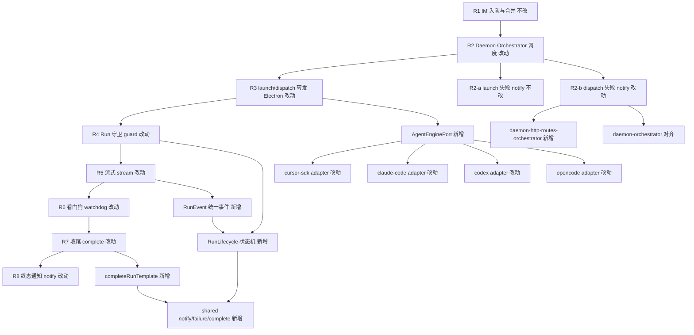
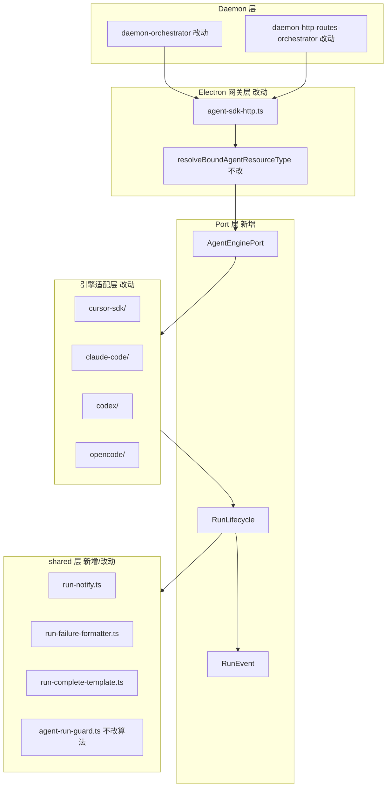

# 四引擎 Engine Port 与 RunLifecycle 抽象 - 实现设计

> **业务 PRD**：见同目录 `01-proposal.md`（验收标准以 01 为准）
> **选定方案**：方案 B — AgentEngine Port + 共享 RunLifecycle

## 一、业务流程与改动范围

> 业务口径以 `01-proposal.md` §四场景矩阵 S1～S8 为准；下图覆盖 IM 主路径 R1～R8 与 Daemon dispatch 失败对称分支。

### （一）业务流程图

**图例**：`不改` 行为与现网一致；`改动` 需改代码或委托共享模块；`新增` 本变更新建抽象/模块；`删除` 四期移除各引擎平行收尾/notify 副本（见「六」四期）。

### （二）流程步骤与改动对照

| 步骤 ID | 业务含义 | 改动 | 落点（模块/文件） | 01 验收关联 |
|---------|----------|------|-------------------|-------------|
| R1 | 飞书 IM 入队、合并预览、F1 排队反馈 | 不改 | `src/daemon/daemon.ts`、`daemon-orchestrator.ts` MergeBatch | S8；01 非目标 |
| R2 | Daemon `runAgentDispatchLoop`  claim 并调度 | 改动 | `src/daemon/daemon-orchestrator.ts` | S5 |
| R2-a | **launch** 失败：busy 重排或 IM notify | 不改 | `daemon-orchestrator.ts:232-242` 已有 `notifySessionUser` | S5 launch 分支 |
| R2-b | **dispatch** 失败：须对称 IM notify | 改动 | `src/daemon/daemon-http-routes-orchestrator.ts:122-126`（现仅 WARN+log）；抽取与 orchestrator 共用 `formatOrchestratorFailure` + `notifySessionUser` | S5；R5 |
| R3 | Daemon `forwardElectronAgentApi` → Electron 统一网关 | 改动 | `electron/agent/cursor-sdk/agent-sdk-http.ts` 注册四引擎 `AgentEnginePort` | R1；S1～S4 |
| R4 | Run 守卫：并发闩、stale/aborted 门控 | 改动 | `electron/agent/shared/agent-run-guard.ts`（保留）；`RunLifecycle.enterGuard` 包装 | S6、S8；R2 |
| R5 | 流式输出与 Presentation 过程事件 | 改动 | 各引擎 `*-stream.ts` / `sdk-run-stream.ts` 发射 `RunEvent` 而非直调 complete | S1；R7 |
| R6 | 看门狗 idle/absolute 超时 | 改动 | 各引擎 watchdog 模块经 `RunLifecycle.onWatchdog` 统一终态归因 | S3；R3、R4 |
| R7 | Run 收尾：assistant 正文、context footer、guard 释放 | 改动 | `electron/agent/shared/run-complete-template.ts`（新）；各 `*-complete.ts` / `sdk-run-lifecycle.ts` 委托 | S1、S2；R7 |
| R8 | 终态 IM：成功/失败/取消/调度失败 | 改动 | `electron/agent/shared/run-notify.ts`、`run-failure-formatter.ts`（新）；收敛 CC/Codex/OpenCode/SDK 四套 `notifySessionChat` | S1～S6；R4 |
| R9 | Electron 重启续接 | 改动 | `sdk-run-recover.ts` 等续接路径接入 `RunLifecycle.resume` | S7 |
| INV-1 | IM 调度权仍在 Daemon | 不改 | `src/daemon/AGENTS.md` Orchestrator SSOT | 01 非目标 |
| INV-2 | 飞书卡片 UI / Presentation 门控 | 不改 | `src/daemon/daemon-presentation-*.ts` | 01 非目标 |

### （三）改动汇总

- **新增**：
  - `AgentEnginePort` 契约与 `RunLifecycle` 状态机（`electron/agent/shared/run-lifecycle.ts` 等，单文件 ≤300 行拆分）。
  - 统一 `RunEvent` 枚举与适配层 `mapEngineEvent → RunEvent`。
  - 共享 `notifySessionChat` / `formatRunFailureMessage` / `completeRunFromTemplate`（`electron/agent/shared/`）。
- **改动**：
  - 四引擎 adapter 实现 Port 六能力，生命周期经 `RunLifecycle` 驱动。
  - Daemon **dispatch** 失败路径补齐与 launch 对称的 IM notify。
  - 各引擎 `complete*` / `notify*` / `finalize*` 逐步委托 shared 模块。
- **删除**（四期）：各引擎内平行 failure 文案器副本、重复 `notifySessionChat` 实现、绕过 `RunLifecycle` 的早退收尾分支。
- **不改**：
  - Daemon `POST /api/agent/launch|dispatch` 对外 HTTP 契约。
  - 飞书 CardKit / stream-text / Presentation ordering 语义。
  - `agent-run-guard` 闩算法与 `crash-log-archiver` 挂接时机（仅迁移调用点至 shared notify）。

## 二、整体思路

**根因**（见 01 §一）：四引擎在守卫→流式→看门狗→收尾→通知链路上平行实现，`errorNotified` / `watchdogTimedOut` / dispatch 失败等契约语义不一致；CC/Codex/OpenCode 各自复制 `notifySessionChat`，SDK 在 `sdk-daemon-notify.ts`，Daemon dispatch HTTP 路由失败无 IM。

**方案 B 要点**：

1. **AgentEnginePort**：产品级六能力契约（launch / dispatch / stop / stream / watchdog / complete），网关 `agent-sdk-http.ts` 按 `resolveBoundAgentResourceType` 解析具体 adapter，业务侧不感知引擎差异（01 R1、R6）。
2. **RunLifecycle + RunEvent**：一次 Run 经历 `guarding → streaming → watching → completing → notifying`；引擎原生事件（SDK `Run.status`、CC `Query` 退出、Codex `ThreadEvent`、OpenCode SSE）经 adapter 映射为有限 `RunEvent` 再驱动状态机（01 R2）。
3. **共享出口**：`shared/` 提供唯一 `notifySessionChat`、失败归因 `formatRunFailureMessage`（收敛 `sdk-failure-messages` / `codex-failure-messages` / CC 内联文案）、`completeRunFromTemplate`（流式 final flush + footer + `errorNotified` 闩）（01 R3、R4、R7）。
4. **Daemon 对称性**：`dispatchSessionToAgent` launch 失败已 `notifySessionUser`；`tryHandleOrchestratorRoute` 的 `/api/agent/dispatch` 须在非 busy 失败时同样 notify（01 R5、S5）。
5. **分期**：一期立骨架与痛点（dispatch 对称 + shared 出口）；二～三期按引擎迁移 adapter；四期删遗留平行路径并 archive 知识库（01 §八）。

**与 01 追溯**：R1～R8 覆盖 01 功能需求 R1～R7；场景矩阵 S1～S8 在「八·（二）」工程验收项逐条映射。

## 三、分层设计

- **Daemon 层**：仅补齐 dispatch 失败 notify；不接管 Run 生命周期。
- **网关层**：`launchSdkAgentFromHttp` / `dispatchAgentFromHttp` 委托 `getEnginePort(resourceType)`，替代直接 import 各 `launch*AgentFromHttp`。
- **Port + Lifecycle 层**：`electron/agent/shared/` 定义契约与状态机；各引擎目录仅保留协议转换与引擎特有 I/O。
- **数据层**：无 schema 变更；session 级 `errorNotified` / `watchdogTimedOut` / `runFinalizing` 字段保留，语义由 `RunLifecycle` 文档化。

## 四、接口设计

### AgentEnginePort（新增，TypeScript 契约）

| 方法 | 入参要点 | 出参 / 错误 | 说明 |
|------|----------|-------------|------|
| `launch` | `LaunchRequest`（`session_key`、`task_text`、`chat_type`…） | `{ ok, error? }` | 冷启动或 resident 首次建会话；失败须可映射 `RunFailureReason` |
| `dispatch` | `session_key`、`task_text`、`message_ids?` | `{ ok, error? }` | 二次调度；`agent_busy` 走 busy 重排，不 notify |
| `stop` | `session_key`、来源 `user \| watchdog \| stale` | `void` | 用户取消或强制终止；须置 aborted 闩防重复 notify |
| `stream` | `session` + 引擎原生事件源 | `AsyncIterable<RunEvent>` 或回调注册 | 将 delta/tool/thinking 转为 `RunEvent` |
| `watchdog` | `session`、`WatchdogConfig` | `void` | 挂接 `agent-run-guard`；超时发射 `RunEvent.Timeout` |
| `complete` | `session`、`RunTerminalContext` | `Promise<void>` | 幂等收尾；委托 `completeRunFromTemplate` |

**错误码（对内枚举 `RunFailureReason`）**：`dispatch_failed` | `run_error` | `timeout` | `user_cancelled` | `context_exhausted` | `stale_aborted` | `session_abnormal` — 驱动 `formatRunFailureMessage` 分支（对齐 01 R3、对齐 `crash-log-archiver` `FailureArchiveType`）。

### RunEvent（新增）

| 事件 | 载荷 | 生命周期转移 |
|------|------|--------------|
| `run_started` | `sessionKey` | → `streaming` |
| `stream_delta` / `tool` / `thinking` / `task` | 呈现字段 | 保持 `streaming` |
| `run_succeeded` | `assistantText?` | → `completing` |
| `run_failed` | `reason`, `detail?` | → `notifying` |
| `run_cancelled` | `source` | → `notifying` |
| `watchdog_timeout` | `trigger` | → `notifying` |
| `dispatch_rejected` | `reason` | → `notifying`（Daemon 侧亦可直接 notify） |

### 对外 HTTP

无变更。仍沿用：

| 方法 | 路径 | 说明 |
|------|------|------|
| POST | `/api/agent/launch` | Daemon → Electron 网关 |
| POST | `/api/agent/dispatch` | 二次调度 |
| POST | `/api/send-text` | IM 终态出站（`stop_progress` 语义不变） |

## 五、数据结构

无 DB / 配置文件 schema 变更。

**Session 字段（各引擎 session 类型保留，语义 SSOT 迁至 RunLifecycle 文档）**：

| 字段 | 用途 | RunLifecycle 门控 |
|------|------|-------------------|
| `errorNotified` | 终态 IM 仅一次 | `notifying` 入口检查 |
| `watchdogTimedOut` | 超时 finalizer 与 complete 去重 | `watching → notifying` |
| `runFinalizing` | complete 幂等 | `completing` 闩 |
| `abortController.signal.aborted` | 用户 stop 静默 | `stop` 置位，跳过 failure notify |
| `failureArchiveDone` | 崩溃归档幂等 | 与 `notifyRunFailure` 同路径 |

**新增类型文件（建议）**：`electron/agent/shared/run-lifecycle-types.ts`（`RunPhase`、`RunEvent`、`RunFailureReason`、`AgentEnginePort`）。

## 六、实现步骤

实现分四期；每步可回溯「一·（二）」步骤 ID。单文件 ≤300 行，超限按职责拆分。

### 一期（优先）：骨架 + 共享出口 + dispatch 对称

对应 01 §八 一期；覆盖 R2-b、R8 基础设施、R4 骨架。

1. **T1-1 / shared notify**：新增 `electron/agent/shared/run-notify.ts`，收敛 `sdk-daemon-notify.ts`、`agent-cc-notify.ts` 中 `notifySessionChat`；各引擎 re-export 或薄包装，行为与现网一致。
2. **T1-2 / shared failure formatter**：新增 `run-failure-formatter.ts`，统一 `formatRunFailureMessage(ctx)`；SDK `formatUserSdkFailureMessage`、Codex `formatCodexFailureMessage` 逐步委托（一期可先 re-export SDK 实现为默认）。
3. **T1-3 / complete 模板**：新增 `run-complete-template.ts`（footer 拼接、`errorNotified` 闩、`archiveAgentFailureLogs` 挂接）；从 `sdk-run-finalize.ts` 抽可复用部分。
4. **T1-4 / RunLifecycle 骨架**：新增 `run-lifecycle.ts` + `run-lifecycle-types.ts`；实现阶段转移与 `RunEvent` 分发 stub；**暂不强制**四引擎全量接入。
5. **T1-5 / Daemon dispatch 对称**（R2-b）：`daemon-http-routes-orchestrator.ts` 在 `!result.ok` 且非 busy 时调用与 `daemon-orchestrator.ts:240` 等价的 notify + ack；抽取 `formatOrchestratorFailure` / `notifySessionUser` 至共享辅助（如 `daemon-orchestrator-notify.ts`）避免双写。
6. **T1-6 / Port 接口落盘**：定义 `AgentEnginePort` 与 `createEnginePortRegistry()`；`agent-sdk-http.ts` 注册表占位，默认仍调现有 handler。

### 二期：Cursor SDK + Claude Code adapter

对应 01 二期；R3～R7 主路径。

7. **T2-1 / cursor-sdk adapter**：`electron/agent/cursor-sdk/engine-port-adapter.ts` 实现 Port；`startSdkRun` / `completeSdkRun` 改经 `RunLifecycle`；`sdk-run-lifecycle.ts` 变薄。
8. **T2-2 / claude-code adapter**：`electron/agent/claude-code/engine-port-adapter.ts`；`completeCcRun`、`cc-watchdog-finalize` 委托 `run-complete-template` + `formatRunFailureMessage`。
9. **T2-3 / 矩阵冒烟**：Cursor + Claude × S1～S6 手工回归。

### 三期：Codex + OpenCode adapter

10. **T3-1 / codex adapter**：`agent-codex-complete.ts` 委托 shared complete；`notifyCodexSessionChat` → shared notify。
11. **T3-2 / opencode adapter**：对称 `agent-opencode-complete.ts`。
12. **T3-3 / 全矩阵**：四引擎 × S1～S8（含 S7 续接、`dispatch` 对称）。

### 四期：清理与知识库

13. **T4-1 / 删除平行路径**：移除各引擎废弃 notify/failure 副本与绕过 Lifecycle 的 dead branch。
14. **T4-2 / AGENTS 沉淀**：更新 `electron/agent/shared/AGENTS.md`、各引擎 `AGENTS.md` Port 挂接说明。
15. **T4-3 / 知识库**：archive 阶段执行「十·（一）」清单。

## 七、参考实现

CodeGraph 未初始化（`codegraph init` 不可用），以下经源码检索核实（`projectPath: /home/suveng/doger/cursor-claw`）：

| 符号 | 路径 | 职责 |
|------|------|------|
| `startSdkRun` / `completeSdkRun` | `electron/agent/cursor-sdk/sdk-run-lifecycle.ts` | SDK 生命周期 SSOT，**迁移目标** |
| `notifySdkFailure` / `notifyDispatchFailure` | `electron/agent/cursor-sdk/sdk-run-finalize.ts` | SDK 失败 notify + 归档 |
| `notifySessionChat`（SDK） | `electron/daemon/sdk-daemon-notify.ts` | **收敛至** `shared/run-notify.ts` |
| `notifySessionChat`（CC） | `electron/agent/claude-code/agent-cc-notify.ts` | 与 SDK 实现重复 |
| `completeCcRun` | `electron/agent/claude-code/agent-cc-stream.ts:194-239` | CC 收尾平行实现 |
| `finalizeCcRunOnWatchdogTimeout` | `electron/agent/claude-code/cc-watchdog-finalize.ts` | 超时 notify |
| `completeCodexRun` | `electron/agent/codex/agent-codex-complete.ts` | Codex 收尾 |
| `completeOpencodeRun` | `electron/agent/opencode/agent-opencode-complete.ts` | OpenCode 收尾 |
| `notifyCodexSessionChat` | `electron/agent/codex/agent-codex-stream.ts` | Codex notify 包装 |
| `notifyOpencodeSessionChat` | `electron/agent/opencode/agent-opencode-stream.ts` | OpenCode notify 包装 |
| `archiveAgentFailureLogs` | `electron/agent/shared/crash-log-archiver.ts` | 失败归档，`FailureArchiveType` 含 `dispatch_failed` |
| `completeRunGuard` / `armRunWatchdog` | `electron/agent/shared/agent-run-guard.ts` | 守卫/watchdog 时钟 |
| `launchSdkAgentFromHttp` | `electron/agent/cursor-sdk/agent-sdk-http.ts` | 网关 launch SSOT |
| `dispatchAgentFromHttp` | `electron/agent/cursor-sdk/agent-sdk-http.ts` | 网关 dispatch |
| `dispatchSessionToAgent` | `src/daemon/daemon-orchestrator.ts:225-242` | launch 失败 **有** notify |
| `tryHandleOrchestratorRoute` dispatch | `src/daemon/daemon-http-routes-orchestrator.ts:106-131` | dispatch 失败 **无** notify（缺口） |
| `formatOrchestratorFailure` | `src/daemon/daemon-orchestrator.ts:140-146` | Daemon 失败文案 |
| `feishu-plain-assistant-reply` | `electron/agent/shared/feishu-plain-assistant-reply.ts` | plain 收尾辅助（complete 模板可复用） |

## 八、技术影响

### （一）影响范围

| 分期 | 涉及模块 | 说明 |
|------|----------|------|
| 一期 | `electron/agent/shared/*`、`src/daemon/daemon-http-routes-orchestrator.ts`、`src/daemon/daemon-orchestrator.ts` | 骨架 + dispatch 对称；**用户可见**：dispatch 失败开始有 IM |
| 二期 | `electron/agent/cursor-sdk/`、`electron/agent/claude-code/`、`agent-sdk-http.ts` | 两引擎 adapter；通知文案可能与现网微差（以矩阵为准） |
| 三期 | `electron/agent/codex/`、`electron/agent/opencode/` | 余下两引擎 |
| 四期 | 各引擎废弃文件、知识库 | 删平行路径 |

- **接口/proto 变更**：无对外 HTTP 变更。
- **数据变更**：无。
- **风险**：
  - **行为变更感知**：统一 formatter 可能改变某引擎「偶然」静默路径 → 以 01 矩阵前后对照；单引擎灰度（二期先 Cursor）。
  - **Presentation 耦合**：`completeRunFromTemplate` 须区分 f41 stream-text 与 plain `notifySessionChat` 收尾，避免双写 assistant（对称现网 `completeCcRun` 分支）。
  - **续接冲突**：`sdk-run-recover` 续接后须重置 `RunLifecycle` 阶段，避免 `errorNotified` 残留（S7）。
  - **循环 import**：`run-notify.ts` 须保持「仅 daemon-client」依赖，不 import `session-dispatcher`（沿用 `sdk-daemon-notify` 模式）。

### （二）工程补充验收项

**一期**

- [ ] `POST /api/agent/dispatch` 返回 `ok: false` 且非 `agent_busy` 时，用户收到与 launch 失败同类语义的 IM（`stop_progress: true`）。
- [ ] `electron/agent/shared/run-notify.ts` 为四引擎终态 `send-text` 唯一实现；`sdk-daemon-notify` / `agent-cc-notify` 仅 re-export。
- [ ] `RunLifecycle` 类型与 `AgentEnginePort` 接口存在于 `shared/`，`agent-sdk-http` 可解析注册表。
- [ ] `npm run build` 通过；单文件 ≤300 行。

**二期（Cursor + Claude）**

- [ ] Cursor / Claude：S1 成功完成一次收尾 IM，无重复轰炸。
- [ ] Cursor / Claude：S2 用户取消、S3 超时、S4 运行失败均有可区分 IM，且 `errorNotified` 不导致合法 notify 被跳过。
- [ ] Cursor / Claude：S6 stale/aborted 不发送误导性成功卡。

**三期（Codex + OpenCode）**

- [ ] 四引擎 S5：`dispatch` 与 `launch` 调度失败均有 IM（含 HTTP dispatch 路由）。
- [ ] 四引擎 S1～S6 通知「有无」与「语义类别」跨引擎一致（01 §6.2）。
- [ ] S7 Electron 重启续接终态 notify 仍满足 S1～S4 各行。

**四期**

- [ ] 源码中无四份独立 `notifySessionChat` 完整实现；无绕过 `RunLifecycle.complete` 的引擎私有 finalize 主路径。
- [ ] `knowledge/业务域/Agent调度/06～10` 与 `消息桥接/02` 已 archive 更新。

## 九、知识库影响

| 文档 | 影响 | 阶段 |
|------|------|------|
| `knowledge/业务域/Agent调度/06-CursorSDK执行引擎.md` | 高：生命周期改述为 Port + RunLifecycle | 四期 archive |
| `knowledge/业务域/Agent调度/07-ClaudeCodeSDK执行引擎.md` | 高：同上 | 四期 |
| `knowledge/业务域/Agent调度/08-CodexSDK执行引擎.md` | 高：同上 | 四期 |
| `knowledge/业务域/Agent调度/09-OpenCodeSDK执行引擎.md` | 高：同上 | 四期 |
| `knowledge/业务域/Agent调度/10-SDK上下文保护与失败归因.md` | 高：`RunFailureReason` 与 `errorNotified` 契约 | 四期 |
| `knowledge/业务域/Agent调度/01-概览.md` | 中：架构图增加 Port/Lifecycle 层 | 四期 |
| `knowledge/业务域/消息桥接/02-飞书通道.md` | 中：多引擎 notify 对称与 dispatch 失败 | 四期 |
| `knowledge/业务域/Agent调度/03-启动与自动重连.md` | 低～中：守卫阶段与 Lifecycle 衔接 | 可能 |
| `electron/agent/shared/AGENTS.md` | 高：实现期 SSOT | 一～四期 |

## 十、知识库更新计划

### （一）必须更新

- `knowledge/业务域/Agent调度/06-CursorSDK执行引擎.md` — Port adapter 与 RunLifecycle 挂接点。
- `knowledge/业务域/Agent调度/07-ClaudeCodeSDK执行引擎.md` — 同上。
- `knowledge/业务域/Agent调度/08-CodexSDK执行引擎.md` — 同上。
- `knowledge/业务域/Agent调度/09-OpenCodeSDK执行引擎.md` — 同上。
- `knowledge/业务域/Agent调度/10-SDK上下文保护与失败归因.md` — 统一失败归因枚举与 notify 策略。
- `knowledge/业务域/消息桥接/02-飞书通道.md` — dispatch 失败对称 IM、四引擎终态一致性。

### （二）可能更新（视实现结果）

- `knowledge/业务域/Agent调度/01-概览.md` — 若概览架构图纳入 RunLifecycle 主状态机。
- `knowledge/业务域/Agent调度/03-启动与自动重连.md` — 若续接与 `RunLifecycle.resume` 有新增特例说明。
- `electron/agent/shared/AGENTS.md` 及各引擎 `AGENTS.md` — 代码侧 SSOT，archive 时同步摘要至知识库。

### （三）不需要更新

- 飞书卡片 UI、菜单、斜杠指令相关文档。
- Daemon MergeBatch / Presentation ordering 专项文档（本次不改门控语义）。
- 微信或其他 IM 通道文档（未扩 scope）。
- `knowledge/工程平台/` 分区正文（无工程平台行为变更）。
