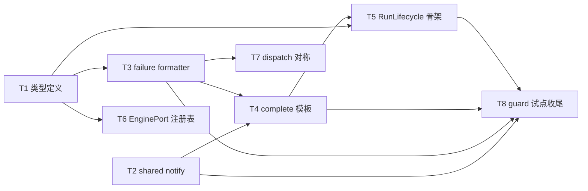
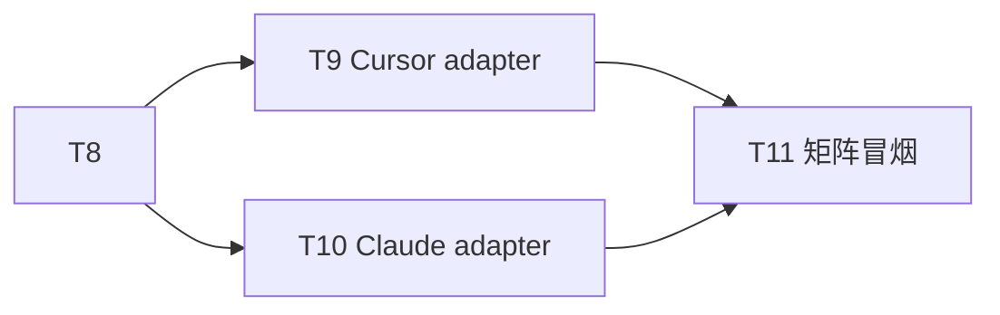
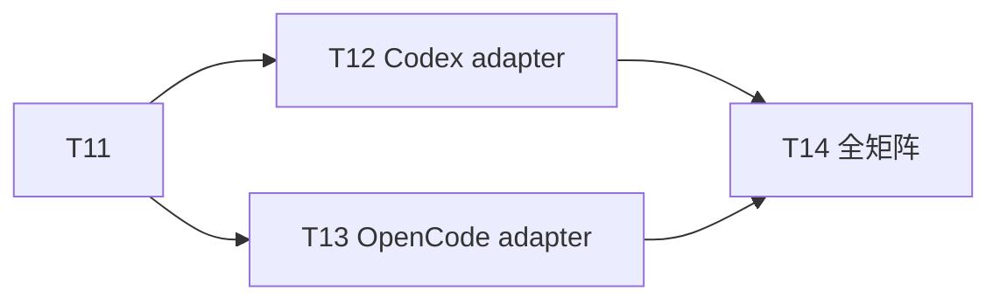
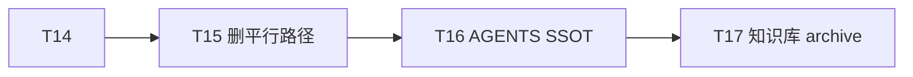

# 四引擎 Engine Port 与 RunLifecycle 抽象 - 任务分解

> **来源**：`/kb-plan`（基于 `01-proposal.md`、`02-design.md`）
> **一期（本轮 kb-apply 优先）**：T1～T8 — RunLifecycle 骨架、shared notify/failure/complete、Daemon dispatch 对称、guard busy IM（S5/S8）
> **二～四期**：T9～T17 — 按引擎迁移 adapter、删遗留路径、知识库（T17 标 `deferred`，归 `/kb-archive`）

## 一、执行计划

### （一）依赖图

**一期（本轮 apply）**



| 任务 | 落点文件 | 对应流程 ID | 01 场景 |
|------|----------|-------------|---------|
| T1 | `run-lifecycle-types.ts` | R4、R8 基础设施 | — |
| T2 | `run-notify.ts`、`sdk-daemon-notify.ts` | R8 | S1～S6 |
| T3 | `run-failure-formatter.ts` | R8、R3 | S4、S5 |
| T4 | `run-complete-template.ts` | R7 | S1、S2 |
| T5 | `run-lifecycle.ts` | R4 | S6、S8 |
| T6 | `agent-engine-port.ts`、`agent-sdk-http.ts` | R3 | R1 |
| T7 | `daemon-http-routes-orchestrator.ts`、`daemon-orchestrator.ts` | R2-b | **S5** |
| T8 | `agent-run-guard.ts`、`sdk-run-finalize.ts` | R4、R7、R8 | S5、S8 |

**二期**



**三期**



**四期（deferred）**



### （二）分组调度

| 轮次 | 任务 | 并行 | 说明 |
|------|------|------|------|
| **一期-1** | T1 | — | 类型 SSOT，后续任务依赖 |
| **一期-2** | T2、T3 | ✅ | 无同文件冲突；T3 依赖 T1 |
| **一期-3** | T4、T6、T7 | ✅ | T4 依赖 T2+T3；T6 依赖 T1；T7 依赖 T3（文案对齐） |
| **一期-4** | T5 | — | 依赖 T1+T4；状态机 stub，不强制四引擎接入 |
| **一期-5** | T8 | — | 依赖 T2～T5；**一期 apply 收尾** |
| **二期** | T9、T10 | ✅ | 各改独立引擎目录；完成后 T11 手工矩阵 |
| **三期** | T12、T13 | ✅ | Codex / OpenCode 对称迁移 |
| **三期末** | T14 | — | 四引擎 × S1～S8 手工回归 |
| **四期** | T15 → T16 → T17 | — | T17 `deferred`，仅 `/kb-archive` 执行 |

**一期同文件冲突清单**

| 文件 | 涉及任务（顺序） |
|------|------------------|
| `electron/agent/shared/run-lifecycle-types.ts` | T1（新建） |
| `electron/agent/shared/run-notify.ts` | T2（新建） |
| `electron/daemon/sdk-daemon-notify.ts` | T2（re-export） |
| `electron/agent/shared/run-failure-formatter.ts` | T3（新建） |
| `electron/agent/shared/run-complete-template.ts` | T4（新建） |
| `electron/agent/shared/run-lifecycle.ts` | T5（新建） |
| `electron/agent/shared/agent-engine-port.ts` | T6（新建） |
| `electron/agent/cursor-sdk/agent-sdk-http.ts` | T6（注册表占位） |
| `src/daemon/daemon-orchestrator.ts` | T7（抽取 notify 辅助） |
| `src/daemon/daemon-http-routes-orchestrator.ts` | T7（dispatch 失败 IM） |
| `electron/agent/shared/agent-run-guard.ts` | T8（enterGuard 包装） |
| `electron/agent/cursor-sdk/sdk-run-finalize.ts` | T8（试点委托 shared） |

## 二、任务清单

---

## T1: RunLifecycle 类型与失败归因枚举

### 背景

四引擎缺少统一的 `RunPhase`、`RunEvent`、`RunFailureReason` 与 `AgentEnginePort` 类型 SSOT，导致 `errorNotified` / `watchdogTimedOut` 等字段语义各引擎自行解释。本任务新建 `run-lifecycle-types.ts`，为后续 shared 模块与状态机提供唯一类型源（01 R2、R3；对应流程 R4/R8 基础设施）。

### 上下文文件

- 必读: `electron/agent/cursor-sdk/sdk-run-finalize.ts` — `notifySdkFailure`、`errorNotified` 闩用法
- 必读: `electron/agent/shared/crash-log-archiver.ts` — `FailureArchiveType`（含 `dispatch_failed`）
- 必读: `electron/agent/shared/agent-run-guard.ts` — session 级 `runFinalizing`、`watchdogTimedOut` 字段
- 参考: `electron/agent/cursor-sdk/sdk-session-types.ts` — SDK session 字段命名

### 实现范围

- **新建**: `electron/agent/shared/run-lifecycle-types.ts`（≤300 行，中文注释）
  - `RunPhase`: `guarding | streaming | watching | completing | notifying`
  - `RunEvent` 联合类型及载荷（`run_started`、`stream_delta`、`tool`、`thinking`、`task`、`run_succeeded`、`run_failed`、`run_cancelled`、`watchdog_timeout`、`dispatch_rejected`）
  - `RunFailureReason` 枚举：`dispatch_failed | run_error | timeout | user_cancelled | context_exhausted | stale_aborted | session_abnormal`
  - `RunTerminalContext`、`LaunchRequest` 等 Port/Lifecycle 共用切片类型
  - `AgentEnginePort` 接口声明（六方法签名，实现归 T6）
- **不改**: 各引擎 session 类型定义；无运行时行为变更

### 接口契约

```ts
export type RunPhase = "guarding" | "streaming" | "watching" | "completing" | "notifying"

export type RunFailureReason =
  | "dispatch_failed" | "run_error" | "timeout" | "user_cancelled"
  | "context_exhausted" | "stale_aborted" | "session_abnormal"

export interface AgentEnginePort {
  launch(req: LaunchRequest): Promise<{ ok: boolean; error?: string }>
  dispatch(sessionKey: string, taskText: string, messageIds?: string[]): Promise<{ ok: boolean; error?: string }>
  stop(sessionKey: string, source: "user" | "watchdog" | "stale"): Promise<void>
  stream(session: unknown): AsyncIterable<RunEvent> | void
  watchdog(session: unknown, config: WatchdogConfig): void
  complete(session: unknown, ctx: RunTerminalContext): Promise<void>
}
```

### 验收标准

- [ ] 类型文件可被 `tsc` 引用，无循环 import
- [ ] `RunFailureReason` 覆盖 `crash-log-archiver` 现有 `FailureArchiveType` 分支（含 `dispatch_failed`）
- [ ] 单文件 ≤300 行；导出符号与上表一致
- [ ] 覆盖 01 R2/R3 类型层；工程验收「`RunLifecycle` 类型与 `AgentEnginePort` 接口存在于 shared」之前置项

### 依赖

- 前置任务: 无
- 后续任务: T3、T5、T6

---

## T2: 共享终态 notify（run-notify）

### 背景

SDK `sdk-daemon-notify.ts` 与 CC `agent-cc-notify.ts` 各自实现 `notifySessionChat`，Codex/OpenCode 亦有包装副本。四引擎终态 `POST /api/send-text` 须收敛至 `electron/agent/shared/run-notify.ts`（01 R4、R7；流程 R8）。

### 上下文文件

- 必读: `electron/daemon/sdk-daemon-notify.ts` — 现网 `notifySessionChat` 实现（**迁移源**）
- 必读: `electron/agent/claude-code/agent-cc-notify.ts` — 重复实现对照
- 必读: `electron/agent/codex/agent-codex-stream.ts` — `notifyCodexSessionChat` 包装
- 必读: `electron/agent/opencode/agent-opencode-stream.ts` — `notifyOpencodeSessionChat` 包装
- 参考: `electron/agent/shared/feishu-plain-assistant-reply.ts` — plain 收尾辅助

### 实现范围

- **新建**: `electron/agent/shared/run-notify.ts`（≤300 行）
  - 导出 `notifySessionChat(sessionKey, text, opts?)` — 唯一终态 IM 出站实现
  - 保持「仅 daemon-client」依赖，**禁止** import `session-dispatcher`（沿用 sdk-daemon-notify 模式，防循环 import）
  - 支持 `stop_progress: true` 等现网载荷字段
- **改动**: `electron/daemon/sdk-daemon-notify.ts` — 薄 re-export 至 `../agent/shared/run-notify.js`
- **改动**: `electron/agent/claude-code/agent-cc-notify.ts` — re-export 或删体留 export（保持 CC import 路径编译通过）
- **一期不改**: Codex/OpenCode stream 包装（归三期 T12/T13）

### 接口契约

```ts
export interface NotifySessionChatOptions {
  stop_progress?: boolean
  chat_type?: string
}

/** 四引擎终态飞书 IM 唯一出站；幂等由调用方 errorNotified 闩保证 */
export async function notifySessionChat(
  sessionKey: string,
  text: string,
  opts?: NotifySessionChatOptions
): Promise<void>
```

### 验收标准

- [ ] `npm run build` 通过
- [ ] SDK/CC 路径编译通过且 re-export 后行为与迁移前一致
- [ ] `run-notify.ts` 不 import 各引擎 session 具体类型
- [ ] 覆盖 02 工程验收「`run-notify.ts` 为四引擎终态 send-text 唯一实现；sdk-daemon-notify / agent-cc-notify 仅 re-export」

### 依赖

- 前置任务: 无（可与 T1 并行）
- 后续任务: T4、T8

---

## T3: 共享失败文案格式化（run-failure-formatter）

### 背景

SDK `formatUserSdkFailureMessage`、Codex `formatCodexFailureMessage`、CC 内联文案各自维护失败 IM 正文，归因类别不一致。本任务统一 `formatRunFailureMessage(ctx)`，一期可先以 SDK 实现为默认委托（01 R3；流程 R8）。

### 上下文文件

- 必读: `electron/agent/cursor-sdk/sdk-failure-messages.ts`（或 `sdk-run-finalize.ts` 内联）— SDK 失败文案
- 必读: `electron/agent/codex/codex-failure-messages.ts` — Codex 文案对照
- 必读: `src/daemon/daemon-orchestrator.ts` L140–146 — `formatOrchestratorFailure`（Daemon 侧文案，T7 须对齐）
- 必读: `electron/agent/shared/run-lifecycle-types.ts` — `RunFailureReason`（T1 产出）

### 实现范围

- **新建**: `electron/agent/shared/run-failure-formatter.ts`（≤300 行）
  - `formatRunFailureMessage(ctx: RunFailureFormatContext): string`
  - 一期：各 `reason` 分支可先 re-export/委托 SDK 现有实现，保证文案不退化
  - 导出 `formatOrchestratorFailure(error: string): string` 或等价，供 Daemon T7 共用
- **不改**: 各引擎完整迁移至 formatter（二～三期逐步替换内联）

### 接口契约

```ts
export interface RunFailureFormatContext {
  reason: RunFailureReason
  detail?: string
  sessionKey?: string
  engineLabel?: string
}

export function formatRunFailureMessage(ctx: RunFailureFormatContext): string
export function formatOrchestratorFailure(error: string): string
```

### 验收标准

- [ ] `dispatch_failed`、`run_error`、`timeout`、`user_cancelled` 等分支均有非空默认文案
- [ ] `formatOrchestratorFailure` 与现网 `daemon-orchestrator.ts:140-146` 输出一致（T7 抽取前须对照）
- [ ] 单文件 ≤300 行；中文注释说明归因→文案映射
- [ ] 覆盖 01 R3 失败归因统一出口基础设施

### 依赖

- 前置任务: T1
- 后续任务: T4、T7、T8

---

## T4: 共享收尾模板（run-complete-template）

### 背景

各引擎 `complete*` / `sdk-run-finalize` 平行实现 assistant 收尾、context footer、`errorNotified` 闩与 `archiveAgentFailureLogs` 挂接。本任务抽取 `completeRunFromTemplate`，供 Lifecycle 与各引擎委托（01 R7；流程 R7）。

### 上下文文件

- 必读: `electron/agent/cursor-sdk/sdk-run-finalize.ts` — `completeSdkRun`、footer、`errorNotified` 逻辑（**抽取源**）
- 必读: `electron/agent/claude-code/agent-cc-stream.ts` L194–239 — `completeCcRun` 分支对照
- 必读: `electron/agent/shared/crash-log-archiver.ts` — `archiveAgentFailureLogs`
- 必读: `electron/agent/shared/feishu-plain-assistant-reply.ts` — plain 收尾路径
- 必读: T2 产出 `run-notify.ts`、T3 产出 `run-failure-formatter.ts`

### 实现范围

- **新建**: `electron/agent/shared/run-complete-template.ts`（≤300 行）
  - `completeRunFromTemplate(session, ctx: CompleteRunContext): Promise<void>`
  - 幂等：`runFinalizing` / `errorNotified` 闩检查
  - 区分 f41 stream-text 与 plain `notifySessionChat` 收尾（避免双写 assistant，对称现网 `completeCcRun`）
  - 失败路径委托 `formatRunFailureMessage` + `notifySessionChat` + 可选 `archiveAgentFailureLogs`
- **不改**: 各引擎 complete 主路径（T8 仅 SDK 试点接入）

### 接口契约

```ts
export interface CompleteRunContext {
  assistantText?: string
  failure?: { reason: RunFailureReason; detail?: string }
  source: "success" | "failure" | "cancelled" | "watchdog"
}

/** 幂等收尾：footer 拼接、errorNotified 闩、失败归档 */
export async function completeRunFromTemplate(
  session: RunLifecycleSessionSlice,
  ctx: CompleteRunContext
): Promise<void>
```

### 验收标准

- [ ] 模板函数不直接 import 各引擎 `*SessionAgent` 全量类型（用 slice 接口）
- [ ] 成功/失败/取消三类路径均有闩防重复 notify
- [ ] `npm run build` 通过；单文件 ≤300 行
- [ ] 覆盖 01 R7 收尾统一阶段基础设施；工程验收 complete 模板存在

### 依赖

- 前置任务: T2、T3
- 后续任务: T5、T8

---

## T5: RunLifecycle 状态机骨架

### 背景

一次 Run 须经历 `guarding → streaming → watching → completing → notifying` 明确阶段。本任务实现 `RunLifecycle` 类/工厂：阶段转移、`RunEvent` 分发 stub、与 shared 模块挂接点；**一期不强制四引擎全量接入**（01 R2；流程 R4）。

### 上下文文件

- 必读: T1 产出 `run-lifecycle-types.ts`
- 必读: T4 产出 `run-complete-template.ts`
- 必读: `electron/agent/shared/agent-run-guard.ts` — `completeRunGuard`、`armRunWatchdog`
- 必读: `electron/agent/cursor-sdk/sdk-run-lifecycle.ts` — 现网 SDK 生命周期（迁移参照，本期不删）

### 实现范围

- **新建**: `electron/agent/shared/run-lifecycle.ts`（≤300 行，超限拆 `run-lifecycle-handlers.ts`）
  - `createRunLifecycle(session): RunLifecycle`
  - `enterGuard()` → `onStreamEvent(ev)` → `onWatchdog(ev)` → `enterCompleting()` → `enterNotifying()`
  - `RunEvent` 分发：成功→completing；失败/取消/超时→notifying；委托 T4 complete / T2 notify
  - `resume(session)` stub（S7 续接，二～三期完善）
- **不改**: 四引擎现有 lifecycle 主路径（仅提供可调用 API）

### 接口契约

```ts
export interface RunLifecycle {
  readonly phase: RunPhase
  enterGuard(): void
  onStreamEvent(event: RunEvent): void
  onWatchdog(event: RunEvent): void
  enterCompleting(ctx: RunTerminalContext): Promise<void>
  enterNotifying(ctx: RunTerminalContext): Promise<void>
  resume(): void
}

export function createRunLifecycle(session: RunLifecycleSessionSlice): RunLifecycle
```

### 验收标准

- [ ] 阶段转移与 01 场景 S6（stale/aborted 门控入口）、S8（并发闩）在 API 层可表达
- [ ] `notifying` 入口检查 `errorNotified`，防重复 IM
- [ ] `npm run build` 通过；单文件 ≤300 行
- [ ] 覆盖工程验收「`RunLifecycle` 类型与状态机存在于 shared」

### 依赖

- 前置任务: T1、T4
- 后续任务: T8、T9～T13

---

## T6: AgentEnginePort 契约与网关注册表

### 背景

`agent-sdk-http.ts` 现直接 import 各 `launch*AgentFromHttp`。本任务落盘 `agent-engine-port.ts` 与 `createEnginePortRegistry()`，网关按 `resolveBoundAgentResourceType` 解析 adapter；**一期注册表占位，默认仍调现有 handler**（01 R1、R6；流程 R3）。

### 上下文文件

- 必读: `electron/agent/cursor-sdk/agent-sdk-http.ts` — `launchSdkAgentFromHttp`、`dispatchAgentFromHttp`
- 必读: T1 产出 `AgentEnginePort` 接口
- 参考: 各引擎 `launch*AgentFromHttp` 入口符号（cursor-sdk、claude-code、codex、opencode）

### 实现范围

- **新建**: `electron/agent/shared/agent-engine-port.ts`（≤300 行）
  - `createEnginePortRegistry(): Map<ResourceType, AgentEnginePort>`
  - 一期：registry 返回 `null` 时 fallback 现有 launch/dispatch 函数（零行为变更）
- **改动**: `electron/agent/cursor-sdk/agent-sdk-http.ts` — `getEnginePort(resourceType)` 查表，无 adapter 时走原路径
- **不改**: 对外 HTTP 路径与请求体；`resolveBoundAgentResourceType` 算法

### 接口契约

```ts
export function createEnginePortRegistry(): ReadonlyMap<string, AgentEnginePort>
export function getEnginePort(resourceType: string): AgentEnginePort | undefined
```

### 验收标准

- [ ] launch/dispatch HTTP 契约不变；无 adapter 时行为与改前一致
- [ ] `npm run build` 通过
- [ ] 覆盖工程验收「`agent-sdk-http` 可解析注册表」；01 R1 契约落盘

### 依赖

- 前置任务: T1
- 后续任务: T9～T13（各引擎实现 Port）

---

## T7: Daemon dispatch 失败对称 IM notify

### 背景

`dispatchSessionToAgent` launch 失败已 `notifySessionUser`；`tryHandleOrchestratorRoute` 的 `/api/agent/dispatch` 在 `!result.ok` 时仅 WARN+log，**用户无 IM**（01 R5、S5；流程 R2-b）。本任务补齐对称 notify，并抽取共享辅助避免双写。

### 上下文文件

- 必读: `src/daemon/daemon-orchestrator.ts` L225–242 — launch 失败 notify 范式
- 必读: `src/daemon/daemon-orchestrator.ts` L140–146 — `formatOrchestratorFailure`
- 必读: `src/daemon/daemon-http-routes-orchestrator.ts` L106–131 — dispatch 失败缺口
- 必读: T3 产出 `formatOrchestratorFailure`（或抽取至 `src/daemon/daemon-orchestrator-notify.ts`）

### 实现范围

- **新建**（建议）: `src/daemon/daemon-orchestrator-notify.ts` — `notifySessionUser`、`formatOrchestratorFailure` 抽取 SSOT
- **改动**: `src/daemon/daemon-orchestrator.ts` — import 抽取模块；launch 失败路径改用共享函数（行为不变）
- **改动**: `src/daemon/daemon-http-routes-orchestrator.ts` — `!result.ok` 且 **非** `agent_busy` 时：调用同等 notify + ack（`stop_progress: true`）
- **不改**: `agent_busy` 重排逻辑（仍不 notify）；R2-a launch busy 分支

### 接口契约

```ts
// daemon-orchestrator-notify.ts（或 shared formatter 再导出）
export function formatOrchestratorFailure(error: string): string
export async function notifySessionUser(
  sessionKey: string,
  text: string,
  opts?: { stop_progress?: boolean }
): Promise<void>
```

### 验收标准

- [ ] `POST /api/agent/dispatch` 返回 `ok: false` 且非 `agent_busy` 时，用户收到与 launch 失败同类语义的 IM（`stop_progress: true`）
- [ ] `agent_busy` 路径仍无多余 IM（S8）
- [ ] launch 失败路径回归不退化
- [ ] 覆盖 01 §6.1「Daemon dispatch 失败」行；02 一期工程验收第一项

### 依赖

- 前置任务: T3
- 后续任务: T14（四引擎 dispatch 矩阵）

---

## T8: guard busy IM 与 SDK finalize 试点接入

### 背景

并发/锁冲突时运行结束须给用户可理解说明（01 S8）；`agent-run-guard` 须与 `RunLifecycle.enterGuard` 衔接。`sdk-run-finalize.ts` 作为 Cursor 试点，将失败 notify 与 complete 委托至 shared 模块，验证一期骨架可落地（流程 R4、R7、R8）。

### 上下文文件

- 必读: `electron/agent/shared/agent-run-guard.ts` — `completeRunGuard`、`armRunWatchdog`、busy 闩
- 必读: `electron/agent/cursor-sdk/sdk-run-finalize.ts` — `notifySdkFailure`、`notifyDispatchFailure`、`completeSdkRun`
- 必读: T2 `run-notify.ts`、T3 `run-failure-formatter.ts`、T4 `run-complete-template.ts`、T5 `run-lifecycle.ts`

### 实现范围

- **改动**: `electron/agent/shared/agent-run-guard.ts` — 新增 `enterGuardWithLifecycle(session, lifecycle)` 或等价包装；busy/并发拒绝时经 `formatRunFailureMessage` + `notifySessionChat` 发出一次说明（对齐 S8，不静默丢弃）
- **改动**: `electron/agent/cursor-sdk/sdk-run-finalize.ts` — `notifySdkFailure`/`notifyDispatchFailure` 委托 `run-notify` + `run-failure-formatter`；`completeSdkRun` 关键路径试点委托 `completeRunFromTemplate` 或 `RunLifecycle.enterCompleting`
- **不改**: guard 闩算法核心；CC/Codex/OpenCode finalize（归二期/三期）

### 接口契约

- `enterGuardWithLifecycle(session, lifecycle): GuardResult` — `allowed | busy | stale_aborted`
- busy 时：`notifySessionChat(sessionKey, formatRunFailureMessage({ reason: "session_abnormal", detail: "agent_busy" }))`（文案以实现为准，须非空）

### 验收标准

- [ ] SDK 路径编译通过；失败/complete notify 经 shared 模块
- [ ] 并发 busy 场景用户收到可理解 IM（手工或日志断言 notify 调用）
- [ ] `errorNotified` 闩仍防重复通知
- [ ] `npm run build` 通过；单文件 ≤300 行（改动后）
- [ ] 覆盖 01 S5（SDK dispatch 失败经 finalize）、S8；一期 apply 收尾项

### 依赖

- 前置任务: T2、T3、T4、T5
- 后续任务: T9（Cursor 全量 adapter）

---

## T9: Cursor SDK Engine Port adapter

### 背景

二期首要迁移 Cursor SDK：`startSdkRun` / `completeSdkRun` 改经 `RunLifecycle` 驱动，`sdk-run-lifecycle.ts` 变薄，实现 `AgentEnginePort` 六能力（01 二期；流程 R3～R7）。

### 上下文文件

- 必读: `electron/agent/cursor-sdk/sdk-run-lifecycle.ts` — `startSdkRun`、`completeSdkRun`
- 必读: `electron/agent/cursor-sdk/sdk-run-stream.ts` — 流式事件源
- 必读: `electron/agent/cursor-sdk/sdk-run-recover.ts` — 续接（S7 注意 `errorNotified` 残留）
- 必读: T5 `run-lifecycle.ts`、T6 `agent-engine-port.ts`、T8 改动后的 `sdk-run-finalize.ts`

### 实现范围

- **新建**: `electron/agent/cursor-sdk/engine-port-adapter.ts`（≤300 行）— 实现 `AgentEnginePort`
- **改动**: `sdk-run-lifecycle.ts` — 委托 adapter + RunLifecycle
- **改动**: `sdk-run-stream.ts` — 发射 `RunEvent` 而非直调 complete（保持呈现语义）
- **改动**: `agent-sdk-http.ts` — 注册 cursor adapter 至 registry

### 接口契约

实现 T1 `AgentEnginePort` 六方法；`stream` 产出 `RunEvent` 联合类型。

### 验收标准

- [ ] Cursor：S1 成功完成一次收尾 IM，无重复轰炸
- [ ] Cursor：S2 取消、S3 超时、S4 运行失败均有可区分 IM
- [ ] Cursor：S6 stale/aborted 不发送误导性成功卡
- [ ] `npm run build` 通过；覆盖 02 二期工程验收三项（Cursor 子集）

### 依赖

- 前置任务: T8
- 后续任务: T11

---

## T10: Claude Code Engine Port adapter

### 背景

Claude Code 路径 `completeCcRun`、`cc-watchdog-finalize` 平行实现收尾与超时 notify，须委托 shared complete + failure formatter（01 二期；流程 R5～R8）。

### 上下文文件

- 必读: `electron/agent/claude-code/agent-cc-stream.ts` — `completeCcRun` L194–239
- 必读: `electron/agent/claude-code/cc-watchdog-finalize.ts` — 超时 finalize
- 必读: `electron/agent/claude-code/agent-cc-events.ts` — 过程事件
- 必读: T2～T6 shared 模块

### 实现范围

- **新建**: `electron/agent/claude-code/engine-port-adapter.ts`
- **改动**: `completeCcRun`、`finalizeCcRunOnWatchdogTimeout` 委托 `run-complete-template` + `formatRunFailureMessage`
- **改动**: `agent-sdk-http.ts` — 注册 claude adapter

### 接口契约

实现 T1 `AgentEnginePort`；CC `Query` 退出事件映射为 `RunEvent`。

### 验收标准

- [ ] Claude：S1～S4、S6 与 Cursor 对照矩阵一致（02 二期验收）
- [ ] 无 bypass `RunLifecycle` 的主路径 finalize（除显式 legacy stub）
- [ ] `npm run build` 通过

### 依赖

- 前置任务: T8
- 后续任务: T11

---

## T11: Cursor + Claude 矩阵冒烟（手工）

### 背景

二期交付前须对 Cursor / Claude × S1～S6 做手工回归，确认通知「有无」与「语义类别」一致（01 §6.2 子集）。

### 上下文文件

- 必读: `01-proposal.md` §四场景矩阵 S1～S6
- 必读: T9、T10 改动文件清单

### 实现范围

- **不改代码**（除非冒烟发现阻断缺陷，另开 repair）
- 记录冒烟结果至后续 `06-automation-test.md`（`/kb-test` 阶段）

### 接口契约

无新增 API。

### 验收标准

- [ ] Cursor + Claude：S1 成功、S2 取消、S3 超时、S4 失败、S5 dispatch（含 HTTP 路由）、S6 stale 各行有记录
- [ ] 跨引擎「是否收到 IM」决策一致（01 §6.2-1）
- [ ] 无重复 notify 轰炸

### 依赖

- 前置任务: T9、T10
- 后续任务: T12、T13

---

## T12: Codex Engine Port adapter

### 背景

三期迁移 Codex：`agent-codex-complete.ts`、`notifyCodexSessionChat` 委托 shared 模块（01 三期；流程 R7、R8）。

### 上下文文件

- 必读: `electron/agent/codex/agent-codex-complete.ts`
- 必读: `electron/agent/codex/agent-codex-stream.ts` — `notifyCodexSessionChat`
- 必读: `electron/agent/codex/codex-failure-messages.ts`

### 实现范围

- **新建**: `electron/agent/codex/engine-port-adapter.ts`
- **改动**: complete/notify 委托 shared；`agent-sdk-http.ts` 注册 codex adapter
- **Codex `ThreadEvent` → `RunEvent` 映射**

### 接口契约

实现 T1 `AgentEnginePort`。

### 验收标准

- [ ] Codex：S1～S6 与 Cursor 对照一致
- [ ] `notifyCodexSessionChat` 仅为薄包装或删除
- [ ] `npm run build` 通过

### 依赖

- 前置任务: T11
- 后续任务: T14

---

## T13: OpenCode Engine Port adapter

### 背景

三期对称迁移 OpenCode：`agent-opencode-complete.ts`、`notifyOpencodeSessionChat`（01 三期）。

### 上下文文件

- 必读: `electron/agent/opencode/agent-opencode-complete.ts`
- 必读: `electron/agent/opencode/agent-opencode-stream.ts`
- 必读: T12 产出作对称参照

### 实现范围

- **新建**: `electron/agent/opencode/engine-port-adapter.ts`
- **改动**: complete/notify 委托 shared；SSE → `RunEvent`
- **改动**: `agent-sdk-http.ts` 注册 opencode adapter

### 接口契约

实现 T1 `AgentEnginePort`。

### 验收标准

- [ ] OpenCode：S1～S6 与 Codex/Cursor 对照一致
- [ ] `npm run build` 通过

### 依赖

- 前置任务: T11
- 后续任务: T14

---

## T14: 四引擎全矩阵回归（手工）

### 背景

三期末验证四引擎 × S1～S8（含 S7 续接、dispatch 对称）（01 §6.1 全表；02 三期工程验收）。

### 上下文文件

- 必读: `01-proposal.md` §四、§六
- 必读: T12、T13 改动清单

### 实现范围

- 手工回归 + 记录；代码修复走 `/kb-repair`
- S7：`sdk-run-recover` 续接后 `RunLifecycle.resume` 与 `errorNotified` 重置验证

### 接口契约

无。

### 验收标准

- [ ] 四引擎 S5：dispatch 与 launch 调度失败均有 IM
- [ ] 四引擎 S1～S6 通知「有无」与「语义类别」跨引擎一致
- [ ] S7 续接终态 notify 满足 S1～S4 各行
- [ ] S8 并发/锁冲突不静默

### 依赖

- 前置任务: T12、T13
- 后续任务: T15

---

## T15: 删除平行 notify/failure/complete 遗留路径

### 背景

四期清理各引擎内废弃副本与绕过 `RunLifecycle.complete` 的 dead branch（02 §一·（三）删除项；01 四期）。

### 上下文文件

- 必读: 各引擎 `*-notify.ts`、`*-failure-messages.ts`、`*-complete.ts` 全文
- 必读: T9～T13 adapter 落地后的 import 图

### 实现范围

- **删除或空心化**: 四份独立 `notifySessionChat` 完整实现；重复 failure formatter；绕过 Lifecycle 的私有 finalize 主路径
- **保留**: 引擎协议转换与 I/O 层
- **验证**: 全仓 grep 无孤立副本

### 接口契约

无新增；仅删冗余。

### 验收标准

- [ ] 源码中无四份独立 `notifySessionChat` 完整实现
- [ ] 无绕过 `RunLifecycle.complete` 的引擎私有 finalize 主路径
- [ ] `npm run build` 通过
- [ ] 覆盖 02 四期工程验收第一项

### 依赖

- 前置任务: T14
- 后续任务: T16

---

## T16: shared 与各引擎 AGENTS.md Port 挂接说明

### 背景

代码侧 SSOT 须沉淀至 `electron/agent/shared/AGENTS.md` 与各引擎 `AGENTS.md`，供 archive 摘要（02 §九、`electron/agent/shared/AGENTS.md` 高影响）。

### 上下文文件

- 必读: `electron/agent/shared/AGENTS.md`
- 必读: 各引擎 `AGENTS.md`
- 必读: T15 后的最终文件布局

### 实现范围

- **改动**: `electron/agent/shared/AGENTS.md` — RunLifecycle、Port、shared notify/failure/complete 契约
- **改动**: 各引擎 `AGENTS.md` — adapter 挂接点与禁止平行 lifecycle 约定

### 接口契约

文档-only。

### 验收标准

- [ ] AGENTS 与代码 import 图一致
- [ ] 明确「禁止在 adapter 外平行实现完整生命周期」

### 依赖

- 前置任务: T15
- 后续任务: T17

---

## T17: 知识库 archive 更新（deferred）

### 背景

`knowledge/业务域/Agent调度/06～10` 与 `消息桥接/02-飞书通道.md` 须反映 Port + RunLifecycle 与 dispatch 对称 IM（01 R8；02 §十·（一））。**本任务不在 kb-apply 执行，仅 `/kb-archive` 由 kb-librarian 消费**。

### 上下文文件

- 必读: `01-proposal.md` §九知识库影响
- 必读: T16 产出 AGENTS 摘要
- 清单: `06-CursorSDK执行引擎.md`、`07-ClaudeCodeSDK执行引擎.md`、`08-CodexSDK执行引擎.md`、`09-OpenCodeSDK执行引擎.md`、`10-SDK上下文保护与失败归因.md`、`消息桥接/02-飞书通道.md`；可能 `01-概览.md`、`03-启动与自动重连.md`

### 实现范围

- **由 kb-librarian 在 archive 阶段执行**；kb-builder 不改动上述 knowledge 正文
- 同步 `05-summary.md` 变更摘要

### 接口契约

无。

### 验收标准

- [ ] 02 §十·（一）必须更新清单全部完成
- [ ] 知识库可回溯 `RunFailureReason` 与 `errorNotified` 统一契约
- [ ] 覆盖 02 四期工程验收第二项

### 依赖

- 前置任务: T16
- 后续任务: 无（`/kb-archive` 收尾）
