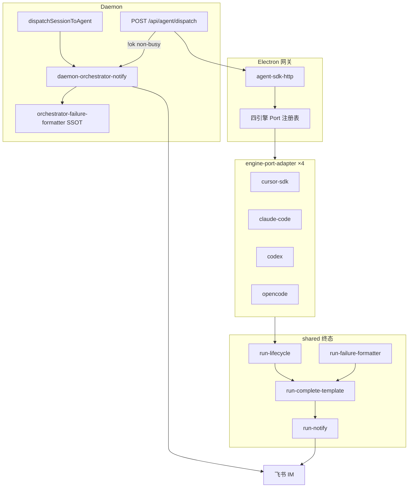

# 四引擎 Engine Port 与 RunLifecycle 抽象 - 代码评审报告（全量 T1～T16）

## 1、审查范围

- **变更类型**：apply 全量产出（T1～T16 `done`；T17 `deferred` 归 `/kb-archive`）
- **评审等级**：full-review（跨 Electron shared / 四引擎 adapter / Daemon orchestrator；架构型技术债）
- **涉及文件**：manifest `tasks` 登记路径 + 新增 `engine-port-adapter.ts`×4、`sdk-run-port-lifecycle.ts`、`src/shared/orchestrator-failure-formatter.ts` 等（约 40+ 源码文件；`06-automation-test.md` 静态指针）
- **设计文档**：`01-proposal.md`（S1～S8 矩阵）、`02-design.md`（四期 §六、八·（二））、`03-tasks.md`（T1～T16 验收）
- **对照基准**：01 功能需求 R1～R8；02 工程补充验收四期项；03 任务清单 T1～T16
- **静态校验**：`npm run build` **通过**（2026-07-12 复审复验 exit 0）；关键新建/改动文件均 ≤300 行（最大 `opencode/engine-port-adapter.ts` 209 行）
- **测试证据**：`06-automation-test.md` §3～§7（T11/T14 静态矩阵 pass；运行态 IM 待手工）
- **评审时间**：2026-07-12T10:50+0800（kb-reviewer `/kb-review` 全量复审 T1～T16）

## 2、严重（必须处理）

无。

> T17 知识库正文更新为 archive 阶段任务，**不**构成代码评审 blocker。

## 3、警告（建议处理）

### 3.1 已关闭（manifest `reviews`）

| ID | 摘要 | 状态 | 关闭理由 |
|----|------|------|----------|
| **R1** | `completeSdkFailureViaTemplate` 零引用；`completeSdkRun` 未委托 template | **fixed** | T9：`completeSdkRunViaPort` + `completeSdkFailureViaTemplate` 已接线（`sdk-run-lifecycle.ts`、`sdk-run-stream.ts`、`engine-port-adapter.ts`）；终态统一经 `RunLifecycle.enterNotifying` → `completeRunFromTemplate` |
| **R2** | `formatOrchestratorFailure` 双份 SSOT | **fixed** | T-FIX：唯一实现在 `src/shared/orchestrator-failure-formatter.ts`；`electron/agent/shared/run-failure-formatter.ts` 与 `src/daemon/daemon-orchestrator-notify.ts` 仅 re-export |
| **R3** | T11 Cursor+Claude S1～S6 无运行态冒烟 | **accepted_debt** | 静态+build 全矩阵 pass（`06` §3.4/§4.5）；无真机飞书环境，运行态 IM 待维护者按 §4.5 手工执行；**不阻断 archive** |
| **R4** | `isSdkSessionProcessing` busy 早退无 IM | **fixed** | T9：`notifySdkProcessingBusy`（`sdk-run-port-lifecycle.ts`）于 `agent-sdk.ts` launch/dispatch processing 早退路径调用 |
| **R5** | T14 四引擎全矩阵运行态 IM | **accepted_debt** | 静态+build 四引擎×S1～S8 pass（`06` §3.5/§4.6/§4.7）；运行态 IM 待维护者按 §4.6 手工；**不阻断 archive** |

### 3.2 分期已知债务（非 open warning）

1. **S7 `RunLifecycle.resume()` 仍为 stub**
   - 位置：`electron/agent/shared/run-lifecycle.ts:78-80`
   - 说明：Cursor `sdk-run-recover.ts` 续接路径存在，未与 Lifecycle 全量挂接；运行态续接 notify 待手工（`06` §3.5 S7 ⏸）。归入 T14 accepted_debt 口径，不另开 blocker。

2. **S8 CC/Codex/OpenCode 仍 `acquireRunGuard` 无 busy IM**
   - 位置：`agent-claude-sdk.ts`、`agent-codex-sdk.ts`、`agent-opencode-sdk.ts`
   - 说明：仅 Cursor 经 `enterGuardWithLifecycle`；其余引擎 busy 静默为文档化差异（`06` §3.5 S8 ⏸）。后续可单独立项收敛，**不阻断本变更 archive**。

3. **shrink：`run-failure-formatter` 仍依赖 `cursor-sdk/sdk-failure-messages`**
   - 位置：`electron/agent/shared/run-failure-formatter.ts:6`
   - 说明：shared 层反向依赖具体引擎；各 adapter 已通过 `ctx.sdk` 注入富文案，长期宜将默认分支下沉 adapter。评分 ~50，维护性建议，非功能 blocker。

**警告四态汇总**：`open` **0**｜`fixed` **3**（R1、R2、R4）｜`accepted_debt` **2**（R3、R5）｜`false_positive` **0**

## 4、设计偏差

1. **S7 续接与 design 终态**
   - 设计预期：各引擎续接后 `RunLifecycle.resume` 重置 `errorNotified` 与阶段（02 §八·（二）三期 S7）
   - 实际：`resume()` 仅 `setPhase("guarding")` stub；Cursor recover 仍走既有 `sdk-run-recover` 路径
   - 影响：静态接线合规；运行态须手工验证（accepted_debt）

2. **S8 跨引擎 guard 对称**
   - 设计预期：01 S8「并发/锁冲突不静默」四引擎可对照
   - 实际：仅 Cursor 有 guard busy IM；CC/Codex/OpenCode 保持 acquireRunGuard 原行为
   - 影响：产品矩阵部分差异已记入 `06`；非本期 scope 回退，accepted_debt

其余实现与 `02-design.md` 方案 B（Port + RunLifecycle + shared 终态出口 + Daemon dispatch 对称）**一致**。

## 5、验收标准检查

### 5.1 01 场景矩阵 S1～S8 × 四引擎（T14 口径）

| 场景 | Cursor | Claude | Codex | OpenCode | 状态 |
|------|--------|--------|-------|----------|------|
| S1 成功完成 | ✅ 静态 | ✅ | ✅ | ✅ | 运行态 📋 R5 |
| S2 用户取消 | ✅ | ✅ | ✅ | ✅ | 运行态 📋 R5 |
| S3 超时/看门狗 | ✅ | ✅ | ✅ | ✅ | 运行态 📋 R5 |
| S4 运行期失败 | ✅ | ✅ | ✅ | ✅ | 运行态 📋 R5 |
| S5 dispatch 失败对称 | ✅ | ✅ | ✅ | ✅ | Daemon 层引擎无关；运行态 📋 R5 |
| S6 stale/aborted | ✅ | ✅ | ✅ | ✅ | 运行态 📋 R5 |
| S7 重启续接 | ⏸ | ⏸ | ⏸ | ⏸ | `resume` stub；accepted_debt |
| S8 并发/锁冲突 | ✅ | ⏸ | ⏸ | ⏸ | Cursor guard IM；其余 accepted_debt |

### 5.2 02 工程补充验收项

| 分期 | 项 | 状态 |
|------|-----|------|
| 一期 | dispatch 非 busy 失败 IM | ✅ |
| 一期 | `run-notify` 唯一实现；SDK/CC re-export | ✅ |
| 一期 | RunLifecycle + AgentEnginePort + registry | ✅ |
| 一期 | build + ≤300 行 | ✅ |
| 二期 | Cursor/Claude S1～S4、S6 静态 | ✅；IM 📋 R3 |
| 三期 | 四引擎 S5、S1～S6 跨引擎一致（静态） | ✅；IM 📋 R5 |
| 三期 | S7 续接 | ⏸ accepted_debt |
| 四期 | 无四份独立 `notifySessionChat`；无 bypass Lifecycle 主路径 | ✅（grep 仅 `run-notify.ts` 完整实现；`cc-watchdog-finalize.ts` 已删） |
| 四期 | 知识库 06～10 + 消息桥接 02 | ⏸ T17 deferred |

### 5.3 任务清单 T1～T16

| 任务 | 关键验收 | 状态 |
|------|----------|------|
| T1 | 类型 SSOT、`RunFailureReason` | ✅ |
| T2 | `run-notify` 唯一出站 | ✅ |
| T3 | 失败文案 + orchestrator SSOT | ✅（T-FIX） |
| T4 | 幂等闩、f41 防双写 | ✅ |
| T5 | 状态机 + `errorNotified` 门控 | ✅ |
| T6 | Port registry + legacy fallback | ✅ |
| T7 | dispatch HTTP 对称 notify | ✅ |
| T8 | guard busy IM；SDK 失败经 shared | ✅ |
| T9 | Cursor Port 六方法 + Lifecycle | ✅ |
| T10 | Claude Port + Lifecycle 收尾 | ✅ |
| T11 | Cursor+Claude 矩阵 | ✅ 静态；📋 IM R3 |
| T12 | Codex Port + re-export notify | ✅ |
| T13 | OpenCode Port + SSE→RunEvent | ✅ |
| T14 | 四引擎×S1～S8 | ✅ 静态；📋 IM R5 |
| T15 | 删平行 notify/failure/complete | ✅ |
| T16 | AGENTS Port 挂接说明 | ✅ |
| T17 | 知识库 archive | ⏸ deferred |

## 6、调用链与回归风险

| 风险点 | 等级 | 说明 |
|--------|------|------|
| 运行态 IM 未 E2E | 中 | R3/R5 accepted_debt；维护者须按 `06` §4.5/§4.6 补手工 |
| S7 续接 + `errorNotified` 残留 | 中 | `resume` stub；recover 路径需运行态对照 |
| S8 非 Cursor busy 静默 | 低 | 文档化差异；后续可收敛 |
| shared→SDK formatter 依赖 | 低 | 维护性；adapter 已可注入 `ctx.sdk` |
| 动态 import 重复 chunk（build 警告） | 低 | Vite reporter；不影响功能 |

## 7、遗留债务

| 类别 | 内容 | 归档方式 |
|------|------|----------|
| **accepted_debt** | R3：T11 Cursor+Claude 运行态 IM | `archived_with_debt` 或 archive 时用户确认 |
| **accepted_debt** | R5：T14 四引擎全矩阵运行态 IM | 同上 |
| **accepted_debt** | S7 `resume` stub + 续接运行态 | 记入 `05-summary`；后续变更挂接 |
| **accepted_debt** | S8 CC/Codex/OpenCode guard busy 无 IM | 同上 |
| **deferred** | T17 知识库 06～10、消息桥接 02 | `/kb-archive` 由 kb-librarian 执行 |

## 8、修复任务建议

| 问题 ID | 建议动作 | 关联 |
|---------|----------|------|
| R3 | 维护者按 `06` §4.5 执行 Cursor+Claude 手工冒烟并补 §7 记录 | 运维 |
| R5 | 维护者按 `06` §4.6 执行四引擎全矩阵手工冒烟 | 运维 |
| S7 | 后续变更：`RunLifecycle.resume` 与 `sdk-run-recover` 挂接 | 新 propose |
| S8 | 后续变更：CC/Codex/OpenCode 改用 `enterGuardWithLifecycle` | 新 propose |
| T17 | `/kb-archive` 更新 Agent 调度 06～10 + 飞书通道 02 | kb-librarian |

## 9、结论

**通过（全量 T1～T16）**，`stage=reviewed`。

四引擎 `AgentEnginePort` adapter、共享 `RunLifecycle` 终态链、Daemon dispatch 对称 IM、`formatOrchestratorFailure` SSOT、平行 notify/failure 路径清理（T15）与 AGENTS 沉淀（T16）均已落地；`npm run build` 复验通过。**严重 0｜open warning 0｜fixed 3｜accepted_debt 2**。

**可进入 `/kb-archive`**：代码与 T1～T16 验收满足归档条件；T17 知识库更新为 archive 内置步骤；R3/R5 运行态 IM 为 accepted_debt，须在 archive 时用户确认或标 `archived_with_debt`。
