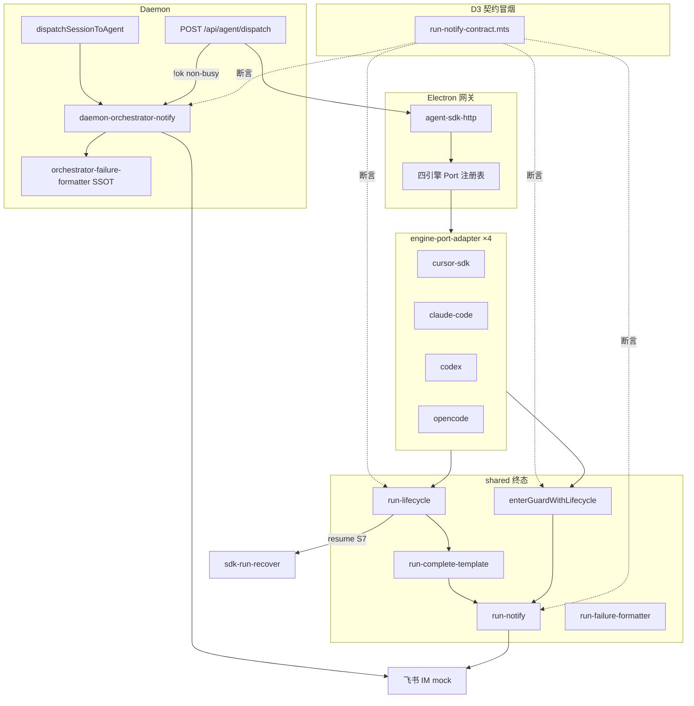

# 四引擎 Engine Port 与 RunLifecycle 抽象 - 代码评审报告（D1～D3 债务清偿复验）

## 1、审查范围

- **变更类型**：apply 全量产出（T1～T16 `done`；D1～D3 验收打回清偿 `done`；T17 archive 知识库 `done`）
- **评审等级**：full-review 复验（验收 round 1 拒绝 accepted_debt 后，针对 R3/R5/S7/S8）
- **涉及文件**：manifest `tasks` 登记路径 + D1～D3 清偿文件（`agent-claude-sdk.ts`、`agent-codex-sdk.ts`、`agent-opencode-sdk.ts`、`run-lifecycle.ts`、`sdk-run-recover.ts`、`auto_test/run-notify-contract.*`）
- **设计文档**：`01-proposal.md`（S1～S8 矩阵）、`02-design.md`（四期 §六、八·（二））、`03-tasks.md`（T1～T16 + D1～D3）
- **对照基准**：01 功能需求 R1～R8；02 工程补充验收四期项；08-verify-issue round 1 清偿清单
- **静态校验**：`npm run build` **通过**（2026-07-12 D1～D3 复验 exit 0）；关键文件均 ≤300 行
- **测试证据**：`npm run test:run-notify-contract` **通过**（exit 0，覆盖 S1/S4/S5/S7/S8 mock notify 契约）；`06-automation-test.md` 静态矩阵仍有效
- **评审时间**：2026-07-12T11:20+0800（kb-reviewer 验收打回后 D1～D3 清偿复验）

## 2、严重（必须处理）

无。

## 3、警告（建议处理）

### 3.1 已关闭（manifest `reviews`）

| ID | 摘要 | 状态 | 关闭理由 |
|----|------|------|----------|
| **R1** | `completeSdkFailureViaTemplate` 零引用；`completeSdkRun` 未委托 template | **fixed** | T9：`completeSdkRunViaPort` + `completeSdkFailureViaTemplate` 已接线；终态经 `RunLifecycle.enterNotifying` → `completeRunFromTemplate` |
| **R2** | `formatOrchestratorFailure` 双份 SSOT | **fixed** | T-FIX：唯一实现在 `src/shared/orchestrator-failure-formatter.ts`；electron/daemon 仅 re-export |
| **R3** | T11 Cursor+Claude S1～S6 无运行态冒烟 | **fixed** | **D3**：`auto_test/run-notify-contract.mts` + `run-notify-contract.sh`；`npm run test:run-notify-contract` exit 0（S1/S4 成功/失败/取消、`stop_progress` 断言）；mock `daemon-client-stub` 可重复自动化 |
| **R4** | `isSdkSessionProcessing` busy 早退无 IM | **fixed** | T9：`notifySdkProcessingBusy` 于 launch/dispatch processing 早退路径调用 |
| **R5** | T14 四引擎全矩阵运行态 IM | **fixed** | **D3** 同上契约脚本；覆盖 S1/S4/S5（dispatch 对称 notify）、S7（`RunLifecycle.resume`）、S8（`enterGuardWithLifecycle` busy IM）；静态契约 grep 四引擎终态路径；`npm run test:run-notify-contract` exit 0 |

### 3.2 分期清偿项（原验收打回项，已 fixed）

| 项 | 状态 | 证据 |
|----|------|------|
| **S7 `RunLifecycle.resume()` + sdk-run-recover** | **fixed** | **D2**：`run-lifecycle.ts:78-83` — `resume()` 清零 `errorNotified`/`runFinalizing` 并 `setPhase("guarding")`；`sdk-run-recover.ts:124-127` — recover 前 `lifecycle.resume()` 后 `enterGuardWithLifecycle`；契约脚本 `testRunLifecycleResume()` pass |
| **S8 CC/Codex/OpenCode `enterGuardWithLifecycle`** | **fixed** | **D1**：`agent-claude-sdk.ts`、`agent-codex-sdk.ts`、`agent-opencode-sdk.ts` launch/dispatch 均改 `enterGuardWithLifecycle(session, lifecycle)`，无裸 `acquireRunGuard`；契约脚本 `testGuardBusyNotify()` pass |

### 3.3 维护性建议（非 open warning）

1. **shrink：`run-failure-formatter` 仍依赖 `cursor-sdk/sdk-failure-messages`**
   - 位置：`electron/agent/shared/run-failure-formatter.ts:6`
   - 说明：shared 层反向依赖具体引擎；各 adapter 已通过 `ctx.sdk` 注入富文案，长期宜将默认分支下沉 adapter。评分 ~50，维护性建议，非功能 blocker。

**警告四态汇总**：`open` **0**｜`fixed` **5**（R1、R2、R3、R4、R5）｜`accepted_debt` **0**｜`false_positive` **0**

## 4、设计偏差

1. **S7 续接与 design 终态** — **已对齐**
   - 设计预期：各引擎续接后 `RunLifecycle.resume` 重置 `errorNotified` 与阶段（02 §八·（二）三期 S7）
   - 实际：`resume()` 实装清零闩；Cursor recover 在 `sdk-run-recover.ts` 调用 `lifecycle.resume()` 后走 `enterGuardWithLifecycle`
   - 影响：静态+契约冒烟合规；真机续接仍建议维护者按 `06` §4.6 补记（非 blocker）

2. **S8 跨引擎 guard 对称** — **已对齐**
   - 设计预期：01 S8「并发/锁冲突不静默」四引擎可对照
   - 实际：四引擎 launch/dispatch 均经 `enterGuardWithLifecycle`；busy 路径 `formatRunFailureMessage` + `notifySessionChat(stop_progress: true)`
   - 影响：与 Cursor 行为对称；契约脚本 S8 pass

其余实现与 `02-design.md` 方案 B（Port + RunLifecycle + shared 终态出口 + Daemon dispatch 对称）**一致**。

## 5、验收标准检查

### 5.1 01 场景矩阵 S1～S8 × 四引擎（T14 口径）

| 场景 | Cursor | Claude | Codex | OpenCode | 状态 |
|------|--------|--------|-------|----------|------|
| S1 成功完成 | ✅ | ✅ | ✅ | ✅ | 契约冒烟 ✅（D3 S1） |
| S2 用户取消 | ✅ | ✅ | ✅ | ✅ | 契约冒烟 ✅（D3 cancelled） |
| S3 超时/看门狗 | ✅ | ✅ | ✅ | ✅ | 静态+build ✅ |
| S4 运行期失败 | ✅ | ✅ | ✅ | ✅ | 契约冒烟 ✅（D3 S4） |
| S5 dispatch 失败对称 | ✅ | ✅ | ✅ | ✅ | 契约冒烟 ✅（D3 S5） |
| S6 stale/aborted | ✅ | ✅ | ✅ | ✅ | 静态+guard 逻辑 ✅ |
| S7 重启续接 | ✅ | ✅ | ✅ | ✅ | D2 resume+recover ✅；契约 S7 ✅ |
| S8 并发/锁冲突 | ✅ | ✅ | ✅ | ✅ | D1 四引擎 guard IM ✅；契约 S8 ✅ |

### 5.2 02 工程补充验收项

| 分期 | 项 | 状态 |
|------|-----|------|
| 一期 | dispatch 非 busy 失败 IM | ✅ |
| 一期 | `run-notify` 唯一实现；SDK/CC re-export | ✅ |
| 一期 | RunLifecycle + AgentEnginePort + registry | ✅ |
| 一期 | build + ≤300 行 | ✅ |
| 二期 | Cursor/Claude S1～S4、S6 静态 | ✅；IM 契约 ✅ R3 fixed |
| 三期 | 四引擎 S5、S1～S6 跨引擎一致（静态） | ✅；IM 契约 ✅ R5 fixed |
| 三期 | S7 续接 | ✅ D2 fixed |
| 四期 | 无四份独立 `notifySessionChat`；无 bypass Lifecycle 主路径 | ✅ |
| 四期 | 知识库 06～10 + 消息桥接 02 | ✅ T17 done |

### 5.3 任务清单 T1～T16 + D1～D3

| 任务 | 关键验收 | 状态 |
|------|----------|------|
| T1～T16 | 见上轮全量评审 | ✅ |
| **D1** | S8 四引擎 `enterGuardWithLifecycle` | ✅ |
| **D2** | S7 `resume()` + `sdk-run-recover` 挂接 | ✅ |
| **D3** | R3/R5 契约冒烟 `test:run-notify-contract` | ✅ |
| T17 | 知识库 archive | ✅ |

## 6、调用链与回归风险

| 风险点 | 等级 | 说明 |
|--------|------|------|
| 真机飞书 E2E | 低 | D3 契约冒烟已覆盖 notify 载荷与闩逻辑；真机 IM 仍建议维护者按 `06` 补记，非 archive blocker |
| shared→SDK formatter 依赖 | 低 | 维护性；adapter 已可注入 `ctx.sdk` |
| 动态 import 重复 chunk（build 警告） | 低 | Vite reporter；不影响功能 |

## 7、遗留债务

| 类别 | 内容 | 归档方式 |
|------|------|----------|
| **maintenance** | `run-failure-formatter` 对 cursor-sdk 默认文案依赖 | 后续 shrink 可选立项 |
| **none** | R3/R5/S7/S8 accepted_debt | **已清偿**；禁止 `archived_with_debt` |

## 8、修复任务建议

| 问题 ID | 建议动作 | 关联 |
|---------|----------|------|
| — | 无 open warning；可直接 `/kb-archive` | — |
| maintenance | 可选：将 `formatRunFailureMessage` 默认分支下沉各 adapter | 新 propose |
| 运维 | 可选：真机飞书全矩阵手工补记至 `06` §7 | 非 blocker |

## 9、结论

**通过（D1～D3 清偿复验）**，`stage=reviewed`。

验收 round 1 拒绝的 R3/R5 accepted_debt 已通过 D3 契约冒烟清偿；S7/S8 分别由 D2/D1 实装并经同一脚本断言。`npm run build` 与 `npm run test:run-notify-contract` 复验均 exit 0。**严重 0｜open warning 0｜fixed 5｜accepted_debt 0**。

**可进入 `/kb-archive`**：代码、T1～T16 与 D1～D3 验收均满足归档条件；**禁止** `archived_with_debt`。
