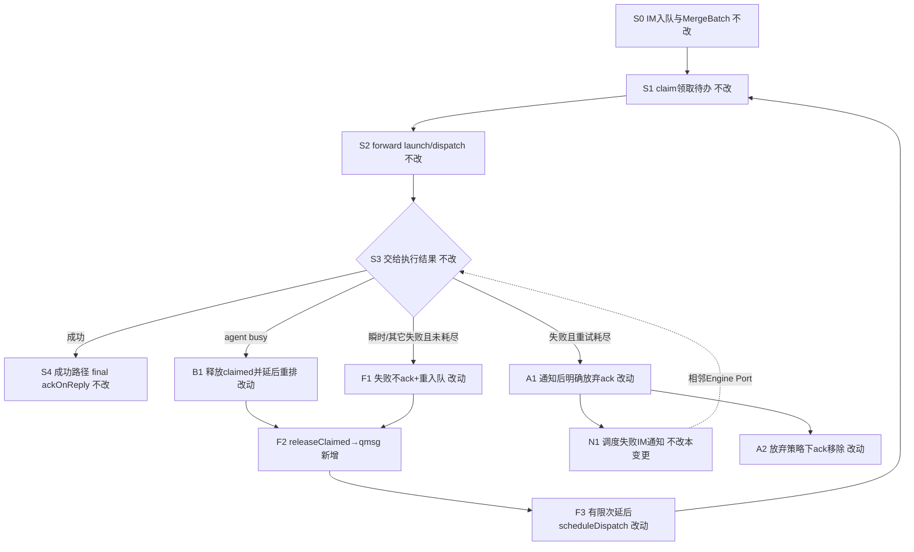
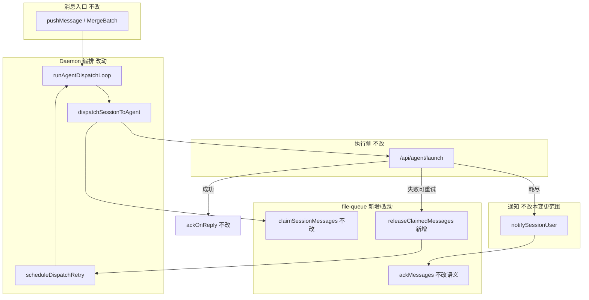

# dispatch失败重入队与ack策略 - 实现设计

> **业务 PRD**：见同目录 `01-proposal.md`（验收标准以 01 为准）
> **业务流程口径**：01 未单列「业务流程」小节；本设计以 `01` §四场景 S1～S5 与 §六验收主路径为业务流节点清单。

## 一、业务流程与改动范围

> 业务口径以 `01-proposal.md` §四 / §六 为准；下图覆盖成功主路径、瞬时失败重试、重试耗尽放弃、busy 重排与通知边界。

### （一）业务流程图

**图例**：`不改` 行为与现网一致；`改动` 需改代码；`新增` 新符号/能力；`删除` 移除「失败即 ack 丢弃」旧路径。

### （二）流程步骤与改动对照

| 步骤 ID | 业务含义 | 改动 | 落点（模块/文件） | 01 验收关联 |
|---------|----------|------|-------------------|-------------|
| S0 | IM 入队、MergeBatch、F1 排队反馈 | 不改 | `src/daemon/daemon.ts` pushMessage；MergeBatch 既有逻辑 | S4；01 非目标 |
| S1 | Orchestrator claim 领取 `.qmsg→.claimed` | 不改 | `daemon-orchestrator.ts` `claimForOrchestratorDispatch`；`file-queue.ts` `claimSessionMessages` | S4 |
| S2 | `forwardElectronAgentApi("/api/agent/launch")` 交给执行侧 | 不改 | `daemon-orchestrator.ts` `forwardElectronAgentApi` | S4；R4 |
| S3 | 判定 launch/dispatch 结果（ok / busy / 失败） | 不改 | `dispatchSessionToAgent` 内 `result.ok` / `parseBusyRetryDelayMs` | S1～S2 |
| S4 | 成功后由 stream final / 回复路径 `ackOnReply` 确认移除 | 不改 | `daemon.ts` `ackOnReply`；`daemon-presentation-stream.ts` | 01 §6.1.4；R4；S4 |
| F1 | 非 busy 失败时**不得**立刻 `ackMessages` 丢任务 | 改动 | `daemon-orchestrator.ts` `dispatchSessionToAgent` 失败分支（删除现网末条 ack） | R1；§6.1.2；S1 |
| F2 | 失败后 `.claimed` 还原为可再次领取的 `.qmsg`（重入队） | 新增 | `file-queue.ts` 新增 `releaseClaimedMessages`（复用 `cleanupOrphanClaimedOnColdStart` 改名模式）；经 `OrchestratorDeps` 注入 | R2；§6.1.1 |
| F3 | 有限次延后重调度（次数/退避）；日志可区分「已安排重试」 | 改动 | `daemon-orchestrator.ts`：扩展 `scheduleBusyRetry` 或并列 `scheduleDispatchRetry`；session 级 attempt Map | R3；R6；S1 |
| B1 | agent busy：与瞬时失败统一走「释放 + 延后重排」，修复仅 timer 不释放导致无法再 claim | 改动 | 同上 `dispatchSessionToAgent` busy 分支 | S1；与现网 `agent_busy_requeue` 日志对齐 |
| A1 | 重试耗尽：停止自动重试，用户可感知「已停试」 | 改动 | `dispatchSessionToAgent`：耗尽分支调用既有 `notifySessionUser` + `formatOrchestratorFailure`（文案可带耗尽语义） | §6.1.3；S2；R3 |
| A2 | 明确放弃策略：通知之后再 ack 移除（非静默） | 改动 | 耗尽路径：`notify` 后 `ackMessages(lastId)`；打 `dispatch_retry_exhausted` 日志 | R1 放弃例外；R6；S2 |
| N1 | 调度失败 IM 通知出口 | 不改 | `daemon-orchestrator-notify.ts`；相邻 Engine Port 变更负责对称性增强 | R5；S3；01 §6.2 |
| S5 | 用户主动「取消/不再重试」入口 | 不改 | 本期无独立入口（01 非目标） | S5；01 §七 |
| DEL-1 | 删除「非 busy 失败 → 直接 ack 末条」旧行为 | 删除 | `dispatchSessionToAgent` 现网 `deps.ackMessages(lastId)` 失败即丢路径 | R7；知识库 R3 |

### （三）改动汇总

- **新增**：
  - `src/bridge/file-queue.ts`：`releaseClaimedMessages(messageIds, sessionKey?)`——将指定 `.claimed` 改回 `.qmsg`（与冷启动 orphan 回收同构，范围按 messageId）。
  - Orchestrator 内 session 级 `dispatchRetryAttemptBySession`（内存 Map，进程内计数即可）。
- **改动**：
  - `src/daemon/daemon-orchestrator.ts`：`dispatchSessionToAgent` 失败路径改为「释放 + 有限重试 / 耗尽通知后 ack」；busy 与瞬时失败收敛到同一重入队策略。
  - `OrchestratorDeps`：增加 `releaseClaimedMessages` 注入；`daemon.ts` `wireDaemonSubmodules` 接线。
- **删除**：
  - 失败分支「未耗尽即 `ackMessages`」的丢任务路径（产品债 R3）。
- **不改（显式列出）**：
  - 成功路径 `ackOnReply` / stream-text final ack。
  - 飞书 CardKit / Presentation / MergeBatch 视觉与交互。
  - file-queue 存储形态整体重写、性能翻修。
  - Engine Port / RunLifecycle / 统一 notify 总线（相邻变更）。
  - 对外 HTTP 契约（`/api/agent/launch|dispatch`、`/api/send-text`）。
  - Electron `retry-policy.ts`（SDK Run 内重试）；本期不跨层耦合，仅可参考其退避数值。

## 二、整体思路

**根因**（见 01 §一；CodeGraph 核实）：`createOrchestrator` → `dispatchSessionToAgent` 在 `forwardElectronAgentApi("/api/agent/launch")` 非 busy 失败时，先 `notifySessionUser`，再对 `claimed.message_ids` 末条调用 `deps.ackMessages`，将 `.claimed` **删除**。任务从待办永久消失，用户只能手动重发（知识库 R3）。busy 分支虽 `scheduleBusyRetry`，但消息仍停在 `.claimed`，下次 `claimForOrchestratorDispatch` 因 `getSessionUnclaimedCount===0` 直接跳过，重排无法真正再领——与「可重试」产品预期仍有缺口。

**方案要点**：

1. **失败默认释放而非确认**：可重试失败 → `releaseClaimedMessages`（`.claimed→.qmsg`）+ 延后 `scheduleAgentDispatch`；**禁止**未耗尽时 ack。
2. **有限重试**：默认每 session 最多 **3** 次自动重试；退避建议 `600 / 1200 / 2400` ms（对齐 `retry-policy.ts` 数值，逻辑留在 Daemon Orchestrator，不 import Electron 模块）。busy 若带 `retry_after` 则取其 capped 值。
3. **放弃闭环**：耗尽后 `notifySessionUser`（可感知停试）→ 再 `ackMessages`（明确放弃，非静默）→ 日志 `dispatch_retry_exhausted`。
4. **成功一次确认**：成功交给执行后仍只靠既有 final/`ackOnReply`；本变更不在 launch ok 时提前 ack。
5. **与通知分工**：通知仍走既有 `notifySessionUser` / 相邻 Engine Port；本变更只改队列 ack/重入队语义（01 R5）。

**最小方案三问（Ponytail）**：

1. **能否复用现有模块/符号？** 能。重入队复用 `cleanupOrphanClaimedOnColdStart` 的 rename 模式抽成按 id 释放；延后调度复用 `scheduleBusyRetry` / `scheduleAgentDispatch`；通知复用 `createOrchestratorNotify`。不新建队列引擎或抽象框架。
2. **拟新增抽象/依赖是否被 01 要求？** 否。不引入新 npm 包、不抽通用 RetryMiddleware；仅新增一个 file-queue 释放函数 + Orchestrator 内 attempt Map。YAGNI：01 只要失败不丢与有限重试可验收。
3. **能否合并到已有文件？** 能。逻辑落在 `file-queue.ts` 与 `daemon-orchestrator.ts`（及 `daemon.ts` 接线）。若单文件将超 300 行，按 AGENTS 再拆小模块；默认不预建「通用重试层」。

## 三、分层设计

- **端点层**：无新 HTTP；编排仍由 SSE/入队触发 `scheduleAgentDispatch`。
- **服务层**：Orchestrator 拥有失败后的队列策略 SSOT。
- **数据层**：仍为会话目录下 `.qmsg` / `.claimed` 文件；无 DB。

## 四、接口设计

无对外 HTTP / proto 变更。沿用既有契约。

**对内新增（TypeScript）**：

| 符号 | 入参 | 出参 | 说明 |
|------|------|------|------|
| `releaseClaimedMessages` | `messageIds: string[]`, `filterSessionKey?: string` | `string[]`（实际释放的 messageId） | 将匹配的 `.claimed` rename 为 `.qmsg`；找不到则跳过 |
| `scheduleDispatchRetry`（或扩展 `scheduleBusyRetry`） | `sessionKey`, `delayMs`, `reason` | `void` | 清除旧 timer、延后 `scheduleAgentDispatch`；打可检索日志 |

**失败分支伪契约**（实现须遵守）：

| 条件 | 队列动作 | 通知 | 重调度 |
|------|----------|------|--------|
| `result.ok` | 不 ack（等 final） | 无失败通知 | 无 |
| 失败且 attempt &lt; max | `releaseClaimedMessages` | 可选：瞬时失败可沿用现网每次 notify，或仅耗尽 notify——**默认保留每次失败 notify**（与现网一致，便于感知） | 是 |
| 失败且 attempt ≥ max | 通知后 `ackMessages` | 必须（含停试语义） | 否 |
| agent busy | 同「可重试失败」 | 可不发失败文案（现网 busy 不走 failure notify） | 是（delay 用 `retry_after`） |

## 五、数据结构

无持久化 schema / 配置文件变更。

**进程内状态**（`daemon-orchestrator.ts`）：

| 结构 | 键 | 值 | 说明 |
|------|----|----|------|
| `dispatchRetryAttemptBySession` | `sessionKey` | `number` | launch 失败递增；成功交给执行或放弃 ack 后清零 |
| `busyRetryTimerBySession`（已有） | `sessionKey` | `Timeout` | 延后重调度；与重试共用或并列 |

**默认常量**（可文件内 const，本期不做用户配置项）：

- `MAX_DISPATCH_RETRIES = 3`
- 退避：`[600, 1200, 2400]` ms；busy 优先 `parseBusyRetryDelayMs`

**队列文件**：仍 `.qmsg` / `.claimed`；不新增 `.failed` 扩展名（Ponytail：用 attempt Map + 耗尽 ack 即可验收）。

## 六、实现步骤

1. **F2**：在 `file-queue.ts` 实现 `releaseClaimedMessages`（对照 `cleanupOrphanClaimedOnColdStart`）；导出并在 `daemon.ts` 注入 `OrchestratorDeps`。（步骤 F2）
2. **F1/DEL-1**：改写 `dispatchSessionToAgent` 非 busy 失败分支：去掉未耗尽时的 `ackMessages`。（步骤 F1、DEL-1）
3. **F3/B1**：接入 attempt 计数 + `scheduleDispatchRetry`；busy 与瞬时失败均先 release 再延后调度；成功 launch 时清零 attempt。（步骤 F3、B1、S4 边界）
4. **A1/A2**：耗尽：`notifySessionUser(..., true)` → `ackMessages` → 日志 `dispatch_retry_exhausted`；清零 attempt。（步骤 A1、A2）
5. **可观测**：统一日志关键字：`dispatch_retry_scheduled` / `dispatch_retry_exhausted` / 保留 `dispatch_failed`。（步骤 R6）
6. **自检**：人工制造 Agent API 未就绪一次，确认消息回 `.qmsg` 并再次 dispatch；连续失败 3+ 次后停止且已通知；成功路径无双跑。（对应 01 §6.1）

## 七、参考实现

CodeGraph（`projectPath=/home/suveng/doger/cursor-claw`，index 后检索）命中摘要：

| 符号 | 路径 | 与本变更关系 |
|------|------|----------------|
| `createOrchestrator` / 内嵌 `dispatchSessionToAgent` | `src/daemon/daemon-orchestrator.ts:68` | **主改点**：失败 ack → 释放+重试/耗尽 |
| `scheduleBusyRetry` / `parseBusyRetryDelayMs` | 同上 | 复用延后重排模式 |
| `ackMessages` | `src/bridge/file-queue.ts:334` | 成功/耗尽放弃仍用；影响面含 `ackOnReply`、`daemon-presentation-stream`（**勿改语义**） |
| `cleanupOrphanClaimedOnColdStart` | `src/bridge/file-queue.ts:512` | **参考实现**：`.claimed→.qmsg` rename |
| `ackOnReply` | `src/daemon/daemon.ts:881` | 成功确认路径，不改 |
| `createOrchestratorNotify` | `src/daemon/daemon-orchestrator-notify.ts:15` | 失败/耗尽通知，不改出口 |
| `shouldRetry` | `electron/agent/shared/retry-policy.ts:38` | 仅参考退避数值；不跨进程依赖 |
| `wireDaemonSubmodules` / `daemonMain` | `src/daemon/daemon.ts` | deps 接线 |

`codegraph_impact(ackMessages)`：`file-queue`、`ackOnReply`、`createStreamTextHandler`——故新增释放函数，避免改 `ackMessages` 语义牵连成功路径。

## 八、技术影响

### （一）影响范围

- **涉及模块**：Daemon Orchestrator、file-queue；`daemon.ts` 接线。
- **接口/proto 变更**：无。
- **数据变更**：无持久 schema；进程内 retry 计数。
- **风险**：
  - 释放与再次 claim 的竞态（并发 rename）——沿用 claim 既有 try/catch 忽略策略。
  - 重复执行：须保证 launch `ok` 后不 release、不二次 claim 同一批直至 final ack（S4）。
  - 毒消息占满：强制 `MAX_DISPATCH_RETRIES`；耗尽必须停止调度。
  - 与 Engine Port 并行：通知文案可能先后落地；本变更硬门槛是队列不丢。

### （二）工程补充验收项

- [ ] busy 失败后磁盘上对应项从 `.claimed` 回到 `.qmsg`，且延时后能再次进入 `dispatchSessionToAgent`。
- [ ] 连续非 busy 失败达到上限后出现 `dispatch_retry_exhausted`，且之后无该 session 自动重调度轰炸。
- [ ] launch 成功一次后 `dispatchRetryAttemptBySession` 已清零，后续新消息重试计数独立。
- [ ] 单文件改动后仍 ≤300 行或已按模式拆分；关键分支有中文注释。
- [ ] 无 02/03 未要求的新抽象层与新依赖。

## 九、知识库影响

- `knowledge/工程平台/Daemon守护进程/01-概览.md` §九 R3「dispatch 失败 ack 不 re-queue」— **必须改写**。
- `knowledge/业务域/消息桥接/01-概览.md` §九「dispatch 失败须手动重发」— **必须改写**。
- `knowledge/业务域/消息桥接/04-消息队列与路由.md` §三「dispatch 失败：notify + ack」与 §九「不 re-queue」— **必须同步**为新策略。
- `knowledge/业务域/Agent调度/` — 低：仅划界「队列恢复在 Daemon Orchestrator，非 Engine Port」。
- 两级索引：`知识索引.md` / 领域 `00-README` **无需**因本变更增删入口（叶子语义更新即可）。

## 十、知识库更新计划

### （一）必须更新

- Daemon 概览 §九 R3 → 描述「失败重入队 + 有限重试；耗尽通知后 ack」。
- 消息桥接概览 §九 限制条目同步。
- `04-消息队列与路由.md` §二/§三/§九：写入 `releaseClaimedMessages` 与失败策略；更新源码锚点。

### （二）可能更新（视实现结果）

- Daemon `02-HTTP与MCP服务.md`：若日志关键字写入运维说明。
- Agent 调度概览：若需交叉引用「dispatch 失败队列侧」一句。

### （三）不需要更新

- 飞书/微信通道 UI 文档。
- Engine Port / RunLifecycle 正文（相邻变更 archive 负责）。
- `知识索引.md` 入口结构。
