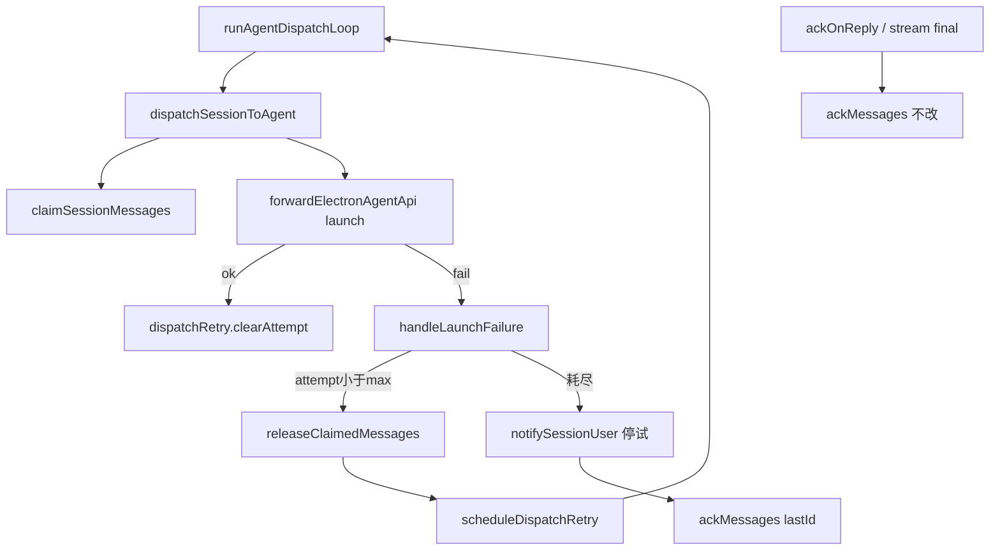

# dispatch失败重入队与ack策略 - 代码评审报告

## 1、审查范围

- **变更类型**: apply 产出的未提交变更（工作区 diff）
- **评审等级**: **focused-review**
- **风险等级与理由**: **中高（可靠性 P0，影响面可收敛）**。触及队列 ack/重入队与进程内重试计数，产品债 R3 闭环；但无 proto/DB/权限/资金，落点限于 `file-queue` 释放原语 + Orchestrator launch 失败路径，故选 focused 而非 full。若后续把 HTTP `/api/agent/dispatch` 纳入同策略，建议升 full-review。
- **涉及文件**: 6 个已改/新增代码与域 AGENTS + 本报告
  - `src/bridge/file-queue.ts`（`releaseClaimedMessages`）
  - `src/bridge/AGENTS.md`
  - `src/daemon/daemon-orchestrator.ts`
  - `src/daemon/daemon-orchestrator-retry.ts`（新增）
  - `src/daemon/daemon.ts`（deps 注入）
  - `src/daemon/AGENTS.md`
- **设计文档**: `02-design.md` / `03-tasks.md`（对照基准）；`01-proposal.md` 验收
- **CodeGraph**: `ackMessages` impact → `ackOnReply` / `createStreamTextHandler`（成功路径未改语义）；`cleanupOrphanClaimedOnColdStart` impact → `initQueue`；`ackOnReply` callees 仍含 `ackMessages`。新符号 `releaseClaimedMessages` / `createDispatchRetry` 索引尚未跟上（落盘后 ~1s 滞后），以 diff + 既有同构符号交叉核实。

## 2、严重（必须处理）

无

## 3、警告（建议处理）

无（评分 ≥75 项无）

**Ponytail 精简轴（focused 必做）**：

- `shrink:` `daemon-orchestrator-retry.ts` 中 `scheduleBusyRetry` 仅为 `scheduleDispatchRetry(..., "busy")` 薄包装 → 可内联到导出面，收益极小，**不建议为本变更再改**。
- `yagni:` 未引入通用 Retry 框架 / 新 npm 依赖；拆 `daemon-orchestrator-retry.ts` 符合 03「超 300 行才拆」与 notify 同构，**批准**。
- `delete:` 无死代码或未使用配置项。

→ **Lean already. Ship.**

## 4、设计偏差

1. **HTTP `/api/agent/dispatch` 仍走旧失败逻辑（已知范围外）**
   - 设计预期: `02` §一·（三）明确「不改对外 HTTP 契约」；T2「不改对外 HTTP」——主改点为 `dispatchSessionToAgent`（launch 编排路径）。
   - 实际实现: `daemon-http-routes-orchestrator.ts` 非 busy 失败仍 `ackMessages(lastId)`；busy 仅 `scheduleBusyRetry`、**不** `releaseClaimedMessages`（与本变更修复的 launch 侧 busy 卡盘问题同构残留）。
   - 影响: IM 主路径（Orchestrator → `/api/agent/launch`）已闭环；外部/旁路 HTTP dispatch 仍可能「失败即丢」或 busy 无法再 claim。记入 §7，**不判为 T1/T2 实现偏差**。

2. **瞬时失败 notify 未传 `stopProgress: true`（轻微）**
   - 设计预期: `02` §四「默认保留每次失败 notify（与现网一致）」；现网失败分支曾传第三参 `true`。
   - 实际实现: `handleLaunchFailure` 可重试路径 `notifySessionUser(sessionKey, text)` 默认 `stopProgress=false`；仅耗尽路径传 `true`。
   - 影响: 重试窗口内进度指示可能继续；与「停试可感知」不冲突。评分 &lt;75，不升警告；若运维观感异常可作 T-FIX。

## 5、验收标准检查

| 任务 | 验收条件 | 状态 |
|------|---------|------|
| T1 | `.claimed`→`.qmsg`，按 id 释放；双份删 claimed | ✅ 与冷启动同构实现 |
| T1 | 不存在 id / IO 失败不抛错 | ✅ try/catch + 跳过 |
| T1 | `ackMessages` 语义未改 | ✅ 未改函数体；CodeGraph impact 成功路径仍依赖原语义 |
| T1 | 无新依赖/抽象；中文注释 | ✅ |
| T2 | 可恢复失败 release + 延后调度，未耗尽不 ack | ✅ `handleLaunchFailure` |
| T2 | 删除「非 busy 失败直接 ack」旧路径 | ✅ orchestrator 失败分支已改 |
| T2 | busy 亦 release + 延后；`dispatch_retry_scheduled` / `agent_busy_requeue` | ✅ |
| T2 | 最多 3 次自动重试；退避 600/1200/2400；耗尽 `dispatch_retry_exhausted` + 停试文案 + ack | ✅ `MAX_DISPATCH_RETRIES` / `DISPATCH_BACKOFF_MS` |
| T2 | launch ok 清零 attempt；成功不提前 ack | ✅ `clearAttempt`；等 final/`ackOnReply` |
| T2 | 行数：orchestrator ≤300 或已拆；中文注释 | ✅ orchestrator 264 / retry 96；`file-queue` 超限为既有债且 T1 允许增量 |
| T2 | 不 import Electron `retry-policy` | ✅ 本地常量 |
| 01 §6.2 / HTTP | 旁路 HTTP dispatch 同策略 | ⏸ 明确划出 T2；见 §7 |
| 02 知识库 §十 | Daemon/桥接概览 R3 改写 | ⏸ 归属 archive，非本评审阻断 |

## 6、调用链与回归风险

| 风险点 | 说明 | 缓解 |
|--------|------|------|
| 成功双跑 | launch ok 后误 release | 实现仅 fail 路径 release；ok 只 clearAttempt |
| 毒消息轰炸 | 无限重试 | `MAX_DISPATCH_RETRIES=3`；耗尽停调度 |
| 进程重启丢计数 | attempt 仅内存 | 冷启动 `cleanupOrphanClaimedOnColdStart` 恢复 `.qmsg`；计数重置可再试 |
| 并发 rename | claim/release 竞态 | 与既有 claim 策略一致：失败忽略 |
| HTTP 旁路 | 见 §4/§7 | 主 IM 路径不受影响 |

## 7、遗留债务

1. **HTTP `POST /api/agent/dispatch` 失败/busy 未接线 `releaseClaimedMessages` / 有限重试**（builder 已知；T2 范围外）。建议另开变更或 `T-FIX`/`T3` 对齐 AGENTS「launch 与 dispatch 两条入口」busy 一致性。
2. **`file-queue.ts` 已超 300 行**（约 583）：本变更按 AGENTS/T1 允许增量；整体拆分另任务。
3. **知识库 R3 正文**（Daemon/消息桥接概览等）待 `/kb-archive` 按 `02` §十更新。

## 8、修复任务建议

| 问题 ID | 建议动作 | 关联任务 |
|---------|----------|----------|
| （无阻断 open） | — | — |
| D1 HTTP 旁路 | 可选：另立变更或 T-FIX 将 dispatch HTTP 失败对齐 release+重试 | 非本变更必做 |
| D2 stopProgress | 可选：可重试 notify 是否传 `true` 与产品确认 | 非阻断 |

## 9、结论

**通过（有债）**：T1/T2 对照 `01`/`02`/`03` 主路径验收满足，可进入 `/kb-test` 后 `/kb-archive`；HTTP dispatch 旧逻辑与知识库 R3 改写属遗留/归档项，**不阻断**本变更 archive（债在 §7，须在 archive 时更新知识库并可视情况登记 `archived_with_debt` 或另开变更）。
