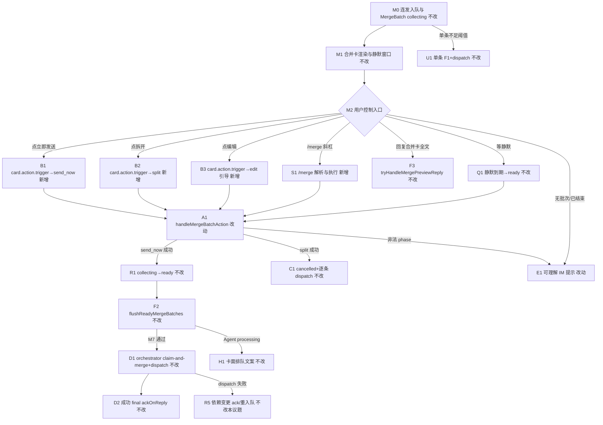
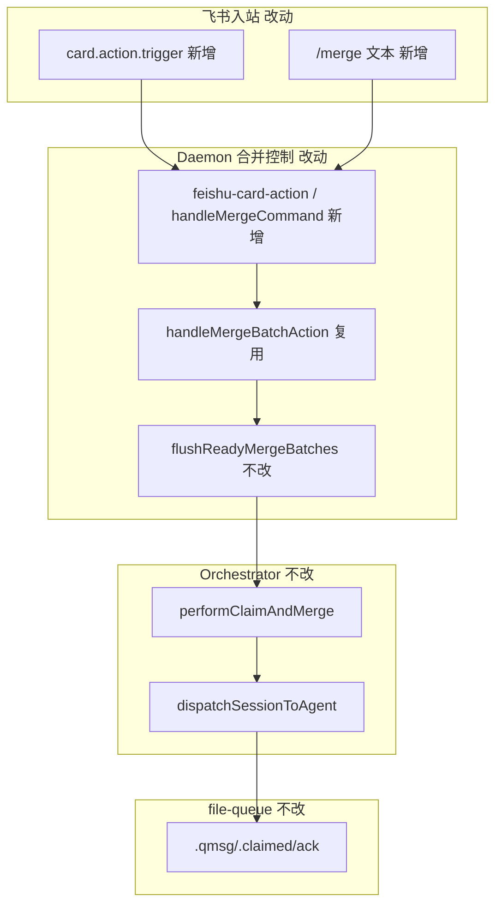

# 合并卡飞书按钮与merge指令 - 实现设计

> **业务 PRD**：见同目录 `01-proposal.md`（验收标准以 01 为准）
> **业务流程口径**：01 未单列「§业务流程」；本设计以 `01` §四场景、§五 R1～R5、§六验收 1～5 为业务流节点清单。

## 一、业务流程与改动范围

> 业务口径以 `01-proposal.md` §四 / §五 / §六 为准；下图覆盖主路径、斜杠兜底、非法状态与单条无回归分支。

### （一）业务流程图

**图例**：`不改` 行为与现网一致；`改动` 需改接线/反馈；`新增` 新入口或新事件注册；`删除` 无。

### （二）流程步骤与改动对照

| 步骤 ID | 业务含义 | 改动 | 落点（模块/文件） | 01 验收关联 |
|---------|----------|------|-------------------|-------------|
| M0 | 主用户私聊连发 ≥2 条，进入 collecting、抑制多余 F1 | 不改 | `daemon.ts` `onMessageEnqueued`；`shouldSendEnqueueF1` | AC5；R4 |
| M1 | 合并卡 CardKit 创建/PATCH、静默计时 | 不改 | `daemon.ts` `renderMergeBatchCardForSession`；`lark-core.ts` `renderMergeBatchCard` | AC5 |
| B1 | 飞书「立即发送」按钮回调接线 | 新增 | `lark-core.ts` 注册 `card.action.trigger`；`feishu-event-handlers.ts` 或 `feishu-card-action.ts` | AC1；R1 |
| B2 | 飞书「拆开逐条」按钮回调接线 | 新增 | 同上 | AC2；R1 |
| B3 | 飞书「编辑」按钮：无内联表单时引导回复合并卡（F3） | 新增 | 同上 + `replyToMessage` 文案 | AC2；R1 |
| S1 | `/merge` 斜杠与按钮语义等价（send / split / edit） | 新增 | `daemon.ts` `handleCommand` 拦截；`COMMANDS`/`feishu-help-text.ts` | AC3；R2 |
| F3 | 回复合并卡全文设置 `overrideText` | 不改 | `daemon-presentation-merge-preview.ts` `tryHandleMergePreviewReply` | AC2 |
| Q1 | 静默窗口到期自动 ready | 不改 | `daemon.ts` `scheduleMergeBatchQuietTimer` | AC1（静默路径） |
| A1 | 合并控制动作 SSOT（send_now/split/edit） | 改动 | `daemon.ts` `handleMergeBatchAction`（复用逻辑，补用户可见反馈与幂等） | R1～R4 |
| R1 | collecting→ready | 不改 | `handleMergeBatchAction` send_now 分支 | AC1 |
| F2 | ready 且 M7 通过时触发 dispatch 循环 | 不改 | `flushReadyMergeBatches`；`broadcastQueueEvent` | AC1；R4 |
| D1 | orchestrator `performClaimAndMerge` + launch | 不改 | `daemon-orchestrator.ts`；`daemon-http-routes-orchestrator.ts` | AC1；R5 边界 |
| D2 | 成功路径 stream final `ackOnReply` | 不改 | `daemon-presentation-stream.ts`；`file-queue.ts` `ackMessages` | R4；R5 契约 |
| R5 | dispatch 失败释放/重试/耗尽 ack（依赖变更） | 不改 | `daemon-orchestrator.ts`；`file-queue.ts` `releaseClaimedMessages` | 01 R5；见 §二 apply 闸门 |
| H1 | Agent processing 时合并卡排队脚本文案 | 不改 | `buildMergeBatchCardView` | AC1 可感知 |
| C1 | split 取消批次、逐条 dispatch | 不改 | `handleMergeBatchAction` split 分支 | AC2 |
| E1 | 无批次、已 dispatch、非法 phase 等可理解提示 | 改动 | 按钮/斜杠回调层统一错误文案映射 | AC4；R3 |
| U1 | 未达 `MERGE_MIN_COUNT` 单条路径 | 不改 | `onMessageEnqueued` 早退；既有 dispatch | AC5 |

### （三）改动汇总

- **新增**：
  - `lark-core.ts`：`card.action.trigger` 事件注册；`FeishuConnectionCallbacks.onCardAction`。
  - `feishu-card-action.ts`（或扩 `feishu-event-handlers.ts`）：解析 `value.action`（`merge_send_now`/`merge_split`/`merge_edit`）→ 解析 `sessionKey` → 调合并控制。
  - `daemon.ts`：`/merge` 斜杠拦截（**不入** `.fcmd`），子命令 `send`（默认）/`split`/`edit <正文>`。
  - `feishu-addons.ts`：增量事件 `card.action.trigger`（若扫码开权尚未包含）。
- **改动**：
  - 按钮/斜杠成功后经 `replyToMessage` 或卡片 toast（飞书 callback 响应）给出可感知结果；失败映射中文提示（对照 `handleMergeBatchAction` error）。
  - 可选：session 级短防抖（如 500ms）避免双入口连点重复日志（**不**改 MergeBatch phase 规则）。
- **删除**：无。
- **不改（显式列出）**：
  - `MergeBatch` phase 状态机定义与转移条件。
  - `file-queue` claim/ack/`releaseClaimedMessages` 语义（归依赖变更 R5）。
  - 微信通道、合并卡 CardKit 视觉结构。
  - `POST /api/control-command`、停止/新话题等 T10 控制层（与本议题划界）。
  - Electron `command-handler` 对 `/merge` 的处理（Daemon 内闭环，避免 fcmd 绕路）。

## 二、整体思路

**根因**（见 01 §一；CodeGraph 核实）：`lark-core.ts` 合并卡已渲染三枚按钮（`merge_send_now`/`merge_edit`/`merge_split`），但 `startConnection` 仅注册 `menu_v6`/`p2p_entered`/`im.message.receive_v1`，**无** `card.action.trigger`；`handleMergeBatchAction` 仅经 `POST /api/merge-batch/action` 可达；`COMMANDS` 无 `/merge`，用户无文本兜底（知识库 T8）。

**方案要点**：

1. **复用 SSOT**：按钮与 `/merge` 均调用既有 `handleMergeBatchAction(sessionKey, action, text?)`，不新建控制总线或 HTTP。
2. **飞书回调**：`card.action.trigger` → 从 `open_id`/`chat_id`/`operator` 解析 `sessionKey`（对齐 `makeChatKey` + `pushMessage` 口径）→ 执行动作 → **必须**回调响应（飞书要求）+ 可选 IM 补充说明。
3. **斜杠兜底**：在 `handleCommand` 识别 `/merge` 前缀后 **Daemon 内直接执行**，不写入 `.fcmd`（合并逻辑不在 Electron）；子命令与按钮 action 一一映射。
4. **编辑语义**：`merge_edit` 按钮无 CardKit 表单时，回复「请直接回复本合并卡发送修改后的全文」（沿用 F3）；`/merge edit <正文>` 走 HTTP 同等 `edit` 分支。
5. **R5 边界**：`send_now` 仅触发 `flushReadyMergeBatches` → 既有 orchestrator dispatch；本议题**不**修改失败 ack/重入队；apply 前须确认依赖变更语义无 breaking 变更（见下）。

**依赖变更 R5 — dispatch/ack 接口契约假设**（引用 `knowledge/变更/进行中/20260711232817-dispatch失败重入队与ack策略/02-design.md` §四、§八）：

| 假设 | 说明 |
|------|------|
| 成功 launch | 不在 launch ok 时提前 ack；仍等 stream final `ackOnReply` |
| 可重试失败 | `releaseClaimedMessages` + 延后 `scheduleAgentDispatch`；**未耗尽不 ack** |
| 耗尽放弃 | `notifySessionUser` 后 `ackMessages` |
| busy | 与可重试失败同策略释放 `.claimed` |
| 本议题触点 | `send_now`→claim 后的 dispatch 失败走上述语义；合并控制**不得**自行 ack 或 release |

**apply 前闸门**：

1. 依赖变更 `20260711232817-dispatch失败重入队与ack策略` stage ≥ `reviewed` 或 `tested`（当前 `tested`，代码已 applied）。
2. 若依赖在 apply 前发生 **breaking** 变更（如改 `handleMergeBatchAction` 签名、改 ready 触发条件、改 claim 门控），本议题须 re-design 或延后 apply。
3. 本议题 apply 不得修改 `MergeBatch` 状态机、队列 ack、微信。

**最小方案三问（Ponytail）**：

1. **能否复用现有模块/符号？** 能。核心复用 `handleMergeBatchAction`、`flushReadyMergeBatches`、`feishu-event-handlers` 接线模式；飞书侧仅补事件注册与解析。
2. **拟新增抽象/依赖是否被 01 要求？** 否。不引入 `control-command` HTTP、不新增 npm 包；至多新增 `feishu-card-action.ts` 单文件（≤300 行）承载回调解析，避免 `daemon.ts` 继续膨胀。
3. **能否合并到已有文件？** 斜杠逻辑可 inline 于 `daemon.ts` `handleCommand` 分支；若超 300 行则抽 `daemon-merge-command.ts`。不预建「通用卡片控制框架」。

## 三、分层设计

- **端点层**：无新对外 HTTP；既有 `POST /api/merge-batch/action` 保留供调试/自动化。
- **服务层**：Daemon 内合并用户入口 SSOT；飞书 WS 事件与斜杠同收敛。
- **数据层**：无持久化变更；`mergeBatchBySession`/`mergeCardRegistry` 内存结构不变。

## 四、接口设计

**对外 HTTP**：无新增；沿用 `POST /api/merge-batch/action` `{ session_key, action, text? }`。

**飞书 WS 事件（新增订阅）**：

| 事件 | 入参（解析后） | 处理 |
|------|----------------|------|
| `card.action.trigger` | `action.value.action`、`operator.open_id`、`open_chat_id` 或 `chat_id` | 映射 `merge_*` → `handleMergeBatchAction` |

**斜杠（Daemon 内，非 HTTP）**：

| 指令 | 等价 action | 说明 |
|------|-------------|------|
| `/merge` 或 `/merge send` | `merge_send_now` | 立即发送 |
| `/merge split` | `merge_split` | 拆开逐条 |
| `/merge edit <正文>` | `merge_edit` + text | 正文必填；超长同 `MERGE_EDIT_MAX_CHARS` |

**错误文案（对用户 IM，映射 `handleMergeBatchAction.error`）**：

| error | 用户可见文案（示例） |
|-------|---------------------|
| `no merge batch` / `batch not in collecting` | 当前没有可操作的合并批次 |
| `batch already dispatching` | 合并批次正在投递中，请稍候 |
| `batch collecting`（send 时） | 合并仍在收集中，请稍候或继续发送消息 |
| `text is required for edit` | 请使用 `/merge edit <正文>` 或回复合并卡 |
| `unknown action` | 未知合并操作 |

## 五、数据结构

无表/字段/持久化模型变更。

**可选进程内（YAGNI，仅当连点重复成问题时）**：

| 结构 | 键 | 值 | 说明 |
|------|----|----|------|
| `mergeActionDebounceBySession` | `sessionKey` | `number`（时间戳） | 500ms 内忽略重复同 action；不改 phase |

## 六、实现步骤

1. **B1～B3**：`lark-core.ts` 注册 `card.action.trigger`；`feishu-addons.ts` 补事件声明（如需扫码权限）；`daemon.ts` 注入 `onCardAction`。（步骤 B1、B2、B3）
2. **路由层**：实现 `onFeishuCardAction`：解析 sessionKey、action、回飞书 callback 响应 + `replyToMessage` 用户文案。（步骤 B1～B3、E1）
3. **S1**：`handleCommand` 识别 `/merge`，解析子命令，调 `handleMergeBatchAction`，**return 不入队** `.fcmd`；更新 `COMMANDS` 与 `buildHelpText`。（步骤 S1）
4. **E1**：集中 `formatMergeActionUserMessage(ok, error, action)` 中文映射。（步骤 E1、AC4）
5. **R5 闸门自检**：在依赖变更 `tested` 前提下联调 send_now → dispatch 失败重入队 → 再次 dispatch 成功；确认合并控制未额外 ack。（步骤 R5、AC1）
6. **双入口**：连点按钮 + 紧随 `/merge send`，第二次应友好提示而非抛栈。（步骤 AC3、01 §八 风险）

## 七、参考实现

CodeGraph（`projectPath=/home/suveng/doger/cursor-claw`）命中摘要：

| 符号 | 路径 | 与本变更关系 |
|------|------|----------------|
| `createMergeBatchCardEntity` | `src/bridge/lark-core.ts:320` | 按钮 `value.action` 定义处 |
| `startConnection` / `EventDispatcher` | `src/bridge/lark-core.ts:1024` | **主改点**：补 `card.action.trigger` |
| `handleMergeBatchAction` | `src/daemon/daemon.ts:682` | **复用 SSOT** |
| `flushReadyMergeBatches` | `src/daemon/daemon.ts:671` | send_now 后 dispatch 触发 |
| `tryHandleMergePreviewReply` | `src/daemon/daemon-presentation-merge-preview.ts` | 编辑 F3，不改 |
| `onFeishuMenuV6` | `src/daemon/feishu-event-handlers.ts:45` | 事件接线参考模式 |
| `handleMenuClick` | `src/bridge/feishu-menu.ts:73` | 菜单→斜杠映射参考（本议题卡片直调 action） |
| `tryHandleOrchestratorRoute` merge 路由 | `src/daemon/daemon-http-routes-orchestrator.ts:54` | 既有 HTTP 调试入口 |
| `dispatchSessionToAgent` | `src/daemon/daemon-orchestrator.ts` | R5 边界，不改 |
| `releaseClaimedMessages` | `src/bridge/file-queue.ts` | R5 已 applied，本议题只读契约 |

## 八、技术影响

### （一）影响范围

- **涉及模块**：`bridge/lark-core.ts`、`daemon/feishu-event-handlers.ts`（或新 `feishu-card-action.ts`）、`daemon/daemon.ts`；可能 `shared/feishu-addons.ts`、`shared/feishu-help-text.ts`。
- **接口/proto 变更**：无 HTTP 契约变更；飞书应用须订阅 `card.action.trigger` 事件。
- **数据变更**：无。
- **风险**：
  - 按钮与斜杠双入口重复触发 → phase 校验 + 可选短防抖。
  - `card.action.trigger` 权限/订阅遗漏 → 按钮仍无效果；须在设置页/扫码 addons 对齐。
  - 与 T10 控制层划界：本期不做 stop/new_chat 卡片回调，避免 scope 膨胀。
  - R5 未 stable 时 apply 可能导致 send_now 后 claim 与失败 ack 竞态——**遵守 apply 前闸门**。

### （二）工程补充验收项

- [ ] 飞书开发者后台已订阅 `card.action.trigger`；扫码增量权限包含该事件（若 SSOT 已补）。
- [ ] 按钮点击后飞书 callback 返回 200 形态响应，无 SDK 未处理 WARN。
- [ ] `/merge` 不生成 `.fcmd` 文件；`daemon-manager` 轮询无 `/merge` 残留。
- [ ] `send_now` 后若 Agent processing，用户见排队文案；idle 后自动 flush（M7 回归）。
- [ ] 依赖变更 dispatch 失败场景：合并批次 claim 后失败可重入队，用户可再次 send/静默投递（R5 联调）。
- [ ] 日志含可检索字段 `merge_action`（action、session_key、ok、source=button|slash）。
- [ ] 单文件 ≤300 行；超限已拆分，无未批准新依赖。

## 九、知识库影响

- `knowledge/工程平台/Daemon守护进程/01-概览.md` — §九 T8 按钮债；dispatch R3 与 R5 关系说明。
- `knowledge/业务域/消息桥接/02-飞书通道.md` — §九 T8；§三 卡片回调规则。
- `knowledge/业务域/Agent调度/04-远程指令.md` — `/merge` 斜杠与合并控制表。
- `knowledge/业务域/消息桥接/01-概览.md` — 合并卡交互闭环一句。
- 两级索引：一般无需改 `知识索引.md`（叶子更新即可）。

## 十、知识库更新计划

### （一）必须更新

- `knowledge/工程平台/Daemon守护进程/01-概览.md` — 关闭或降级 T8 限制表述；注明按钮与 `/merge` 入口。
- `knowledge/业务域/消息桥接/02-飞书通道.md` — §九 移除「按钮未接线」；§三 补 `card.action.trigger` 与编辑引导。
- `knowledge/业务域/Agent调度/04-远程指令.md` — 合并控制表增加 `/merge` 子命令；更新 §九 限制。

### （二）可能更新（视实现结果）

- `knowledge/工程平台/Daemon守护进程/02-HTTP与MCP服务.md` — 若实现抽离 `daemon-merge-command.ts`，补内部模块一句。
- `knowledge/业务域/消息桥接/01-概览.md` — 主流程图补按钮/斜杠分支。
- `src/shared/feishu-addons.ts` 对应设置页说明 — 若新增事件 scope，archive 时同步 renderer 对照表描述（代码侧，KB 仅引用）。

### （三）不需要更新

- `knowledge/业务域/消息桥接/03-微信通道.md` — 01 明确不在范围。
- `knowledge/业务域/消息桥接/04-消息队列与路由.md` — 无队列语义变更。
- `knowledge/工程平台/Daemon守护进程/03-进程模型与部署.md` — 无部署变更。
