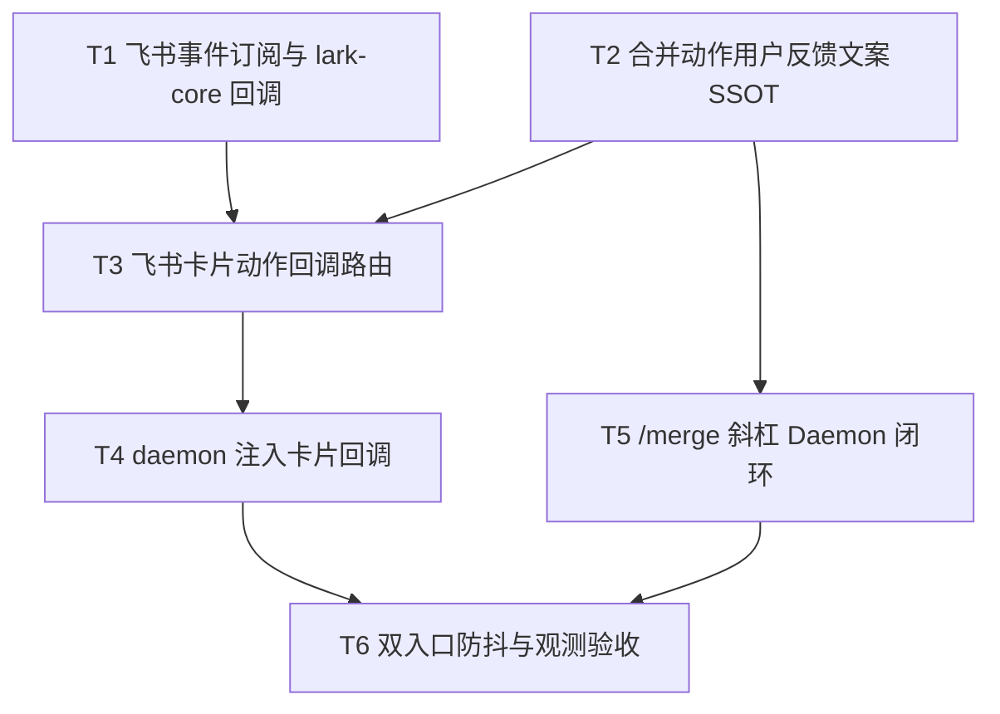

# 合并卡飞书按钮与merge指令 - 任务分解

> **来源**：`/kb-plan`（基于 `01-proposal.md`、`02-design.md`）
> **任务数**：6（T1–T6）
> **R5 依赖**：`20260711232817-dispatch失败重入队与ack策略` 已 `archived_with_debt`（T1/T2 applied）；`send_now` 路径**不得**修改 `file-queue` ack/claim/`releaseClaimedMessages` 语义，仅经既有 `flushReadyMergeBatches` → orchestrator 触发 dispatch。

## 一、执行计划

### （一）依赖图



**01 验收追溯**：

| 01 验收 | 主责任务 |
|---------|----------|
| AC1 立即发送可投递且可感知 | T3、T4、T5、T6 |
| AC2 拆开、编辑合法态可用 | T3、T4、T5 |
| AC3 `/merge` 核心动作 | T5 |
| AC4 无批次/已结束明确提示 | T2、T3、T5 |
| AC5 单条路径无回归 | 全任务禁止改 `onMessageEnqueued` 单条早退与 F1 门控 |

**02 §六步骤对齐**：T1→步骤 1；T2→步骤 4；T3→步骤 2；T4→步骤 1 接线 + 步骤 2；T5→步骤 3；T6→步骤 5、6 + §八·（二）工程项。

### （二）分组调度

| 轮次 | 并行任务 | 说明 |
|------|----------|------|
| **第一轮** | T1、T2 | 无共享写文件；T1 改 `feishu-addons.ts` + `lark-core.ts`；T2 新建 `daemon-merge-action-feedback.ts` |
| **第二轮** | T3 | 依赖 T1、T2；新建 `feishu-card-action.ts` |
| **第三轮** | T4 | 依赖 T3；改 `daemon.ts`（`startFeishuChannel` 注入 `onCardAction`） |
| **第四轮** | T5 | 依赖 T2；新建 `daemon-merge-command.ts`，改 `daemon.ts`（`handleCommand`/`COMMANDS`）、`feishu-help-text.ts` |
| **第五轮** | T6 | 依赖 T4、T5；增量改 `feishu-card-action.ts` 或 `daemon-merge-command.ts`（防抖/日志），验收 §八·（二） |

**同文件冲突清单（须串行）**：

| 文件 | 涉及任务（顺序） |
|------|------------------|
| `src/daemon/daemon.ts` | T4（卡片回调注入）→ T5（斜杠拦截与 COMMANDS） |
| `src/daemon/feishu-card-action.ts` | T3（初建）→ T6（防抖/日志，若落点在此） |

## 二、任务清单

## T1: 飞书 card.action.trigger 订阅与 lark-core 回调类型

### 背景

合并卡三枚按钮已在 `createMergeBatchCardEntity` 定义 `value.action`，但 `startConnection` 未注册 `card.action.trigger`（02 §二根因）。本任务补齐开放平台事件 SSOT 与 WebSocket 订阅入口，为 T3 卡片路由提供类型与回调挂点（步骤 B1 基础设施）。

### 上下文文件

- CodeGraph: `startConnection` `FeishuConnectionCallbacks` `createMergeBatchCardEntity` — 事件注册与按钮 action 定义
- 必读: `src/bridge/lark-core.ts` — `startConnection`（约 L1024）、`FeishuConnectionCallbacks`（约 L1144）、合并卡按钮 `merge_send_now`/`merge_edit`/`merge_split`（约 L338）
- 必读: `src/shared/feishu-addons.ts` — `FEISHU_MENU_EVENTS` / `FEISHU_MENU_ADDONS` 派生规则
- 参考: `knowledge/变更/进行中/20260712113253-合并卡飞书按钮与merge指令/01-proposal.md` — R1、§八 依赖

### 实现范围

- 修改: `src/shared/feishu-addons.ts` — 在 `FEISHU_MENU_EVENTS` 追加 `{ event: "card.action.trigger", desc: "合并卡按钮点击回调" }`；`FEISHU_MENU_ADDONS.events.items.tenant` 由数组 `.map` 自动包含（禁止手写第二份列表）
- 修改: `src/bridge/lark-core.ts` —
  - 新增 `FeishuCardActionEvent` 接口（至少含 `action: string`、`openId: string`、`openChatId: string`、原始 `value` 对象）
  - `FeishuConnectionCallbacks` 增加可选 `onCardAction?: (event: FeishuCardActionEvent) => void | Promise<void>`
  - 在 `EventDispatcher.register` 内注册 `"card.action.trigger"`：解析 `operator.operator_id.open_id`、`open_chat_id`/`chat_id`、`action.value`（含 `action` 字段），调用 `callbacks.onCardAction`；解析失败打 WARN 不抛栈

### 接口契约

- `export interface FeishuCardActionEvent { action: string; openId: string; openChatId: string; rawValue?: Record<string, unknown> }`
- `FeishuConnectionCallbacks.onCardAction?: (event: FeishuCardActionEvent) => void | Promise<void>`
- `FEISHU_MENU_EVENTS` 含 `card.action.trigger` 条目

### 验收标准

- [ ] `FEISHU_MENU_ADDONS.events.items.tenant` 含 `card.action.trigger`；设置页增量事件表自动展示（§八·（二）第 1 项）
- [ ] `startConnection` 注册 `card.action.trigger` 后 SDK 不再对该事件打 no handler WARN（§八·（二）第 2 项前置）
- [ ] 未提供 `onCardAction` 时行为与现网一致（可选回调，不破坏 menu_v6/p2p_entered）
- [ ] `lark-core.ts` 增量后仍 ≤300 行，否则按 AGENTS 拆分（§八·（二）第 7 项）
- [ ] 无 `02`/`03` 未要求的抽象层、trait/mixin 中间层或未批准的新依赖（Ponytail 口径）

### 依赖

- 前置任务: 无
- 后续任务: T3

---

## T2: 合并动作用户可见反馈文案 SSOT

### 背景

按钮与 `/merge` 双入口须将 `handleMergeBatchAction` 返回的 `{ ok, error? }` 映射为统一中文 IM 文案（步骤 E1、01 AC4、R3）。抽离纯函数模块，供 T3/T5 复用，**不**在 `handleMergeBatchAction` 内耦合飞书展示逻辑（Ponytail：SSOT 仍在 action 层，反馈在入口层）。

### 上下文文件

- CodeGraph: `handleMergeBatchAction` — 现有 `error` 字符串全集
- 必读: `src/daemon/daemon.ts` — `handleMergeBatchAction`（约 L682–742）各分支 `error` 值
- 必读: `knowledge/变更/进行中/20260712113253-合并卡飞书按钮与merge指令/02-design.md` §四错误文案表（本任务内已摘录于接口契约）

### 实现范围

- 新建: `src/daemon/daemon-merge-action-feedback.ts` —
  - `formatMergeActionUserMessage(result: { ok: boolean; error?: string }, action: string): string` — 成功/失败中文文案
  - `mapMergeActionErrorToUserText(error: string | undefined): string` — 按 §四 表映射；未知 error 降级为「操作失败，请稍后重试」
  - `mergeActionToNormalized(action: string): "send_now" | "split" | "edit" | "unknown"` — 统一 `merge_*` 前缀剥离（供日志与文案）

### 接口契约

```typescript
export function formatMergeActionUserMessage(
  result: { ok: boolean; error?: string },
  action: string,
): string

export function mapMergeActionErrorToUserText(error: string | undefined): string
```

**错误映射（与 02 §四 一致）**：

| error | 用户文案（示例） |
|-------|------------------|
| `no merge batch` / `no active merge batch` / `batch not in collecting` | 当前没有可操作的合并批次 |
| `batch already dispatching` | 合并批次正在投递中，请稍候 |
| `batch collecting`（send 场景） | 合并仍在收集中，请稍候或继续发送消息 |
| `text is required for edit` | 请使用 `/merge edit <正文>` 或回复合并卡 |
| `unknown action` | 未知合并操作 |

成功文案示例：`立即发送已提交` / `已拆开逐条投递` / `合并内容已更新`（按 action 区分）。

### 验收标准

- [ ] 覆盖 `handleMergeBatchAction` 现网全部 `error` 字符串；表外 error 有降级文案（01 AC4）
- [ ] 纯函数、无 import daemon/bridge 业务模块（避免环引）
- [ ] 文件 ≤300 行，含必要中文注释
- [ ] 无 `02`/`03` 未要求的抽象层或未批准的新依赖（Ponytail 口径）

### 依赖

- 前置任务: 无
- 后续任务: T3、T5

---

## T3: 飞书卡片动作回调路由

### 背景

实现 `card.action.trigger` → 合并控制的主路径（步骤 B1～B3、A1）。解析 `sessionKey` 与 `merge_*` action，调用既有 `handleMergeBatchAction` SSOT，返回飞书 callback 要求的响应形态，并经 IM 补充可感知结果（01 AC1、AC2）。

### 上下文文件

- CodeGraph: `onFeishuMenuV6` `makeChatKey` `handleMergeBatchAction` — 事件接线与 sessionKey 口径
- 必读: `src/daemon/feishu-event-handlers.ts` — `onFeishuMenuV6` 接线模式与 `FeishuEventHandlerDeps`
- 必读: `src/shared/channel-types.ts` — `makeChatKey(channelId, chatId)`
- 必读: `src/daemon/daemon-merge-action-feedback.ts` — T2 产出（本任务依赖其文案函数）
- 必读: `src/bridge/lark-core.ts` — T1 产出 `FeishuCardActionEvent`
- 参考: 飞书开放平台 `card.action.trigger` 回调响应结构（toast/response body）

### 实现范围

- 新建: `src/daemon/feishu-card-action.ts` —
  - `FeishuCardActionDeps`：`log`、`makeChatKey`、`handleMergeBatchAction`、`replyToMessage`（或 `LarkSender.sendMessage`）
  - `onFeishuCardAction(rt, sender, ev, deps)`：
    - 仅处理 `merge_send_now` / `merge_split` / `merge_edit`；其他 action 忽略或 WARN
    - `sessionKey = makeChatKey(rt.cfg.id, openChatId)`（私聊对齐 `pushMessage` 口径）
    - `merge_edit` 无内联正文时：调 action 前若需引导，经 `replyToMessage` 发送「请直接回复本合并卡发送修改后的全文」（沿用 F3，不替代 `tryHandleMergePreviewReply`）
    - 调用 `handleMergeBatchAction(sessionKey, ev.action, text?)`
    - **必须**向飞书返回 callback 成功响应（含 toast 或等价 200 形态）；失败时 toast 展示 T2 映射文案
    - 成功/失败后可选 `replyToMessage` 补充 IM 说明（与 toast 不矛盾）
  - **禁止**在本模块调用 `ackMessages` / `releaseClaimedMessages` / 改 `MergeBatch` phase 规则（R5 边界）

### 接口契约

```typescript
export interface FeishuCardActionDeps {
  log: (level: string, ...args: unknown[]) => void
  makeChatKey: (channelId: string, rawChatId: string) => string
  handleMergeBatchAction: (
    sessionKey: string,
    action: string,
    text?: string,
  ) => Promise<{ ok: boolean; error?: string }>
  replyToMessage: (messageId: string, text: string, chatId?: string) => Promise<void>
}

export async function onFeishuCardAction(
  rt: FeishuHandlerRuntime, // 与 feishu-event-handlers 同形，可 import type
  sender: LarkSender,
  ev: FeishuCardActionEvent,
  deps: FeishuCardActionDeps,
): Promise<{ toast?: { type: string; content: string } } | void>
```

### 验收标准

- [ ] 主用户私聊合并卡点击「立即发送」→ `handleMergeBatchAction(..., "merge_send_now")` 被调用；用户见 toast 或 IM 成功反馈（01 AC1）
- [ ] 「拆开」「编辑」在 collecting 合法态可执行；编辑引导文案符合 02 §二第 4 点（01 AC2）
- [ ] 无批次/已 dispatch 时用户见 T2 中文提示，不抛未捕获异常（01 AC4）
- [ ] 飞书 callback 返回 200 形态响应，无 SDK 未处理 WARN（§八·（二）第 2 项）
- [ ] **未修改** `file-queue.ts`、`daemon-orchestrator.ts` ack/重入队逻辑（R5：send_now 仅经既有 flush/dispatch）
- [ ] 文件 ≤300 行；无预建「通用卡片控制框架」（Ponytail 口径）

### 依赖

- 前置任务: T1、T2
- 后续任务: T4、T6

---

## T4: daemon 注入飞书卡片回调

### 背景

在 `startFeishuChannel` 将 T3 路由接入 `LarkSender.startConnection` 的 `onCardAction` 回调，完成 B1～B3 端到端接线（02 步骤 1 第 3 点、步骤 2）。

### 上下文文件

- CodeGraph: `startFeishuChannel` `feishuEventDeps` — 现有 menu_v6 注入模式
- 必读: `src/daemon/daemon.ts` — `startFeishuChannel`（约 L1064–1170）、`handleMergeBatchAction`（闭包可注入）
- 必读: `src/daemon/feishu-card-action.ts` — T3 产出
- 必读: `src/daemon/feishu-event-handlers.ts` — `FeishuHandlerRuntime` 类型复用

### 实现范围

- 修改: `src/daemon/daemon.ts` —
  - `import { onFeishuCardAction } from "./feishu-card-action.js"`
  - 在 `sender.startConnection(..., { onMenuV6, onP2pEntered, onCardAction })` 增加：
    ```typescript
    onCardAction: (ev) => {
      onFeishuCardAction(rt, sender, ev, {
        log,
        makeChatKey,
        handleMergeBatchAction,
        replyToMessage,
      }).catch(...)
    }
    ```
  - **不**在本任务改 `handleCommand`、`COMMANDS`、`onMessageEnqueued` 单条路径

### 接口契约

- `startFeishuChannel` 向 `startConnection` 传入完整 `FeishuConnectionCallbacks`（含 `onCardAction`）
- `handleMergeBatchAction` 仍为本文件闭包，签名不变

### 验收标准

- [ ] 飞书通道启动后 `card.action.trigger` 事件到达 daemon 日志可检索（如 `merge_action` 或等价 INFO）
- [ ] `onMessageEnqueued`、静默计时、`shouldSendEnqueueF1` 行为不变（01 AC5）
- [ ] 与 T10 控制层无交叉：未接线 stop/new_chat 卡片回调
- [ ] 无 `02`/`03` 未要求的抽象层或未批准的新依赖（Ponytail 口径）

### 依赖

- 前置任务: T3
- 后续任务: T5、T6

---

## T5: /merge 斜杠 Daemon 内闭环

### 背景

实现 `/merge` 文本兜底（步骤 S1、01 AC3、R2），在 `handleCommand` **之前**拦截，Daemon 内直接调 `handleMergeBatchAction`，**禁止** `pushCommandToQueue` 写入 `.fcmd`（02 §一 S1、§八·（二）第 3 项）。

### 上下文文件

- CodeGraph: `handleCommand` `pushCommandToQueue` `isCommand` — 现网全量入队 fcmd
- 必读: `src/daemon/daemon.ts` — `handleCommand`（约 L1288）、`COMMANDS`（约 L1174）、`isCommand`
- 必读: `src/daemon/daemon-merge-action-feedback.ts` — T2 文案
- 必读: `src/daemon/daemon-presentation-types.ts` 或 `daemon.ts` — `MERGE_EDIT_MAX_CHARS`
- 参考: `src/shared/feishu-help-text.ts` — `buildHelpText` / `ALL_COMMAND_LINES` 结构

### 实现范围

- 新建: `src/daemon/daemon-merge-command.ts` —
  - `tryHandleMergeSlashCommand(text: string, messageId: string, chatId?: string): Promise<boolean>`
  - 识别 `/merge`、`/merge send`、`/merge split`、`/merge edit <正文>`（大小写不敏感前缀）
  - `chatId` 即 `sessionKey`（与 `handleCommand` 入参 `chatKey` 一致）
  - 映射：`send`→`merge_send_now`，`split`→`merge_split`，`edit`→`merge_edit` + 正文
  - 调 `handleMergeBatchAction` + T2 文案 → `replyToMessage`；返回 `true` 表示已消费
- 修改: `src/daemon/daemon.ts` —
  - `handleCommand` 开头：`if (await tryHandleMergeSlashCommand(...)) return;` 再 `pushCommandToQueue`
  - `COMMANDS` 增加 `"/merge": "合并控制（/merge send | split | edit <正文>）"`
  - 向 `tryHandleMergeSlashCommand` 注入 `handleMergeBatchAction`、`replyToMessage`
- 修改: `src/shared/feishu-help-text.ts` — `ALL_COMMAND_LINES` 增加 `/merge` 说明行

### 接口契约

```typescript
export async function tryHandleMergeSlashCommand(
  text: string,
  messageId: string,
  chatId: string | undefined,
  deps: {
    handleMergeBatchAction: (sessionKey: string, action: string, text?: string) => Promise<{ ok: boolean; error?: string }>
    replyToMessage: (messageId: string, text: string, chatId?: string) => Promise<void>
  },
): Promise<boolean>
```

| 用户输入 | 等价 action |
|----------|-------------|
| `/merge` 或 `/merge send` | `merge_send_now` |
| `/merge split` | `merge_split` |
| `/merge edit <正文>` | `merge_edit` + text |

### 验收标准

- [ ] `/merge`、`/merge send`、`/merge split`、`/merge edit hello` 均可完成对应动作（01 AC3）
- [ ] 执行后队列目录**无**对应 `.fcmd`；`daemon-manager` 轮询无 `/merge` 残留（§八·（二）第 3 项）
- [ ] `/help` 与 `buildHelpText` 含 `/merge` 说明
- [ ] 其他斜杠（`/stop` 等）仍走 `.fcmd`，无回归
- [ ] `send_now` 路径不额外 ack/release 队列（R5 契约只读）
- [ ] 新建 `daemon-merge-command.ts` ≤300 行；无 Electron `command-handler` 改动
- [ ] 无 `02`/`03` 未要求的抽象层或未批准的新依赖（Ponytail 口径）

### 依赖

- 前置任务: T2（T4 卡片路径可先并行，但 `daemon.ts` 须 T4 完成后执行本任务）
- 后续任务: T6

---

## T6: 双入口防抖、结构化日志与工程验收补齐

### 背景

闭合 02 步骤 5、6 与 §八·（二）剩余工程项：按钮与 `/merge` 连点友好提示、可检索 `merge_action` 日志、M7 排队文案与 R5 dispatch 失败重入队联调断言（**不改** ack/队列代码）。

### 上下文文件

- CodeGraph: `flushReadyMergeBatches` `buildMergeBatchCardView` `releaseClaimedMessages` — send_now 后与 R5 边界
- 必读: `src/daemon/feishu-card-action.ts` — T3（可能增量防抖）
- 必读: `src/daemon/daemon-merge-command.ts` — T5
- 必读: `knowledge/变更/归档/20260711232817-dispatch失败重入队与ack策略/02-design.md` §四 — R5 契约（只读）
- 参考: `src/daemon/daemon-orchestrator.ts` — dispatch 失败释放路径（本任务不修改）

### 实现范围

- 修改: `src/daemon/feishu-card-action.ts` 和/或 `src/daemon/daemon-merge-command.ts` —
  - **可选**进程内 `mergeActionDebounceBySession`（500ms 同 session 同 action 忽略第二次，仅友好日志/文案，**不改** MergeBatch phase）
  - 结构化日志：`merge_action` 字段含 `action`、`session_key`、`ok`、`source`（`button`|`slash`）、`error?`
- **不修改**：`handleMergeBatchAction` 状态机分支、`file-queue.ts`、`daemon-orchestrator.ts` 失败策略
- 若 T3/T5 已含基础日志，本任务补齐字段统一性与双入口连测验收说明（可在 `src/daemon/AGENTS.md` 增量一句，≤3 行）

### 接口契约

- 日志形态示例：`log("INFO", "merge_action", { action, session_key, ok, source, error })`
- 防抖（若实现）：`shouldIgnoreMergeActionDebounce(sessionKey, action): boolean` — 模块内私有即可，不导出公共框架

### 验收标准

- [ ] 连点「立即发送」后紧随 `/merge send`，第二次返回友好提示而非抛栈（02 步骤 6、01 §八 风险）
- [ ] `send_now` 后 Agent `processing` 时合并卡仍显示排队文案；idle 后自动 flush（§八·（二）第 4 项，M7 回归）
- [ ] 手工/联调：dispatch 可重试失败后消息重入 `.qmsg`，用户可再次 send/静默投递；合并控制路径**无**自行 `ackMessages`/`releaseClaimedMessages`（§八·（二）第 5 项、R5 archived T1/T2）
- [ ] 日志可 grep `merge_action`（§八·（二）第 6 项）
- [ ] 涉及文件均 ≤300 行（§八·（二）第 7 项）
- [ ] 单条不足 `MERGE_MIN_COUNT` 仍走既有 F1+dispatch，无回归（01 AC5）
- [ ] 无 `02`/`03` 未要求的抽象层或未批准的新依赖（Ponytail 口径）

### 依赖

- 前置任务: T4、T5
- 后续任务: 无（完成后可 `/kb-apply` 或 `/kb-test`）
