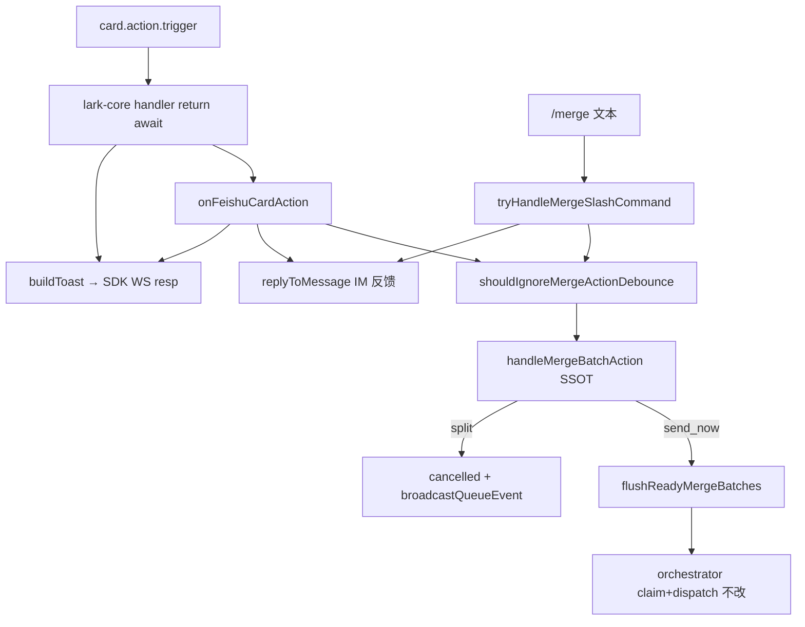

# 合并卡飞书按钮与merge指令 - 代码评审报告

## 1、审查范围

- **变更类型**: apply 产出的未提交变更（T1–T6 均 done；T-FIX-01 已修复）
- **评审等级**: focused-review（Daemon 局部功能，非跨端契约；含 Ponytail 精简检查）
- **重评**: R2 targeted-review（`review_fixed` → 复核 T-FIX-01 / R1 toast 透传闭环）
- **涉及文件**: 8 个代码/约定文件 + 3 个 KB 文档（`01-proposal.md`、`02-design.md`、`03-tasks.md`、本报告）
- **设计文档**: `02-design.md`（对照基准）
- **CodeGraph**: `codegraph_context` + 源码直读复核 `card.action.trigger` → `onCardAction` → `onFeishuCardAction` 返回值链；`handleMergeBatchAction` 双入口调用链
- **范围外**: `electron/daemon/daemon-manager.ts`、`electron/scheduling/command-executor.ts` 未归属改动，本评审忽略

## 2、严重（必须处理）

无

## 3、警告（建议处理）

1. **Ponytail — yagni: `extractInlineEditText` 预留未用内联表单**
   - 位置: `src/daemon/feishu-card-action.ts:79-86`
   - 说明: 当前卡面无内联 `text/content/body` 字段，编辑按钮走 F3 引导分支；预留解析可等 CardKit 表单落地再补。评分 **55**，建议处理，**不阻断 archive**。

~~1. **卡片 callback toast 未透传飞书 WS EventDispatcher 响应链**（**R1，已由 T-FIX-01 修复并复评通过**，见 §9）~~

## 4、设计偏差

~~1. **飞书 callback toast 响应链断裂**（**R1，已修复**）~~

无与 `02` 已确认决策相悖的未闭合偏差。T-FIX-01 后 toast 经 `lark-core` `return await callbacks.onCardAction(...)` 透传 SDK 回传链，与 `02` §二第 2 点、`03` T3 接口契约一致。

## 5、验收标准检查

### 01-proposal §六 验收 1–5

| 验收 | 条件 | 状态 |
|------|------|------|
| AC1 | 主用户私聊「立即发送」可投递且可感知 | ✅ `merge_send_now` → `handleMergeBatchAction` → `flushReadyMergeBatches`；IM 反馈 ✅；卡片 toast ✅（R1 复评） |
| AC2 | 拆开、编辑合法态可用 | ✅ `merge_split` / `merge_edit`（无内联正文走 F3 引导） |
| AC3 | `/merge` 核心动作 | ✅ `tryHandleMergeSlashCommand` 映射 send/split/edit |
| AC4 | 无批次/已结束明确提示 | ✅ `daemon-merge-action-feedback.ts` 错误映射 + 双入口 `replyToMessage` |
| AC5 | 单条路径无回归 | ✅ `onMessageEnqueued` / `shouldSendEnqueueF1` 未改；`/merge` 在 `pushCommandToQueue` 前拦截 |

### 03-tasks T1–T6

| 任务 | 关键验收 | 状态 |
|------|---------|------|
| T1 | `FEISHU_MENU_EVENTS` 含 `card.action.trigger`；`startConnection` 注册 handler | ✅ addons `.map` 派生；handler 已注册 |
| T1 | `lark-core.ts` ≤300 行 | ⚠️ 债务 D1（1190 行，增量克制；`bridge/AGENTS.md` 已标注） |
| T2 | 错误文案 SSOT、纯函数无环引 | ✅ |
| T3 | 合并卡三 action 路由；无 ack/release | ✅ grep 无 `ackMessages`/`releaseClaimedMessages` |
| T3 | 飞书 callback 含 toast | ✅ `FeishuCardActionToastResponse` + `buildToast` 返回；handler `return await` |
| T4 | `onCardAction` 注入；单条路径不变 | ✅ `daemon.ts` 返回 `onFeishuCardAction` Promise（成功透传 toast） |
| T5 | `/merge` 不写 `.fcmd`；help 文案 | ✅ `handleCommand` 先 `tryHandleMergeSlashCommand` 再 `pushCommandToQueue` |
| T6 | 500ms 防抖 + `merge_action` 日志 | ✅ `shouldIgnoreMergeActionDebounce` 双入口共用；`logMergeAction` 字段齐全 |
| T6 | R5 不改队列语义 | ✅ 新模块只调 `handleMergeBatchAction` |

### `02-design.md` §八·（二）工程补充验收项

| 项 | 状态 |
|----|------|
| 1 飞书后台/扫码订阅 `card.action.trigger` | ✅ 代码 SSOT 已补；⏳ 运维侧须 `kb-test` 实测 |
| 2 callback 200 + toast | ✅ 代码静态检查通过；⏳ `kb-test` 实测卡片点击即时 toast |
| 3 `/merge` 无 `.fcmd` | ✅ |
| 4 M7 排队文案 + idle flush | ✅ 代码路径未改；⏳ `kb-test` |
| 5 R5 dispatch 失败重入队 | ✅ 本变更未触队列；⏳ 联调 `kb-test` |
| 6 `merge_action` 日志 | ✅ |
| 7 单文件 ≤300 | ✅ 新建三文件均合规；`lark-core` 为 D1 债务 |

## 6、调用链与回归风险

| 回归点 | 风险 | 说明 |
|--------|------|------|
| 双入口重复触发 | 低 | 500ms 防抖 + `handleMergeBatchAction` phase 校验 |
| `/merge` 误入 `.fcmd` | 低 | 前缀匹配后 `return true`，未知子命令亦消费 |
| R5 ack/release 越界 | 低 | 新模块无 `file-queue` 引用；`send_now` 仅 flush |
| 单条 F1 路径 | 低 | `onMessageEnqueued` 未触碰 |
| 卡片 toast 透传 | 低 | R1 已修复；异常路径 `.catch` 返回 void，SDK 仍 200 |
| `lark-core` 体量 | 低 | D1 既有债务，本次增量克制 |

## 7、遗留债务

1. **D1 — `lark-core.ts` 行数（1190 行）**
   - 位置: `src/bridge/lark-core.ts`
   - 说明: 超 AGENTS 300 行硬限为变更前既有债务；`src/bridge/AGENTS.md` 已标注「行数债务」与「卡片回调透传」约定。整体拆分另开任务，**不阻断本变更 archive**（`accepted_debt`）。

## 8、修复任务建议

| 问题 ID | 建议动作 | 关联任务 | 状态 |
|---------|----------|----------|------|
| R1 | `FeishuConnectionCallbacks.onCardAction` 返回 toast；`lark-core` `return await`；`daemon.ts` 透传 Promise | T-FIX-01 | ✅ 已修复并复评通过 |
| D1 | 另开变更拆分 `lark-core.ts`（非本议题 scope） | — | 接受债务 |

## 9、结论

**通过**（R2 重评），可进入 `/kb-test`；静态评审无 open 阻断项，**暂不建议直接 `/kb-archive`**（须完成 §八·（二）运维/联调项）。

初评（R1）曾 **未通过**（toast 未透传）；T-FIX-01 修复后经 R2 重评闭环。

### 重评结论（R1 / T-FIX-01）

- **复评范围**: `src/bridge/lark-core.ts`（`card.action.trigger` handler、`FeishuCardActionToastResponse`）、`src/daemon/daemon.ts`（`onCardAction` 注入）、`src/daemon/feishu-card-action.ts`（`buildToast` 返回）。
- **R1 结果**: **通过**。证据链：
  1. `lark-core.ts:1074-1093` — handler 为 `async`，`return await callbacks.onCardAction({...})`，不再 `void Promise.resolve`。
  2. `lark-core.ts:1178-1189` — 导出 `FeishuCardActionToastResponse`；`onCardAction` 返回类型含 toast 载荷。
  3. `feishu-card-action.ts:88-89,168` — `buildToast` 构造 `{ toast: { type, content } }` 并在成功/失败/防抖路径返回。
  4. `daemon.ts:1170-1178` — `onCardAction` 返回 `onFeishuCardAction(...)` 的 Promise（`.catch` 仅吞异常日志，成功路径透传 toast）。
  5. `bridge/AGENTS.md` 已补「卡片回调透传」约定，防回归。
- **open 统计**: 阻断 **0**；警告 open **0**（Ponytail `extractInlineEditText` 为建议项，不记 open）；接受债务 **1**（D1）。
- **后续**: 进入 `/kb-test` 验证飞书后台订阅、卡片点击 toast 实机、M7 排队、R5 重入队；通过后 `/kb-archive` 并执行 `02` §十知识库更新计划。

### 剩余风险（非阻断）

1. **实机 toast 展示**: 代码链已闭合，仍依赖飞书 SDK `WSClient.handleEventData` 将 handler 返回值 base64 回传；须在 `kb-test` 点按合并卡按钮确认 UI 展示。
2. **D1 行数债务**: `lark-core.ts` 1190 行，后续拆分任务跟踪。
3. **CodeGraph 索引**: 本轮 `codegraph_context` 对 `onFeishuCardAction` 命中偏弱，复评以源码直读为准；归档前可选刷新索引做 impact 扫描。
