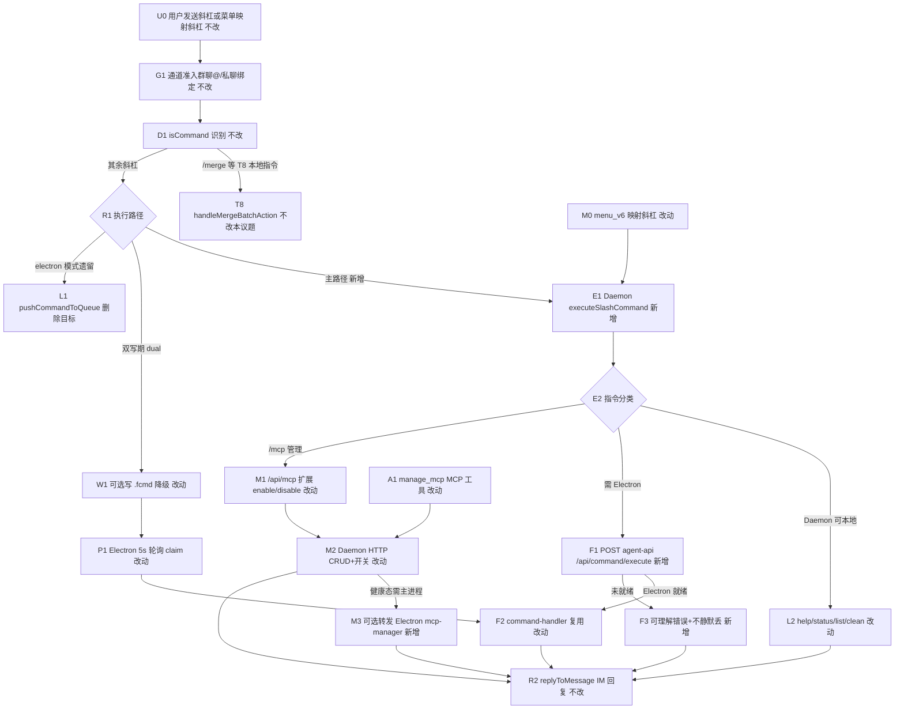
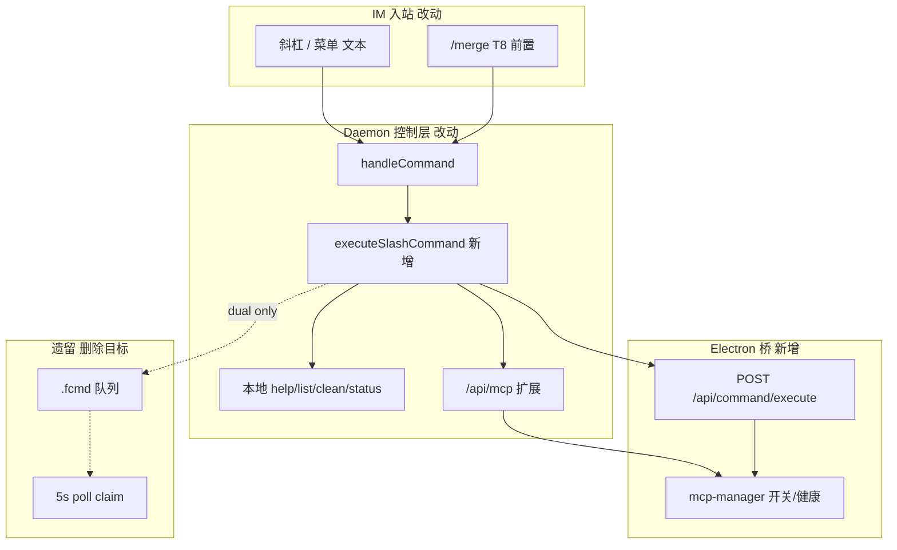

# 控制层HTTP化与斜杠去Electron依赖 - 实现设计

> **业务 PRD**：见同目录 `01-proposal.md`（验收标准以 01 为准）
> **业务流程口径**：01 未单列「§业务流程」；本设计以 `01` §四场景、§五 R1～R5、§六验收 1～5 为业务流节点清单。

## 一、业务流程与改动范围

> 业务口径以 `01-proposal.md` §四 / §五 / §六 为准；下图覆盖斜杠主路径、`/mcp` 管理、Electron 未就绪与双写降级分支。

### （一）业务流程图



**图例**：`不改` 行为与现网一致；`改动` 需改接线/逻辑；`新增` 新节点或新 HTTP；`删除` 迁移完成后移除 `.fcmd` 主路径。

### （二）流程步骤与改动对照

| 步骤 ID | 业务含义 | 改动 | 落点（模块/文件） | 01 验收关联 |
|---------|----------|------|-------------------|-------------|
| U0 | 飞书/微信用户发送 `/status`、`/mcp` 等 | 不改 | `daemon.ts` `startFeishuChannel` / `initWeChatChannel` | AC5 无回归 |
| G1 | 群聊须 @、私聊绑定等通道准入 | 不改 | `daemon.ts` `isBotMentioned`；`session-dispatcher` 入队门控 | AC4 授权一致 |
| D1 | `isCommand` + `COMMANDS` 识别斜杠 | 不改 | `daemon.ts` `isCommand`/`COMMANDS` | AC1 |
| T8 | `/merge` 等合并控制 Daemon 内闭环 | 不改（归并行变更） | `daemon.ts` `handleCommand` 前置分支（T8 变更） | 与 T8 划界 |
| R1 | 斜杠主路径改 Daemon 即时执行 | 改动 | `daemon.ts` `handleCommand`；新 `daemon-slash-executor.ts` | AC1；R1 |
| E1 | 统一斜杠执行入口 | 新增 | `daemon-slash-executor.ts` `executeSlashCommand` | AC1；R1 |
| L2 | Daemon 本地可完成指令 | 改动 | `daemon-slash-executor.ts`；`feishu-help-text.ts`；`file-queue` 列表 | AC1（Electron 未 claim） |
| F1 | Electron 依赖指令 HTTP 同步转发 | 新增 | `agent-sdk-http.ts` `POST /api/command/execute`；`daemon-orchestrator.ts` `forwardElectronCommandApi` | AC1；AC3 |
| F2 | 复用现网 command 语义 | 改动 | 抽 `electron/scheduling/command-executor.ts`（自 `daemon-manager` `checkAndExecutePendingCommands`） | AC5 无回归 |
| F3 | Electron/agent-api 未就绪错误 | 新增 | `daemon-slash-executor.ts` 错误映射 | AC1；AC4 |
| M1 | `/mcp` 斜杠走 Daemon HTTP | 改动 | `daemon-slash-executor.ts` `/mcp` 分支 | AC2；R2 |
| M2 | `/api/mcp` 补 enable/disable/info | 改动 | `daemon-http-admin-content.ts` `handleMcpAdmin` | AC2 |
| M3 | MCP 健康态/开关需主进程时转发 | 新增 | `agent-sdk-http.ts` 或 `mcp-manager` 薄 HTTP；`command-handler` `handleFeishuMcpCommand` 逻辑下沉 | AC2 |
| M0 | 飞书菜单映射改走同一执行器 | 改动 | `feishu-event-handlers.ts` / `feishu-menu.ts`：注入 `executeSlashCommand` 替代仅 `pushCommandToQueue` | AC5 |
| W1 | 双写期防重复执行 | 改动 | `SLASH_EXEC_MODE` 环境变量；`pushCommandToQueue` messageId 去重；Electron poll 跳过已执行 | 01 §八 双写 |
| L1 | `.fcmd` 主路径入队 | 删除（迁移末） | `daemon.ts` `handleCommand` 默认不再 `pushCommandToQueue` | AC1 |
| P1 | Electron 5s 轮询 claim | 改动→删除 | `daemon-manager.ts` `checkAndExecutePendingCommands`：dual 模式跳过或整段废弃 | AC3 |
| R2 | 执行结果 `replyToMessage` | 不改 | `daemon-http-non-api-routes.ts` `/cmd/result` 逻辑内联至执行器 | AC4 |
| A1 | `manage_mcp` 工具改直连扩展 HTTP | 改动 | `server-admin.ts` `manage_mcp`；补 enable/disable | AC2 |
| A2 | `manage_agent` 停止 stop 等不再经 fcmd | 改动 | `daemon-http-admin-crud.ts` `handleAgentAdmin` | R2 |

### （三）改动汇总

- **新增**：
  - `src/daemon/daemon-slash-executor.ts`：`executeSlashCommand(text, messageId, chatId?, chatType?)` — Daemon 斜杠 SSOT。
  - `electron/scheduling/command-executor.ts`：自 `checkAndExecutePendingCommands` 抽出 `executeFileCommand`（供 HTTP 与遗留 poll 共用）。
  - `POST /api/command/execute` on `agent-sdk-http.ts`：`{ command, messageId, chatId?, chatType? }` → `{ ok, message }`。
  - `forwardElectronCommandApi`（`daemon-orchestrator.ts` 或 `daemon-slash-executor` deps）：读 `agent-api-port.json` 同步 POST。
  - `SLASH_EXEC_MODE`：`daemon`（默认目标）| `dual` | `electron`（回滚）。
- **改动**：
  - `handleCommand`：T8 本地指令优先 → `executeSlashCommand`；`dual` 才写 `.fcmd`。
  - `daemon-http-admin-content.ts`：`/api/mcp` POST 增 `enable`/`disable`/`info`（与斜杠子命令对齐）。
  - `feishu-event-handlers.ts`：菜单映射调用 `executeSlashCommand`。
  - `server-admin.ts`：`manage_mcp` 支持 enable/disable；`manage_agent` 非 launch 动作改直连执行器或 `/api/command/execute`。
  - `handleAgentAdmin`：`stop`/`restart`/`reset` 不再 `pushCommandToQueue`。
- **删除（迁移完成后）**：
  - 斜杠主路径 `.fcmd` 写入；`checkAndExecutePendingCommands` 整段或仅保留非斜杠兼容。
- **不改（显式列出）**：
  - 消息入队、MergeBatch、orchestrator dispatch、Presentation/CardKit 视觉。
  - 微信通道斜杠识别逻辑（仍 `handleCommand`，执行器共用）。
  - T8 合并卡 `card.action.trigger` 与 `/merge`（变更 `20260712113253`）。
  - `file-queue` `.qmsg`/`.claimed` 语义；引擎 SDK；全量废除 `/mcp-admin` MCP 服务（本期仅管理类工具 HTTP 化，agent `/mcp` 工具保留）。

## 二、整体思路

**根因**（见 01 §一；CodeGraph 核实）：`handleCommand` 仅 `pushCommandToQueue` 写 `.fcmd`（`daemon.ts:1288-1290`）；Electron `daemon-manager` 5s 轮询 `GET /commands` → `POST /commands/claim` → `checkAndExecutePendingCommands` 执行（`daemon-manager.ts:901-1070`）。Daemon 单独运行或 Electron 重启窗口内指令滞留至 60s 超时清除（`cleanExpiredCommands`）。`/api/mcp` 已有 list/add/delete（`daemon-http-admin-content.ts`），但 `/mcp` 斜杠与 `manage_mcp` 的 enable/disable 仍依赖 Electron `mcp-manager`（`command-handler.ts:466`）。

**方案要点**：

1. **Daemon 为斜杠 SSOT**：`executeSlashCommand` 在 Daemon 进程内即时执行并 `replyToMessage`，消除对 Electron claim 轮询的硬依赖。
2. **对称 agent-api 转发**：与 IM dispatch 相同，Electron 依赖指令经 `forwardElectronCommandApi` → `POST /api/command/execute` 同步执行；未就绪返回明确中文错误（01 AC4）。
3. **`/mcp` HTTP 等价**：扩展 `POST /api/mcp` 覆盖斜杠子命令；`manage_mcp` MCP 工具改调同一 HTTP，不再仅 list/add/delete。
4. **双写可回滚**：`SLASH_EXEC_MODE=dual` 时 Daemon 执行 + 条件写 `.fcmd`，Electron poll 以 `messageId` 跳过已处理；稳定后 `daemon` 模式停写 `.fcmd`。
5. **T8 划界**：`/merge` 与合并卡按钮由变更 `20260712113253` 在 `handleCommand` **最前**分支处理，**不入**通用斜杠执行器、**不写** `.fcmd`；本议题不实现 `POST /api/control-command` 统一总线。

**T8 并行契约**（变更 `20260712113253`）：

| 边界 | T8（合并卡） | T10（本议题） |
|------|-------------|---------------|
| 入口 | `card.action.trigger`、`/merge` | 其余 `COMMANDS` 斜杠、`menu_v6` 映射 |
| 执行 | `handleMergeBatchAction` | `executeSlashCommand` + HTTP |
| HTTP | 沿用 `POST /api/merge-batch/action` | `POST /api/mcp`、`/api/command/execute` 等 |
| 冲突避免 | `handleCommand` 前缀匹配 `/merge` return | 执行器忽略 `/merge`；双写 dedup 用 `messageId` |

**最小方案三问（Ponytail）**：

1. **能否复用现有模块/符号？** 能。复用 `checkAndExecutePendingCommands` switch 逻辑（抽到 `command-executor.ts`）、`forwardElectronAgentApi` 模式、`/api/mcp` 与 `buildHelpText`；Daemon 侧 `replyToMessage` 替代 `/cmd/result` 往返。
2. **拟新增抽象/依赖是否被 01 要求？** 仅 `daemon-slash-executor.ts` + `command-executor.ts` 两文件（各 ≤300 行）；不引入 `control-command` 总线、不新增 npm 包、不预建通用「控制框架」trait。
3. **能否合并到已有文件？** `handleCommand` 保持薄转发；若 `daemon-slash-executor` 超限可拆 `daemon-slash-mcp.ts`，**禁止**为单指令新建多层 notifier。

## 三、分层设计



- **端点层**：`POST /api/command/execute`（Electron）；扩展 `GET|POST /api/mcp`；保留 `/commands*` 仅 dual/回滚期。
- **服务层**：Daemon `executeSlashCommand` 为 IM 斜杠 SSOT；Electron `command-executor` 为需主进程状态操作的执行后端。
- **数据层**：无新持久化；`.fcmd` 迁移后仅兼容残留清理。

## 四、接口设计

### Daemon 斜杠（进程内，非新对外路径）

| 函数 | 入参 | 出参 | 说明 |
|------|------|------|------|
| `executeSlashCommand` | `text, messageId, chatId?, chatType?` | `Promise<void>` | 内部 `replyToMessage` |

### Electron command API（新增）

| 方法 | 路径 | 请求体 | 响应 |
|------|------|--------|------|
| POST | `/api/command/execute` | `{ command: string, messageId: string, chatId?: string, chatType?: string }` | `{ ok: boolean, message: string }` |

错误：`503` agent-api 未监听；`400` 未知指令；body 中文 `message` 与现网 `reportCommandResult` 一致。

### `/api/mcp` 扩展（改动）

| 方法 | action | 关键字段 | 说明 |
|------|--------|----------|------|
| GET | — | — | 现网 list（不变） |
| POST | add/delete | name, config, scope | 现网（不变） |
| POST | enable/disable | name | 新增；转发或内联 `toggleMcpServer` |
| POST | info | name | 新增；返回类型/来源/开关/健康 |

### 环境变量

| 变量 | 值 | 说明 |
|------|-----|------|
| `SLASH_EXEC_MODE` | `daemon` \| `dual` \| `electron` | 默认 `dual`（迁移期）→ 稳定后 `daemon` |

### 遗留 HTTP（dual/electron 模式）

| 方法 | 路径 | 说明 |
|------|------|------|
| GET | `/commands` | 列 `.fcmd` |
| POST | `/commands/claim` | Electron claim |
| POST | `/cmd/result` | dual 期 Electron 回报；`daemon` 模式可废弃 |

## 五、数据结构

无表/字段/持久化模型变更。

**进程内（双写去重）**：

| 结构 | 键 | 值 | 说明 |
|------|----|----|------|
| `slashExecutedMessageIds` | `messageId` | `number`（时间戳） | 60s TTL；dual 期 Electron poll 跳过；防重复回复 |

**`.fcmd` 文件（迁移期保留）**：

```typescript
// 现网不变
{ command, messageId, timestamp, source, chatId?, chatType? }
```

## 六、实现步骤

1. **F2**：抽出 `electron/scheduling/command-executor.ts` `executeFileCommand`；`checkAndExecutePendingCommands` 改调用。（步骤 F2、P1）
2. **F1**：`agent-sdk-http.ts` 注册 `POST /api/command/execute`。（步骤 F1）
3. **E1/L2**：新建 `daemon-slash-executor.ts`；实现本地指令 + `forwardElectronCommandApi`。（步骤 E1、L2、F3）
4. **R1**：`handleCommand` 改调 `executeSlashCommand`；`SLASH_EXEC_MODE` 控制是否写 `.fcmd`。（步骤 R1、W1、L1）
5. **M2/M3/M1**：扩展 `/api/mcp`；`/mcp` 斜杠与 `manage_mcp` 对齐。（步骤 M1～M3、A1）
6. **M0**：`feishu-event-handlers` 菜单改 `executeSlashCommand`。（步骤 M0）
7. **A2**：`handleAgentAdmin` stop/restart/reset 改直连执行器。（步骤 A2）
8. **T8 联调**：确认 `/merge` 前置分支与 dedup 无重复回复。（T8 契约）
9. **迁移收尾**：默认 `SLASH_EXEC_MODE=daemon`；文档化废弃 poll；删除主路径 `.fcmd`。（步骤 L1、P1）

## 七、参考实现

CodeGraph（`projectPath=/home/suveng/doger/cursor-claw`）命中摘要：

| 符号 | 路径 | 与本变更关系 |
|------|------|----------------|
| `handleCommand` | `src/daemon/daemon.ts:1288` | **主改点**：由入队改为执行 |
| `pushCommandToQueue` | `src/daemon/daemon.ts:1211` | dual/回滚；去重键 `messageId` |
| `getPendingCommands` / `claimCommand` | `src/daemon/daemon.ts:1237-1264` | 遗留 poll 路径 |
| `cleanExpiredCommands` | `src/daemon/daemon.ts:1266` | 60s 超时 — 主路径消除后降级风险 |
| `COMMANDS` / `isCommand` | `src/daemon/daemon.ts:1173-1193` | 指令表 SSOT |
| `checkAndExecutePendingCommands` | `electron/daemon/daemon-manager.ts:901` | 逻辑下沉至 `command-executor` |
| `handleFeishuMcpCommand` | `electron/scheduling/command-handler.ts:466` | `/mcp` 语义 SSOT |
| `handleFeishuModelCommand` | `electron/scheduling/command-handler.ts:76` | Electron 转发复用 |
| `handleChatCommand` | `electron/session/session-dispatcher-chat.ts:71` | `/chat` 转发复用 |
| `forwardElectronAgentApi` | `src/daemon/daemon-orchestrator.ts:111` | **模式参照** |
| `createAdminContentRoutes` | `src/daemon/daemon-http-admin-content.ts:24` | `/api/mcp` 扩展 |
| `handleMcpAdmin` | `src/daemon/daemon-http-admin-content.ts:25` | enable/disable 落点 |
| `handleAgentAdmin` | `src/daemon/daemon-http-admin-crud.ts:124` | 去除 fcmd 绕路 |
| `registerAdminTools` / `manage_mcp` | `src/daemon/server-admin.ts:53-120` | MCP 工具 HTTP 对齐 |
| `/commands` 路由 | `src/daemon/daemon-http-non-api-routes.ts:170-188` | dual 期保留 |
| `onFeishuMenuV6` | `src/daemon/feishu-event-handlers.ts:45` | 菜单改执行器 |
| `buildHelpText` | `src/shared/feishu-help-text.ts:30` | `/help` 本地 |

## 八、技术影响

### （一）影响范围

- **涉及模块**：`src/daemon/daemon.ts`、`daemon-slash-executor.ts`（新）、`daemon-http-admin-content.ts`、`daemon-http-admin-crud.ts`、`server-admin.ts`、`feishu-event-handlers.ts`；`electron/agent/cursor-sdk/agent-sdk-http.ts`、`electron/scheduling/command-executor.ts`（新）、`electron/daemon/daemon-manager.ts`、`electron/scheduling/command-handler.ts`。
- **接口/proto 变更**：新增 `POST /api/command/execute`；`POST /api/mcp` 增 action；无 proto。
- **数据变更**：无；`.fcmd` 写入量减少至零（`daemon` 模式）。
- **风险**：
  - **双写重复执行**：须 `messageId` dedup + `SLASH_EXEC_MODE` 闸门（01 §八）。
  - **T8 并行**：`/merge` 与通用执行器顺序错误 → 重复回复；须 `handleCommand` 前置 T8 分支（与 `20260712113253` apply 顺序协调）。
  - **Electron 未就绪**：`/stop`/`/model` 等失败体验须优于静默 60s 超时（01 AC3、AC4）。
  - **MCP enable 健康检查**：若仅 Daemon 写文件而健康态在 Electron，须 M3 转发或文档注明延迟。
  - **`daemon.ts` 行数**：抽出执行器，避免批2 前继续膨胀。

### （二）工程补充验收项

- [ ] `SLASH_EXEC_MODE=daemon` 时飞书发 `/status`，Electron **未** claim 仍 3s 内收到回复（AC1）。
- [ ] Electron 退出时 `/help` 可回复；`/stop` 返回「应用未运行」类文案，非无响应（AC4）。
- [ ] `/mcp ls`、`/mcp enable <名>` 与现网 Electron 路径语义一致（AC2）。
- [ ] `manage_mcp` list/add/delete/enable 经 HTTP 可比现网（AC2）。
- [ ] `dual` 模式连发同 `messageId` 不双回复；稳定后切 `daemon` 无 `.fcmd` 残留（双写期）。
- [ ] 菜单 `cmd_status` 等与斜杠等价，不经 5s poll（AC5 菜单回归）。
- [ ] `/merge`（T8）与 `/status` 同会话连发无交叉污染（T8 划界）。
- [ ] 日志含 `slash_exec`（command、message_id、mode、ok、source=im|menu）。
- [ ] 新文件 ≤300 行；无未批准 npm 依赖。

## 九、知识库影响

- `knowledge/工程平台/Daemon守护进程/01-概览.md` — §九 T10 斜杠/fcmd 限制关闭。
- `knowledge/工程平台/Daemon守护进程/02-HTTP与MCP服务.md` — `/api/mcp` enable/disable；斜杠 SSOT；`manage_*` HTTP 化。
- `knowledge/业务域/Agent调度/04-远程指令.md` — 序列图改 Daemon 即时执行；`.fcmd` 降级说明。
- `knowledge/业务域/消息桥接/02-飞书通道.md` — §三 菜单→执行器（非仅 fcmd）。
- 两级索引：一般无需改 `知识索引.md`。

## 十、知识库更新计划

### （一）必须更新

- `knowledge/工程平台/Daemon守护进程/01-概览.md` — 移除「斜杠依赖 Electron claim」；补 `executeSlashCommand` 与 `SLASH_EXEC_MODE`。
- `knowledge/工程平台/Daemon守护进程/02-HTTP与MCP服务.md` — `/api/mcp` 全 action；`POST /api/command/execute` 划界；T10 限制关闭。
- `knowledge/业务域/Agent调度/04-远程指令.md` — 主流程图与接口表；§九 `/mcp` HTTP 化。

### （二）可能更新（视实现结果）

- `knowledge/业务域/消息桥接/02-飞书通道.md` — 菜单映射改执行器一句。
- `knowledge/工程平台/Electron桌面应用/04-配置与更新.md` — admin 控制层 HTTP 化进度。
- `electron/scheduling/AGENTS.md` — `command-executor` 模块边界（代码侧，KB 引用）。

### （三）不需要更新

- `knowledge/业务域/消息桥接/03-微信通道.md` — 01 明确不改微信语义（执行器共用实现即可）。
- `knowledge/业务域/消息桥接/04-消息队列与路由.md` — 无 `.qmsg` 语义变更。
- `knowledge/业务域/工作流/**` — 无工作流状态机变更。
- T8 合并卡知识（`02-飞书通道` 按钮节）— 由变更 `20260712113253` archive 时更新。
