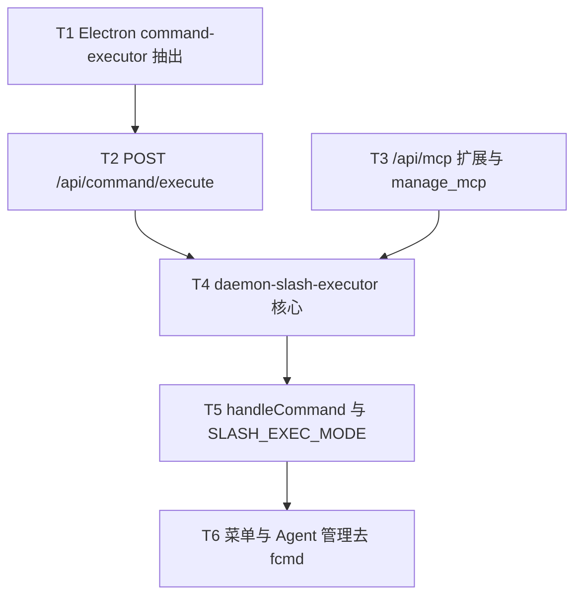

# 控制层HTTP化与斜杠去Electron依赖 - 任务分解

> **来源**：`/kb-plan`（基于 `01-proposal.md`、`02-design.md`）
> **任务数**：6（T1–T6）
> **T8 划界**：`/merge` 与合并卡按钮归变更 `20260712113253-合并卡飞书按钮与merge指令`；本变更**不得**实现 `handleMergeBatchAction`、合并卡路由或 `POST /api/control-command` 总线。

## 一、执行计划

### （一）依赖图

**CodeGraph 文件依赖边**（`projectPath=/home/suveng/doger/cursor-claw`）：

| 源符号/文件 | 依赖/波及 | 任务 |
|-------------|-----------|------|
| `checkAndExecutePendingCommands` | `daemon-manager.ts` ← `command-handler` import；影响 `startStatusPolling`、`startDaemon` | T1 |
| `handleCommand` | `daemon.ts` → `pushCommandToQueue`；调用方 `startFeishuChannel`、`initWeChatChannel` | T5 |
| `pushCommandToQueue` | 同上 + `feishu-event-handlers`、`daemon-http-admin-crud` | T5、T6 |
| `forwardElectronAgentApi` | `daemon-orchestrator.ts`；模式参照新增 `forwardElectronCommandApi` | T4 |
| `createAdminContentRoutes` / `handleMcpAdmin` | `daemon-http-admin-content.ts` ← `daemon-http-admin-crud` | T3 |
| `handleAgentAdmin` | `daemon-http-admin-crud.ts` → `pushCommandToQueue` | T6 |
| `onFeishuMenuV6` | `feishu-event-handlers.ts` → `pushCommandToQueue` | T6 |
| `handleFeishuMcpCommand` | `command-handler.ts:466`；语义 SSOT，T2 路由复用 | T1、T2 |
| `agent-sdk-http.ts` | Electron 统一 HTTP 网关；新增 command execute 路由 | T2 |

**01 验收追溯**：

| 01 验收 | 主责任务 |
|---------|----------|
| AC1 主路径斜杠 Electron 未 claim 仍可完成 | T4、T5 |
| AC2 `/mcp` 核心动作经 Daemon HTTP | T3、T4 |
| AC3 Electron 重启窗口不静默丢失 | T1、T2、T4、T5 |
| AC4 未授权仍拒绝且提示可理解 | T4、T5 |
| AC5 卡片与 Agent 执行无回归 | 全任务禁止改 MergeBatch/orchestrator dispatch 语义 |

**02 §六步骤对齐**：T1→步骤 1、8；T2→步骤 2；T3→步骤 5（M2/M3/A1）；T4→步骤 3；T5→步骤 4、9；T6→步骤 6、7。

### （二）分组调度

| 轮次 | 并行任务 | 说明 |
|------|----------|------|
| **第一轮** | T1、T3 | 无共享写文件；T1 改 Electron `daemon-manager`；T3 改 Daemon admin 路由 |
| **第二轮** | T2 | 依赖 T1；仅改 `agent-sdk-http.ts` |
| **第三轮** | T4 | 依赖 T2、T3；新建 `daemon-slash-executor.ts`，增量 `daemon-orchestrator.ts` |
| **第四轮** | T5 | 依赖 T4；仅改 `daemon.ts`（`handleCommand`、双写、`SLASH_EXEC_MODE`） |
| **第五轮** | T6 | 依赖 T5；改 `feishu-event-handlers.ts`、`daemon-http-admin-crud.ts` |

**同文件冲突清单（须串行）**：

| 文件 | 涉及任务（顺序） |
|------|------------------|
| `electron/daemon/daemon-manager.ts` | T1（抽出 executor + dual poll 跳过） |
| `electron/agent/cursor-sdk/agent-sdk-http.ts` | T2 |
| `src/daemon/daemon-orchestrator.ts` | T4（`forwardElectronCommandApi`） |
| `src/daemon/daemon.ts` | T5（`handleCommand` 接线；**不**实现 `/merge`） |

## 二、任务清单

## T1: Electron command-executor 抽出与 poll 路径改造

### 背景

现网斜杠执行逻辑嵌在 `checkAndExecutePendingCommands`（`daemon-manager.ts:901`），HTTP 同步执行与遗留 5s poll 无法共用。本任务抽出 `executeFileCommand` 供 T2 HTTP 路由与 poll 双路径复用，并为 `dual` 模式预留 `messageId` 跳过钩子（步骤 F2、P1）。

### 上下文文件

- CodeGraph: `checkAndExecutePendingCommands` `handleFeishuMcpCommand` — poll 执行 switch 与 MCP 语义
- 必读: `electron/daemon/daemon-manager.ts` — `checkAndExecutePendingCommands`（约 L901–1070）
- 必读: `electron/scheduling/command-handler.ts` — `handleFeishuMcpCommand`（L466）、`handleFeishuModelCommand`、`reportCommandResult`
- 参考: `knowledge/变更/进行中/20260712113307-控制层HTTP化与斜杠去Electron依赖/01-proposal.md` — R4、§八 双写

### 实现范围

- 新建: `electron/scheduling/command-executor.ts` —
  - `export async function executeFileCommand(cmd: FileCommand, ctx: CommandExecutorContext): Promise<{ ok: boolean; message: string }>`
  - 自 `checkAndExecutePendingCommands` 搬迁 switch 分支（help/status/list/clean/stop/restart/model/mcp/chat/task/workflow 等），保持与现网 `reportCommandResult` 语义一致
  - `CommandExecutorContext` 含 `port`、`messageId`、`chatId`、`chatType`、必要 `TaskRunFn` 等最小字段
- 修改: `electron/daemon/daemon-manager.ts` —
  - `checkAndExecutePendingCommands` 改为遍历 pending 后调用 `executeFileCommand`
  - 新增可选 `shouldSkipCommand?(messageId: string): boolean` 注入点（T5 经 Daemon HTTP 或共享状态提供 dedup；本期可先接 env/回调占位，dual 期 poll 跳过已执行 `messageId`）

### 接口契约

- `export interface FileCommand { command: string; messageId: string; chatId?: string; chatType?: string; ... }`（与现网 `.fcmd` JSON 对齐）
- `export async function executeFileCommand(cmd: FileCommand, ctx: CommandExecutorContext): Promise<{ ok: boolean; message: string }>`
- `checkAndExecutePendingCommands` 对外签名不变；内部仅委托 executor

### 验收标准

- [ ] `executeFileCommand` 覆盖原 `checkAndExecutePendingCommands` 全部斜杠分支，单测式冒烟：`/help`、`/status` 返回与变更前一致（AC5）
- [ ] `daemon-manager.ts` 增量后 ≤300 行，否则继续拆文件（§八·（二）第 9 项）
- [ ] poll 路径在注入 `shouldSkipCommand` 返回 true 时跳过该 `messageId`（为 T5 dual dedup 预留）
- [ ] 无 `02`/`03` 未要求的抽象层、trait/mixin 中间层或未批准的新依赖（Ponytail 口径）

### 依赖

- 前置任务: 无
- 后续任务: T2

---

## T2: Electron POST /api/command/execute

### 背景

Daemon 侧需同步调用 Electron 执行 `/stop`、`/model`、`/mcp` 等主进程指令，消除 5s poll 延迟。本任务在 `agent-sdk-http` 注册 `POST /api/command/execute`，复用 T1 的 `executeFileCommand`（步骤 F1）。

### 上下文文件

- CodeGraph: `agent-sdk-http` `ensureAgentSdkHttpServer` — 统一网关路由注册模式
- 必读: `electron/agent/cursor-sdk/agent-sdk-http.ts` — 现有 `/api/agent/launch|dispatch` 注册方式
- 必读: `electron/scheduling/command-executor.ts` — T1 产出 `executeFileCommand`
- 必读: `src/daemon/daemon-orchestrator.ts` — `forwardElectronAgentApi`（约 L111）转发模式参照

### 实现范围

- 修改: `electron/agent/cursor-sdk/agent-sdk-http.ts` —
  - 注册 `POST /api/command/execute`
  - 请求体：`{ command: string, messageId: string, chatId?: string, chatType?: string }`
  - 响应：`{ ok: boolean, message: string }`；`message` 中文与 `reportCommandResult` 一致
  - 错误：`400` 未知指令；`503` 服务未就绪（body 含可理解中文）
  - handler 内调用 `executeFileCommand`，**不**经 `.fcmd` 入队

### 接口契约

- `POST /api/command/execute` 请求/响应体见上表（与 `02-design` §四一致）
- 路由与 `launchSdkAgentFromHttp` 同进程、同 `agent-api-port.json` 端口

### 验收标准

- [ ] Electron 运行中 `curl POST /api/command/execute` 传 `/help` 3s 内返回 `{ ok, message }`（AC1 后半）
- [ ] Electron 未监听时 Daemon 经 T4 `forwardElectronCommandApi` 收到 `503` 或等价 `{ ok:false, message }`，非挂死（AC3、AC4）
- [ ] 不修改 `POST /api/agent/launch|dispatch` 契约（AC5）
- [ ] 无 `02`/`03` 未要求的抽象层、trait/mixin 中间层或未批准的新依赖（Ponytail 口径）

### 依赖

- 前置任务: T1
- 后续任务: T4

---

## T3: /api/mcp 扩展与 manage_mcp HTTP 对齐

### 背景

`/api/mcp` 现仅 list/add/delete（`daemon-http-admin-content.ts:25`），`/mcp` 斜杠 enable/disable 仍走 Electron `mcp-manager`。本任务扩展 Daemon HTTP 覆盖 enable/disable/info，并让 `manage_mcp` MCP 工具直连同一接口（步骤 M2、M3、A1）。

### 上下文文件

- CodeGraph: `createAdminContentRoutes` `manage_mcp` — admin 路由与 MCP 工具入口
- 必读: `src/daemon/daemon-http-admin-content.ts` — `handleMcpAdmin`（L25–77）
- 必读: `src/daemon/server-admin.ts` — `manage_mcp` 工具（约 L108–120）
- 必读: `electron/scheduling/command-handler.ts` — `handleFeishuMcpCommand` 子命令语义（ls/enable/disable/info）
- 参考: `electron/mcp/mcp-manager.ts` — `toggleMcpServer`、健康检查（M3 转发落点）

### 实现范围

- 修改: `src/daemon/daemon-http-admin-content.ts` —
  - `POST /api/mcp` 新增 `action: enable | disable | info`
  - `enable`/`disable`：写配置 + 必要时 `forwardElectronAgentApi` 或薄 HTTP 调 Electron `mcp-manager` 做健康/开关（M3）；失败返回可理解中文
  - `info`：返回 name、scope、enabled、类型/来源/健康摘要
- 修改: `src/daemon/server-admin.ts` —
  - `manage_mcp` 支持 `enable`/`disable`/`info`，经 `daemonPost("/api/mcp", …)` 与斜杠对齐
  - list/add/delete 行为不变

### 接口契约

- `POST /api/mcp` 扩展 action：`enable`/`disable` 需 `name`；`info` 需 `name`；响应 `{ ok, message?, servers?, server? }`
- `manage_mcp` 工具参数与上述 action 一一对应

### 验收标准

- [ ] `/mcp ls`、`/mcp enable <名>` HTTP 路径与现网 Electron 斜杠语义一致（§八·（二）第 3 项；AC2）
- [ ] `manage_mcp` list/add/delete/enable 经 HTTP 可比现网（§八·（二）第 4 项；AC2）
- [ ] MCP 健康态需主进程时，转发失败返回明确中文而非静默成功（§八·（二）风险 M3）
- [ ] 无 `02`/`03` 未要求的抽象层、trait/mixin 中间层或未批准的新依赖（Ponytail 口径）

### 依赖

- 前置任务: 无
- 后续任务: T4

---

## T4: daemon-slash-executor 与 Electron 同步转发

### 背景

Daemon 须成为 IM 斜杠 SSOT：`executeSlashCommand` 进程内即时执行并 `replyToMessage`，本地指令（help/status/list/clean）不调 Electron，其余经 `forwardElectronCommandApi` 同步 POST（步骤 E1、L2、F3、M1）。**禁止**处理 `/merge`（T8 划界）。

### 上下文文件

- CodeGraph: `handleCommand` `pushCommandToQueue` `buildHelpText` — 现网入队与本地 help
- 必读: `src/shared/feishu-help-text.ts` — `buildHelpText`（约 L30）
- 必读: `src/daemon/daemon-orchestrator.ts` — `forwardElectronAgentApi`（L111）、`readElectronAgentApiPort`
- 必读: `src/daemon/daemon-http-admin-content.ts` — T3 扩展后的 `handleMcpAdmin`（`/mcp` 子命令复用或内联调用）
- 必读: `electron/scheduling/command-executor.ts`、`agent-sdk-http.ts` — T1/T2 产出

### 实现范围

- 新建: `src/daemon/daemon-slash-executor.ts`（≤300 行）—
  - `export async function executeSlashCommand(deps: SlashExecutorDeps, text: string, messageId: string, chatId?: string, chatType?: string): Promise<void>`
  - 忽略 `/merge` 及 `merge_*` 前缀（T8 由 `handleCommand` 前置分支处理，执行器 double-guard）
  - 本地：`/help`、`/status`、`/list`、`/clean` 等 Daemon 可完成指令，结束时 `deps.replyToMessage`
  - `/mcp`：解析子命令，调 T3 同等逻辑或 `localDaemonUrl("/api/mcp")` 内循环
  - Electron 依赖：`forwardElectronCommandApi` → `POST /api/command/execute`；失败映射「应用未运行」类中文（AC4）
  - 结构化日志：`slash_exec` 字段（command、message_id、mode、ok、source）
- 修改: `src/daemon/daemon-orchestrator.ts` —
  - 导出 `forwardElectronCommandApi(subpath, body)`，复用 `readElectronAgentApiPort` + `httpJson` 模式（与 `forwardElectronAgentApi` 对称）

### 接口契约

- `export interface SlashExecutorDeps { replyToMessage; log; forwardElectronCommandApi; getSlashExecMode; ... }`
- `export async function executeSlashCommand(deps, text, messageId, chatId?, chatType?): Promise<void>`
- `forwardElectronCommandApi(subpath: string, body: object): Promise<{ ok: boolean; error?: string; message?: string }>`

### 验收标准

- [ ] `SLASH_EXEC_MODE=daemon` 时飞书发 `/status`，Electron **未** claim 仍 3s 内收到回复（§八·（二）第 1 项；AC1）
- [ ] Electron 退出时 `/help` 可回复；`/stop` 返回「应用未运行」类文案（§八·（二）第 2 项；AC4）
- [ ] `/mcp ls`、`/mcp enable <名>` 经执行器与 T3 HTTP 语义一致（§八·（二）第 3 项）
- [ ] 执行器**不**处理 `/merge`；与 `/status` 同会话连发无交叉污染（§八·（二）第 7 项；T8 划界）
- [ ] 日志含 `slash_exec`（§八·（二）第 8 项）
- [ ] 新文件 ≤300 行（§八·（二）第 9 项）
- [ ] 无 `02`/`03` 未要求的抽象层、trait/mixin 中间层或未批准的新依赖（Ponytail 口径）

### 依赖

- 前置任务: T2、T3
- 后续任务: T5

---

## T5: handleCommand 接线与 SLASH_EXEC_MODE 双写

### 背景

`handleCommand` 现仅 `pushCommandToQueue`（`daemon.ts:1288-1290`），须改为主路径 `executeSlashCommand`，并用 `SLASH_EXEC_MODE` 控制是否写 `.fcmd` 及 dedup（步骤 R1、W1、L1）。**不实现** `/merge` 本体；若变更 `20260712113253` 已 apply，须保持其前置分支在 `executeSlashCommand` 之前。

### 上下文文件

- CodeGraph: `handleCommand` `pushCommandToQueue` `isCommand` `COMMANDS` — 斜杠识别与入队
- 必读: `src/daemon/daemon.ts` — `handleCommand`（L1287+）、`pushCommandToQueue`（L1211）、`COMMANDS`（L1173）
- 必读: `src/daemon/daemon-slash-executor.ts` — T4 产出
- 参考: `knowledge/变更/进行中/20260712113253-合并卡飞书按钮与merge指令/03-tasks.md` — T5 `/merge` 划界（**只读**，不修改该变更代码）

### 实现范围

- 修改: `src/daemon/daemon.ts` —
  - `handleCommand`：`isCommand` 后 →（T8 `/merge` 前置分支若已存在则保留）→ `await executeSlashCommand(...)`
  - 读取 `SLASH_EXEC_MODE`：`daemon`（默认目标）| `dual` | `electron`；`dual` 时执行后条件 `pushCommandToQueue`；`electron` 回滚仅入队
  - 进程内 `slashExecutedMessageIds` Map（`messageId`→时间戳，60s TTL）；dual 期供 T1 poll `shouldSkipCommand` 查询（经 deps 或 HTTP 小接口，最小实现即可）
  - `daemon` 模式默认不再写 `.fcmd` 主路径
  - `wireDaemonSubmodules` 注入 `executeSlashCommand` 所需 deps

### 接口契约

- 环境变量 `SLASH_EXEC_MODE`: `daemon` | `dual` | `electron`；迁移期默认 `dual`（与 `02-design` §四一致）
- `slashExecutedMessageIds` 去重 API 供 Electron poll 跳过（函数或 `GET` 查询，由实现择最小路径）

### 验收标准

- [ ] 主路径斜杠在 Electron 未 claim 时仍可完成（01 AC1）
- [ ] `dual` 模式同 `messageId` 不双回复；切 `daemon` 后无新 `.fcmd` 残留（§八·（二）第 5 项；01 §八）
- [ ] Electron 重启窗口内斜杠不静默丢失（01 AC3）
- [ ] 未授权通道仍被 G1 门控拒绝，与现网一致（01 AC4）
- [ ] **不**修改 `/merge`、`handleMergeBatchAction`、MergeBatch 状态机（T8 划界；01 AC5）
- [ ] 无 `02`/`03` 未要求的抽象层、trait/mixin 中间层或未批准的新依赖（Ponytail 口径）

### 依赖

- 前置任务: T4
- 后续任务: T6

---

## T6: 飞书菜单与 Agent 管理去 fcmd

### 背景

飞书 `menu_v6` 与 `handleAgentAdmin` 的 stop/restart/reset 仍经 `pushCommandToQueue` 绕 5s poll。本任务改调 `executeSlashCommand` 或直连 T2 HTTP，完成迁移收尾（步骤 M0、A2）。

### 上下文文件

- CodeGraph: `onFeishuMenuV6` `handleAgentAdmin` — 菜单与 admin 绕路点
- 必读: `src/daemon/feishu-event-handlers.ts` — `onFeishuMenuV6`（L45+）、`FeishuEventHandlerDeps`
- 必读: `src/daemon/daemon-http-admin-crud.ts` — `handleAgentAdmin`（L124–152）
- 必读: `src/daemon/daemon-slash-executor.ts` — T4 产出
- 必读: `src/daemon/daemon.ts` — `feishuEventDeps` 组装（约 L1089、L1158）

### 实现范围

- 修改: `src/daemon/feishu-event-handlers.ts` —
  - `FeishuEventHandlerDeps` 增加 `executeSlashCommand`（或等价回调）
  - `onFeishuMenuV6`：菜单项映射斜杠文本后调 `executeSlashCommand`，`source=menu`；**不**默认 `pushCommandToQueue`（`SLASH_EXEC_MODE=electron` 回滚除外）
- 修改: `src/daemon/daemon-http-admin-crud.ts` —
  - `handleAgentAdmin` 的 `stop`/`restart`/`reset` 改调 `executeSlashCommand` 或 `forwardElectronCommandApi("/api/command/execute")`；`launch`/`clean` 保持现网语义
  - 移除对 `pushCommandToQueue` 的 admin 绕路依赖（deps 可保留供 dual 回滚）

### 接口契约

- `onFeishuMenuV6` 菜单项（如 `cmd_status`）与等价斜杠 `/status` 走同一 `executeSlashCommand`
- `POST /api/agent` action `stop|restart|reset` 同步返回执行结果文案

### 验收标准

- [ ] 菜单 `cmd_status` 等与斜杠等价，不经 5s poll（§八·（二）第 6 项；AC5）
- [ ] `manage_agent` stop/restart/reset 不再仅「queued」而无即时反馈（R2；AC2 管理类可比）
- [ ] 卡片与 Agent dispatch/orchestrator 无回归（01 AC5）
- [ ] 无 `02`/`03` 未要求的抽象层、trait/mixin 中间层或未批准的新依赖（Ponytail 口径）

### 依赖

- 前置任务: T5
- 后续任务: 无（实现完成后 `/kb-archive`）
