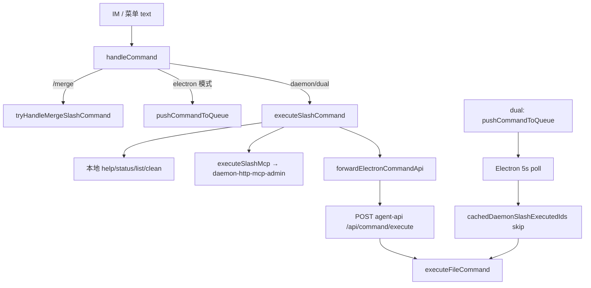

# 控制层HTTP化与斜杠去Electron依赖 - 代码评审报告

## 1、审查范围

- **变更类型**: apply 产出的未提交变更（含 5 个未跟踪新文件）
- **评审等级**: focused-review（HTTP 契约 + Daemon/Electron 多端一致性）
- **涉及文件**: 18 个（代码 13 修改 + 5 新增；AGENTS.md 4 处）
- **设计文档**: `02-design.md`（对照基准）
- **评审方法**: CodeGraph 调用链（`handleCommand` / `checkAndExecutePendingCommands` / `forwardElectronCommandApi`）+ git diff 全文核对

## 2、严重（必须处理）

无

## 3、警告（建议处理）

1. **`slash_exec` 结构化日志缺少 `source` 字段（im|menu）**
   - 位置: `src/daemon/daemon-slash-executor.ts:42-47`、`src/daemon/daemon.ts:1344-1378`
   - 说明: `02` §八·（二）第 8 项与 T4 验收要求日志含 `source=im|menu`；`handleCommand` 已接收 `source` 参数（菜单 T6 传 `"menu"`），但未传入 `executeSlashCommand` / `logSlashExec`。影响可观测与 dual 期排障，不阻断主路径功能。
   - 修改方向: `SlashExecutorDeps` 或 `executeSlashCommand` 增加 `source?` 参数，写入 `slash_exec` JSON。

2. **MCP 健康探测转发端点未在 Electron agent-api 注册（T3 M3 遗留）**
   - 位置: `src/daemon/daemon-http-mcp-admin.ts:128-136`；`electron/agent/cursor-sdk/agent-sdk-http.ts:193-233`
   - 说明: Daemon 侧 `fetchElectronMcpStatusMap` 调用 `POST /api/mcp/status-map`，但 `agent-sdk-http` 仅注册 `launch|dispatch|command/execute|sdk-warmup`。Electron 运行中时 `/mcp ls`/`info` 健康列恒为「未知」并带 `healthError`，符合「不静默成功」，但未达到与现网 Electron 斜杠健康语义一致（AC2 部分满足）。
   - 修改方向: 在 `agent-sdk-http` 增薄路由，委托 `getMcpStatusMap`（`mcp-manager`），或改调已有 IPC 等价逻辑。

3. **dual 模式 poll 去重依赖 5s 批量同步，存在短窗口双回复风险**
   - 位置: `electron/daemon/daemon-manager.ts:896-917`、`src/daemon/daemon.ts:1377-1383`
   - 说明: `syncDaemonSlashExecutedIds` 仅在 status poll tick 拉取 `GET /commands/executed-ids`；Daemon 标记与 `.fcmd` 双写之间，若 Electron 恰好在同步前 claim 新入队指令，可能二次 `reportCommandResult`。迁移期 `SLASH_EXEC_MODE=dual` 场景；`daemon` 模式无此路径。
   - 修改方向: claim 前对单 `messageId` 调 `GET /commands/skip-check`（已预留），或 Daemon 双写前预同步。

## 4、设计偏差

1. **M3 健康转发仅 Daemon 侧实现，Electron 端点缺失**
   - 设计预期: `02` 步骤 M3 — 健康态需主进程时经 agent-api 或薄 HTTP 转发 `mcp-manager`
   - 实际实现: Daemon `daemon-http-mcp-admin.ts` 已写转发客户端；Electron `agent-sdk-http` 无对应路由
   - 影响: 健康展示降级；enable/disable 写盘语义与 `toggleMcpServer` 对齐（仅 `disabled` 字段）

2. **`slash_exec` 日志字段不完整**
   - 设计预期: `command`、`message_id`、`mode`、`ok`、`source`
   - 实际实现: 缺 `source`；`mode` 来自 `getSlashExecMode()` 正确

无其他与 `02` 方案显著冲突项。T8 `/merge` 前置分支与执行器 double-guard 符合划界。

## 5、验收标准检查

| 任务 | 验收条件 | 状态 |
|------|---------|------|
| T1 | `executeFileCommand` 覆盖原 poll 全部分支 | ✅ 静态核对 switch 完整 |
| T1 | poll `shouldSkipCommand` 注入 | ✅ `setCommandPollSkipChecker` + `syncDaemonSlashExecutedIds` |
| T1 | 新文件 ≤300 行 | ✅ `command-executor.ts` 245 行 |
| T2 | `POST /api/command/execute` 契约 | ✅ `agent-command-http.ts` + `runWithHttpCommandResultSink` 跳过 `/cmd/result` |
| T2 | 未就绪可理解错误 | ✅ 503 + 中文 message |
| T3 | `/api/mcp` enable/disable/info | ✅ `daemon-http-admin-content.ts` |
| T3 | `manage_mcp` HTTP 对齐 | ✅ `server-admin.ts` |
| T3 | 健康转发失败非静默 | ✅ `healthError` 中文化；端点缺失见 §3-2 |
| T4 | Daemon 本地 `/status` 不经 Electron claim | ✅ `isDaemonLocalCommand` |
| T4 | Electron 未就绪 `/stop` 中文提示 | ✅ `formatElectronUnavailableMessage` |
| T4 | 不处理 `/merge` | ✅ `shouldSkipSlashCommand` + `tryHandleMergeSlashCommand` 前置 |
| T4 | `slash_exec` 日志 | ⚠️ 缺 `source` |
| T4 | 新文件 ≤300 行 | ✅ executor 155 + mcp 165 行 |
| T5 | `SLASH_EXEC_MODE` 三态 | ✅ 默认 `dual` |
| T5 | dual dedup | ⚠️ 5s 同步窗口见 §3-3 |
| T5 | 不改 T8 MergeBatch | ✅ 无 `handleMergeBatchAction` 语义变更 |
| T6 | 菜单走 `handleSlashCommand` | ✅ `feishu-event-handlers.ts` |
| T6 | admin stop/restart/reset 同步 | ✅ `daemon-http-admin-crud.ts` |
| AC1-AC5 | 01 验收 | ⚠️ 需 `/kb-test` 运行时验证；静态路径已接通 |
| §八·（二）9 | 新文件 ≤300 行 | ✅ 全部合规 |
| §八·（二）9 | `daemon.ts` / `daemon-manager.ts` | ⚠️ 历史超限（1857/1544），本变更未加剧，非新增债务 |

## 6、调用链与回归风险

| 回归点 | 风险 | 缓解 |
|--------|------|------|
| MergeBatch / orchestrator dispatch | 低 | 未改 dispatch loop |
| `/api/agent/launch\|dispatch` | 低 | 契约未动 |
| dual 双回复 | 中 | 迁移期；切 `daemon` 消除 |
| MCP 健康展示 | 中 | 配置 CRUD 正常；健康待补端点 |
| 授权门控 G1 | 低 | `isBotMentioned` 仍在 `handleCommand` 之前 |

## 7、遗留债务

1. **T3 M3**：`POST /api/mcp/status-map` 需在 Electron agent-api 补齐（见 R2）。
2. **迁移收尾**：稳定后默认 `SLASH_EXEC_MODE=daemon`、废弃 poll 主路径（`02` §六步骤 9，本期未做）。
3. **`daemon.ts` 行数**：批2 拆分仍待后续变更，非本议题范围。

## 8、修复任务建议

| 问题 ID | 建议动作 | 关联任务 |
|---------|----------|----------|
| R1 | `executeSlashCommand` 增加 `source` 并写入 `slash_exec` | T-FIX-01（可选，observability） |
| R2 | `agent-sdk-http` 注册 `/api/mcp/status-map` → `getMcpStatusMap` | T-FIX-02（M3 闭环） |
| R3 | poll claim 前调 `skip-check` 或缩短同步窗口 | T-FIX-03（dual 期） |

## 9、结论

**未通过**（警告 2 项，评分 ≥75），可先进入 `/kb-test` 补运行时验收记录；**归档前**建议修复 R1（可观测）与 R2（MCP 健康语义），或在 manifest 登记 `accepted_debt` 后 `/kb-archive`。

**Ponytail 精简（≥3 条）**：

1. `shrink:` `daemon-slash-mcp.ts` 与 `command-handler.handleFeishuMcpCommand` 子命令解析高度重复 → 斜杠 `/mcp` 可内循环 `POST /api/mcp` 减 80+ 行
2. `yagni:` `GET /commands/skip-check` 已接线但 Electron 仅用 `executed-ids` 批量同步 → 二选一
3. `shrink:` `daemon-http-mcp-admin.postElectronAgentApi` 与 `daemon-orchestrator.forwardElectronAgentApi` 重复 HTTP 客户端 → 注入 orchestrator 转发
4. `Lean already.` 核心两文件 `command-executor` / `daemon-slash-executor` 体量合理，无未批准依赖

`net: -~100 lines possible`（MCP 斜杠路径合并后）
