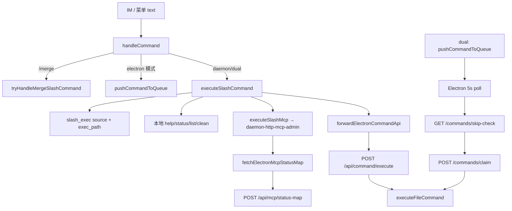

# 控制层HTTP化与斜杠去Electron依赖 - 代码评审报告

## 1、审查范围

- **变更类型**: apply 产出变更 + T-FIX-01/02/03 债务清偿复评
- **评审等级**: focused-review（HTTP 契约 + Daemon/Electron 多端一致性）
- **涉及文件**: 18 个（代码 13 修改 + 5 新增；AGENTS.md 4 处；T-FIX 增量 3 文件）
- **设计文档**: `02-design.md`（对照基准）
- **评审方法**: 读盘核对 T-FIX 验收标准 + 调用链静态追溯（`handleCommand` → `executeSlashCommand` → `logSlashExec`；`fetchElectronMcpStatusMap` → `POST /api/mcp/status-map`；`checkAndExecutePendingCommands` → `GET /commands/skip-check`）

## 2、严重（必须处理）

无

## 3、警告（建议处理）

无（R1/R2/R3 均已修复，见 §5 T-FIX 验收）

## 4、设计偏差

无（T-FIX 后实现与 `02` 方案对齐）

- **R1 已闭合**：`slash_exec` 现含 `source: im|menu`（通道来源）与 `exec_path: local|mcp|electron|skip`（执行路径），字段语义与 T4/T-FIX-01 契约一致。
- **R2 已闭合**：Electron `agent-sdk-http` 已注册 `POST /api/mcp/status-map`，委托 `getMcpStatusMap`，Daemon `fetchElectronMcpStatusMap` 无需改动即可对接。
- **R3 已闭合**：dual 模式 poll 在 **claim 前** 调用 `GET /commands/skip-check`，与批量 `executed-ids` 缓存并存，消除 5s 同步窗口竞态。

T8 `/merge` 前置分支与执行器 double-guard 仍符合划界。

## 5、验收标准检查

| 任务 | 验收条件 | 状态 |
|------|---------|------|
| T1 | `executeFileCommand` 覆盖原 poll 全部分支 | ✅ |
| T1 | poll `shouldSkipCommand` 注入 | ✅ |
| T1 | 新文件 ≤300 行 | ✅ `command-executor.ts` 245 行 |
| T2 | `POST /api/command/execute` 契约 | ✅ |
| T2 | 未就绪可理解错误 | ✅ 503 + 中文 message |
| T3 | `/api/mcp` enable/disable/info | ✅ |
| T3 | `manage_mcp` HTTP 对齐 | ✅ |
| T3 | 健康转发闭环 | ✅ T-FIX-02 补齐 status-map |
| T4 | Daemon 本地 `/status` 不经 Electron claim | ✅ |
| T4 | Electron 未就绪 `/stop` 中文提示 | ✅ |
| T4 | 不处理 `/merge` | ✅ |
| T4 | `slash_exec` 日志含 `source=im\|menu` | ✅ T-FIX-01 |
| T4 | 新文件 ≤300 行 | ✅ executor 174 + mcp 165 行 |
| T5 | `SLASH_EXEC_MODE` 三态 | ✅ 默认 `dual` |
| T5 | dual dedup | ✅ T-FIX-03 skip-check 接线 |
| T5 | 不改 T8 MergeBatch | ✅ |
| T6 | 菜单走 `handleSlashCommand` | ✅ 传 `"menu"` |
| T6 | admin stop/restart/reset 同步 | ✅ |
| T-FIX-01 | `channelSource` 签名 + `source`/`exec_path` 日志 | ✅ |
| T-FIX-01 | `handleCommand` 下传 im/menu | ✅ `daemon.ts:1377-1378` |
| T-FIX-02 | `/api/mcp/status-map` 注册 + `getMcpStatusMap` | ✅ `agent-sdk-http.ts:221-233` |
| T-FIX-03 | claim 前 `GET /commands/skip-check` | ✅ `daemon-manager.ts:963-968` |
| T-FIX-03 | skip-check 路由未削弱 | ✅ `daemon.ts:1716-1720` |
| AC1-AC5 | 01 验收 | ⚠️ 静态路径已接通；运行时见 `/kb-test` |
| §八·（二）9 | 新文件 ≤300 行 | ✅ |
| §八·（二）9 | `daemon.ts` / `daemon-manager.ts` | ⚠️ 历史超限，本变更未加剧 |

## 6、调用链与回归风险

| 回归点 | 风险 | 缓解 |
|--------|------|------|
| MergeBatch / orchestrator dispatch | 低 | 未改 dispatch loop |
| `/api/agent/launch\|dispatch` | 低 | 契约未动 |
| dual 双回复 | 低 | skip-check claim 前实时去重 + 失败保守跳过 |
| MCP 健康展示 | 低 | status-map 已注册 |
| skip-check 不可达 | 低 | 保守跳过防双回复；迁移期 dual 专用 |
| 授权门控 G1 | 低 | `isBotMentioned` 仍在 `handleCommand` 之前 |

## 7、遗留债务

1. **迁移收尾**：稳定后默认 `SLASH_EXEC_MODE=daemon`、废弃 poll 主路径（`02` §六步骤 9，本期未做）。
2. **`daemon.ts` 行数**：批2 拆分仍待后续变更，非本议题范围。

## 8、修复任务建议

| 问题 ID | 建议动作 | 关联任务 |
|---------|----------|----------|
| R1 | 已修复 | T-FIX-01 ✅ |
| R2 | 已修复 | T-FIX-02 ✅ |
| R3 | 已修复 | T-FIX-03 ✅ |

无 open 阻断项；无需新增 T-FIX。

## 9、结论

**通过**，可进入 `/kb-archive`（建议先完成 `/kb-test` 运行时验收记录）。

- R1/R2/R3 静态核对均已闭合，manifest `reviews[]` 维持 `fixed`。
- 无评分 ≥75 的新问题；§7 仅保留非阻断迁移与历史行数债务。

**Ponytail 精简（复评）**：

1. `shrink:` `daemon-slash-mcp.ts` 与 `command-handler.handleFeishuMcpCommand` 子命令解析仍重复 → 斜杠 `/mcp` 可内循环 `POST /api/mcp`（非阻断）
2. `native:` `GET /commands/skip-check` 与 `executed-ids` 批量缓存现并存，符合 T-FIX-03 设计（实时 + 批量优化）
3. `shrink:` `daemon-http-mcp-admin.postElectronAgentApi` 与 `daemon-orchestrator.forwardElectronAgentApi` 重复 HTTP 客户端（非阻断）
4. `Lean already.` 核心 `command-executor` / `daemon-slash-executor` / `agent-sdk-http`（259 行）体量合理

`net: -~100 lines possible`（MCP 斜杠路径合并后，归档后可选跟进）
