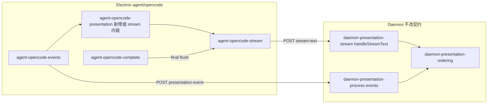

# OpenCode展示排序接入 - 实现设计

> **业务 PRD**：见同目录 `01-proposal.md`（验收标准以 01 为准）

## 一、业务流程与改动范围

> 业务口径以 `01-proposal.md` §五功能需求 R1–R5、§六验收标准为准；`01` 无独立「业务流程」节，下图由 R1–R5 与 Cursor/CC 已落地 Rev2 end-only 路径归纳。

### （一）业务流程图

```mermaid
flowchart TD
  startNode["用户发消息 不改"] --> enqueue["S0 入队 + dispatch 不改"]
  enqueue --> ocRun["S1 OpenCode prompt + SSE 不改"]
  ocRun --> orderGate{"S2 presentationOrderingEligible<br/>开关+f41? 改动"}

  orderGate -->|否 PRESENTATION_ORDERING=0| legacyPath["S2-L 直通 stream-text 不改"]
  orderGate -->|是| sseRoute{"S3 SSE part 分流 改动"}

  sseRoute -->|reasoning| thinkLatch["S3-T thinking POST + 置闩 改动"]
  sseRoute -->|tool running| toolLatch["S3-Tool notify tool POST + 置闩 改动"]
  sseRoute -->|tool silent| silentTool["S3-S silent 仅日志 改动"]
  sseRoute -->|text delta| deferGate{"S4 应 defer assistant?<br/>新增"}

  thinkLatch --> latchOn["S5 seenProcessEvent<br/>presentationDeferStream 改动"]
  toolLatch --> latchOn
  latchOn --> deferGate

  deferGate -->|是 Rev2 end-only| bufferAssist["S6 仅累积 streamBuffer<br/>不 POST non-final 新增"]
  deferGate -->|否 纯对话| preamble["S6-P preamble 400ms 短窗 新增"]
  preamble --> streamPost["S7 POST stream-text 改动"]
  deferGate -->|否 已建卡| streamPost

  bufferAssist --> moreSse{"S8 更多 SSE 不改"]
  moreSse --> sseRoute

  moreSse -->|session.idle / Run 收尾| finalFlush["S9 flushOpencodeStreamPost final 改动"]
  finalFlush --> daemonRelease["S10 Daemon enqueueRelease<br/>DeferredAssistant 不改"]
  daemonRelease --> ackStop["S11 ack/stop_progress 不改"]

  legacyPath --> legacyStream["append 即 schedule POST 不改"]
  legacyStream --> ackStop

  subgraph daemonSub ["Daemon 双侧门控 不改"]
    hst["handleStreamText deferred:true"]
    hpe["handlePresentationEvent 闩锁"]
  end
  streamPost --> hst
  thinkLatch --> hpe
  toolLatch --> hpe
  finalFlush --> hst
```

**图例**：`不改` 行为与现网一致；`改动` 需改代码/配置；`新增` 新节点或新分支；`删除` 本期无删除项。

### （二）流程步骤与改动对照

| 步骤 ID | 业务含义 | 改动 | 落点（模块/文件） | 01 验收关联 |
|---------|----------|------|-------------------|-------------|
| S0 | 用户消息入队、Daemon dispatch → OpenCode launch | 不改 | `src/daemon/daemon-orchestrator.ts`；`electron/agent/opencode/agent-opencode-sdk.ts` | 验收 5 前置 |
| S1 | OpenCode `session.prompt` + SSE `message.part.updated` | 不改 | `electron/agent/opencode/agent-opencode-events.ts` `handleOpencodeSseEvent` | — |
| S2 | `presentationOrderingEligible` = `PRESENTATION_ORDERING` + `f41Stream` | 改动 | `electron/agent/opencode/agent-opencode-utils.ts` `presentationOrderingEligible`（已有定义，接入消费） | 验收 3、4 |
| S2-L | 开关关闭：assistant delta 立即 `scheduleOpencodeStreamPost` | 不改 | `appendOpencodeStreamDelta` 在 `shouldDefer` 为 false 时行为与现网一致 | 验收 4 |
| S3-T | `reasoning` part → `markProcessEventSeen` + POST thinking | 改动 | `agent-opencode-events.ts` `handlePartUpdated`；`agent-opencode-stream.ts` `markOpencodeProcessEventSeen` | 验收 1、3；R3 |
| S3-Tool | notify 级 tool → 置闩 + POST presentation-event | 改动 | `agent-opencode-events.ts`；`src/shared/sdk-tool-presentation-tier.ts` `resolveSdkToolPresentationTier` | 验收 1、3；R3 |
| S3-S | silent tool（read/glob 等）→ 仅 `lastTool`/日志，不置闩不 POST | 改动 | `agent-opencode-events.ts` `handlePartUpdated` tool 分支 | R3；对称 Cursor/CC |
| S4 | `shouldDeferOpencodeAssistantPost` 判定 defer | 新增 | `electron/agent/opencode/agent-opencode-presentation.ts`（或 `agent-opencode-stream.ts` 内联） | 验收 1；R1、R2 |
| S5 | 过程可见时置 `seenProcessEvent` + `presentationDeferStream` | 改动 | `markOpencodeProcessEventSeen` 对齐 `sdk-run-presentation.ts` `markProcessEventSeen` | R2、R3 |
| S6 | 含过程 Run：non-final 不 POST stream-text，仅写 buffer | 新增 | `appendOpencodeStreamDelta`；`doFlushOpencodeStreamPost` 增加 `shouldDefer`/`shouldEndOnly` 早退 | 验收 1；R1 |
| S6-P | 纯对话：首包 400ms preamble 等待过程事件 | 新增 | `scheduleOpencodePreambleRelease`（对称 `schedulePreambleRelease`） | 验收 2、3 |
| S7 | 非 defer 路径 POST `/api/stream-text`；daemon 可返 `deferred:true` | 改动 | `postOpencodeStreamText` 已有 `deferred` 处理；配合 S6 减少无效 POST | R1 |
| S8 | tool/thinking 过程卡由 Daemon 处理（里程碑/CardKit） | 不改 | `src/daemon/daemon-presentation-process-events.ts`；`daemon-presentation-assistant-events.ts` | 验收 3 |
| S9 | Run 收尾 `flushOpencodeStreamPost(true)` 为含过程场景唯一 assistant IM 出站 | 改动 | `agent-opencode-complete.ts` `completeOpencodeRun`（已有 final flush，补 defer 链一致性） | 验收 2、5；R5 |
| S10 | Daemon `handleStreamText` final + `presentationProcessActive` → `enqueueReleaseDeferredAssistantStream` | 不改 | `src/daemon/daemon-presentation-stream.ts`；`daemon-presentation-ordering-release.ts` | 验收 2；R2 |
| S11 | 终态 notify / `reportSessionAgentPhase(idle)` / RunGuard | 不改 | `agent-opencode-complete.ts`；`engine-port-adapter.ts` | 验收 4、5；R5 |
| X-POST | 移除 `postOpencodePresentationEvent` 飞书早退，保证 Daemon 双侧闩 | 改动 | `agent-opencode-stream.ts` `postOpencodePresentationEvent` | 验收 3；R3（对称 CC `postPresentationEvent`） |

### （三）改动汇总

- **改动**：`electron/agent/opencode/agent-opencode-stream.ts`（defer 门控、`markOpencodeProcessEventSeen`、移除 presentation-event 飞书早退）、`electron/agent/opencode/agent-opencode-events.ts`（tool 分级、置闩顺序）、可选新建 `agent-opencode-presentation.ts`（单文件 ≤300 行时）
- **新增**：`shouldDeferOpencodeAssistantPost`、`shouldEndOnlyOpencodeAssistantDefer`、`scheduleOpencodePreambleRelease`（对称 `sdk-run-presentation.ts` Rev2 end-only 链）
- **不改（显式列出）**：Daemon `handleStreamText` / `createPresentationOrdering` / MergeBatch / F1 门控；OpenCode Port/RunLifecycle；`engine-port-adapter.ts` 终态模板；Codex 引擎（本变更范围外）；队列与合并卡 UI

## 二、整体思路

**根因**（见 01 §一）：OpenCode 已具备 `presentationOrderingEligible`、`seenProcessEvent`、`postOpencodeStreamText` 对 `deferred:true` 的处理，以及 Daemon 侧通用 ordering 门控，但 **Electron 流式出站未接入 defer 链**——`appendOpencodeStreamDelta` 在过程事件后仍立即 `scheduleOpencodeStreamPost`，`markOpencodeProcessEventSeen` 未置 `presentationDeferStream`，`doFlushOpencodeStreamPost` 无 Rev2 end-only 早退，导致 assistant 首包抢在 tool/thinking 之前到达 Daemon（CodeGraph：`appendOpencodeStreamDelta` @ `agent-opencode-stream.ts:189`；对照 `shouldDeferAssistantPost` @ `sdk-run-presentation.ts:194`）。

**方案要点**（对齐 Cursor Rev2 end-only，见 `electron/agent/cursor-sdk/sdk-run-presentation.ts` 与 `src/daemon/AGENTS.md` Presentation 时序编排）：

1. **双侧门控**：Electron 侧 non-final 禁止 POST；Daemon 侧 `presentationProcessActive` 时返回 `{ deferred: true }` 并累积 `deferredAssistantText`（已存在，OpenCode 须触发 POST 时机对齐）。
2. **过程闩**：thinking / notify 级 tool 调用 `markOpencodeProcessEventSeen`（含 `presentationDeferStream=true`）；silent tool 不置闩。
3. **Release 唯一路径**：含过程 Run 仅在 `flushOpencodeStreamPost(true)`（Run 收尾）释放 assistant IM；禁止 mid-run `maybeReleaseDeferredAssistant`（Rev2）。
4. **presentation-event 必达 Daemon**：移除 `postOpencodePresentationEvent` 的 `feishuSuppressesProcessKind` 早退（对称 CC），由 Daemon 做里程碑/CardKit 降级与 `presentationProcessActive` 置位。
5. **回滚**：`PRESENTATION_ORDERING=0` 时 `presentationOrderingEligible` 为 false，全链早退，行为回现网直通。

**最小方案三问（Ponytail）**：

1. **能否复用现有模块/符号？** 能。以 `sdk-run-presentation.ts` + `agent-cc-presentation.ts` 为模板，复用 `presentationOrderingEligible`（`agent-opencode-utils.ts`）、`resolveSdkToolPresentationTier`、Daemon `handleStreamText`/`enqueueReleaseDeferredAssistantStream`；不新建 Presentation 子系统。
2. **拟新增抽象是否 PRD 要求？** 否。仅增 3 个私有判定函数（`shouldDefer*` / `shouldEndOnly*` / `schedulePreambleRelease`），不引入 trait/通用 Orchestrator；YAGNI：与 Cursor 同名语义 inline 即可。
3. **能否合并到已有文件？** 优先合并。`agent-opencode-stream.ts` 当前约 235 行，增补 defer 链后预计 <300 行；若超限则拆出 `agent-opencode-presentation.ts`（对称 CC），**不**预建四引擎共用抽象层。

## 三、分层设计



- **端点层**：沿用 `POST /api/stream-text`、`POST /api/presentation-event`（`daemon-http-routes-send.ts`）；无新路由。
- **服务层**：OpenCode Electron 负责 SSE→defer 判定与是否 POST；Daemon 负责 CardKit 首建门控、deferred 释放、飞书里程碑降级（已实现）。
- **数据层**：内存 `OpencodeSessionAgent` 字段 `seenProcessEvent`/`presentationDeferStream`（已有）；Daemon `SessionProgressState` 编排字段（已有）；无持久化变更。

## 四、接口设计

无新增 HTTP 路由与 proto 变更。沿用契约：

| 端点 | OpenCode 侧变更 | 说明 |
|------|-----------------|------|
| `POST /api/stream-text` | Electron 减少含过程场景下的 non-final POST；仍处理 `deferred:true` 响应 | 对称 `sdk-run-presentation.ts` `postStreamText` |
| `POST /api/presentation-event` | 飞书通道亦 POST（由 Daemon 抑制呈现，仍置 ordering 闩） | 对称 `agent-cc-notify.ts` `postPresentationEvent` |

## 五、数据结构

无表/持久化变更。会话内存字段（已存在于 `OpencodeSessionAgent`）：

| 字段 | 用途 |
|------|------|
| `seenProcessEvent` | 本 Run 已见 thinking/notify-tool |
| `presentationDeferStream` | Daemon 曾返回 `deferred:true` 或过程闩已置 |
| `streamBuffer` / `streamPostChain` | assistant 累积与串行 POST |
| `thinkingOpen` / `toolPresentationOutboundIds` | 过程卡 PATCH 游标 |

Daemon `SessionProgressState` 编排字段由既有 presentation-event/stream-text 维护，本变更不扩展。

## 六、实现步骤

1. **步骤 S5/X-POST**：改造 `markOpencodeProcessEventSeen`——增加 `presentationOrderingEligible` 门控，置 `seenProcessEvent` + `presentationDeferStream` + `clearOpencodeStreamPostTimer`；`postOpencodePresentationEvent` 移除飞书早退。
2. **步骤 S3-S/S3-Tool**：`handlePartUpdated` tool 分支接入 `resolveSdkToolPresentationTier`：notify 级走现有 POST+置闩；silent 级仅更新 `lastTool`/日志。
3. **步骤 S4–S7**：在 `agent-opencode-stream.ts`（或 `agent-opencode-presentation.ts`）实现 `shouldDeferOpencodeAssistantPost`、`shouldEndOnlyOpencodeAssistantDefer`、`scheduleOpencodePreambleRelease`；改造 `appendOpencodeStreamDelta` 与 `doFlushOpencodeStreamPost` non-final 早退逻辑（对照 `sdk-run-presentation.ts:119-145,194-228`）。
4. **步骤 S9**：确认 `completeOpencodeRun` 收尾 `flushOpencodeStreamPost(true)` 在 defer 链下仍唯一出站；`resetOpencodeRunPresentationState` 与 `resetOpencodeStreamState` 清零闩锁字段。
5. **步骤 S2-L**：手工验证 `PRESENTATION_ORDERING=0` 时函数早退，行为与变更前一致。
6. **回归**：四引擎 Port 归档用例 + OpenCode 多 tool Run 飞书私聊与 Cursor 并排对比（见 §八·（二））。

## 七、参考实现

CodeGraph 命中符号（`projectPath=/home/suveng/doger/cursor-claw`）：

| 角色 | 符号 | 路径 |
|------|------|------|
| **对照 SSOT（Cursor）** | `shouldDeferAssistantPost` / `shouldEndOnlyAssistantDefer` / `markProcessEventSeen` / `appendAssistantStreamDelta` | `electron/agent/cursor-sdk/sdk-run-presentation.ts` |
| **对照（CC 拆分）** | `appendCcAssistantStreamDelta` / `shouldDeferCcAssistantPost` | `electron/agent/claude-code/agent-cc-presentation.ts`；`agent-cc-utils.ts` |
| **OpenCode 流式入口** | `appendOpencodeStreamDelta` / `postOpencodeStreamText` / `markOpencodeProcessEventSeen` | `electron/agent/opencode/agent-opencode-stream.ts` |
| **OpenCode SSE 映射** | `handlePartUpdated` / `handleOpencodeSseEvent` | `electron/agent/opencode/agent-opencode-events.ts` |
| **eligible 判定** | `presentationOrderingEligible` | `electron/agent/opencode/agent-opencode-utils.ts`（复用 `agent-cc-utils` `presentationOrderingEnvEnabled`） |
| **Daemon defer/release** | `handleStreamText` / `enqueueReleaseDeferredAssistantStream` | `src/daemon/daemon-presentation-stream.ts`；`daemon-presentation-ordering-release.ts` |
| **Daemon 过程闩** | `handleToolPresentationEvent` / `handleThinkingPresentationEvent` | `src/daemon/daemon-presentation-process-events.ts` |
| **tool 分级 SSOT** | `resolveSdkToolPresentationTier` | `src/shared/sdk-tool-presentation-tier.ts` |

## 八、技术影响

### （一）影响范围

- **涉及模块**：`electron/agent/opencode/`（stream、events、utils；可选 presentation）；**不涉及** Daemon 主链改动（仅消费既有 ordering API）。
- **接口/proto 变更**：无。
- **数据变更**：无。
- **风险**：
  - **飞书双侧闩**：若保留 `postOpencodePresentationEvent` 早退，Daemon 无法置 `presentationProcessActive`，final release 可能失效——本设计要求移除早退（步骤 1）。
  - **文件行数**：`agent-opencode-stream.ts` 增补后须 ≤300 行，超限拆 `agent-opencode-presentation.ts`。
  - **SSE 语义**：OpenCode `reasoning`/`tool` part 与 Cursor `thinking`/`tool_call` 映射须保持一一置闩；未知 part 仍 WARN 不崩溃。
  - **异常终态**：`session.error` / abort 须经 `completeOpencodeRun` final flush 或 failure notify，避免 deferred 缓冲泄漏（对齐 R5）。

### （二）工程补充验收项

- [ ] `PRESENTATION_ORDERING=0` 重启后 OpenCode 多 tool Run 与变更前时间轴一致，无卡死、无丢终态
- [ ] 飞书私聊 OpenCode Run：tool 执行中无 assistant 单独成卡；idle 后正文完整释放
- [ ] 与 Cursor 同 prompt 并排：过程在上、结论在下体感一致
- [ ] silent tool（如 read）不触发 defer，notify tool 触发 defer
- [ ] `presentation_order_violation` 日志无新增异常峰值（NF1 可观测）
- [ ] 四引擎 Port 回归：`engine-port-adapter` 终态契约无变更

## 九、知识库影响

- `knowledge/业务域/Agent调度/09-OpenCodeSDK执行引擎.md` — §九「presentationOrderingEligible 未接入」须归档更新（高）
- `knowledge/业务域/消息桥接/02-飞书通道.md` — OpenCode 纳入 ordering 双侧门控说明（中）
- `knowledge/变更/归档/20260704190748-IM通知消息顺序与流式推送优化/` — 交叉引用四引擎对齐（低）
- `electron/agent/opencode/AGENTS.md` — 代码侧 SSOT 补充 Presentation 时序（implement 同步）
- 两级索引：若 `09-OpenCode` §九变更显著，可在 `Agent调度/01-概览.md` 变更记录追加一句；`知识索引.md` 无需改结构

## 十、知识库更新计划

### （一）必须更新

- `knowledge/业务域/Agent调度/09-OpenCodeSDK执行引擎.md` — 移除 §九 限制项，补充 Presentation defer/Rev2 end-only 与参考文件
- `electron/agent/opencode/AGENTS.md` — Presentation 时序编排段落（archive 时由 kb-librarian 或 builder 同步）

### （二）可能更新（视实现结果）

- `knowledge/业务域/消息桥接/02-飞书通道.md` — 四引擎 presentation-event POST 口径表
- `knowledge/业务域/Agent调度/06-CursorSDK执行引擎.md` — 交叉引用「OpenCode 已对齐」一句（避免重复铺陈）

### （三）不需要更新

- Daemon 工程平台分区正文（行为未改，仅 OpenCode 客户端接入）
- Proto / Flutter / Quasar 分区
- `knowledge/业务域/Agent调度/08-CodexSDK执行引擎.md`（Codex ordering 不在本变更范围）
