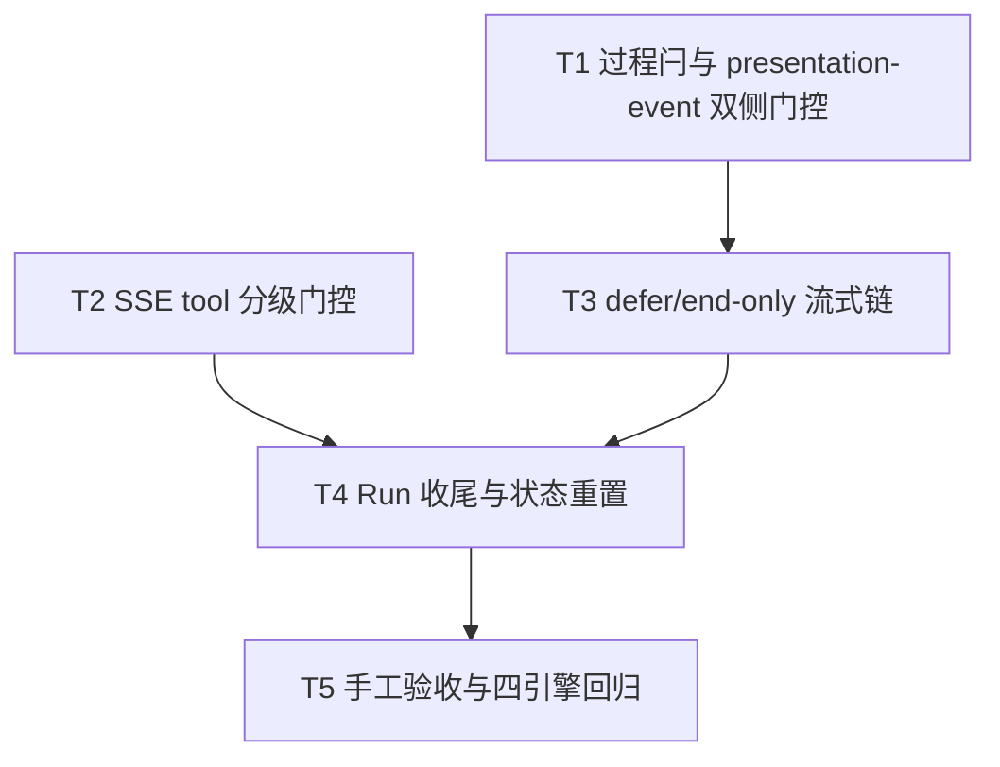

# OpenCode展示排序接入 - 任务分解

> **来源**：`/kb-plan`（基于 `01-proposal.md`、`02-design.md`）
> **任务数**：5（T1–T5）
> **Daemon 划界**：本变更**不得**修改 `src/daemon/daemon-presentation-*.ts`、`daemon.ts` ordering 主链；仅消费既有 `POST /api/stream-text` 与 `POST /api/presentation-event` 契约。

## 一、执行计划

### （一）依赖图



```
T1 ──→ T3 ──┐
            ├──→ T4 ──→ T5
T2 ─────────┘
```

**CodeGraph 文件依赖边**（`projectPath=/home/suveng/doger/cursor-claw`）：

| 源符号/文件 | 依赖/波及 | 任务 |
|-------------|-----------|------|
| `markOpencodeProcessEventSeen` | `agent-opencode-stream.ts:206`；仅置 `seenProcessEvent`，缺 `presentationDeferStream` 与 `presentationOrderingEligible` 门控 | T1 |
| `postOpencodePresentationEvent` | `agent-opencode-stream.ts:65`；`feishuSuppressesProcessKind` 早退阻断 Daemon 双侧闩 | T1 |
| `handlePartUpdated` | `agent-opencode-events.ts:27`；唯一调用 `appendOpencodeStreamDelta`；tool 分支未分级 | T2 |
| `appendOpencodeStreamDelta` | `agent-opencode-stream.ts:189`；无 defer，直接 `scheduleOpencodeStreamPost` | T3 |
| `doFlushOpencodeStreamPost` | `agent-opencode-stream.ts:116`；无 `shouldDefer*` / `shouldEndOnly*` 早退 | T3 |
| `shouldDeferAssistantPost`（对照 SSOT） | `sdk-run-presentation.ts:194` | T3 |
| `resolveSdkToolPresentationTier` | `src/shared/sdk-tool-presentation-tier.ts:23`；CC/Cursor 已消费 | T2 |
| `completeOpencodeRun` | `agent-opencode-complete.ts:43`；已有 `flushOpencodeStreamPost(true)` | T4 |
| `resetOpencodeRunPresentationState` | `agent-opencode-utils.ts:106`；已清零 `seenProcessEvent`/`presentationDeferStream` | T4 |
| `presentationOrderingEligible` | `agent-opencode-utils.ts:101`；已有定义，本变更仅接入消费 | T1、T3 |

**01 验收追溯**：

| 01 验收 | 主责任务 |
|---------|----------|
| AC1 门控范围内 tool 执行中无 assistant 抢首屏 | T1、T2、T3 |
| AC2 idle 后 deferred 正文正确释放 | T3、T4 |
| AC3 与 Cursor 同场景排序体感一致 | T1–T4、T5 |
| AC4 排序关闭无卡死、无丢终态 | T1、T3、T4、T5 |
| AC5 四引擎 Port 归档项无回归 | T4、T5 |

**02 §六步骤对齐**：T1→步骤 1（S5/X-POST）；T2→步骤 2（S3-S/S3-Tool）；T3→步骤 3（S4–S7）；T4→步骤 4（S9）；T5→步骤 5–6（S2-L + 回归）。

### （二）分组调度

| 轮次 | 并行任务 | 说明 |
|------|----------|------|
| **第一轮** | T1、T2 | 不同文件；T1 改 `agent-opencode-stream.ts` 闩锁与早退；T2 改 `agent-opencode-events.ts` tool 分级 |
| **第二轮** | T3 | 依赖 T1；独占 `agent-opencode-stream.ts`（或新建 `agent-opencode-presentation.ts`）defer 链 |
| **第三轮** | T4 | 依赖 T2、T3；改 `agent-opencode-complete.ts`，核对 `resetOpencodeRunPresentationState` |
| **第四轮** | T5 | 依赖 T4；纯手工验收，不写业务代码 |

**同文件冲突清单（须串行）**：

| 文件 | 涉及任务（顺序） |
|------|------------------|
| `electron/agent/opencode/agent-opencode-stream.ts` | T1 → T3（当前约 235 行；T3 增补后须 ≤300 行，超限拆 `agent-opencode-presentation.ts`） |
| `electron/agent/opencode/agent-opencode-events.ts` | T2 |
| `electron/agent/opencode/agent-opencode-complete.ts` | T4 |

## 二、任务清单

## T1: 过程闩对齐与 presentation-event 飞书早退移除

### 背景

OpenCode 的 `markOpencodeProcessEventSeen` 仅置 `seenProcessEvent`，未置 `presentationDeferStream`、未受 `presentationOrderingEligible` 门控；`postOpencodePresentationEvent` 对飞书通道 `feishuSuppressesProcessKind` 早退，导致 Daemon 无法置 `presentationProcessActive`，双侧门控失效。本任务是 defer 链（T3）与 Daemon release（T4）的前置，对应设计步骤 S5、X-POST。

### 上下文文件

- CodeGraph: `markOpencodeProcessEventSeen` — 对比 `markProcessEventSeen` @ `sdk-run-presentation.ts:245`
- CodeGraph: `postOpencodePresentationEvent` — 调用方 `handlePartUpdated`、`closeOpencodeThinkingIfOpen`
- 必读: `electron/agent/opencode/agent-opencode-stream.ts` — `markOpencodeProcessEventSeen`、`postOpencodePresentationEvent` 现网实现
- 必读: `electron/agent/cursor-sdk/sdk-run-presentation.ts` — `markProcessEventSeen` 对称 SSOT（约 245–250 行）
- 必读: `electron/agent/opencode/agent-opencode-utils.ts` — `presentationOrderingEligible`
- 参考: `src/shared/feishu-presentation-gate.ts` — `feishuSuppressesProcessKind` 语义（理解「呈现抑制 ≠ ordering defer」）

### 实现范围

- 修改: `electron/agent/opencode/agent-opencode-stream.ts` — `markOpencodeProcessEventSeen`：
  - **增加** `presentationOrderingEligible(session)` 门控；不满足时直接 return（S2-L 回滚路径）
  - 门控通过后：`seenProcessEvent = true`、`presentationDeferStream = true`、`clearOpencodeStreamPostTimer(session)`
  - 更新 JSDoc：阐明与 Cursor `markProcessEventSeen` 对称，飞书里程碑降级在 Daemon 侧
- 修改: `electron/agent/opencode/agent-opencode-stream.ts` — `postOpencodePresentationEvent`：
  - **移除** `feishuSuppressesProcessKind(resolveChannelType(...), event.kind)` 早退（约第 70 行）
  - 飞书私聊亦 POST `/api/presentation-event`，由 Daemon 做里程碑抑制与 ordering 闩
  - **保留** lock 缺失、HTTP 失败等既有错误处理
- 不改: `appendOpencodeStreamDelta`、`doFlushOpencodeStreamPost`（归 T3）

### 接口契约

- `markOpencodeProcessEventSeen(session: OpencodeSessionAgent): void` — ordering 开启且 f41 时置双侧闩；否则 no-op
- `postOpencodePresentationEvent(...): Promise<void>` — 不再因飞书抑制跳过 POST；载荷契约不变

### 验收标准

- [ ] `presentationOrderingEligible === false`（`PRESENTATION_ORDERING=0` 或非 f41）时 `markOpencodeProcessEventSeen` 无副作用（01 AC4、02 §八·（二）第 1 项）
- [ ] ordering 开启：thinking/tool 调用 `markOpencodeProcessEventSeen` 后 `seenProcessEvent === true` 且 `presentationDeferStream === true`（R2、R3）
- [ ] 飞书私聊：`postOpencodePresentationEvent` 对 thinking/tool 仍发起 HTTP POST（可用 mock 或日志验证请求发出；Daemon 侧里程碑降级不在本任务范围）
- [ ] `closeOpencodeThinkingIfOpen` 经 `postOpencodePresentationEvent` 发送 thinking final 时不再被飞书早退拦截
- [ ] 无 `02`/`03` 未要求的抽象层、trait/mixin 中间层或未批准的新依赖（Ponytail 口径）

### 依赖

- 前置任务: 无
- 后续任务: T3

---

## T2: SSE tool 分支接入 resolveSdkToolPresentationTier

### 背景

OpenCode `handlePartUpdated` 的 tool `running` 分支对所有工具一律 `markOpencodeProcessEventSeen` + POST presentation-event，未区分 notify/silent 级，导致 read/glob 等 silent 工具误触发 defer（与 Cursor/CC 不对称）。本任务接入 `resolveSdkToolPresentationTier`，对应设计步骤 S3-S、S3-Tool。

### 上下文文件

- CodeGraph: `handlePartUpdated` — tool 分支与 `markOpencodeProcessEventSeen` 调用序
- CodeGraph: `resolveSdkToolPresentationTier` — `src/shared/sdk-tool-presentation-tier.ts`
- 必读: `electron/agent/opencode/agent-opencode-events.ts` — `handlePartUpdated` tool/reasoning 分支全文
- 必读: `electron/agent/cursor-sdk/sdk-run-stream.ts` — tool_call 分级消费范例（约 147 行附近）
- 参考: `electron/agent/claude-code/agent-cc-presentation-tool.ts` — CC 对称实现

### 实现范围

- 修改: `electron/agent/opencode/agent-opencode-events.ts` — `handlePartUpdated` tool 分支（`st === "running" || st === "pending"`）：
  - 调用 `resolveSdkToolPresentationTier(toolName)` 得 `notify` | `silent`
  - **notify**：保持现有行为——`flushOpencodeLog`、`closeOpencodeThinkingIfOpen`、`lastTool`、`markOpencodeProcessEventSeen`、`toolPresentationOutboundIds?.delete`、`postOpencodePresentationEvent(started)`
  - **silent**：仅更新 `session.lastTool` + `pushUiLog`（或沿用 `appendOpencodeLog` 若已有）；**不**调用 `markOpencodeProcessEventSeen`、**不** POST presentation-event
- 修改: `handlePartUpdated` reasoning 分支——保持 `markOpencodeProcessEventSeen` + POST（T1 门控后自动受益）；顺序不变：先置闩再 POST
- 不改: tool `completed`/`error` 终态 POST 逻辑（仍 POST final，不额外置闩）
- 不改: `agent-opencode-stream.ts` defer 链（归 T3）

### 接口契约

- 依赖 `resolveSdkToolPresentationTier(toolName: string): "notify" | "silent"` — 自 `src/shared/sdk-tool-presentation-tier.ts` 导入，不复制白名单
- notify tool `running` 仍 POST `{ kind: "tool", tool_status: "started", final: false }`

### 验收标准

- [ ] notify 级 tool（如 shell/write/task）`running` 仍触发 `markOpencodeProcessEventSeen` + presentation-event POST（01 AC1/AC3、R3）
- [ ] silent 级 tool（如 read/glob）`running` **不**调用 `markOpencodeProcessEventSeen`、**不** POST presentation-event，但 `lastTool` 仍更新（02 §八·（二）第 4 项）
- [ ] reasoning part 行为与变更前一致且经 T1 门控（仍置闩 + POST）
- [ ] 未知 part 类型仍 WARN 不崩溃（02 §八·（一）SSE 语义风险）
- [ ] 无 `02`/`03` 未要求的抽象层、trait/mixin 中间层或未批准的新依赖（Ponytail 口径）

### 依赖

- 前置任务: 无（与 T1 并行；notify 路径依赖 T1 闩锁语义在 T3 前落地，T2 单独可测 silent 不置闩）
- 后续任务: T4

---

## T3: OpenCode defer/end-only 流式出站链

### 背景

`appendOpencodeStreamDelta` 在过程事件后仍立即 `scheduleOpencodeStreamPost`，`doFlushOpencodeStreamPost` 无 Rev2 end-only 早退，是 assistant 抢首屏的根因。本任务对称 `sdk-run-presentation.ts` 实现 defer 判定、preamble 短窗与 non-final 禁止 POST，对应设计步骤 S4–S7。

### 上下文文件

- CodeGraph: `appendOpencodeStreamDelta` / `doFlushOpencodeStreamPost` — 与 `shouldDeferAssistantPost` 对照
- 必读: `electron/agent/cursor-sdk/sdk-run-presentation.ts` — `shouldDeferAssistantPost`（194）、`shouldEndOnlyAssistantDefer`（120）、`schedulePreambleRelease`（207）、`appendAssistantStreamDelta`（217）、`doFlushStreamPost`（126–145）
- 必读: `electron/agent/opencode/agent-opencode-stream.ts` — 全文（T1 已改闩锁与早退）
- 必读: `electron/agent/opencode/agent-opencode-utils.ts` — `presentationOrderingEligible`
- 参考: `electron/agent/claude-code/agent-cc-presentation.ts` — CC 拆分范例（若需拆文件）

### 实现范围

- 修改或新建（单文件 ≤300 行约束）：
  - **优先**在 `electron/agent/opencode/agent-opencode-stream.ts` 内联实现；
  - 若增补后 **>300 行**，将 defer 判定与 preamble 拆至 `electron/agent/opencode/agent-opencode-presentation.ts` 并自 `agent-opencode-stream.ts` 导入（对称 CC，不建四引擎共用层）
- 新增私有函数（命名对称 Cursor，OpenCode 前缀）：
  - `shouldDeferOpencodeAssistantPost(session)` — 对齐 `shouldDeferAssistantPost`
  - `shouldEndOnlyOpencodeAssistantDefer(session)` — 对齐 `shouldEndOnlyAssistantDefer`（Rev2 end-only）
  - `isAwaitingFirstOpencodeProcessEvent(session)` — 纯对话 preamble 判定
  - `scheduleOpencodePreambleRelease(session)` — 400ms 短窗，常量复用 `STREAM_POST_INTERVAL_MS`
- 修改: `appendOpencodeStreamDelta`：
  - 累积 `streamBuffer` 后，若 `shouldDeferOpencodeAssistantPost` 为 true 则 return（仅写 buffer）
  - 若 `isAwaitingFirstOpencodeProcessEvent` 则 `scheduleOpencodePreambleRelease` 后 return
  - 否则 `scheduleOpencodeStreamPost(session, false)`
  - **保留** `isFeishuPlainAssistantReply` 早退
- 修改: `doFlushOpencodeStreamPost`：
  - non-final：若 `shouldDeferOpencodeAssistantPost` 或 `shouldEndOnlyOpencodeAssistantDefer` 为 true 则 return（不 POST）
  - final 路径不变，仍经 `postOpencodeStreamText` 处理 `deferred:true` → 设 `presentationDeferStream`
- **禁止** mid-run `maybeReleaseDeferredAssistant` 等价物（Rev2 end-only；release 仅 T4 final flush）
- 不改: `postOpencodePresentationEvent`（T1 已完成）

### 接口契约

- `shouldDeferOpencodeAssistantPost(session): boolean` — T4 可读 session 状态验证；无对外 HTTP 变更
- `appendOpencodeStreamDelta(session, delta)` — ordering+含过程时仅累积 buffer；纯对话经 preamble 后 POST
- `doFlushOpencodeStreamPost(session, final)` — non-final 含过程场景 no-op POST

### 验收标准

- [ ] ordering 开启 + 已见 thinking/notify-tool：`appendOpencodeStreamDelta` 不触发 non-final `scheduleOpencodeStreamPost`（01 AC1、R1/R2）
- [ ] 纯对话（无过程事件）：首包经 400ms preamble 后正常 POST，体感不劣于现网节流（01 AC2 前置、02 §八·（二）第 3 项）
- [ ] `doFlushOpencodeStreamPost(..., false)` 在 `shouldEndOnlyOpencodeAssistantDefer` 为 true 时不 POST（Rev2 end-only）
- [ ] `PRESENTATION_ORDERING=0` 时上述函数均早退，行为与变更前时间轴一致（01 AC4、02 §八·（二）第 1 项）
- [ ] 主改文件（含可选 `agent-opencode-presentation.ts`）各 ≤300 行
- [ ] 无 `02`/`03` 未要求的抽象层、trait/mixin 中间层或未批准的新依赖（Ponytail 口径）

### 依赖

- 前置任务: T1
- 后续任务: T4

---

## T4: Run 收尾 final flush 与 presentation 状态重置一致性

### 背景

含过程 Run 的 assistant IM 唯一出站须在 `flushOpencodeStreamPost(true)`（Run 收尾）；`completeOpencodeRun` 已有 final flush，须在 defer 链（T3）落地后确认与 `resetOpencodeRunPresentationState`/`resetOpencodeStreamState` 清零闩锁字段一致，异常终态不泄漏 deferred 缓冲。对应设计步骤 S9。

### 上下文文件

- CodeGraph: `completeOpencodeRun` — `flushOpencodeStreamPost(true)` 调用条件
- 必读: `electron/agent/opencode/agent-opencode-complete.ts` — `completeOpencodeRun` 全文
- 必读: `electron/agent/opencode/agent-opencode-stream.ts` — `flushOpencodeStreamPost`、`resetOpencodeStreamState`（T3 完成后）
- 必读: `electron/agent/opencode/agent-opencode-utils.ts` — `resetOpencodeRunPresentationState`
- 参考: `electron/agent/cursor-sdk/sdk-run-stream.ts` — Run 收尾 `flushStreamPost(true)` 唯一出站范例

### 实现范围

- 修改: `electron/agent/opencode/agent-opencode-complete.ts` — `completeOpencodeRun`：
  - 确认含过程 defer 场景下 `flushOpencodeStreamPost(session, true)` 仍为**唯一** assistant IM 出站（条件 `f41Stream && (streamBuffer.trim() || outboundMessageId)` 保持或按 T3 微调）
  - **禁止**新增 mid-run release 或 `maybeReleaseDeferredAssistant` 调用
  - `session.error` / abort / watchdog 路径仍保证 final flush 或 failure notify，避免 buffer 泄漏（R5）
- 核对: `resetOpencodeRunPresentationState` 与 `resetOpencodeStreamState` 已清零 `seenProcessEvent`、`presentationDeferStream`、`streamBuffer`、`outboundMessageId`；不足则补全
- 不改: `engine-port-adapter.ts` 终态模板；Daemon release 链

### 接口契约

- `completeOpencodeRun(...)` — 幂等；defer 链下 final flush 触发 Daemon `enqueueReleaseDeferredAssistantStream`（消费方不变）
- `resetOpencodeRunPresentationState(session)` — 新 Run 开始前闩锁与 buffer 归零

### 验收标准

- [ ] 含过程多 tool Run：idle 后 `completeOpencodeRun` 触发一次 final assistant IM，正文完整（01 AC2、02 §八·（二）第 2 项）
- [ ] `session.error` / SSE 异常 / abort 后无 deferred buffer 常驻泄漏；终态 notify 仍到达（01 AC4/AC5、R5）
- [ ] 新 Run `start` 前 `seenProcessEvent`/`presentationDeferStream` 均为 false
- [ ] `engine-port-adapter` 终态契约无签名/语义变更（02 §八·（二）第 6 项、01 AC5）
- [ ] 无 `02`/`03` 未要求的抽象层、trait/mixin 中间层或未批准的新依赖（Ponytail 口径）

### 依赖

- 前置任务: T2、T3
- 后续任务: T5

---

## T5: 手工验收与四引擎 Port 回归

### 背景

设计步骤 S2-L 与 S6 要求环境级验证：排序开关回滚、飞书/OpenCode 多 tool 场景、与 Cursor 并排对比、可观测日志与四引擎 Port 无回归。本任务不写代码，汇总前序任务交付物的端到端验收。

### 上下文文件

- 必读: 同目录 `01-proposal.md` §六验收标准
- 必读: 同目录 `02-design.md` §八·（二）工程补充验收项
- 参考: `knowledge/变更/归档/20260711232258-四引擎 Engine Port 与 RunLifecycle 抽象/` — Port 回归用例
- 参考: `electron/agent/opencode/AGENTS.md` — 实现后须同步 Presentation 段落（归 `/kb-archive`，本任务仅记录 gaps）

### 实现范围

- 无代码变更
- 执行并记录以下场景（可截图或简短结论写入 `04-review.md` 预备，本任务不强制写 review）：
  1. `PRESENTATION_ORDERING=0` 重启 → OpenCode 多 tool Run 时间轴与变更前一致
  2. `PRESENTATION_ORDERING=1` 飞书私聊 OpenCode：tool 中无 assistant 单独成卡；idle 后正文完整
  3. 同 prompt OpenCode vs Cursor 并排：过程在上、结论在下
  4. silent tool（read）不 defer；notify tool（shell）defer
  5. 日志检索 `presentation_order_violation` 无异常峰值
  6. 四引擎 Port launch/dispatch/终态 smoke

### 接口契约

- 无新增接口；验收产出为可勾选 checklist 结论

### 验收标准

- [ ] 01 §六五项验收均可勾选通过（或标明阻塞项与日志依据）
- [ ] 02 §八·（二）六项工程补充验收均可勾选通过
- [ ] 发现实现缺口时开新 `T-FIX-*` 或 `/kb-revise`，不在本任务内改代码
- [ ] 无 `02`/`03` 未要求的抽象层、trait/mixin 中间层或未批准的新依赖（Ponytail 口径）

### 依赖

- 前置任务: T4
- 后续任务: 无（完成后可 `/kb-archive`）
