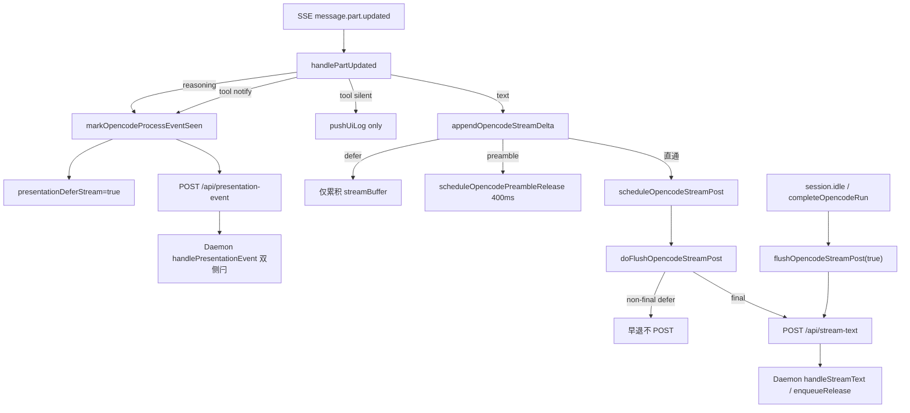

# OpenCode展示排序接入 - 代码评审报告

## 1、审查范围

- **变更类型**: apply 产出的未提交变更（T1–T4 代码实现）
- **评审等级**: focused-review（局部 Electron Presentation 改动，无 proto/DB/资金/权限路径）
- **涉及文件**: 5 个（`agent-opencode-stream.ts`、`agent-opencode-events.ts`、`agent-opencode-complete.ts`、`agent-opencode-utils.ts`、`electron/agent/opencode/AGENTS.md`）
- **设计文档**: `02-design.md`（对照基准）
- **评审方法**: `git diff` + CodeGraph `codegraph_impact(markOpencodeProcessEventSeen)` + 对照 `sdk-run-presentation.ts` SSOT；Agent #2 Bug 扫描 + Agent #3 设计偏差/Ponytail 精简检查

## 2、严重（必须处理）

无

## 3、警告（建议处理）

无

**Ponytail 精简（Agent #3）**：`Lean already. Ship.`

- defer 链内联 `agent-opencode-stream.ts`（279 行），未预建 `agent-opencode-presentation.ts` 或四引擎共用层，符合 `02` §2 最小方案三问。
- `shouldDeferOpencodeAssistantPost` / `shouldEndOnlyOpencodeAssistantDefer` 与 Cursor 同名双函数对称保留，非本变更新增抽象。
- `resetOpencodeRunPresentationState` 内联清 timer/链以避免与 stream 循环依赖，注释合理，非过度封装。

## 4、设计偏差

无

实现与 `02-design.md` S3–S9、X-POST 步骤一致：

- T1：`markOpencodeProcessEventSeen` 增加 `presentationOrderingEligible` 门控并置 `presentationDeferStream`；`postOpencodePresentationEvent` 移除飞书 `feishuSuppressesProcessKind` 早退。
- T2：`handlePartUpdated` tool `running` 接入 `resolveSdkToolPresentationTier`，notify/silent 分流对称 Cursor/CC。
- T3：`shouldDefer*` / `shouldEndOnly*` / `isAwaitingFirst*` / `scheduleOpencodePreambleRelease` 内联 stream；`appendOpencodeStreamDelta` 与 `doFlushOpencodeStreamPost` non-final 早退符合 Rev2 end-only。
- T4：`completeOpencodeRun` 收尾前 `clearOpencodeStreamPostTimer`、final flush 后 `streamPostChain = undefined`；`resetOpencodeRunPresentationState` 补全 timer/链清零。

未引入 design 未要求的 Daemon 改动或新 HTTP 路由。

## 5、验收标准检查

| 任务 | 验收条件 | 状态 |
|------|---------|------|
| T1 | `PRESENTATION_ORDERING=0` 时 `markOpencodeProcessEventSeen` 无副作用 | ✅ 门控 `presentationOrderingEligible` 早退 |
| T1 | ordering 开启置 `seenProcessEvent` + `presentationDeferStream` | ✅ `agent-opencode-stream.ts:249-253` |
| T1 | 飞书私聊 presentation-event 仍 POST | ✅ 移除 `feishuSuppressesProcessKind` 早退 |
| T1 | `closeOpencodeThinkingIfOpen` 不经飞书拦截 | ✅ 同上 |
| T1 | 无未批准抽象/依赖 | ✅ |
| T2 | notify tool 置闩 + POST | ✅ events notify 分支 |
| T2 | silent tool 不置闩、不 POST | ✅ events silent 分支仅 `pushUiLog` |
| T2 | reasoning 行为一致且受益 T1 门控 | ✅ `reasoning` 分支仍 `markOpencodeProcessEventSeen` |
| T2 | 未知 part WARN 不崩溃 | ✅ 未改未知分支逻辑 |
| T3 | 含过程场景 non-final 不 `scheduleOpencodeStreamPost` | ✅ `appendOpencodeStreamDelta` defer 早退 |
| T3 | 纯对话 400ms preamble | ✅ `scheduleOpencodePreambleRelease` |
| T3 | `doFlushOpencodeStreamPost` non-final end-only 早退 | ✅ 174-176 行 |
| T3 | `PRESENTATION_ORDERING=0` 全链早退 | ✅ 各函数首行 `presentationOrderingEligible` |
| T3 | 主改文件 ≤300 行 | ✅ stream 279 行 |
| T4 | final flush 为含过程 Run 唯一 assistant IM 出站 | ✅ `completeOpencodeRun` + Rev2 注释 |
| T4 | 异常终态无 buffer 泄漏路径 | ✅ final flush / lifecycle 分支保留 |
| T4 | 新 Run 前闩锁归零 | ✅ `resetOpencodeRunPresentationState` |
| T4 | Port 终态契约无变更 | ✅ 未改 `engine-port-adapter.ts` |
| T5 | 01 §六五项验收 | ⚠️ 未执行（任务 pending，须手工/运行时） |
| T5 | 02 §八·（二）六项工程补充验收 | ⚠️ 未执行 |
| T5 | 四引擎 Port smoke | ⚠️ 未执行 |

## 6、调用链与回归风险

| 回归点 | 风险 | 缓解 |
|--------|------|------|
| `PRESENTATION_ORDERING=0` 回滚路径 | 低 | 全链 `presentationOrderingEligible` 早退，静态对齐 Cursor |
| 飞书私聊过程卡重复/里程碑 | 低 | 呈现抑制改由 Daemon 处理；与 CC 对称 |
| silent tool 误 defer | 低 | `resolveSdkToolPresentationTier` SSOT 白名单 |
| preamble 与过程事件竞态 | 低 | timer 内二次 `shouldDefer` 检查；对称 Cursor |
| 下一 Run 串 POST | 低 | `completeOpencodeRun` 清 timer + `streamPostChain=undefined`；`resetOpencodeRunPresentationState` 同步 |
| Codex/Port/RunLifecycle | 低 | 变更范围仅 `electron/agent/opencode/` |
| Daemon ordering 主链 | 低 | 无 Daemon 代码改动，仅消费既有 API |

CodeGraph 影响面：`markOpencodeProcessEventSeen` 波及 `handlePartUpdated`、`handleOpencodeSseEvent`（5 symbols），与 design 预期一致，无意外上游调用方。

## 7、遗留债务

1. **T5 手工验收未执行**：01 §六、02 §八·（二）运行时项须在归档前完成（飞书/OpenCode 多 tool、与 Cursor 并排、四引擎 Port smoke）。
2. **知识库同步**：`knowledge/业务域/Agent调度/09-OpenCodeSDK执行引擎.md` 等须在 `/kb-archive` 阶段由 librarian 更新（`02` §十 计划项，非本评审阻断）。

## 8、修复任务建议

| 问题 ID | 建议动作 | 关联任务 |
|---------|----------|----------|
| — | 无 open 代码问题 | — |
| T5 | 执行手工验收 checklist 并勾选 `03-tasks.md` T5 | T5 |

## 9、结论

**通过**（T1–T4 代码实现评审无阻断项，可标记 `reviewed`）。**归档前须完成 T5 手工验收**（01 §六、02 §八·（二））；T5 未勾选前请勿 `/kb-archive`。
