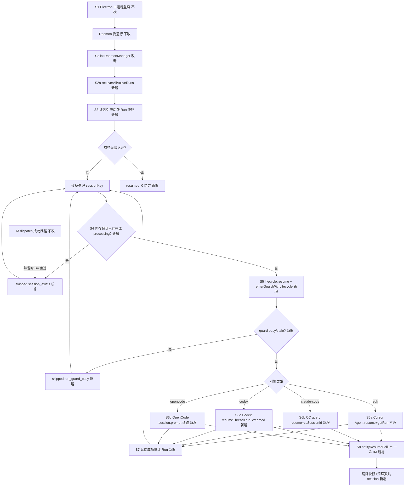
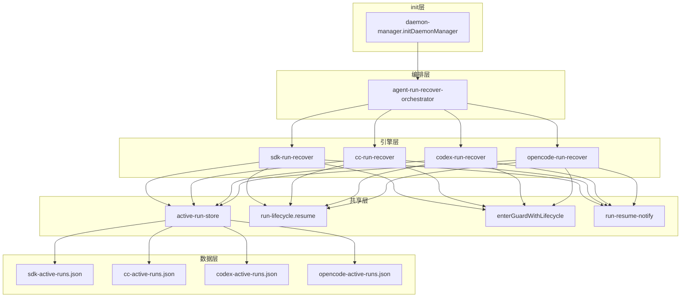

# 非Cursor引擎主进程续接 - 实现设计

> **业务 PRD**：见同目录 `01-proposal.md`（验收标准以 01 为准）

## 1、业务流程与改动范围

> 业务口径以 `01-proposal.md` 背景、功能需求 R1–R5 与验收标准为准；下图覆盖主进程重启后续接主路径与关键分支。

### 1.1 业务流程图

**图例**：`不改` 行为与现网一致；`改动` 需改现有挂接或逻辑；`新增` 新节点/新分支/新模块；`删除` 本变更无删除路径。

### 1.2 流程步骤与改动对照

| 步骤 ID | 业务含义 | 改动 | 落点（模块/文件） | 01 验收关联 |
|---------|----------|------|-------------------|-------------|
| S1 | Electron 重启、Daemon 仍运行 | 不改 | `electron/main.ts`、`src/daemon/` | 场景前提 |
| S2 | 主进程 init 触发四引擎 recover | 改动 | `electron/daemon/daemon-manager.ts` `initDaemonManager` | R1；验收 1 |
| S2a | 统一编排四引擎 recover | 新增 | `electron/agent/shared/agent-run-recover-orchestrator.ts` | R1 |
| S3 | 读盘活跃 Run（排除 userStopped） | 新增 | `electron/agent/shared/active-run-store.ts`；各引擎 `*-run-persistence.ts` | R4 |
| S3-sdk | Cursor 读 `sdk-active-runs.json` | 不改 | `electron/agent/cursor-sdk/sdk-run-persistence.ts` | 验收 4 |
| S4 | 防 recover 与 dispatch 双跑 | 新增 | 各 `recover*ActiveRuns`；对照 `sdk-run-recover.ts` L56–59 | 01 §八双跑；验收 1 |
| S5 | 续接前重置 Lifecycle 门控 | 新增 | `electron/agent/shared/run-lifecycle.ts` `resume()`；各 recover 内 `enterGuardWithLifecycle` | R2；验收 1 |
| S6a | Cursor `Agent.resume`+`startSdkRun` | 不改 | `electron/agent/cursor-sdk/sdk-run-recover.ts` | 验收 4 |
| S6b | CC `ccSessionId`+`options.resume` 续跑 | 新增 | `electron/agent/claude-code/cc-run-recover.ts`、`cc-run-persist.ts` | R1；验收 1、2 |
| S6c | Codex `codexSessionId`+`resumeThread` | 新增 | `electron/agent/codex/codex-run-recover.ts`、`codex-run-persist.ts` | R1；验收 1、2 |
| S6d | OpenCode `opencodeSessionId`+`session.prompt` | 新增 | `electron/agent/opencode/opencode-run-recover.ts`、`opencode-run-persist.ts` | R1；验收 1、2 |
| S7 | 续接成功无需用户重发 IM | 新增 | 各 recover 复用现有 `start*Run`/`stream*` 链 | 验收 2 |
| S8 | 失败一次可感知通知 | 新增 | `electron/agent/shared/run-resume-notify.ts`（从 Cursor `notifyResumeFailure` 抽取） | R3；验收 3 |
| S9 | Run 启动/呈现游标写盘 | 新增 | 挂接各引擎 launch/stream 路径（对称 `sdk-run-persist.ts`） | R4 |
| S10 | 用户 stop 标记不再续接 | 新增 | 各 `stop*Session` 调 `mark*RunUserStopped` | R4 |
| — | Port 六能力与 dispatch 成功路径 | 不改 | 各 `engine-port-adapter.ts`、`agent-sdk-http.ts` | R5；验收 5 |

### 1.3 改动汇总

- **改动**：`daemon-manager.ts` init 由仅 `recoverSdkActiveRuns` 改为 `recoverAllActiveRuns`（内含 Cursor，行为不变）。
- **新增**：`shared/active-run-store.ts`（JSON 读写容错）；`shared/agent-run-recover-orchestrator.ts`；`shared/run-resume-notify.ts`；CC/Codex/OpenCode 各 `*-run-persistence.ts`、`*-run-persist.ts`、`*-run-recover.ts`；三引擎 `userData/*-active-runs.json`。
- **不改（显式）**：Cursor `sdk-run-persistence.ts` / `sdk-run-recover.ts` 对外契约；`enterGuardWithLifecycle` 闩算法；`engine-port-adapter` Port 六方法；Daemon 队列/合并卡/路由 T4；dispatch 成功路径与终态 `completeRunFromTemplate` 链。

## 2、整体思路

**根因**（见 01 §一）：S7 主进程 recover 仅 Cursor 在 `initDaemonManager` 挂接；CC/Codex/OpenCode 的 `ccSessionId`/`codexSessionId`/`opencodeSessionId` 仅存内存 Map，重启后丢失，无法对称续接。

**方案要点**（对齐 01 R1–R5）：

1. **持久化**：三引擎在 Run 启动与呈现游标变更时写盘（对称 Cursor `persistActiveRunSnapshot` + 3s 节流）；用户 `stop*Session` 写 `userStopped`。
2. **恢复**：`recoverAllActiveRuns` 并行/串行调用四引擎 recover；每条记录先 `createRunLifecycle(session).resume()`，再 `enterGuardWithLifecycle`，再引擎特有续接 API。
3. **失败通知**：抽取 `notifyResumeFailure(sessionKey, reason)` 至 shared，四引擎共用一次 IM 文案模式。
4. **防双跑**：recover 前检查各 registry（`CC_SESSIONS`/`CODEX_SESSIONS`/`OPENCODE_SESSIONS`/`sdkSessions`）及 `is*SessionRunning`；guard 返回 `busy`/`stale_aborted` 时 skip 且不 notify（与 Cursor S7 一致）。
5. **Cursor 零回归**：`sdk-active-runs.json` 与 `recoverSdkActiveRuns` 逻辑不重构，仅纳入 orchestrator。

**最小方案三问（Ponytail）**：

1. **能否复用现有符号？** 能。`run-lifecycle.resume()`、`enterGuardWithLifecycle`、`notifySessionChat`、`listRecoverableSdkRuns`/`persistActiveSdkRun` 模式、各引擎已有 `ccSessionId`/`codexSessionId`/`opencodeSessionId` 续接 API 均已在 CodeGraph 命中；recover 编排复用 Cursor `sdk-run-recover.ts` 步骤骨架。
2. **新增抽象是否被 01 要求？** `active-run-store.ts` 被 R4（三引擎持久化）隐含要求，但仅抽取 JSON 读写/校验（Cursor 已有等价实现），不引入 trait/第三方依赖。`run-resume-notify.ts` 被 R3 要求，从 Cursor 单文件 inline 提升为 shared 以避免四份复制。
3. **能否合并到已有文件？** Cursor recover 保持独立文件；三引擎各一对 `persist`+`recover`（≤300 行约束）；`daemon-manager` 仅改一行调用。新建 `agent-run-recover-orchestrator.ts` 理由：四引擎顺序/汇总日志/错误隔离，避免 `daemon-manager` 再膨胀。

## 3、分层设计

- **端点层**：无新增 HTTP；init 进程内 fire-and-forget（对称现网 L1219）。
- **服务层**：orchestrator 汇总 `RecoverSummary`（按引擎分计 resumed/failed/skipped）；各 `recover*ActiveRuns` 负责重建 session 对象并接入现有 stream/watchdog 链。
- **数据层**：`userData/` 下四份 JSON；共享 store 提供 `readAll`/`upsert`/`clear`/`listRecoverable`/`markUserStopped`，文件名由调用方传入。

## 4、接口设计

无新增对外 HTTP/IPC。进程内新增：

| 符号 | 签名要点 | 说明 |
|------|----------|------|
| `recoverAllActiveRuns` | `(): Promise<RecoverAllSummary>` | orchestrator 入口 |
| `recoverCcActiveRuns` 等 | `(): Promise<RecoverSummary>` | 各引擎 recover，返回计数字段对称 Cursor |
| `persistCcActiveRunSnapshot` 等 | session + force? | Run 启动/呈现变更写盘 |
| `markCcRunUserStopped` 等 | `(sessionKey)` | stop 路径挂接 |
| `notifyResumeFailure` | `(sessionKey, reason)` | 迁至 shared，Cursor recover 改 import |

**错误语义**：recover 单条失败不抛错阻断 init；终态已结束（引擎侧无活跃 Run）→ failed + 一次 IM + `clearActive*Run`；skip 不 IM。

## 5、数据结构

**共享字段**（各引擎 `*ActiveRunRecord` 公共超集）：

| 字段 | 类型 | 说明 |
|------|------|------|
| sessionKey | string | 主键 |
| engine | `"claude-code"\|"codex"\|"opencode"` | 三引擎新记录必填；Cursor 沿用原结构无此字段 |
| apiKey | string | 与通道资源一致 |
| workspaceDir | string | |
| chatType | string | |
| runStartedAt | number | |
| streamId / outboundMessageId / inboundMessageIds | optional | 呈现续接 |
| userStopped | boolean? | true 则 `listRecoverable` 排除 |
| updatedAt | number | |

**引擎扩展字段**：

| 引擎 | 续接键 | 额外持久化 |
|------|--------|------------|
| CC | `ccSessionId` | `model`, `baseUrl`, `lastTaskMessage`（最后一次用户 prompt，供 recover 重发） |
| Codex | `codexSessionId` | `model`, `baseUrl`, `lastTaskMessage` |
| OpenCode | `opencodeSessionId` | `providerId`, `model`, `deployMode`, `opencodeHostname`, `opencodePort`, `profileResourceId`, `lastTaskMessage` |

**文件路径**：`{userData}/cc-active-runs.json`、`codex-active-runs.json`、`opencode-active-runs.json`（与 `sdk-active-runs.json` 同级）。

## 6、实现步骤

1. **（S3）** 新增 `active-run-store.ts`：泛型 JSON 读写，校验 sessionKey 主键，写失败 WARN 不抛。
2. **（S3/S9）** 三引擎 `*-run-persistence.ts` + `*-run-persist.ts`：定义 Record 类型、`persist`/`clear`/`listRecoverable`/`markUserStopped`。
3. **（S9/S10）** 在 `startCcQuery`/`startCodexRun`/`startOpencodeRun` 及呈现 flush 挂接 `persist*Snapshot`；在 `stopClaudeCodeSession`/`stopCodexSession`/`stopOpencodeSession` 挂接 `mark*UserStopped`。
4. **（S8）** 抽取 `run-resume-notify.ts`；`sdk-run-recover.ts` 改 import（行为不变）。
5. **（S6b–d）** 实现三引擎 `*-run-recover.ts`：读盘→skip 判定→重建 session→`createRunLifecycle().resume()`→`enterGuardWithLifecycle`→引擎续接→成功计 resumed / 失败 notify+clear。
6. **（S2a）** `agent-run-recover-orchestrator.ts`：顺序调用四 recover，聚合日志 `[recover]`。
7. **（S2）** `daemon-manager.ts`：`void recoverAllActiveRuns().catch(...)` 替换原单引擎调用。
8. **（回归）** 手工/契约：四引擎各一条重启续接；Cursor 对照现网 S7。

## 7、参考实现

CodeGraph / 源码命中（`projectPath=/home/suveng/doger/cursor-claw`）：

| 符号 | 路径 | 用途 |
|------|------|------|
| `recoverSdkActiveRuns` | `electron/agent/cursor-sdk/sdk-run-recover.ts:40` | S7 基准模板 |
| `notifyResumeFailure` | 同上 L33 | R3 文案模式 |
| `SdkActiveRunRecord` | `electron/agent/cursor-sdk/sdk-run-persistence.ts:7` | 持久化字段参照 |
| `persistActiveRunSnapshot` | `electron/agent/cursor-sdk/sdk-run-persist.ts:34` | 节流写盘参照 |
| `initDaemonManager` | `electron/daemon/daemon-manager.ts:1211` | recover 挂接点 |
| `resume()` | `electron/agent/shared/run-lifecycle.ts:79` | R2 门控重置 |
| `enterGuardWithLifecycle` | `electron/agent/shared/agent-run-guard.ts:66` | guard busy IM |
| `buildQueryOptions` resume | `electron/agent/claude-code/cc-query-options.ts:34` | CC 续接粒度 |
| `resolveCodexThread` | `electron/agent/codex/agent-codex-sdk.ts:88` | `resumeThread(codexSessionId)` |
| OpenCode session | `electron/agent/opencode/agent-opencode-sdk.ts:106` | `opencodeSessionId` 创建/复用 |
| `CC_SESSIONS` 等 | `agent-cc-session-registry.ts` 等 | S4 双跑检测 |

## 8、技术影响

### 8.1 影响范围

- **涉及模块**：`electron/agent/shared/`、`claude-code/`、`codex/`、`opencode/`、`daemon/daemon-manager.ts`；Cursor 仅 import 路径微调。
- **接口/proto 变更**：无。
- **数据变更**：`userData` 新增三份 JSON；不迁移旧数据（无历史快照则 recover 空跑）。
- **风险**：
  - 三引擎 SDK **无** Cursor 式 `getRun(runId)` 终态探测；中断 Run 能否续跑依赖各 SDK `resume` 语义（**待实现时逐引擎验证**）。
  - CC recover 可能需重发 `lastTaskMessage`；空 prompt + resume 是否足够为 **待确认**。
  - OpenCode embedded server 冷启动后 `opencodeSessionId` 是否仍有效需探活。
  - 四文件并发写盘无跨引擎事务；单 sessionKey 仅属一引擎，无冲突。

### 8.2 工程补充验收项

- [ ] `initDaemonManager` 后日志含四引擎 `[recover]` 汇总行。
- [ ] recover 与 IM dispatch 并发：第二条路径 `skipped reason=session_exists`，无重复 Run。
- [ ] `userStopped=true` 记录重启不续接。
- [ ] `notifyResumeFailure` 每条失败 session 仅一次 IM（`stop_progress: true`）。
- [ ] 三引擎 persist 写盘失败仅 WARN，不阻断 Run。
- [ ] 新增/改动单文件 ≤300 行。

## 9、知识库影响

- `knowledge/业务域/Agent调度/07-ClaudeCodeSDK执行引擎.md` §九 — 移除「无主进程 recover」限制。
- `knowledge/业务域/Agent调度/08-CodexSDK执行引擎.md` §九 — 同上。
- `knowledge/业务域/Agent调度/09-OpenCodeSDK执行引擎.md` §九 — 同上。
- `knowledge/业务域/Agent调度/06-CursorSDK执行引擎.md` §二/§九 — 补充四引擎 orchestrator 表述。
- `knowledge/业务域/Agent调度/03-启动与自动重连.md` §二 — S7 扩展为四引擎。
- `knowledge/业务域/Agent调度/01-概览.md` §五/§三 — 续接约束更新。
- `knowledge/业务域/Agent调度/10-SDK上下文保护与失败归因.md` §二 — S7 适用范围扩展。
- 两级索引：若 §五约束变更，需同步 `knowledge/知识地图.md` Agent 调度入口描述（archive 阶段核实）。

## 10、知识库更新计划

### 10.1 必须更新

- `07-ClaudeCodeSDK执行引擎.md` — §二 resume/§九 限制/§十 变更记录。
- `08-CodexSDK执行引擎.md` — §二 `codexSessionId` 续接与 §九。
- `09-OpenCodeSDK执行引擎.md` — §二 `opencodeSessionId` 与 §九。
- `03-启动与自动重连.md` — §二 S7 四引擎 recover 流程。

### 10.2 可能更新（视实现结果）

- `06-CursorSDK执行引擎.md` — orchestrator 挂接细节、文件清单。
- `01-概览.md` — §五 关键约束、§三 续接 mermaid。
- `10-SDK上下文保护与失败归因.md` — `notifyResumeFailure` 四引擎对称说明。
- `00-README.md` — 若子模块 §九 结构性变更则更新阅读路径。

### 10.3 不需要更新

- `02-多会话模型.md`、`04-远程指令.md`、`05-定时任务.md` — 不在 01 范围。
- `knowledge/工程平台/` 各分区 — 无客户端/服务端工程变更。
