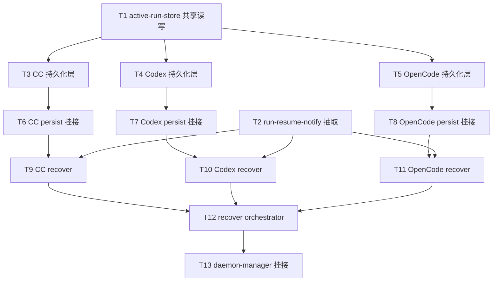

# 非Cursor引擎主进程续接 - 任务分解

> **来源**：`/kb-plan`（基于 `01-proposal.md`、`02-design.md`）
> **任务数**：13（T1–T13）

## 1、执行计划

### 1.1 依赖图

**CodeGraph 落点确认**（`projectPath=/home/suveng/doger/cursor-claw`）：

| 符号/文件 | 路径 | 任务 |
|-----------|------|------|
| `recoverSdkActiveRuns` | `electron/agent/cursor-sdk/sdk-run-recover.ts:40` | T12 纳入 orchestrator；逻辑不改 |
| `notifyResumeFailure` | 同上 L33 | T2 抽取至 shared |
| `persistActiveRunSnapshot` | `electron/agent/cursor-sdk/sdk-run-persist.ts:34` | T3–T5 对称模板 |
| `SdkActiveRunRecord` | `electron/agent/cursor-sdk/sdk-run-persistence.ts:7` | T3–T5 字段参照 |
| `initDaemonManager` | `electron/daemon/daemon-manager.ts:1219` | T13 改 recover 调用 |
| `enterGuardWithLifecycle` | `electron/agent/shared/agent-run-guard.ts:66` | T9–T11 recover 内调用 |
| `resume()` | `electron/agent/shared/run-lifecycle.ts:79` | T9–T11 续接前重置门控 |
| `startCcQuery` | `electron/agent/claude-code/agent-claude-sdk.ts:70` | T6 persist 挂接点 |
| `startCodexRun` | `electron/agent/codex/agent-codex-sdk.ts:103` | T7 persist 挂接点 |
| `startOpencodeRun` | `electron/agent/opencode/agent-opencode-sdk.ts:84` | T8 persist 挂接点 |
| `stopClaudeCodeSession` | `electron/agent/claude-code/agent-claude-sdk.ts:213` | T6 userStopped 挂接 |
| `stopCodexSession` | `electron/agent/codex/agent-codex-session-registry.ts:47` | T7 userStopped 挂接 |
| `stopOpencodeSession` | `electron/agent/opencode/agent-opencode-session-registry.ts:41` | T8 userStopped 挂接 |
| `buildQueryOptions` resume | `electron/agent/claude-code/cc-query-options.ts:34` | T9 CC 续接粒度 |
| `resolveCodexThread` | `electron/agent/codex/agent-codex-sdk.ts:88` | T10 `resumeThread` |
| `CC_SESSIONS` 等 | 各 `agent-*-session-registry.ts` | T9–T11 S4 双跑 skip |

**01 验收追溯**：

| 01 验收 | 主责任务 |
|---------|----------|
| 1 三引擎重启续接成功或明确失败 | T9–T13 |
| 2 成功无需手动重发 IM | T9–T11 |
| 3 失败仅通知一次 | T2、T9–T11 |
| 4 Cursor S7 无回归 | T2、T12、T13 |
| 5 四引擎终态 IM 符合 Port 契约 | T6–T8 不改 dispatch/complete 链 |

**02 §8.2 工程补充验收追溯**：

| 工程项 | 主责任务 |
|--------|----------|
| init 后四引擎 `[recover]` 汇总日志 | T12、T13 |
| recover 与 dispatch 并发 skip | T9–T11 |
| `userStopped=true` 不续接 | T3–T8、T9–T11 |
| `notifyResumeFailure` 一次 IM + `stop_progress` | T2、T9–T11 |
| persist 写盘失败仅 WARN | T1、T3–T8 |
| 单文件 ≤300 行 | 全任务 |

### 1.2 分组调度

| 轮次 | 并行任务 | 说明 |
|------|----------|------|
| **第一轮** | T1、T2 | 共享层无交叉写文件；T2 仅改 Cursor recover import |
| **第二轮** | T3、T4、T5 | 三引擎持久化层并行（均依赖 T1） |
| **第三轮** | T6、T7、T8 | 各引擎 launch/stream/stop 挂接（分目录无冲突） |
| **第四轮** | T9、T10、T11 | 三引擎 recover 并行（依赖 T2 + 各 persist 层 + 各挂接） |
| **第五轮** | T12 | orchestrator 聚合四 recover |
| **第六轮** | T13 | `daemon-manager` 单行调用替换 |

**同文件冲突清单（须串行）**：

| 文件 | 涉及任务（顺序） |
|------|------------------|
| `electron/agent/cursor-sdk/sdk-run-recover.ts` | T2（import 改 shared notify） |
| `electron/daemon/daemon-manager.ts` | T13 |

## 2、任务清单

## T1: 共享 active-run-store JSON 读写

### 背景

三引擎活跃 Run 快照需对称 Cursor `sdk-run-persistence.ts` 的 JSON 读写容错，但不宜复制四份。本任务抽取泛型 `active-run-store.ts`，供 T3–T5 各引擎 persistence 调用，满足 R4 数据层基础。

### 上下文文件

- CodeGraph: `readAllRecords writeAllRecords listRecoverableSdkRuns sdk-run-persistence` — Cursor 现网读写模式
- 必读: `electron/agent/cursor-sdk/sdk-run-persistence.ts` — 校验、读容错、写 WARN 语义
- 必读: `electron/agent/shared/AGENTS.md` — shared 模块边界
- 参考: `electron/agent/cursor-sdk/sdk-run-persist.ts` — 3s 节流在 persist 层而非 store

### 实现范围

- 新建: `electron/agent/shared/active-run-store.ts`
  - 泛型 `ActiveRunStore<T extends { sessionKey: string; userStopped?: boolean; updatedAt: number }>`
  - `readAll(filePath): Record<string, T>` — 缺失/损坏返回 `{}`
  - `upsert(filePath, record): void` — 写失败 `pushUiLog` WARN 不抛
  - `clear(filePath, sessionKey): void`
  - `listRecoverable(filePath, isValid): T[]` — 排除 `userStopped===true`
  - `markUserStopped(filePath, sessionKey, isValid): void`
  - 调用方传入 `userData` 下完整文件路径与 per-engine 校验函数

### 接口契约

- `export function readActiveRunRecords<T>(filePath: string, isValid: (v: unknown) => v is T): Record<string, T>`
- `export function upsertActiveRunRecord<T extends ActiveRunBase>(filePath: string, record: T): void`
- `export function clearActiveRunRecord(filePath: string, sessionKey: string): void`
- `export function listRecoverableActiveRuns<T>(filePath: string, isValid: (v: unknown) => v is T): T[]`
- `export function markActiveRunUserStopped<T>(filePath: string, sessionKey: string, isValid: (v: unknown) => v is T): void`

### 验收标准

- [ ] 读盘缺失/JSON 损坏/主键不一致记录返回空或过滤，不抛错阻断 init
- [ ] 写盘失败仅 WARN，不抛错（对齐 02 §8.2 persist WARN 项）
- [ ] `listRecoverable` 排除 `userStopped===true`（对齐 02 §8.2 userStopped 项）
- [ ] 单文件 ≤300 行
- [ ] 无 `02`/`03` 未要求的抽象层、trait/mixin 中间层或未批准的新依赖（Ponytail 口径）

### 依赖

- 前置任务: 无
- 后续任务: T3、T4、T5

---

## T2: run-resume-notify 抽取与 Cursor import 迁移

### 背景

R3 要求续接失败一次可感知 IM；现网 `notifyResumeFailure` 内联于 `sdk-run-recover.ts`。抽取至 shared 供四引擎 recover 共用，Cursor recover 仅改 import，行为零变更（验收 4）。

### 上下文文件

- CodeGraph: `notifyResumeFailure recoverSdkActiveRuns` — 文案与 notify 链
- 必读: `electron/agent/cursor-sdk/sdk-run-recover.ts` L27–37 — 现网 `notifyResumeFailure` 实现
- 必读: `electron/daemon/sdk-daemon-notify.ts` — `notifySessionChat` 契约
- 参考: `electron/agent/shared/run-notify.ts` — shared notify 模块风格

### 实现范围

- 新建: `electron/agent/shared/run-resume-notify.ts`
  - `export async function notifyResumeFailure(sessionKey: string, reason: string): Promise<void>`
  - 文案模式：`⚠️ 未能自动续接上次任务（{reason}），请重新发送消息继续。`
  - `notifySessionChat(..., { stop_progress: true })`
  - UI 日志前缀 `[recover]`
- 修改: `electron/agent/cursor-sdk/sdk-run-recover.ts`
  - 删除本地 `notifyResumeFailure` 与 `RESUME_FAIL_USER_HINT`
  - 改 import `../shared/run-resume-notify`
  - **不改** `recoverSdkActiveRuns` 业务逻辑

### 接口契约

- `export async function notifyResumeFailure(sessionKey: string, reason: string): Promise<void>`

### 验收标准

- [ ] Cursor recover 失败路径仍调用 shared `notifyResumeFailure`，IM 含 `stop_progress: true`（对齐 01 验收 3、4；02 §8.2 notify 项）
- [ ] 每条失败 session 仅一次 notify（recover 循环内 failed 分支单次调用）
- [ ] `recoverSdkActiveRuns` resumed/failed/skipped 计数与 skip 路径行为与改前一致（Cursor S7 无回归）
- [ ] 单文件 ≤300 行
- [ ] 无 `02`/`03` 未要求的抽象层、trait/mixin 中间层或未批准的新依赖（Ponytail 口径）

### 依赖

- 前置任务: 无
- 后续任务: T9、T10、T11

---

## T3: Claude Code 活跃 Run 持久化层

### 背景

CC 的 `ccSessionId` 仅存内存，主进程重启无法续接。本任务新增 `cc-run-persistence.ts`（Record 类型 + store 封装）与 `cc-run-persist.ts`（3s 节流写盘），对称 Cursor `sdk-run-persistence` / `sdk-run-persist`，对应设计 S3/S9。

### 上下文文件

- CodeGraph: `SdkActiveRunRecord persistActiveSdkRun ccSessionId CcSessionAgent` — 字段与 session 类型
- 必读: `electron/agent/cursor-sdk/sdk-run-persistence.ts` — 模板
- 必读: `electron/agent/cursor-sdk/sdk-run-persist.ts` — 节流模式
- 必读: `electron/agent/claude-code/agent-cc-types.ts` — `CcSessionAgent` 字段
- 必读: `electron/agent/shared/active-run-store.ts` — T1 产出（先读 diff）

### 实现范围

- 新建: `electron/agent/claude-code/cc-run-persistence.ts`
  - `CcActiveRunRecord`：`sessionKey`、`engine: "claude-code"`、公共字段 + `ccSessionId`、`model`、`baseUrl`、`lastTaskMessage`
  - 文件 `{userData}/cc-active-runs.json`
  - `persistCcActiveRun`、`clearCcActiveRun`、`listRecoverableCcRuns`、`markCcRunUserStopped`
- 新建: `electron/agent/claude-code/cc-run-persist.ts`
  - `persistCcActiveRunSnapshot(session, force?)` — 从 `CcSessionAgent` 构建 Record，3s 节流
  - `clearCcPersistThrottle(sessionKey)`

### 接口契约

- `export interface CcActiveRunRecord { ... }`
- `export function persistCcActiveRun(record: CcActiveRunRecord): void`
- `export function clearCcActiveRun(sessionKey: string): void`
- `export function listRecoverableCcRuns(): CcActiveRunRecord[]`
- `export function markCcRunUserStopped(sessionKey: string): void`
- `export function persistCcActiveRunSnapshot(session: CcSessionAgent, force?: boolean): void`

### 验收标准

- [ ] Record 含 `ccSessionId`、`lastTaskMessage` 等 02 §5 字段
- [ ] 写盘失败仅 WARN 不抛（02 §8.2）
- [ ] `listRecoverableCcRuns` 排除 `userStopped===true`
- [ ] 两文件各 ≤300 行
- [ ] 无 `02`/`03` 未要求的抽象层、trait/mixin 中间层或未批准的新依赖（Ponytail 口径）

### 依赖

- 前置任务: T1
- 后续任务: T6、T9

---

## T4: Codex 活跃 Run 持久化层

### 背景

Codex `codexSessionId` 重启丢失。本任务新增 Codex 版 persistence + persist，对称 T3，文件 `codex-active-runs.json`。

### 上下文文件

- CodeGraph: `CodexSessionAgent codexSessionId resolveCodexThread` — 续接键与 session 字段
- 必读: `electron/agent/codex/agent-codex-sdk.ts` — session 结构
- 必读: `electron/agent/claude-code/cc-run-persistence.ts` — T3 对称参照（先读 diff）
- 必读: `electron/agent/shared/active-run-store.ts`

### 实现范围

- 新建: `electron/agent/codex/codex-run-persistence.ts`
  - `CodexActiveRunRecord`：`engine: "codex"` + `codexSessionId`、`model`、`baseUrl`、`lastTaskMessage`
  - `{userData}/codex-active-runs.json`
- 新建: `electron/agent/codex/codex-run-persist.ts`
  - `persistCodexActiveRunSnapshot(session, force?)` + 节流

### 接口契约

- `export interface CodexActiveRunRecord { ... }`
- `export function persistCodexActiveRun(record: CodexActiveRunRecord): void`
- `export function clearCodexActiveRun(sessionKey: string): void`
- `export function listRecoverableCodexRuns(): CodexActiveRunRecord[]`
- `export function markCodexRunUserStopped(sessionKey: string): void`
- `export function persistCodexActiveRunSnapshot(session: CodexSessionAgent, force?: boolean): void`

### 验收标准

- [ ] 字段对齐 02 §5 Codex 扩展列
- [ ] 写盘失败仅 WARN；`userStopped` 过滤正确
- [ ] 两文件各 ≤300 行
- [ ] 无 `02`/`03` 未要求的抽象层、trait/mixin 中间层或未批准的新依赖（Ponytail 口径）

### 依赖

- 前置任务: T1
- 后续任务: T7、T10

---

## T5: OpenCode 活跃 Run 持久化层

### 背景

OpenCode `opencodeSessionId` 及 embedded server 连接参数重启丢失。本任务新增 OpenCode persistence + persist，文件 `opencode-active-runs.json`。

### 上下文文件

- CodeGraph: `OpencodeSessionAgent opencodeSessionId resolveOpencodeClient` — session 与 server 字段
- 必读: `electron/agent/opencode/agent-opencode-sdk.ts` — `buildSession`、`startOpencodeRun`
- 必读: `electron/agent/codex/codex-run-persistence.ts` — T4 对称参照
- 必读: `electron/agent/shared/active-run-store.ts`

### 实现范围

- 新建: `electron/agent/opencode/opencode-run-persistence.ts`
  - `OpencodeActiveRunRecord`：`engine: "opencode"` + `opencodeSessionId`、`providerId`、`model`、`deployMode`、`opencodeHostname`、`opencodePort`、`profileResourceId`、`lastTaskMessage`
- 新建: `electron/agent/opencode/opencode-run-persist.ts`
  - `persistOpencodeActiveRunSnapshot(session, force?)` + 节流

### 接口契约

- `export interface OpencodeActiveRunRecord { ... }`
- `export function persistOpencodeActiveRun(record: OpencodeActiveRunRecord): void`
- `export function clearOpencodeActiveRun(sessionKey: string): void`
- `export function listRecoverableOpencodeRuns(): OpencodeActiveRunRecord[]`
- `export function markOpencodeRunUserStopped(sessionKey: string): void`
- `export function persistOpencodeActiveRunSnapshot(session: OpencodeSessionAgent, force?: boolean): void`

### 验收标准

- [ ] 字段对齐 02 §5 OpenCode 扩展列（含 deployMode/hostname/port）
- [ ] 写盘失败仅 WARN；`userStopped` 过滤正确
- [ ] 两文件各 ≤300 行
- [ ] 无 `02`/`03` 未要求的抽象层、trait/mixin 中间层或未批准的新依赖（Ponytail 口径）

### 依赖

- 前置任务: T1
- 后续任务: T8、T11

---

## T6: Claude Code Run 启动/呈现/stop 持久化挂接

### 背景

持久化层就绪后，须在 Run 生命周期写盘：`startCcQuery` 启动、`flushStreamPost` 呈现游标变更、`stopClaudeCodeSession` 标记 userStopped（S9/S10）。不改 launch/dispatch 成功路径（R5）。

### 上下文文件

- CodeGraph: `startCcQuery flushStreamPost stopClaudeCodeSession persistActiveRunSnapshot` — 挂接点对照 Cursor
- 必读: `electron/agent/claude-code/agent-claude-sdk.ts` — `startCcQuery`、`launchClaudeCodeAgent`、`stopClaudeCodeSession`
- 必读: `electron/agent/claude-code/agent-cc-stream.ts` — `flushStreamPost` 呈现游标更新处
- 必读: `electron/agent/claude-code/cc-run-persist.ts` — T3 产出
- 必读: `electron/agent/cursor-sdk/sdk-run-lifecycle.ts` — Cursor `persistActiveRunSnapshot(..., true)` 于 start 时机

### 实现范围

- 修改: `electron/agent/claude-code/agent-claude-sdk.ts`
  - `startCcQuery` 或 launch 成功设 `runStartedAt` 后 `persistCcActiveRunSnapshot(session, true)`
  - `stopClaudeCodeSession` 开头或删 session 前 `markCcRunUserStopped(sessionKey)`（Map 仍有 record 时）
- 修改: `electron/agent/claude-code/agent-cc-stream.ts`
  - `flushStreamPost` 成功更新 `streamId`/`outboundMessageId` 后 `persistCcActiveRunSnapshot(session)`（节流）

### 接口契约

- 消费 T3 的 `persistCcActiveRunSnapshot`、`markCcRunUserStopped`；不新增对外 HTTP

### 验收标准

- [ ] Run 启动后 `cc-active-runs.json` 有对应 sessionKey 记录（含 `ccSessionId` 若已 init）
- [ ] 呈现游标变更触发节流写盘（3s 内不刷盘）
- [ ] 用户 stop 后记录 `userStopped=true`，重启 `listRecoverableCcRuns` 不含该条（02 §8.2）
- [ ] persist 失败不阻断 query/stream（02 §8.2 WARN）
- [ ] Port dispatch/complete 路径无行为变更（01 验收 5、R5）
- [ ] 改动文件各 ≤300 行
- [ ] 无 `02`/`03` 未要求的抽象层、trait/mixin 中间层或未批准的新依赖（Ponytail 口径）

### 依赖

- 前置任务: T3
- 后续任务: T9

---

## T7: Codex Run 启动/呈现/stop 持久化挂接

### 背景

对称 T6：在 `startCodexRun`/`launchCodexAgent` 与 stream 呈现 flush、`stopCodexSession` 挂接 Codex persist（S9/S10）。

### 上下文文件

- CodeGraph: `startCodexRun stopCodexSession streamCodexEvents` — Codex Run 链
- 必读: `electron/agent/codex/agent-codex-sdk.ts` — launch/start/stop 入口
- 必读: `electron/agent/codex/agent-codex-session-registry.ts` — `stopCodexSession`
- 必读: `electron/agent/codex/codex-run-persist.ts` — T4 产出
- 参考: T6 diff — 挂接模式对称

### 实现范围

- 修改: `electron/agent/codex/agent-codex-sdk.ts`
  - `startCodexRun` / launch 成功路径 `persistCodexActiveRunSnapshot(session, true)`
  - 保存 `lastTaskMessage`（prompt 参数）
- 修改: `electron/agent/codex/agent-codex-session-registry.ts`
  - `stopCodexSession` 内 `markCodexRunUserStopped(sessionKey)`
- 修改: `electron/agent/codex/agent-codex-stream.ts`（若呈现游标在此更新）
  - stream flush 后 `persistCodexActiveRunSnapshot(session)`；若游标仅在 sdk 文件更新则只改对应 1–2 文件，**本任务总改动文件 ≤3**

### 接口契约

- 消费 T4 导出函数；不新增对外 API

### 验收标准

- [ ] Run 启动写盘含 `codexSessionId`、`lastTaskMessage`
- [ ] stop 后 `userStopped=true` 不续接
- [ ] persist WARN 不阻断 runStreamed
- [ ] Port 六能力与 dispatch 成功路径无回归（01 验收 5）
- [ ] 单任务涉及文件 ≤3、各 ≤300 行
- [ ] 无 `02`/`03` 未要求的抽象层、trait/mixin 中间层或未批准的新依赖（Ponytail 口径）

### 依赖

- 前置任务: T4
- 后续任务: T10

---

## T8: OpenCode Run 启动/呈现/stop 持久化挂接

### 背景

对称 T6/T7：OpenCode `startOpencodeRun` 创建 session 后写盘，stop 标记 userStopped，呈现变更节流 persist。

### 上下文文件

- CodeGraph: `startOpencodeRun stopOpencodeSession streamOpencodeEvents` — OpenCode Run 链
- 必读: `electron/agent/opencode/agent-opencode-sdk.ts`
- 必读: `electron/agent/opencode/agent-opencode-session-registry.ts` — `stopOpencodeSession`
- 必读: `electron/agent/opencode/opencode-run-persist.ts` — T5 产出

### 实现范围

- 修改: `electron/agent/opencode/agent-opencode-sdk.ts`
  - `startOpencodeRun` 在 `opencodeSessionId` 赋值后 `persistOpencodeActiveRunSnapshot(session, true)`
  - 持久化 embedded server 参数（`deployMode`、`opencodeHostname`、`opencodePort` 等）
- 修改: `electron/agent/opencode/agent-opencode-session-registry.ts`
  - `stopOpencodeSession` 内 `markOpencodeRunUserStopped`
- 可选第三文件: `agent-opencode-stream.ts` — 呈现 flush 挂接（若需要）

### 接口契约

- 消费 T5 导出函数

### 验收标准

- [ ] 写盘含 OpenCode 扩展字段（02 §5）
- [ ] stop → userStopped；persist WARN 不阻断 prompt
- [ ] Port/dispatch 无回归（01 验收 5）
- [ ] 涉及文件 ≤3、各 ≤300 行
- [ ] 无 `02`/`03` 未要求的抽象层、trait/mixin 中间层或未批准的新依赖（Ponytail 口径）

### 依赖

- 前置任务: T5
- 后续任务: T11

---

## T9: Claude Code 主进程 recover

### 背景

实现 CC 版 `recoverCcActiveRuns`，骨架对称 `recoverSdkActiveRuns`：读盘 → S4 skip → R2 lifecycle.resume + enterGuardWithLifecycle → `buildQueryOptions({ resume: ccSessionId })` + `startCcQuery` → 失败 notify+clear（S6b/S7/S8）。

### 上下文文件

- CodeGraph: `recoverSdkActiveRuns CC_SESSIONS isClaudeCodeSessionRunning buildQueryOptions` — 基准与双跑检测
- 必读: `electron/agent/cursor-sdk/sdk-run-recover.ts` — 逐步骨架（L40–166）
- 必读: `electron/agent/claude-code/cc-run-persistence.ts`、`cc-run-recover.ts`（本任务新建）
- 必读: `electron/agent/claude-code/cc-query-options.ts` — `resume` 选项
- 必读: `electron/agent/claude-code/agent-claude-sdk.ts` — `startCcQuery`、session 重建
- 必读: `electron/agent/shared/run-lifecycle.ts`、`agent-run-guard.ts`
- 必读: `electron/agent/shared/run-resume-notify.ts` — T2 产出

### 实现范围

- 新建: `electron/agent/claude-code/cc-run-recover.ts`
  - `export async function recoverCcActiveRuns(): Promise<RecoverSummary>`
  - `listRecoverableCcRuns()` 遍历
  - skip：`isClaudeCodeSessionRunning(sessionKey) || CC_SESSIONS.has(sessionKey)` → `reason=session_exists`
  - guard `busy`/`stale_aborted` → skip 不 notify
  - 重建 `CcSessionAgent`（从 Record 恢复 apiKey/workspace/chatType 等）
  - `createRunLifecycle(session).resume()` → `enterGuardWithLifecycle`
  - 有 `lastTaskMessage` 则作为 prompt 调 `startCcQuery`；否则空串 + resume
  - 成功 `summary.resumed++`；失败 `notifyResumeFailure` + `clearCcActiveRun` + `summary.failed++`
  - 日志前缀 `[recover]`、`pushUiLog("CC", ...)`

### 接口契约

- `export async function recoverCcActiveRuns(): Promise<RecoverSummary>`
- `RecoverSummary` 复用 `electron/agent/cursor-sdk/sdk-session-types.ts` 或 shared 类型（与 Cursor 字段对称：`{ resumed, failed, skipped }`）

### 验收标准

- [ ] 主进程重启后 CC 活跃 Run 可续接或明确失败 IM（01 验收 1、2）
- [ ] 失败仅一次 notify + `stop_progress: true`（01 验收 3；02 §8.2）
- [ ] 与 dispatch 并发时内存已有 session → skipped `session_exists`，无重复 Run（02 §8.2）
- [ ] 续接前调用 `lifecycle.resume()`（R2）
- [ ] guard busy/stale skip 不 notify（与 Cursor S7 一致）
- [ ] 单文件 ≤300 行
- [ ] 无 `02`/`03` 未要求的抽象层、trait/mixin 中间层或未批准的新依赖（Ponytail 口径）

### 依赖

- 前置任务: T2、T3、T6
- 后续任务: T12

---

## T10: Codex 主进程 recover

### 背景

实现 `recoverCodexActiveRuns`：读盘 → skip → lifecycle/guard → `resolveCodexThread`/`resumeThread(codexSessionId)` + `startCodexRun(lastTaskMessage)`（S6c）。

### 上下文文件

- CodeGraph: `recoverSdkActiveRuns resolveCodexThread CODEX_SESSIONS isCodexSessionRunning` — 模板与续接 API
- 必读: `electron/agent/cursor-sdk/sdk-run-recover.ts`
- 必读: `electron/agent/codex/agent-codex-sdk.ts` — `resolveCodexThread`、`startCodexRun`、`buildCodexClient`
- 必读: `electron/agent/codex/codex-run-persistence.ts`
- 必读: `electron/agent/shared/run-resume-notify.ts`
- 参考: T9 diff — 骨架对称

### 实现范围

- 新建: `electron/agent/codex/codex-run-recover.ts`
  - `export async function recoverCodexActiveRuns(): Promise<RecoverSummary>`
  - skip：`isCodexSessionRunning || CODEX_SESSIONS.has`
  - 重建 session 含 `codexSessionId`、MCP/cli 路径按现网 launch 逻辑
  - 成功续跑 `startCodexRun`；失败 notify + clear

### 接口契约

- `export async function recoverCodexActiveRuns(): Promise<RecoverSummary>`

### 验收标准

- [ ] Codex 重启续接成功或明确失败（01 验收 1、2）
- [ ] 失败一次 IM；并发 skip；R2 lifecycle.resume
- [ ] 终态仍走现有 `completeCodexRun` Port 链（01 验收 5）
- [ ] 单文件 ≤300 行
- [ ] 无 `02`/`03` 未要求的抽象层、trait/mixin 中间层或未批准的新依赖（Ponytail 口径）

### 依赖

- 前置任务: T2、T4、T7
- 后续任务: T12

---

## T11: OpenCode 主进程 recover

### 背景

实现 `recoverOpencodeActiveRuns`：读盘 → skip → 重建 client/server（`resolveOpencodeClient`）→ `session.prompt` 续跑（S6d）。OpenCode session 冷启动有效性待实现验证（02 §8.1 风险）。

### 上下文文件

- CodeGraph: `recoverSdkActiveRuns startOpencodeRun resolveOpencodeClient OPENCODE_SESSIONS` — 续接与 registry
- 必读: `electron/agent/cursor-sdk/sdk-run-recover.ts`
- 必读: `electron/agent/opencode/agent-opencode-sdk.ts` — `startOpencodeRun`、`buildSession`
- 必读: `electron/agent/opencode/opencode-run-persistence.ts`
- 必读: `electron/agent/shared/run-resume-notify.ts`
- 参考: T9/T10 diff

### 实现范围

- 新建: `electron/agent/opencode/opencode-run-recover.ts`
  - `export async function recoverOpencodeActiveRuns(): Promise<RecoverSummary>`
  - skip：`isOpencodeSessionRunning || OPENCODE_SESSIONS.has`
  - 从 Record 恢复 provider/model/deployMode/hostname/port/profileResourceId
  - 探活：`opencodeSessionId` 无效则 failed + notify + clear
  - 有效则 `startOpencodeRun(session, lastTaskMessage, guardToken, opts)`

### 接口契约

- `export async function recoverOpencodeActiveRuns(): Promise<RecoverSummary>`

### 验收标准

- [ ] OpenCode 重启续接成功或明确失败（01 验收 1、2）
- [ ] session 失效时一次失败 IM + 清快照（不 silent fail）
- [ ] 失败/ skip/ guard 语义与 T9 对称
- [ ] Port 终态契约无回归（01 验收 5）
- [ ] 单文件 ≤300 行
- [ ] 无 `02`/`03` 未要求的抽象层、trait/mixin 中间层或未批准的新依赖（Ponytail 口径）

### 依赖

- 前置任务: T2、T5、T8
- 后续任务: T12

---

## T12: 四引擎 recover orchestrator

### 背景

设计 S2a：统一 `recoverAllActiveRuns` 顺序调用四引擎 recover，聚合 `RecoverAllSummary` 与 `[recover]` 汇总日志；Cursor 仍用现网 `recoverSdkActiveRuns`，逻辑不重构。

### 上下文文件

- CodeGraph: `recoverSdkActiveRuns initDaemonManager` — 现网挂接与 Cursor recover
- 必读: `electron/agent/cursor-sdk/sdk-run-recover.ts` — `recoverSdkActiveRuns` 导出
- 必读: T9/T10/T11 产出 — 三引擎 recover 入口
- 必读: `electron/daemon/daemon-manager.ts` L1219 — 现网 `void recoverSdkActiveRuns()` 模式

### 实现范围

- 新建: `electron/agent/shared/agent-run-recover-orchestrator.ts`
  - `export interface RecoverAllSummary { sdk: RecoverSummary; cc: RecoverSummary; codex: RecoverSummary; opencode: RecoverSummary }`
  - `export async function recoverAllActiveRuns(): Promise<RecoverAllSummary>`
  - 顺序：`recoverSdkActiveRuns` → `recoverCcActiveRuns` → `recoverCodexActiveRuns` → `recoverOpencodeActiveRuns`
  - 单引擎异常 catch，不阻断其余引擎
  - 汇总日志：`[recover] recoverAllActiveRuns 完成 sdk=... cc=... codex=... opencode=...`
- 可选: 各引擎 agent-sdk 或 recover 文件 re-export（便于 import 路径稳定）

### 接口契约

- `export async function recoverAllActiveRuns(): Promise<RecoverAllSummary>`

### 验收标准

- [ ] 四引擎均有 recover 调用，Cursor 行为与改前一致（01 验收 4）
- [ ] init 后日志含四引擎 `[recover]` 汇总行（02 §8.2）
- [ ] 单引擎 throw 不阻断 init 与其他引擎 recover
- [ ] 单文件 ≤300 行
- [ ] 无 `02`/`03` 未要求的抽象层、trait/mixin 中间层或未批准的新依赖（Ponytail 口径）

### 依赖

- 前置任务: T9、T10、T11
- 后续任务: T13

---

## T13: daemon-manager init 挂接 recoverAllActiveRuns

### 背景

设计 S2：将 `initDaemonManager` 内 `void recoverSdkActiveRuns()` 替换为 `void recoverAllActiveRuns()`，fire-and-forget 对称现网 L1219，完成 R1 三引擎 + Cursor 统一触发。

### 上下文文件

- CodeGraph: `initDaemonManager recoverSdkActiveRuns` — 唯一挂接点
- 必读: `electron/daemon/daemon-manager.ts` L1215–1225 — recover 调用块
- 必读: `electron/agent/shared/agent-run-recover-orchestrator.ts` — T12 产出
- 必读: `electron/daemon/AGENTS.md` — 不拆分 daemon-manager 约定

### 实现范围

- 修改: `electron/daemon/daemon-manager.ts`
  - import 改为 `recoverAllActiveRuns`（经 orchestrator 或 agent-sdk 聚合导出）
  - `void recoverAllActiveRuns().catch(...)` 替换 `recoverSdkActiveRuns`
  - catch 日志仍 WARN，不阻断 init
  - 移除仅 Cursor 的 import 若不再需要

### 接口契约

- init 侧仅调用 `recoverAllActiveRuns(): Promise<RecoverAllSummary>`

### 验收标准

- [ ] Electron 主进程重启后自动触发四引擎 recover（01 验收 1、R1）
- [ ] 日志可见 orchestrator 汇总（02 §8.2）
- [ ] Daemon 路由、file-queue、dispatch 成功路径无改动（R5、01 验收 5）
- [ ] Cursor S7 手工/对照：recover 行为无回归（01 验收 4）
- [ ] 改动最小（约一行调用 + import）
- [ ] 无 `02`/`03` 未要求的抽象层、trait/mixin 中间层或未批准的新依赖（Ponytail 口径）

### 依赖

- 前置任务: T12
- 后续任务: 无（实现完成后 `/kb-test` 或手工四引擎续接回归）
