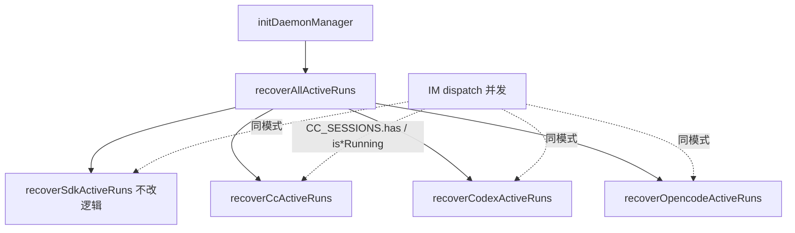

# 非Cursor引擎主进程续接 - 代码评审报告

## 1、审查范围

- **变更类型**: apply 产出的未提交变更（含 11 个新增 `??` 文件 + 24 个已跟踪文件 diff）
- **评审等级**: focused-review（跨四引擎主进程可靠性，无 proto/DB/权限契约变更）
- **涉及文件**: 35 个（manifest `files` 所列代码 + 本报告）
- **设计文档**: `02-design.md`（对照基准）
- **核对方式**: 全文阅读 orchestrator / 三引擎 `*-run-recover.ts` / 持久化层；`git diff` 抽样挂接点；CodeGraph MCP 本次索引未就绪（`recoverAllActiveRuns` 未命中），以源码直读替代

## 2、严重（必须处理）

无

## 3、警告（建议处理）

1. **Codex CLI 不可用时跳过全部待续接记录且不 IM 通知**
   - 位置: `electron/agent/codex/codex-run-recover.ts:72-76`
   - 说明: `checkCodexCliAvailable()` 失败时直接 `return {0,0,0}`，不遍历 `listRecoverableCodexRuns()`，违反 01 R3「失败一次可感知通知」在「有盘记录但 CLI 缺失」边角场景下的预期。CC/OpenCode 无对等早退。建议：仍遍历记录，对每条 `failed++` + `notifyResumeFailure(sessionKey, "Codex CLI 不可用")` + 保留或清除快照（与 Cursor 终态探测失败语义对齐）。

2. **三引擎 recover 同步计 `resumed`，异步 Run 失败无 recover 级 notify**
   - 位置: `cc-run-recover.ts:110-113`、`codex-run-recover.ts:118-121`、`opencode-run-recover.ts:173-176`
   - 说明: `startCcQuery` / `startCodexRun` / `startOpencodeRun` fire-and-forget 后立即 `summary.resumed++`；若后续 stream 失败，用户走常规 `complete*Run` 失败链而非 `notifyResumeFailure`。与 Cursor S7（`await startSdkRun` 后计 resumed）略有差异，但属 02 §8.1 已披露「各 SDK resume 语义待验证」范围；建议 archive 后手工验收「续接后秒级失败」是否 IM 可理解。

3. **Ponytail：`parseRecordChatType` 四份复制**
   - 位置: `sdk-run-recover.ts:25-28`、`cc-run-recover.ts:18-21`、`codex-run-recover.ts:23-26`、`opencode-run-recover.ts:29-32`
   - 说明: `shrink:` 可抽到 `agent-launcher` 或 shared 小函数（约 -12 行 ×3）。非阻断，与 Cursor 原实现一致。

4. **OpenCode recover 探活与 `startOpencodeRun` 重复 `resolveOpencodeClient`**
   - 位置: `opencode-run-recover.ts:109-116` vs `agent-opencode-sdk.ts` `startOpencodeRun`
   - 说明: `yagni:` 探活成功后可复用 client bundle 传入 session，减少冷启动双连；属性能/精简建议，不影响正确性。

## 4、设计偏差

1. **Codex recover CLI 门禁 vs 02 流程图 S6c**
   - 设计预期: 读盘 → skip/guard → 引擎续接 → 成功/失败 notify
   - 实际实现: CLI 不可用时不进入循环，盘记录滞留且无用户 IM
   - 影响: 低频边角（打包缺 optional 平台包、PATH 异常）；不满足 01 验收 3 的严格解读

2. **三引擎无 Cursor 式终态探测（`Agent.getRun`）**
   - 设计预期: 02 §8.1 已标注为已知风险「待实现时逐引擎验证」
   - 实际实现: 依赖各 SDK `resume` + 续跑；OpenCode 额外 `session.get` 探活（优于 CC/Codex）
   - 影响: 引擎侧已结束 Run 可能先计 resumed 再由 complete 链收尾；可接受，archive 后需手工四引擎各一条验收

其余分层（orchestrator 顺序、shared store/notify、daemon 单行替换、防双跑 skip 语义）与 `02-design.md` 一致。

## 5、验收标准检查

| 任务 | 验收条件 | 状态 |
|------|---------|------|
| T1 | 读盘容错、写盘 WARN、`userStopped` 过滤、≤300 行 | ✅ |
| T2 | shared `notifyResumeFailure`、Cursor import 迁移、行为不变 | ✅ |
| T3 | CC Record 字段、`cc-active-runs.json`、≤300 行 | ✅ |
| T4 | Codex Record 对称 T3 | ✅ |
| T5 | OpenCode 扩展字段含 deploy/hostname/port | ✅ |
| T6 | launch/stream/stop 挂接、终态 `clearCcActiveRun` | ✅ |
| T7 | Codex launch/stream/stop 挂接、终态 clear | ✅ |
| T8 | OpenCode launch/stream/stop 挂接、终态 clear | ✅ |
| T9 | CC recover：skip/guard/resume/notify/clear、≤300 行 | ✅ |
| T10 | Codex recover 骨架对称（CLI 早退见 §3 警告） | ⚠️ |
| T11 | OpenCode 探活 + recover 对称 | ✅ |
| T12 | 四引擎顺序 recover、单引擎 catch、汇总日志 | ✅ |
| T13 | `initDaemonManager` → `recoverAllActiveRuns` fire-and-forget | ✅ |
| 01-1 | 三引擎重启续接成功或明确失败 | ⚠️ 需手工/kb-test |
| 01-2 | 成功无需手动重发 IM | ✅ 代码路径未改 dispatch/launch notify |
| 01-3 | 失败仅通知一次 | ✅ recover 循环内单次 `notifyResumeFailure` |
| 01-4 | Cursor S7 无回归 | ✅ `recoverSdkActiveRuns` 逻辑未改，仅 notify import |
| 01-5 | Port 六能力/dispatch 成功路径不变 | ✅ handler 注册与 dispatch 体无行为 diff |
| 02§8.2 | 四引擎 `[recover]` 汇总日志 | ✅ orchestrator L58-62 |
| 02§8.2 | recover∥dispatch `session_exists` skip | ✅ 三引擎 + Cursor 同模式 |
| 02§8.2 | `userStopped` 不续接 | ✅ `listRecoverable*` 过滤 |
| 02§8.2 | 单文件 ≤300 行 | ✅ 最大 `opencode-run-recover.ts` 194 行 |

## 6、调用链与回归风险

| 风险点 | 等级 | 说明 |
|--------|------|------|
| Cursor S7 回归 | 低 | 仅 `notifyResumeFailure` import 迁至 shared（`sdk-daemon-notify` 已 re-export `run-notify`，语义一致） |
| recover 与 dispatch 双跑 | 低 | 内存 registry + `is*SessionRunning` skip，对称 S7 L47-50 |
| 盘快照泄漏 | 低 | 终态 `complete*Run` + recover 失败 `clear*` + stop `userStopped` 三角覆盖 |
| 四引擎 init 阻塞 | 低 | orchestrator 单引擎 try/catch；daemon catch 不阻断 init |
| OpenCode embedded 冷启动 | 中 | `probeOpencodeRecoverTarget` 已探活；仍建议手工 embedded 模式重启验收 |
| CC/Codex 无终态探测 | 中 | 02 已知限制；依赖 SDK resume 语义 |

## 7、遗留债务

- 三引擎 recover **手工/kb-test 四引擎各一条**尚未在本评审中执行（代码结构就绪，运行时行为待 archive 前或后补测）。
- Codex CLI 不可用早退（§3-1）可作为 `accepted_debt` 或下一迭代 `T-FIX` 处理；**不阻断**本次 archive（边角场景、有 WARN 日志）。

## 8、修复任务建议

| 问题 ID | 建议动作 | 关联任务 |
|---------|----------|----------|
| — | 无 open 阻断项；可选 `T-FIX-01`：Codex CLI 不可用时遍历失败 notify | T10 |

## 9、结论

**通过**，可进入 `/kb-archive`。

实现与 `02-design.md` / `03-tasks.md` 主路径对齐：`recoverAllActiveRuns` 编排、三引擎持久化/挂接/终态 clear、R2 `lifecycle.resume`、R3 单次 `notifyResumeFailure`、R5 dispatch 未改、防双跑 skip 对称 Cursor S7。无评分 ≥75 的阻断缺陷；§3 警告与 Codex CLI 边角建议在 archive 后手工验收或可选小修跟进。
