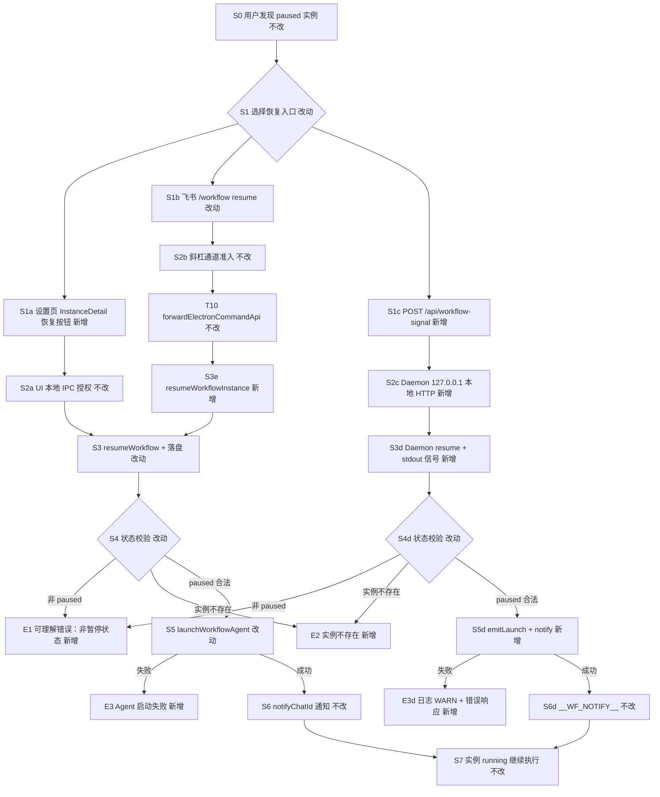
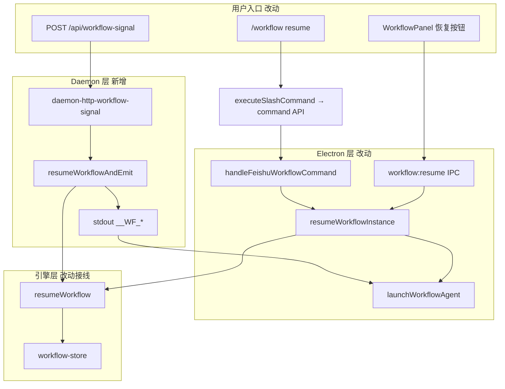

# 工作流恢复入口与信号接口 - 实现设计

> **业务 PRD**：见同目录 `01-proposal.md`（验收标准以 01 为准）
> **业务流程口径**：01 未单列「§业务流程」；本设计以 `01` §四场景、§五 R1～R5、§六验收 1～5 为业务流节点清单。

## 1、业务流程与改动范围

> 业务口径以 `01-proposal.md` §四 / §五 / §六 为准；下图覆盖 paused 恢复主路径与关键失败分支。

### 1.1 业务流程图

**图例**：`不改` 行为与现网一致；`改动` 需改代码/接线；`新增` 新节点或新分支；`删除` 本变更无删除路径。

### 1.2 流程步骤与改动对照

| 步骤 ID | 业务含义 | 改动 | 落点（模块/文件） | 01 验收关联 |
|---------|----------|------|-------------------|-------------|
| S0 | 用户发现 paused 实例（设置页实例 Tab、`/workflow status`、外部系统） | 不改 | `src/renderer/components/WorkflowPanel.tsx`；`electron/scheduling/command-handler.ts` `handleFeishuWorkflowCommand` | 验收 1 前置 |
| S1a | 设置页实例详情点击「恢复」 | 新增 | `WorkflowPanel.tsx` `InstanceDetail`；`electron/preload.ts`；`electron/daemon/daemon-manager.ts` `workflow:resume` IPC | R1；验收 1 |
| S1b | 飞书 `/workflow resume <实例ID\|序号>` | 新增 | `electron/scheduling/command-handler.ts` `handleFeishuWorkflowCommand`；`WORKFLOW_SUBCMD_HELP`；`src/shared/feishu-help-text.ts`；`src/daemon/daemon.ts` `COMMANDS` 描述 | R2；验收 1 |
| S1c | 外部系统 POST 工作流信号 | 新增 | `src/daemon/daemon-http-workflow-signal.ts`（新）；`src/daemon/daemon-http-routes.ts` 或 `daemon-http-admin-content.ts` 注册 | R3；验收 3 |
| S2a | UI 本地用户操作（Electron 已登录） | 不改 | `electron/daemon/daemon-manager.ts` IPC 注册惯例 | R5 |
| S2b | 斜杠通道准入（群聊 @ / 私聊绑定） | 不改 | `src/daemon/daemon.ts` `handleCommand` → `executeSlashCommand` | R5；验收 2 |
| S2c | HTTP 仅本机 `127.0.0.1`（与 `/api/mcp` 同信任域） | 新增 | `src/daemon/daemon-http-server.ts`（监听不变）；新路由 handler | R5；验收 2 |
| T10 | `/workflow` 经 Daemon SSOT 转发 Electron | 不改 | `src/daemon/daemon-slash-executor.ts` → `forwardElectronCommandApi`；`electron/scheduling/command-executor.ts` | 依赖 T10；禁止 `.fcmd` 独路径 |
| S3 | 引擎 `resumeWorkflow` 将 paused→running 并组装 Prompt | 改动（接线） | `src/workflow/workflow-engine.ts` `resumeWorkflow`（逻辑已有） | R4；验收 1 |
| S3e | Electron 侧恢复 + Agent 启动（对齐 `runWorkflowDefinition`） | 新增 | `electron/workflow/workflow-runner.ts` `resumeWorkflowInstance` | R4；验收 1 |
| S3d | Daemon 侧恢复 + stdout 信号（对齐 MCP `run`） | 新增 | `src/workflow/server-workflow.ts` 抽取 `resumeWorkflowAndEmit`；新 HTTP handler 调用 | R3/R4；验收 3 |
| S4 | 非 paused / 实例不存在 / 无当前节点 | 新增（错误文案） | `workflow-engine.ts` `resumeWorkflow` 既有 message；runner/HTTP 透传 | 验收 4 |
| S5 | 成功后 `launchWorkflowAgent` | 改动（恢复路径复用） | `electron/session/session-dispatcher-launch.ts` `launchWorkflowAgent`；`workflow-runner.ts` | 验收 1 |
| S5d | Daemon 路径 `__WF_LAUNCH__` / `__WF_INSTANCE__` | 新增 | `server-workflow.ts` `emitLaunch`/`emitInstanceUpdate`；`electron/daemon/daemon-manager.ts` stdout 解析（已有） | 验收 3 |
| S6 | 成功通知 `notifyChatId` | 不改 | `electron/workflow/workflow-runner.ts` `notifyWorkflowChat`；`server-workflow.ts` `emitNotify` | 01 §四场景 |
| S7 | Agent 继续当前节点执行 | 不改 | `workflow-engine.ts` `buildStartPrompt`；Agent MCP `workflow_next` 链 | 验收 5（队列无回归） |
| E1 | 对 running/completed/failed 恢复 | 新增 | 各入口统一透传 `工作流非暂停状态` | 验收 4 |
| E2 | 实例 ID 无效 | 新增 | 同上 `实例不存在` | 验收 4 |
| E3 | Agent 启动失败 | 新增 | `workflow-runner.ts` / HTTP handler 返回可读错误；实例保持 `running`（与 `run` 一致） | 01 §四「失败可感知」 |
| B-T10-fail | Electron 未就绪时斜杠 resume | 不改 | `daemon-slash-executor.ts` `formatElectronUnavailableMessage` | R5；与现网 `/workflow run` 一致 |

### 1.3 改动汇总

- **新增**：
  - `electron/workflow/workflow-runner.ts` `resumeWorkflowInstance(instanceId)` — Electron 侧恢复 SSOT（UI + 斜杠共用）。
  - `src/workflow/server-workflow.ts` `resumeWorkflowAndEmit(instanceId)` — Daemon 侧恢复 SSOT（HTTP + 可选 MCP `resume` action）。
  - `src/daemon/daemon-http-workflow-signal.ts` — `POST /api/workflow-signal` 路由处理。
  - `WorkflowPanel.tsx` `InstanceDetail`「恢复」按钮；IPC `workflow:resume`（`preload.ts`、`env.d.ts`、`daemon-manager.ts`）。
  - `/workflow resume` 子命令与 help 文案。
- **改动**：
  - `handleFeishuWorkflowCommand` 增加 `resume` 分支，调用 `resumeWorkflowInstance`。
  - `daemon-http-routes.ts`（或 admin 路由表）注册 `/api/workflow-signal`。
  - `feishu-help-text.ts`、`daemon.ts` `COMMANDS` 补 resume 说明。
- **删除**：无。
- **不改（显式列出）**：
  - 工作流引擎状态机、`handleNext`/`handleReject`、分支 Gateway、定义 CRUD UI、消息队列语义。
  - `executeSlashCommand` 主路径与 `SLASH_EXEC_MODE` 三态（T10 已归档）。
  - 变更 `20260712113356-Agent标识跨重启持久化` 全部范围。
  - `recoverStaleInstances` 自动 paused 逻辑（仅产品入口恢复，不改编恢复触发条件）。

## 2、整体思路

**根因**（见 01 §一；CodeGraph 核实）：`resumeWorkflow` 已在 `workflow-engine.ts:402` 实现 paused→running + `buildStartPrompt`，但**无任何产品入口调用**；`handleFeishuWorkflowCommand`（`command-handler.ts:594`）仅 ls/info/run/status/delete；`WorkflowPanel` `InstanceDetail`（`:279`）无恢复按钮；知识库记载的 `POST /api/workflow-signal` 路由未实现（`01-概览.md` §九）。

**方案要点**（追溯 01 R1～R5）：

1. **双端 SSOT、语义统一（R4）**：Electron 路径（UI/斜杠）共用 `resumeWorkflowInstance`；Daemon 路径（HTTP）共用 `resumeWorkflowAndEmit`（与 MCP `run` 的 stdout 信号模式一致）。两函数均调用同一引擎 `resumeWorkflow`，错误文案与 `runWorkflowDefinition` 风格对齐。
2. **斜杠走 T10 主路径（R2）**：`/workflow resume` **不得**单独写 `.fcmd` 或绕过 `executeSlashCommand`；由 `forwardElectronCommandApi` → `POST /api/command/execute` → `executeFileCommand` → `handleFeishuWorkflowCommand`（归档变更 `20260712113307` 已落地）。
3. **HTTP 信号（R3）**：在 Daemon 注册 `POST /api/workflow-signal`，action=`resume`；本机 `127.0.0.1` 信任域与 `/api/mcp` 一致，供外部集成注入继续信号。
4. **授权（R5）**：斜杠沿用通道准入（`Agent调度/04-远程指令` §三「全员」+ 入站门控）；UI 为本地 Electron 用户；HTTP 为 loopback，不新增 token（与现网 admin HTTP 一致）。
5. **幂等**：二次 resume 因状态已 `running` 返回「工作流非暂停状态」——与引擎校验一致，无需额外锁。

**最小方案三问（Ponytail）**：

1. **能否复用现有模块/符号？** 能。复用 `resumeWorkflow`、`launchWorkflowAgent`、`runWorkflowDefinition` 模式、`server-workflow.ts` 的 `emitLaunch`/`emitNotify`/`emitInstanceUpdate`、`daemon-slash-executor` 的 Electron 转发链；**不**新建工作流引擎或状态机层。
2. **拟新增抽象/依赖是否被 01 要求？** 仅 `resumeWorkflowInstance` + `resumeWorkflowAndEmit` 两个薄函数 + 一个 HTTP 路由文件（均 ≤300 行）；不引入 Gateway、队列中间件、新 npm 包；MCP `manage_workflows` 增 `resume` action 为**可选**（R4 对齐，非 01 硬性验收，implement 阶段可 inline 仅 HTTP 调用 `resumeWorkflowAndEmit`）。
3. **能否合并到已有文件？** 能。HTTP 路由独立文件是为遵守 daemon 单文件 ≤300 行；`WorkflowPanel.tsx` 已超限（~511 行），implement 时若再加 UI 逻辑须将 `InstanceDetail` 拆至 `WorkflowInstanceDetail.tsx`，本设计仅增恢复按钮与 handler 调用。

## 3、分层设计

- **端点层**：`POST /api/workflow-signal`（Daemon，新增）；`workflow:resume` IPC（Electron，新增）；`/workflow resume`（斜杠，新增）；**禁止**新增 Electron 独占 HTTP 路径或复用已废弃 `.fcmd` 主路径。
- **服务层**：`resumeWorkflowInstance`（Electron SSOT）；`resumeWorkflowAndEmit`（Daemon SSOT）；引擎层不感知入口差异。
- **数据层**：无表/字段变更；仅实例 JSON `status` paused→running（既有字段）。

## 4、接口设计

### 4.1 斜杠（R2）

| 子命令 | 用法 | 成功响应 | 失败响应 |
|--------|------|----------|----------|
| resume | `/workflow resume <实例ID\|序号>` | `✅ 工作流已恢复，继续节点: {nodeName}\n实例 ID: {id}` | `❌ 工作流非暂停状态` / `❌ 实例不存在` / `❌ Agent 启动失败: …` |

`WORKFLOW_SUBCMD_HELP` 与 `feishu-help-text.ts`、`daemon.ts` `COMMANDS["/workflow"]` 同步补充 resume 行。

### 4.2 IPC（R1）

| Channel | 入参 | 出参 |
|---------|------|------|
| `workflow:resume` | `instanceId: string` | `{ ok: boolean; error?: string; instanceId?: string }` |

行为与 `workflow:run` 对称（`daemon-manager.ts:1555` 模式）。

### 4.3 HTTP 工作流信号（R3）

| 方法 | 路径 | 请求体 | 响应 |
|------|------|--------|------|
| POST | `/api/workflow-signal` | `{ "action": "resume", "instanceId": string }` | `{ "ok": true, "message": string, "instanceId": string }` |

| HTTP 状态 | 条件 | body.error 示例 |
|-----------|------|-----------------|
| 400 | action 非 resume / 缺 instanceId | `invalid action` / `instanceId required` |
| 404 | 实例不存在 | `实例不存在` |
| 409 | status ≠ paused | `工作流非暂停状态` |
| 503 | `__WF_LAUNCH__` 后 Electron 未消费（可选宽松：仍 200 + message 提示检查 Agent） | （implement 取与 MCP run 一致策略） |
| 200 | 成功 | 含 `message` 中文摘要 |

**契约对齐说明**：知识库 `01-概览.md` §九记载路径为 `/api/workflow-signal`；本变更以该路径为 SSOT。仅实现 `action=resume`；不扩展 Gateway 式分支信号。

### 4.4 MCP（可选，R4 对齐）

| 工具 | 新增 action | 说明 |
|------|-------------|------|
| `manage_workflows` | `resume` | 参数 `id`=实例 ID；内部调 `resumeWorkflowAndEmit` |

非 01 硬性验收项；若 `server-workflow.ts` 行数逼近 300，可推迟至 follow-up。

## 5、数据结构

无表/字段/持久化模型变更。

**进程内**：复用既有 `WorkflowInstance.status`、`currentNodeId`、`notifyChatId`；`resumeWorkflow` 仅更新 `status` 与 `updatedAt`。

## 6、实现步骤

1. **S3e**：在 `workflow-runner.ts` 实现 `resumeWorkflowInstance`（对照 `runWorkflowDefinition:9-57`，将 `startWorkflow` 换为 `resumeWorkflow`）。（步骤 S3、S5、S6）
2. **S1b**：`handleFeishuWorkflowCommand` 增加 `resume` 分支 + help 文案；`feishu-help-text.ts`、`COMMANDS` 同步。（步骤 S1b、T10）
3. **S1a**：`workflow:resume` IPC + `preload`/`env.d.ts`；`InstanceDetail` 在 `status===paused` 时展示「恢复」按钮。（步骤 S1a）
4. **S3d**：`server-workflow.ts` 抽取 `resumeWorkflowAndEmit`（复用 `emitLaunch`/`emitNotify`/`emitInstanceUpdate`）。（步骤 S3d、S5d、S6d）
5. **S1c**：新建 `daemon-http-workflow-signal.ts`，注册 `POST /api/workflow-signal`。（步骤 S1c、S2c）
6. **验收联调**：paused 实例分别经 UI、斜杠、HTTP 恢复；对 running 实例三入口均返回 E1；确认无 `.fcmd` 绕路。（步骤 E1～E3、01 验收 1～5）

## 7、参考实现

CodeGraph（`projectPath=/home/suveng/doger/cursor-claw`）命中摘要：

| 符号 | 路径 | 与本变更关系 |
|------|------|----------------|
| `resumeWorkflow` | `src/workflow/workflow-engine.ts:402` | **引擎 SSOT**；paused 校验 + Prompt 组装 |
| `recoverStaleInstances` | `src/workflow/workflow-engine.ts:388` | **不改**；自动 paused 来源 |
| `runWorkflowDefinition` | `electron/workflow/workflow-runner.ts:9` | **模板**；implement 对称写 `resumeWorkflowInstance` |
| `handleFeishuWorkflowCommand` | `electron/scheduling/command-handler.ts:594` | **主改点**；增 resume 子命令 |
| `executeFileCommand` | `electron/scheduling/command-executor.ts:97` | `/workflow` 路由（`:169`） |
| `executeSlashCommand` | `src/daemon/daemon-slash-executor.ts:95` | T10 斜杠 SSOT；`/workflow` 走 electron 分支 |
| `forwardElectronCommandApi` | `src/daemon/daemon-orchestrator.ts` | T10 转发模式参照 |
| `launchWorkflowAgent` | `electron/session/session-dispatcher-launch.ts:133` | 恢复后 Agent 启动 |
| `registerWorkflowAdminTools` | `src/workflow/server-workflow.ts:125` | Daemon MCP；可选增 resume |
| `emitLaunch` / `emitNotify` | `src/workflow/server-workflow.ts:27-44` | HTTP 路径 stdout 信号 |
| `WorkflowPanel` `InstanceDetail` | `src/renderer/components/WorkflowPanel.tsx:279` | UI 恢复按钮落点 |
| `workflow:run` IPC | `electron/daemon/daemon-manager.ts:1555` | IPC 注册模式参照 |
| `createAdminApiHandler` | `src/daemon/daemon-http-routes.ts:14` | HTTP 路由注册入口 |
| `__WF_LAUNCH__` 解析 | `electron/daemon/daemon-manager.ts:649` | Daemon stdout → Agent 启动（已有） |

## 8、技术影响

### 8.1 影响范围

- **涉及模块**：`src/workflow/workflow-engine.ts`（仅接线）、`server-workflow.ts`、`electron/workflow/workflow-runner.ts`、`electron/scheduling/command-handler.ts`、`src/renderer/components/WorkflowPanel.tsx`（或拆分出的 InstanceDetail 组件）、`electron/daemon/daemon-manager.ts`、`electron/preload.ts`、`src/daemon/daemon-http-workflow-signal.ts`（新）、`src/daemon/daemon-http-routes.ts`、`src/shared/feishu-help-text.ts`、`src/daemon/daemon.ts`。
- **接口/proto 变更**：新增 `POST /api/workflow-signal`；新增 IPC `workflow:resume`；斜杠 help 文案；无 proto。
- **数据变更**：无。
- **风险**：
  - **T10 路径混用**：若 implement 为 resume 单独写 `.fcmd` 或 Daemon 本地直调 Electron 文件 API，将与归档变更冲突；**必须**走 `executeSlashCommand` → `command/execute`。
  - **双端存储路径**：Daemon `APP_DATA_DIR/workflows` 与 Electron `userData/workflows` 须已同步（现网 run 已依赖）；resume 不引入新不一致。
  - **WorkflowPanel 行数**：已超 300 行，implement 须拆分组件。
  - **HTTP 无鉴权**：loopback 与现网 `/api/mcp` 同信任模型；暴露端口非 127.0.0.1 时为环境风险（非本变更引入）。

### 8.2 工程补充验收项

- [ ] paused 实例经设置页「恢复」后 `status=running` 且 Agent 收到当前节点 Prompt（验收 1）。
- [ ] `/workflow resume <id>` 在 `SLASH_EXEC_MODE=daemon` 且 Electron 运行时可恢复；Electron 退出时返回「应用未运行」类文案（T10 + 验收 1/4）。
- [ ] `POST /api/workflow-signal` body `{action:"resume",instanceId}` 对合法 paused 返回 `ok:true` 且 stdout 出现 `__WF_LAUNCH__`（验收 3）。
- [ ] 对 `running`/`completed` 实例三入口均返回「工作流非暂停状态」类可读错误（验收 4）。
- [ ] 恢复成功后 `notifyChatId` 收到通知（01 §四）。
- [ ] 消息队列 `.qmsg`/orchestrator 无行为变化（验收 5）。
- [ ] 新文件 ≤300 行；`WorkflowPanel` 拆分后各文件 ≤300 行。
- [ ] 日志含可检索字段 `workflow_resume`（instance_id、source=ui\|slash\|http、ok）。

## 9、知识库影响

- `knowledge/业务域/工作流/04-触发与管理入口.md` — 高；补 resume 入口（UI/斜杠/HTTP）、子命令表、IPC。
- `knowledge/业务域/工作流/01-概览.md` — 高；§九 关闭「无 UI/指令恢复」「HTTP 未实现」限制。
- `knowledge/业务域/工作流/03-节点执行与流转.md` — 中；§九 resume 产品入口说明。
- `knowledge/工程平台/Daemon守护进程/02-HTTP与MCP服务.md` — 中；§五 接口表增 `/api/workflow-signal`。
- `knowledge/业务域/Agent调度/04-远程指令.md` — 低；`/workflow` 子命令表增 resume（若与现网表冲突则合并）。
- 两级索引：一般无需改 `知识索引.md`。

## 10、知识库更新计划

### 10.1 必须更新

- `knowledge/业务域/工作流/04-触发与管理入口.md` — §四/§五：`/workflow resume`、设置页恢复、IPC `workflow:resume`。
- `knowledge/业务域/工作流/01-概览.md` — §三 状态机入口标注；§九 移除 HTTP/入口缺失限制。
- `knowledge/工程平台/Daemon守护进程/02-HTTP与MCP服务.md` — §五 增 `POST /api/workflow-signal`。

### 10.2 可能更新（视实现结果）

- `knowledge/业务域/工作流/03-节点执行与流转.md` — §九 resume 入口一句。
- `knowledge/业务域/Agent调度/04-远程指令.md` — `/workflow` 子命令表。
- `src/workflow/AGENTS.md` — `resumeWorkflowAndEmit` 模块边界（代码侧，KB 可引用）。

### 10.3 不需要更新

- `knowledge/业务域/消息桥接/**` — 无通道语义变更。
- `knowledge/工程平台/Electron桌面应用/**` — 无结构性 IPC 分区变更（仅多一个 workflow channel）。
- `knowledge/变更/进行中/20260712113356-Agent标识跨重启持久化/**` — 独立变更，不混入。
- T10 归档目录 — 已归档，本变更仅**依赖**其斜杠路径，不回写。
