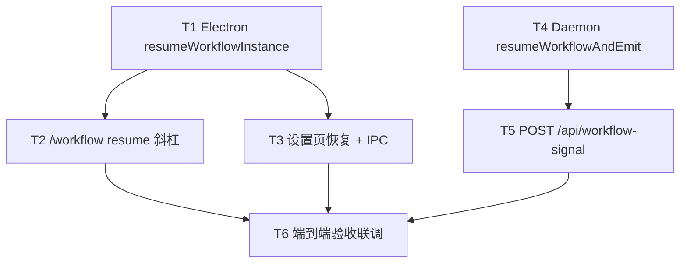

# 工作流恢复入口与信号接口 - 任务分解

> **来源**：`/kb-plan`（基于 `01-proposal.md`、`02-design.md`）
> **任务数**：6（T1–T6）
> **T10 划界**：`/workflow resume` **必须**经 `executeSlashCommand` → `forwardElectronCommandApi` → `POST /api/command/execute` → `executeFileCommand` → `handleFeishuWorkflowCommand`（归档变更 `20260712113307`）；**禁止** `.fcmd` 独路径或 Daemon 本地直调 Electron 文件 API。

## 1、执行计划

### 1.1 依赖图

**CodeGraph 文件依赖边**（`projectPath=/home/suveng/doger/cursor-claw`）：

| 源符号/文件 | 依赖/波及 | 任务 |
|-------------|-----------|------|
| `resumeWorkflow` | `src/workflow/workflow-engine.ts:402` — 引擎 SSOT，三入口共用 | T1、T4 |
| `runWorkflowDefinition` | `electron/workflow/workflow-runner.ts:9` — T1 对称模板 | T1 |
| `handleFeishuWorkflowCommand` | `electron/scheduling/command-handler.ts:594` — 增 `resume` 分支 | T2 |
| `executeFileCommand` / `executeSlashCommand` | T10 斜杠主链；`/workflow` 走 electron 分支 | T2（验收） |
| `emitLaunch` / `emitNotify` / `emitInstanceUpdate` | `src/workflow/server-workflow.ts:27-48` — Daemon stdout 信号 | T4、T5 |
| `manage_workflows` action=run | `server-workflow.ts:191` — T4 对称模板 | T4 |
| `workflow:run` IPC | `electron/daemon/daemon-manager.ts:1555` — T3 对称模板 | T3 |
| `InstanceDetail` | `src/renderer/components/WorkflowPanel.tsx:279` — 恢复按钮落点（须拆分） | T3 |
| `createAdminApiHandler` | `src/daemon/daemon-http-routes.ts:14` — 注册新路由 | T5 |
| `__WF_LAUNCH__` 解析 | `electron/daemon/daemon-manager.ts:649` — 已有，HTTP 路径复用 | T5（验收） |

**01 验收追溯**：

| 01 验收 | 主责任务 |
|---------|----------|
| 1 paused 实例经产品入口恢复并继续执行 | T1、T2、T3、T5、T6 |
| 2 授权下 resume 可用，未授权拒绝 | T2（斜杠通道准入）、T3（本地 Electron 用户）、T5（127.0.0.1 loopback） |
| 3 HTTP 信号对合法 paused 实例可恢复 | T4、T5、T6 |
| 4 非 paused 恢复返回可理解错误 | T1–T5（透传引擎文案）、T6 |
| 5 无分支 Gateway；队列无回归 | 全任务禁止改 orchestrator/queue；T6 回归 |

**02 §六步骤对齐**：T1→步骤 1；T2→步骤 2；T3→步骤 3；T4→步骤 4；T5→步骤 5；T6→步骤 6。

### 1.2 分组调度

| 轮次 | 并行任务 | 说明 |
|------|----------|------|
| **第一轮** | T1、T4 | 双端 SSOT 薄函数，无共享写文件；均仅调用既有 `resumeWorkflow` |
| **第二轮** | T2、T3、T5 | T2/T3 依赖 T1；T5 依赖 T4；三任务文件簇无交集 |
| **第三轮** | T6 | 依赖 T2、T3、T5 全部落地；手工/静态验收 |

**同文件冲突清单（须串行）**：

| 文件 | 涉及任务（顺序） |
|------|------------------|
| `electron/workflow/workflow-runner.ts` | T1 |
| `electron/scheduling/command-handler.ts` | T2 |
| `src/renderer/components/WorkflowPanel.tsx` + 拆分出的 `WorkflowInstanceDetail.tsx` | T3 |
| `electron/preload.ts`、`src/renderer/env.d.ts`、`electron/daemon/daemon-manager.ts` | T3（同任务内按 IPC 三端同步顺序改） |
| `src/workflow/server-workflow.ts` | T4 |
| `src/daemon/daemon-http-workflow-signal.ts`（新建）、`src/daemon/daemon-http-routes.ts` | T5 |

## 2、任务清单

## T1: Electron 侧 resumeWorkflowInstance SSOT

### 背景

引擎 `resumeWorkflow` 已实现 paused→running + Prompt 组装，但 Electron 路径（UI、斜杠）缺少与 `runWorkflowDefinition` 对称的薄封装。本任务在 `workflow-runner.ts` 新增 `resumeWorkflowInstance`，供 T2 斜杠与 T3 UI/IPC 共用，对齐设计 S3e/S5/S6。

### 上下文文件

- CodeGraph: `runWorkflowDefinition` `resumeWorkflow` `launchWorkflowAgent` — 对称实现与 Agent 启动链
- 必读: `electron/workflow/workflow-runner.ts` — `runWorkflowDefinition:9-57` 模板
- 必读: `src/workflow/workflow-engine.ts` — `resumeWorkflow:402-424` 引擎校验与返回值
- 必读: `electron/session/session-dispatcher-launch.ts` — `launchWorkflowAgent:133` 启动参数
- 参考: `electron/workflow/AGENTS.md` — 禁止直调 SDK，须走 session-dispatcher

### 实现范围

- 修改: `electron/workflow/workflow-runner.ts` —
  - 新增 `export async function resumeWorkflowInstance(instanceId: string): Promise<{ ok: boolean; error?: string; instanceId?: string }>`
  - 流程：`resumeWorkflow(instanceId)` → 失败透传 `result.message`（`实例不存在` / `工作流非暂停状态` 等）→ 成功则 `BrowserWindow` 广播 `workflow:instance-updated` → `launchWorkflowAgent`（与 run 路径相同字段）→ 失败返回 `Agent 启动失败: …` → 成功可选 `notifyWorkflowChat`（恢复语义文案，如 `▶️ 工作流已恢复，继续节点: {nodeName}`）
  - import 新增 `resumeWorkflow` from `../../src/workflow/workflow-engine`
- 删除: 无

### 接口契约

- `export async function resumeWorkflowInstance(instanceId: string): Promise<{ ok: boolean; error?: string; instanceId?: string }>` — Electron 恢复 SSOT（UI + 斜杠共用）
- 错误文案与引擎 `resumeWorkflow` 保持一致，不二次包装为英文
- 结构化日志：`workflow_resume` 字段 `{ instance_id, source: "electron", ok: boolean }`（implement 在函数入口/出口各打一条）

### 验收标准

- [ ] paused 实例调用后 `status=running` 且 `launchWorkflowAgent` 被调用（对齐 01 验收 1、02 §8.2 第 1 项）
- [ ] 非 paused / 实例不存在 / 无当前节点时返回 `{ ok: false, error: "<引擎 message>" }`（01 验收 4）
- [ ] Agent 启动失败时返回可读错误，实例保持 `running`（与 `runWorkflowDefinition` 一致，01 §四「失败可感知」）
- [ ] `workflow-runner.ts` ≤300 行
- [ ] 日志含可检索字段 `workflow_resume`（`instance_id`、`source=electron`、`ok`）（02 §8.2 第 8 项）
- [ ] 无 `02`/`03` 未要求的抽象层、trait/mixin 中间层或未批准的新依赖（Ponytail 口径）

### 依赖

- 前置任务: 无
- 后续任务: T2、T3

---

## T2: /workflow resume 斜杠子命令与 help 文案

### 背景

飞书 `/workflow` 现有 ls/info/run/status/delete，缺 resume 子命令（R2）。本任务在 `handleFeishuWorkflowCommand` 增 `resume` 分支，实例解析逻辑对齐 `status` 子命令（ID 或最近列表 1-based 序号），调用 T1 的 `resumeWorkflowInstance`；斜杠须走 T10 主链，不得新增 `.fcmd` 路径。

### 上下文文件

- CodeGraph: `handleFeishuWorkflowCommand` `executeSlashCommand` — 斜杠入口与 T10 转发链
- 必读: `electron/scheduling/command-handler.ts` — `handleFeishuWorkflowCommand:594-720`、`WORKFLOW_SUBCMD_HELP:579-585`、`status` 分支实例解析 `:669-702`
- 必读: `electron/workflow/workflow-runner.ts` — T1 产出 `resumeWorkflowInstance`
- 必读: `src/daemon/daemon-slash-executor.ts` — `executeSlashCommand:95` 确认 `/workflow` 走 electron 分支
- 参考: `src/daemon/daemon.ts` — `COMMANDS["/workflow"]:1233` 描述字符串
- 参考: `knowledge/变更/归档/20260712113307-控制层HTTP化与斜杠去Electron依赖/03-tasks.md` — T10 划界（只读）

### 实现范围

- 修改: `electron/scheduling/command-handler.ts` —
  - `WORKFLOW_SUBCMD_HELP` 增行：`🔹 /workflow resume <实例ID|序号> — 恢复暂停的工作流`
  - 新增 `sub === "resume"` 分支：解析 `parts[2]`（同 status 的 ID/序号逻辑）→ 调用 `resumeWorkflowInstance` → 成功 `reportCommandResult` 文案：`✅ 工作流已恢复，继续节点: {nodeName}\n实例 ID: {id}` → 失败前缀 `❌` + error
  - 打日志 `workflow_resume` `{ instance_id, source: "slash", ok }`
- 修改: `src/daemon/daemon.ts` — `COMMANDS["/workflow"]` 描述补 `resume`（如 `ls | info | run | resume | status | delete`）
- 删除: 无

### 接口契约

- 斜杠用法：`/workflow resume <实例ID|序号>`
- 成功响应：`✅ 工作流已恢复，继续节点: {nodeName}\n实例 ID: {id}`
- 失败响应：`❌ 工作流非暂停状态` / `❌ 实例不存在` / `❌ Agent 启动失败: …` / 用法提示
- **禁止**新增 `.fcmd` 处理或 Daemon 侧本地直调 resume 逻辑

### 验收标准

- [ ] `SLASH_EXEC_MODE=daemon` 且 Electron 运行时，`/workflow resume <paused实例ID>` 可恢复（02 §8.2 第 2 项、01 验收 1）
- [ ] Electron 未就绪时返回「应用未运行」类文案（与现网 `/workflow run` 一致，T10 `formatElectronUnavailableMessage`）
- [ ] 对 `running`/`completed` 实例返回「工作流非暂停状态」类可读错误（01 验收 4、02 §8.2 第 4 项）
- [ ] `grep` 确认 resume 无 `.fcmd` 独路径；仅经 `executeSlashCommand` → command API
- [ ] 未授权斜杠通道仍被现有门控拒绝（01 验收 2、R5）
- [ ] 日志含 `workflow_resume` + `source=slash`（02 §8.2 第 8 项）
- [ ] 无 `02`/`03` 未要求的抽象层、trait/mixin 中间层或未批准的新依赖（Ponytail 口径）

### 依赖

- 前置任务: T1
- 后续任务: T6

---

## T3: 设置页恢复按钮与 workflow:resume IPC

### 背景

设置页 `WorkflowPanel` 的 `InstanceDetail` 对 paused 实例无恢复操作（R1）。本任务新增 IPC `workflow:resume`（对称 `workflow:run`），在实例详情展示「恢复」按钮；`WorkflowPanel.tsx` 已 510 行超限，须将 `InstanceDetail` 拆至独立文件以满足 ≤300 行约束。

### 上下文文件

- CodeGraph: `InstanceDetail` `workflow:run` — UI 落点与 IPC 注册模式
- 必读: `src/renderer/components/WorkflowPanel.tsx` — `InstanceDetail:279-330`、run 对话框调用模式 `:431`
- 必读: `electron/daemon/daemon-manager.ts` — `workflow:run` handler `:1555-1558`
- 必读: `electron/preload.ts` — `runWorkflow` 暴露 `:410-411`
- 必读: `src/renderer/env.d.ts` — `runWorkflow` 类型 `:297`
- 必读: `electron/workflow/workflow-runner.ts` — T1 `resumeWorkflowInstance`
- 参考: `src/renderer/components/AGENTS.md` — 单文件 ≤300 行、拆分约定

### 实现范围

- 新建: `src/renderer/components/WorkflowInstanceDetail.tsx` —
  - 自 `WorkflowPanel.tsx` 迁出 `InstanceDetail` 组件
  - `status === "paused"` 时展示「恢复」按钮；点击调用 `window.electronAPI.resumeWorkflowInstance(inst.id)`；busy 态禁用；成功刷新实例/关闭或 toast；失败展示 `error` 中文
- 修改: `src/renderer/components/WorkflowPanel.tsx` —
  - 删除内联 `InstanceDetail`，import 新组件
  - 拆分后本文件 ≤300 行
- 修改: `electron/daemon/daemon-manager.ts` —
  - 新增 `ipcMain.handle("workflow:resume", …)` 委托 `resumeWorkflowInstance`
- 修改: `electron/preload.ts` — 暴露 `resumeWorkflowInstance(instanceId: string)`
- 修改: `src/renderer/env.d.ts` — 同步 `ElectronAPI.resumeWorkflowInstance` 签名：`Promise<{ ok: boolean; error?: string; instanceId?: string }>`

### 接口契约

- IPC Channel: `workflow:resume`
- 入参: `instanceId: string`
- 出参: `{ ok: boolean; error?: string; instanceId?: string }`（与 `workflow:run` 对称）
- Preload: `resumeWorkflowInstance(instanceId: string)` → invoke `workflow:resume`
- UI：仅 `paused` 状态可见「恢复」按钮

### 验收标准

- [ ] 设置页打开 paused 实例详情，点击「恢复」后 `status=running` 且 Agent 收到当前节点 Prompt（01 验收 1、02 §8.2 第 1 项）
- [ ] 非 paused 实例无恢复按钮；若 IPC 误调仍返回引擎错误文案（01 验收 4）
- [ ] `WorkflowPanel.tsx` 与 `WorkflowInstanceDetail.tsx` 均 ≤300 行（02 §8.2 第 7 项）
- [ ] `preload.ts` / `env.d.ts` / `daemon-manager.ts` 三处 IPC 契约一致
- [ ] 恢复成功后 UI 收到 `workflow:instance-updated` 刷新列表
- [ ] 无 `02`/`03` 未要求的抽象层、trait/mixin 中间层或未批准的新依赖（Ponytail 口径）

### 依赖

- 前置任务: T1
- 后续任务: T6

---

## T4: Daemon 侧 resumeWorkflowAndEmit SSOT

### 背景

HTTP 工作流信号与（可选）MCP 须与 MCP `run` 共用 stdout 信号模式（`__WF_LAUNCH__` / `__WF_NOTIFY__` / `__WF_INSTANCE__`）。本任务在 `server-workflow.ts` 抽取 `resumeWorkflowAndEmit`，对称 `manage_workflows` 的 `run` action（S3d/S5d/S6d）。

### 上下文文件

- CodeGraph: `emitLaunch` `manage_workflows run` `resumeWorkflow` — stdout 信号与 run 模板
- 必读: `src/workflow/server-workflow.ts` — `emitLaunch:27-39`、`run` action `:191-215`、`respondEngineResult:57-78`
- 必读: `src/workflow/workflow-engine.ts` — `resumeWorkflow:402-424`
- 参考: `src/workflow/AGENTS.md` — 禁止 workflow 域 import daemon/electron；stdout 信号约定

### 实现范围

- 修改: `src/workflow/server-workflow.ts` —
  - import 新增 `resumeWorkflow`
  - 新增 `export function resumeWorkflowAndEmit(instanceId: string): { ok: boolean; error?: string; message?: string; instanceId?: string }`
  - 逻辑：`resumeWorkflow` → 失败返回 `{ ok: false, error: result.message }` → 成功则 `emitInstanceUpdate` → `emitLaunch` → `emitNotify`（恢复语义，如 `▶️ 工作流已恢复，继续节点: {nodeName}`）→ 返回 `{ ok: true, message, instanceId }`
  - 打日志 `workflow_resume` `{ instance_id, source: "daemon", ok }`
- 删除: 无
- **可选（非 01 硬性验收）**：`manage_workflows` enum 增 `resume` action 内部调 `resumeWorkflowAndEmit`；若追加后文件 >300 行则**仅**导出函数供 HTTP 调用，MCP 推迟 follow-up

### 接口契约

- `export function resumeWorkflowAndEmit(instanceId: string): { ok: boolean; error?: string; message?: string; instanceId?: string }`
- 成功时 stdout 须出现 `__WF_LAUNCH__:` 与 `__WF_INSTANCE__:` 行
- 错误文案：`实例不存在` / `工作流非暂停状态` / 引擎其他 message

### 验收标准

- [ ] 对合法 paused 实例调用后 stdout 含 `__WF_LAUNCH__` JSON（含 `instanceId`、`prompt`、`nodeName`）（02 §8.2 第 3 项前置）
- [ ] 非 paused / 不存在实例返回 `{ ok: false, error: "…" }` 且不 emit launch（01 验收 4）
- [ ] `server-workflow.ts` ≤300 行（02 §8.2 第 7 项）
- [ ] 日志含 `workflow_resume` + `source=daemon`（02 §8.2 第 8 项）
- [ ] 无 `02`/`03` 未要求的抽象层、trait/mixin 中间层或未批准的新依赖（Ponytail 口径）

### 依赖

- 前置任务: 无
- 后续任务: T5

---

## T5: POST /api/workflow-signal HTTP 路由

### 背景

知识库记载的 `POST /api/workflow-signal` 尚未实现（R3）。本任务新建独立路由文件（遵守 daemon 单文件 ≤300 行），注册至 `createAdminApiHandler` 分发链，本机 `127.0.0.1` 信任域与 `/api/mcp` 一致；仅实现 `action=resume`。

### 上下文文件

- CodeGraph: `createAdminApiHandler` `daemon-http-routes-misc` — 路由注册模式
- 必读: `src/daemon/daemon-http-routes.ts` — `createAdminApiHandler:14-52` 分发顺序
- 必读: `src/daemon/daemon-http-routes-misc.ts` — 独立路由簇参考
- 必读: `src/daemon/daemon-http-server.ts` — loopback 监听（确认不改动）
- 必读: `src/workflow/server-workflow.ts` — T4 `resumeWorkflowAndEmit`
- 参考: `knowledge/业务域/工作流/01-概览.md` §九 — 路径 SSOT `/api/workflow-signal`

### 实现范围

- 新建: `src/daemon/daemon-http-workflow-signal.ts` —
  - `export async function tryHandleWorkflowSignalRoute(deps, pathname, method, req, res): Promise<boolean>`
  - 处理 `POST /api/workflow-signal`：解析 body `{ action, instanceId }` → `action !== "resume"` 或缺字段 → 400 → 调 `resumeWorkflowAndEmit` → 映射 HTTP 状态：404（实例不存在）、409（非 paused）、200（成功 `{ ok: true, message, instanceId }`）
  - 打日志 `workflow_resume` `{ instance_id, source: "http", ok }`
- 修改: `src/daemon/daemon-http-routes.ts` — 在 misc/orchestrator 之前或之后插入 `tryHandleWorkflowSignalRoute` 调用
- 删除: 无

### 接口契约

- `POST /api/workflow-signal`
- 请求体: `{ "action": "resume", "instanceId": string }`
- 成功 200: `{ "ok": true, "message": string, "instanceId": string }`
- 错误 body 含 `error` 字段；状态码：400（invalid action / 缺 instanceId）、404（实例不存在）、409（非 paused）
- 503 策略与 MCP `run` 一致（implement 取现有 stdout 消费失败处理）

### 验收标准

- [ ] `curl -X POST http://127.0.0.1:<port>/api/workflow-signal -d '{"action":"resume","instanceId":"<paused-id>"}'` 返回 `ok:true` 且 Daemon stdout 出现 `__WF_LAUNCH__`（01 验收 3、02 §8.2 第 3 项）
- [ ] 对 `running` 实例返回 409 + `工作流非暂停状态`（01 验收 4、02 §8.2 第 4 项）
- [ ] `action` 非 `resume` 或缺 `instanceId` 返回 400
- [ ] 路由仅监听 loopback（与现网 admin HTTP 同信任模型，01 验收 2、R5）
- [ ] `daemon-http-workflow-signal.ts` ≤300 行；`daemon-http-routes.ts` 增量仅接线（02 §8.2 第 7 项）
- [ ] 日志含 `workflow_resume` + `source=http`（02 §8.2 第 8 项）
- [ ] 无 `02`/`03` 未要求的抽象层、trait/mixin 中间层或未批准的新依赖（Ponytail 口径）

### 依赖

- 前置任务: T4
- 后续任务: T6

---

## T6: 端到端验收联调

### 背景

三入口（UI、斜杠、HTTP）与错误分支须一次性覆盖 `01` §六全部验收项与 `02` §8.2 工程补充项；确认队列/orchestrator 无回归、无 Gateway 引入、幂等二次 resume 行为正确。

### 上下文文件

- 必读: `knowledge/变更/进行中/20260712113344-工作流恢复入口与信号接口/01-proposal.md` — §六验收 1–5
- 必读: 本文件 T1–T5 各任务验收标准 — 02 §8.2 对齐清单
- 参考: `src/daemon/daemon-slash-executor.ts` — 确认斜杠路径
- 参考: `electron/daemon/daemon-manager.ts` — `__WF_LAUNCH__` stdout 解析 `:649`

### 实现范围

- 修改: 无业务代码（仅在本任务验收节勾选 checklist；若发现缺陷开 repair 任务，不在本任务内扩 scope）
- 执行: 手工/脚本联调清单（implement 阶段记录于 `04-review.md` 或任务备注，**禁止**粘贴完整终端日志至变更文档）

### 接口契约

- 无新增接口；验证 T1–T5 全部契约在真实 paused 实例上成立

### 验收标准

- [ ] **AC-01** paused 实例分别经设置页、飞书 `/workflow resume`、HTTP 信号恢复后继续执行（01 验收 1）
- [ ] **AC-02** 斜杠未授权通道拒绝；UI 为本地用户；HTTP 仅 loopback（01 验收 2）
- [ ] **AC-03** HTTP 合法 paused 返回 `ok:true` + stdout `__WF_LAUNCH__`（01 验收 3）
- [ ] **AC-04** 对 running/completed/failed 实例三入口均返回「工作流非暂停状态」或等价可读错误（01 验收 4、02 §8.2 第 4 项）
- [ ] **AC-05** 二次 resume 已 running 实例返回非 paused 错误（幂等，02 §二 第 5 点）
- [ ] **AC-06** 恢复成功后 `notifyChatId` 收到通知（01 §四、02 §8.2 第 5 项）
- [ ] **AC-07** 消息队列 `.qmsg`/orchestrator dispatch 行为无变化（01 验收 5、02 §8.2 第 6 项；grep 确认未改 `file-queue`/`daemon-orchestrator` 调度语义）
- [ ] **AC-08** 无分支 Gateway 代码引入（grep `gateway` 于 workflow 恢复路径应为 0 新增）
- [ ] **AC-09** 新文件与拆分后 UI 文件均 ≤300 行（02 §8.2 第 7 项）
- [ ] **AC-10** 三入口日志均可 grep `workflow_resume` 且含 `source=ui|slash|http`（02 §8.2 第 8 项；UI 源可在 IPC handler 打 `source=ui`）
- [ ] **AC-11** Electron 退出时斜杠 resume 返回「应用未运行」类文案（02 §8.2 第 2 项）
- [ ] 无 `02`/`03` 未要求的抽象层、trait/mixin 中间层或未批准的新依赖（Ponytail 口径）

### 依赖

- 前置任务: T2、T3、T5
- 后续任务: 无（完成后可进入 `/kb-apply` 收尾 review 或 `/kb-archive` 知识库同步）
