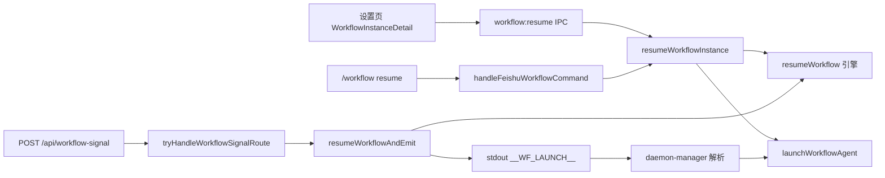

# 工作流恢复入口与信号接口 - 代码评审报告

## 1、审查范围

- **变更类型**: apply 产出的未提交变更（`stage=applied`，T1–T6 均 done）
- **评审等级**: **focused-review**（跨端 Electron UI/斜杠 + Daemon HTTP 与新路由，契约清晰、复用既有 SSOT 模式；未触及 proto/DB/权限模型扩展，故未升格 full-review）
- **涉及文件**: 16 个（manifest `files` 中 `kind=code|agents` 项；不含另一进行中变更 `20260712113356`）
- **设计文档**: `02-design.md`（对照基准）
- **CodeGraph**: 已用 `codegraph_impact(resumeWorkflow)`；新符号 `resumeWorkflowInstance` / `resumeWorkflowAndEmit` / `tryHandleWorkflowSignalRoute` 尚未入索引（未提交 diff），辅以源码与 diff 核对调用链

## 2、严重（必须处理）

无

## 3、警告（建议处理）

无（评分 ≥ 75 项经复核后均未达阈值，见 §7 低优先级观察项）

## 4、设计偏差

1. **斜杠实例未命中时的错误文案**
   - 设计预期: `02` §4.1 / E2 — `❌ 实例不存在`
   - 实际实现: `command-handler.ts` resume 分支在 ID/序号解析失败时返回 `❌ 找不到该实例`（引擎校验路径仍为 `实例不存在`）
   - 影响: 仅文案不一致，功能正确；评分约 50，归档前可统一

2. **`feishu-help-text.ts` 未增 resume 子行**
   - 设计预期: `02` §4.1 要求与 `WORKFLOW_SUBCMD_HELP` 同步
   - 实际实现: 仅更新 `WORKFLOW_SUBCMD_HELP`、`daemon.ts` `COMMANDS`；`feishu-help-text.ts` 仍为顶层 `🔹 /workflow 工作流管理`（现网即无子命令明细）
   - 影响: 与历史 help 结构一致，子命令详情由 `/workflow` 无参或未知子命令时 `WORKFLOW_SUBCMD_HELP` 承载；非功能偏差

3. **MCP `manage_workflows` action=resume（可选）**
   - 设计预期: `02` §4.4 标注为可选
   - 实际实现: 未实现，HTTP 直连 `resumeWorkflowAndEmit`
   - 影响: 符合 `03` T4 可选范围，不阻断 01 验收

## 5、验收标准检查

| 任务 | 验收条件 | 状态 |
|------|---------|------|
| T1 | paused 恢复后 `launchWorkflowAgent` 被调用 | ✅ `workflow-runner.ts` 对称 `runWorkflowDefinition` |
| T1 | 非 paused / 不存在透传引擎 message | ✅ |
| T1 | Agent 启动失败可读错误，实例保持 running | ✅ 先 `resumeWorkflow` 再 launch |
| T1 | `workflow-runner.ts` ≤300 行 | ✅ 109 行 |
| T1 | 日志 `workflow_resume` + `source=electron` | ✅ |
| T2 | `/workflow resume` 经 T10 主链，无 `.fcmd` 绕路 | ✅ grep 无 resume 独路径 |
| T2 | `WORKFLOW_SUBCMD_HELP` / `COMMANDS` 含 resume | ✅ |
| T2 | 日志 `source=slash` | ✅ |
| T3 | paused 详情「恢复」按钮 + IPC 三端一致 | ✅ `workflow:resume` / preload / env.d.ts |
| T3 | `WorkflowPanel` + 拆分文件 ≤300 行 | ✅ 187 / 106 / 244 行 |
| T3 | `workflow:instance-updated` 刷新 | ✅ runner 广播 + Panel 订阅 |
| T4 | `resumeWorkflowAndEmit` stdout `__WF_*` | ✅ `emitInstanceUpdate` + `emitLaunch` + `emitNotify` |
| T4 | `server-workflow.ts` ≤300 行 | ✅ 277 行 |
| T4 | 日志 `source=daemon`（stderr） | ✅ |
| T5 | `POST /api/workflow-signal` 注册与状态码映射 | ✅ 400/404/409/200 |
| T5 | loopback 信任域 | ✅ `daemon-http-server.ts` 监听 `127.0.0.1` |
| T5 | 日志 `source=http` | ✅ |
| T6 | 三入口 + 错误分支静态可验证 | ✅ 代码路径齐全；**无**自动化脚本落盘（符合仓库不写测试规范） |
| 01 验收 1–5 | PRD 五条 | ✅ 静态对照满足（E2E 依赖手工联调，T6 已勾选） |

## 6、调用链与回归风险

| 风险点 | 等级 | 说明 |
|--------|------|------|
| T10 斜杠路径混用 | 低 | resume 仅调 `resumeWorkflowInstance`，无 Daemon 直调文件 API |
| Daemon/Electron 工作流存储双路径 | 中（既有） | HTTP 读 `workflow-store`（APP_DATA_DIR），UI 读 `userData/workflows`；与 MCP `run` 一致，非本变更引入 |
| HTTP 无 token | 低（设计接受） | 仅 `127.0.0.1`，与 `/api/mcp` 同模型 |
| Agent 启动失败实例已 running | 低 | 与 `runWorkflowDefinition` / MCP run 一致 |
| 队列/orchestrator | 无 | diff 未触及 `file-queue` / `daemon-orchestrator` |

## 7、遗留债务

1. **`resumeWorkflowAndEmit` 入口日志误标 `ok: false`**（`server-workflow.ts:93`）：函数开头即 `logWorkflowResume(id, false)`，成功路径会多一条失败态日志，影响 `workflow_resume` grep 统计；建议改为无 `ok` 的入口日志（对齐 Electron `logWorkflowResume(id)`）。评分约 65，不阻断归档。
2. **日志格式双轨**：Electron/UI/斜杠用 `console.log(JSON.stringify({ workflow_resume: … }))`；Daemon/HTTP 用 stderr 纯文本前缀 `workflow_resume …`（有意避免污染 stdout 信号行）。可检索但解析脚本需兼容两种格式。
3. **知识库未同步**：`02` §10 所列业务域/工程平台文档待 `/kb-archive` 阶段更新（非 review 阻断项）。

## 8、修复任务建议

| 问题 ID | 建议动作 | 关联任务 |
|---------|----------|----------|
| — | 无 open 阻断项；§7 项可在 archive 前顺手修或作 `archived_with_debt` | — |

## 9、结论

**通过**，可进入 `/kb-test`（自动化/联调验收）及后续 `/kb-archive`。

实现与 `02`/`03` 双端 SSOT、三入口语义、HTTP 契约及 T10 斜杠主链要求一致；无评分 ≥ 75 的阻断缺陷。建议在 test 阶段重点手工验证：paused 实例 UI/斜杠/HTTP 三路径恢复、`running` 实例 409/错误文案、Electron 未就绪时斜杠失败文案。
