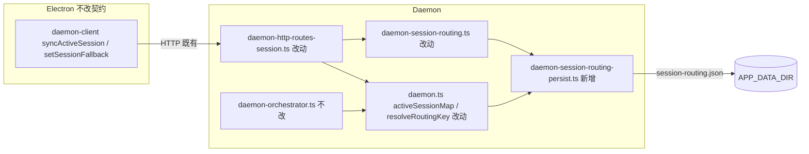

# Agent标识跨重启持久化 - 实现设计

> **业务 PRD**：见同目录 `01-proposal.md`（验收标准以 01 为准）
> **变更 ID**：`20260712113356-Agent标识跨重启持久化`
> **workflow_version**：v2.6

## 1、业务流程与改动范围

> 业务口径以 `01-proposal.md` §三～§六 为准；覆盖 Daemon 重启后续聊路由主路径与持久化失败降级分支。`01` 无独立「§业务流程」小节，下图由功能需求 R1～R4 与验收 1～4 归纳。

### 1.1 业务流程图

```mermaid
flowchart TD
  subgraph persist [映射持久化 新增]
    W1[映射变更 setActiveSession / setSessionFallback / clear 改动] --> W2[debounce 写 session-routing.json 新增]
    W3[Daemon 启动 daemonMain 新增] --> W4[load + TTL prune 新增]
    W4 --> W5[填充 activeSessionMap / fallbackSessionMap 改动]
  end

  subgraph runtime [续聊主路径]
    U[用户 IM 续聊 不改] --> ENQ[pushMessage / 入队 不改]
    ENQ --> ROUTE[resolveRoutingKey 读 activeSessionMap 改动]
    ROUTE --> DISP[orchestrator dispatch / launch 不改]
    DISP --> EAPI[Electron agent-api launch|dispatch 不改]
    EAPI --> SDK[引擎会话 agentId 内存 / sdk-active-runs 不改]
  end

  W5 --> ROUTE
  W1 -.-> ROUTE

  subgraph degrade [损坏 / 过期 新增]
    W4 -->|JSON 损坏| D1[WARN 日志 + 空映射启动 新增]
    D1 --> D2[首条路由失败可理解 notify 改动]
    W4 -->|TTL 过期条目| D3[丢弃条目 新增]
  end
```

**图例**：`不改` 行为与现网一致；`改动` 在既有节点加持久化 hook 或读盘后语义；`新增` 新分支或新模块；`删除` 无（本变更不删用户路径）。

### 1.2 流程步骤与改动对照

| 步骤 ID | 业务含义 | 改动 | 落点（模块/文件） | 01 验收关联 |
|---------|----------|------|-------------------|-------------|
| S1 | Daemon 启动，恢复调度态路由映射 | 新增 | `src/daemon/daemon.ts`（`daemonMain` 调用 load）；新建 `src/daemon/daemon-session-routing-persist.ts` | 验收 1、2 |
| S2 | 加载磁盘映射并重建 `sessionToChatMap` | 新增 | `daemon-session-routing-persist.ts`；`daemon.ts` `setActiveSession` 旁反向索引 | 验收 1 |
| S3 | 映射变更（活跃会话 / 回退栈）触发写盘 | 改动 | `daemon.ts` `setActiveSession`；`daemon-session-routing.ts` set/get/clear helper；`daemon-http-routes-session.ts` 改调 helper | R1 |
| S4 | 用户 IM 续聊，按 chat 解析 sessionKey | 改动 | `daemon.ts` `resolveRoutingKey`（读已恢复的 `activeSessionMap`） | 验收 1、2 |
| S5 | Orchestrator claim → launch/dispatch | 不改 | `daemon-orchestrator.ts` `dispatchSessionToAgent` | 验收 1 |
| S6 | Electron 引擎侧 agentId / Run 续接 | 不改 | `electron/agent/cursor-sdk/sdk-run-persistence.ts`（既有 `sdk-active-runs.json`） | 与 S7 recover 协同、不冲突 |
| S7 | TTL 清理过期映射，避免无限增长 | 新增 | `daemon-session-routing-persist.ts` `pruneExpiredEntries`；启动时 + 定时（如 6h） | R3、验收 4 |
| S8 | 持久化文件损坏或缺失 | 新增 | `daemon-session-routing-persist.ts` 容错读；`daemon.ts` 启动 WARN；launch 失败沿用 `formatOrchestratorFailure` notify | R4、验收 3 |
| S9 | 临时会话关闭回退 | 改动 | `daemon-session-routing.ts` + persist hook；HTTP 路由经 helper | 验收 1 |
| S10 | `sessionAgentPhaseMap` 运行时阶段 | 不改 | `daemon-orchestrator.ts`（内存，重启清空；冷启动 claimed 回收既有） | 01 非目标 |

### 1.3 改动汇总

- **改动**：`activeSessionMap` / `fallbackSessionMap` 由纯内存改为「启动 load + 变更 debounce save」；HTTP 回退栈路由改经 `daemon-session-routing` helper 统一写路径（对齐 archive `20260711205108` §3.1 shrink 建议）。
- **新增**：`daemon-session-routing-persist.ts`；`APP_DATA_DIR/session-routing.json` 及 TTL / 原子写 / 损坏降级。
- **不改（显式列出）**：IM 协议与卡片；`sessionAgentPhaseMap`；MergeBatch / Presentation；Electron `sdk-active-runs.json` Run recover；工作流恢复（`20260712113344`）；HTTP 路径与请求体契约。

## 2、整体思路

见 01 §一～§三。根因：**T11** — `activeSessionMap`（chatId→sessionKey）与 `fallbackSessionMap`（临时 sessionKey→回退目标）仅存 Daemon 进程内存，重启后 `resolveRoutingKey` 回退为 raw `chatId`，主私聊丢失 `::workspaceDir` 后缀，导致续聊像新会话、工作区可能漂移。

**方案要点**：

1. 在 `APP_DATA_DIR`（Electron `userData`，与 `scheduled-tasks.json` / `agent-api-port.json` 同级）落盘 **`session-routing.json`**，承载两类映射 + 元数据；**不**复用早期阶段 3 草案 `sessions.json` 的 `agent_id` 字段（该职责已由 Electron `sdk-active-runs.json` + recover 覆盖，避免双写）。
2. Daemon `daemonMain` 在 `wireDaemonSubmodules` **之前** load，填充既有 Map 并重建 `sessionToChatMap`。
3. 所有映射变更经 **单一写路径**（`setActiveSession` + `setSessionFallback` / `clearSessionFallback`）debounce 持久化；原子写 `*.tmp` → `renameSync`（对齐 `file-queue.ts` 模式）。
4. TTL 默认 **30 天**（`lastTouchedAt`  per entry）；过期条目 load 时剔除，运行期定时 prune。
5. 读盘失败：空映射启动 + `log("WARN", "session_routing_load_failed: …")`；用户侧在路由失效导致 launch 失败时，沿用 orchestrator 既有 notify（不新增 HTTP）。

**最小方案三问**（[kb-ponytail.md](references/kb-ponytail.md)）：

1. **能否复用现有模块？** 能。Map 与 helper 已在 `daemon.ts` / `daemon-session-routing.ts`；持久化仿 `sdk-run-persistence.ts` + `scheduled-tasks.json` 读写模式；启动挂点 `daemonMain` 已有 `initQueue` 先例。
2. **新增抽象是否 PRD 要求？** 否。仅新增单文件 `daemon-session-routing-persist.ts`（load/save/prune/debounce），**不**引入 SessionRoutingService 类、ORM 或新 npm 依赖。
3. **能否合并到已有文件？** `daemon.ts` 已超 300 行，持久化逻辑**必须**拆至新文件；路由 hook 留在 `setActiveSession` 与 `daemon-session-routing.ts` 三函数内，避免「预建通用持久化框架」。

## 3、分层设计



- **端点层**：`/api/active-session`、`/api/session-fallback` 契约不变；handler 改调 routing helper。
- **服务层**：`setActiveSession` / `setSessionFallback` / `clearSessionFallback` 末尾 `scheduleSessionRoutingPersist()`。
- **数据层**：`session-routing.json`；无 DB / proto 变更。

## 4、接口设计

无新增 HTTP 路径；沿用现网契约：

| 方法 | 路径 | 说明 |
|------|------|------|
| POST | `/api/active-session` | `{ chatId, sessionKey }` → 写 Map + 持久化 |
| GET | `/api/active-sessions` | 返回内存快照（含恢复后数据） |
| DELETE | `/api/active-session` | 删除映射 + 持久化 |
| POST/GET/DELETE | `/api/session-fallback` | 回退栈读写，行为不变 |

内部新增（非 HTTP）：

```typescript
// daemon-session-routing-persist.ts
export function loadSessionRoutingInto(
  active: Map<string, string>,
  fallback: Map<string, string>,
  onActiveSet: (chatId: string, sessionKey: string) => void,
): LoadResult; // { ok, pruned, error? }
export function scheduleSessionRoutingPersist(
  active: Map<string, string>,
  fallback: Map<string, string>,
): void;
```

## 5、数据结构

**文件路径**：`{APP_DATA_DIR}/session-routing.json`（实现上以 `process.env.APP_DATA_DIR` 为准；与 archive `20260711205108` T4 及早期 `~/.cursor-claw/sessions.json` 规划同目录族，本变更仅路由子集）。

**JSON  schema（v1）**：

```json
{
  "version": 1,
  "activeSessions": {
    "feishu:oc_xxx": {
      "sessionKey": "feishu:oc_xxx::/path/to/workspace",
      "lastTouchedAt": 1781270400000
    }
  },
  "fallbackSessions": {
    "feishu:oc_xxx::__IND__abc": {
      "fallbackSessionKey": "feishu:oc_xxx::/path/to/workspace",
      "lastTouchedAt": 1781270400000
    }
  }
}
```

| 字段 | 说明 |
|------|------|
| `version` | 固定 `1`；未来不兼容时 bump 并清空或迁移 |
| `*.lastTouchedAt` | 毫秒时间戳；写映射时更新 |
| `activeSessions` | 等价现网 `activeSessionMap` |
| `fallbackSessions` | 等价现网 `fallbackSessionMap` |

**TTL**：`SESSION_ROUTING_TTL_MS` 默认 `30 * 24 * 60 * 60 * 1000`（30 天）；`lastTouchedAt + TTL < now` 的条目 load / 定时 prune 时删除。

**不写盘**：`sessionAgentPhaseMap`、`messageSessionMap`、`sessionToChatMap`（后者由 active 反向重建）。

**原子写**：`writeFileSync(tmp)` + `renameSync`；失败仅 WARN，不阻断内存路由。

## 6、实现步骤

1. **步骤 1（S1/S2）**：新建 `daemon-session-routing-persist.ts` — `loadSessionRoutingInto`、`scheduleSessionRoutingPersist`（debounce 500ms）、`pruneExpiredEntries`、schema 校验。
2. **步骤 2（S1）**：`daemonMain` 在 `wireDaemonSubmodules` 前调用 load，填充 `activeSessionMap` / `fallbackSessionMap`，遍历 active 调用 `setActiveSession` 重建 `sessionToChatMap`。
3. **步骤 3（S3/S9）**：`setActiveSession` 与 `setSessionFallback` / `clearSessionFallback` 末尾 schedule persist；`daemon-http-routes-session.ts` 回退栈 POST/DELETE 改调 helper（GET 可保留 Map 读）。
4. **步骤 4（S7）**：启动 prune + `setInterval` 6h 定时 prune 并写盘。
5. **步骤 5（S8）**：损坏 JSON → 空映射 + WARN 关键字 `session_routing_load_failed`；可选首启 flag 供运维检索。
6. **步骤 6（KB）**：archive 时更新 §10 所列知识文件。

## 7、参考实现

CodeGraph（`projectPath=/home/suveng/doger/cursor-claw`）命中：

| 符号 | 路径 | 本变更用法 |
|------|------|-----------|
| `activeSessionMap` | `src/daemon/daemon.ts:377` | 持久化源之一；`resolveRoutingKey` 消费 |
| `setActiveSession` | `src/daemon/daemon.ts:806` | 写 hook + 重建 `sessionToChatMap` |
| `resolveRoutingKey` | `src/daemon/daemon.ts:941` | 续聊路由 SSOT |
| `fallbackSessionMap` | `src/daemon/daemon-session-routing.ts:6` | 持久化源之二 |
| `setSessionFallback` / `getSessionFallback` / `clearSessionFallback` | `src/daemon/daemon-session-routing.ts:9-20` | 统一写路径 + persist hook |
| `tryHandleSessionRoute` | `src/daemon/daemon-http-routes-session.ts` | 路由 handler，改调 helper |
| `dispatchSessionToAgent` | `src/daemon/daemon-orchestrator.ts:210` | launch 成功时 `setActiveSession` |
| `sessionAgentPhaseMap` | `src/daemon/daemon-orchestrator.ts:82` | **不持久化**（CodeGraph `codegraph_node` 对 orchestrator 内 Map 索引有限，以源码为准） |
| `syncActiveSession` / `setSessionFallback` | `electron/daemon/daemon-client.ts:57-82` | 客户端不变 |
| `persistActiveSdkRun` / `sdk-active-runs.json` | `electron/agent/cursor-sdk/sdk-run-persistence.ts` | Run/agentId 续接边界参照 |
| `daemonMain` | `src/daemon/daemon.ts:1732` | 启动 load 挂点 |
| `codegraph_impact("activeSessionMap")` | 2 符号 | `daemon.ts` 模块内常量 |

早期规划：`knowledge/变更/归档/20260627162620-飞书作为Cursor展示与控制层/02-design.md` §五 `sessions.json`（含 `agent_id`）— 本变更仅取其「Daemon 重启恢复路由」意图，字段缩窄为 `session-routing.json`。

产品债：**`knowledge/业务域/Agent调度/02-多会话模型.md` §九 T11**。

## 8、技术影响

### 8.1 影响范围

- **涉及模块**：`src/daemon/daemon-session-routing-persist.ts`（新）、`daemon-session-routing.ts`、`daemon.ts`、`daemon-http-routes-session.ts`；Electron **无**契约变更。
- **接口/proto 变更**：无。
- **数据变更**：新增 `session-routing.json`；不修改 `sdk-active-runs.json`。
- **风险**：
  - **中**：脏映射（工作区已删除）导致 launch 到错误 cwd — 依赖 TTL + 用户换目录后 `/workspace` 修正；不在本变更做路径存在性校验。
  - **低**：debounce 窗口内崩溃丢最后一次映射变更 — 可接受（P2）；下次变更再写盘。
  - **低**：多 Daemon 实例同 `APP_DATA_DIR` 竞写 — 现网单实例 lock 假定不变。
  - **低**：与 `20260712113344` 工作流恢复正交，无共享状态。

### 8.2 工程补充验收项

- [ ] 仅 kill Daemon 进程、保留 Electron 与引擎会话：同 chat 续聊 `resolveRoutingKey` 命中原 `sessionKey`（含 `::workspaceDir`）
- [ ] 重启前后 `GET /api/active-sessions` 与磁盘 `session-routing.json` 一致（debounce _flush 后）
- [ ] 手动损坏 JSON（非法语法）：Daemon 仍能启动；日志含 `session_routing_load_failed`；首条消息不因 Daemon 崩溃
- [ ] 将某条目 `lastTouchedAt` 设为超过 TTL：重启后该 chat 不再命中旧 sessionKey
- [ ] `fallbackSessionMap` 在 `/chat new` → 关闭临时会话链路上跨 Daemon 重启仍可 `getSessionFallback`
- [ ] `sessionAgentPhaseMap` 重启后仍为空；F1 不因本变更回归（仍仅 `.qmsg` 计数）
- [ ] 无 `02`/`03` 未要求的抽象层、trait/mixin 或新 npm 依赖（Ponytail 口径）

## 9、知识库影响

- `knowledge/业务域/Agent调度/02-多会话模型.md` — §九 T11 闭环；§六 内存→持久化补充。
- `knowledge/工程平台/Daemon守护进程/02-HTTP与MCP服务.md` — §六 数据增加 `session-routing.json`。
- `knowledge/工程平台/Daemon守护进程/01-概览.md` — 调度态持久化一句（可能）。
- `knowledge/业务域/Agent调度/01-概览.md` — T11 限制移除（可能）。
- 两级索引：若 T11 从「已知限制」移除，需更新 `知识索引.md` 相关条目（archive 时确认）。

## 10、知识库更新计划

### 10.1 必须更新

- `knowledge/业务域/Agent调度/02-多会话模型.md` — T11 实现说明、`session-routing.json` 与 TTL、与 `sdk-active-runs` 边界。
- `knowledge/工程平台/Daemon守护进程/02-HTTP与MCP服务.md` — §六 持久化文件清单。

### 10.2 可能更新（视实现结果）

- `knowledge/工程平台/Daemon守护进程/01-概览.md` — 重启恢复能力总述。
- `knowledge/业务域/Agent调度/01-概览.md` — §九 全局限制调整。
- `knowledge/知识地图.md` — T11 状态（若索引仍单列）。

### 10.3 不需要更新

- `knowledge/业务域/工作流/*` 及变更 `20260712113344` 目录正文。
- IM 通道、MergeBatch、Presentation 子模块文档（行为不变）。
- `electron/agent/cursor-sdk/AGENTS.md`（Run 持久化已文档化，本变更不改 Electron recover）。
