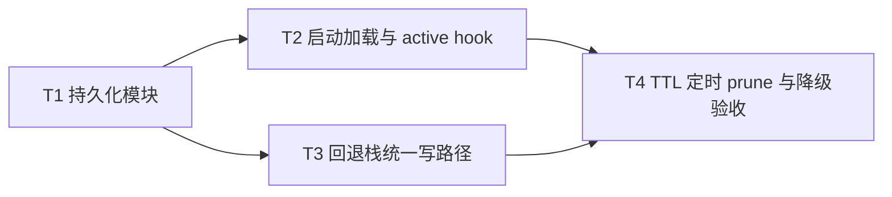

# Agent标识跨重启持久化 - 任务分解

> **来源**：`/kb-plan`（基于 `01-proposal.md`、`02-design.md`）

## 1、执行计划

### （一）依赖图



```
T1 ──→ T2 ──→ T4
  └──→ T3 ──┘
```

### （二）分组调度

| 轮次 | 并行任务 | 说明 |
|------|----------|------|
| 第一轮 | T1 | 新建 `daemon-session-routing-persist.ts`，无文件冲突 |
| 第二轮 | T2、T3 | T2 改 `daemon.ts`；T3 改 `daemon-session-routing.ts` + `daemon-http-routes-session.ts`，互不冲突 |
| 第三轮 | T4 | 在 T2/T3 完成后接入 6h 定时 prune；补强损坏降级与 TTL 验收 |

## 2、任务清单

## T1: 新建 session-routing 持久化模块

### 背景

产品债 T11 根因是 `activeSessionMap` / `fallbackSessionMap` 仅存内存。本任务新增单文件持久化层，提供 load/save/prune/debounce 与 schema 校验，是 T2/T3/T4 的公共数据层依赖。

### 上下文文件

- CodeGraph: `activeSessionMap` `setActiveSession` `persistActiveSdkRun` — 并列 Map 与磁盘读写参照
- CodeGraph impact: `activeSessionMap` → `daemon.ts` 模块内 2 符号
- 必读: `src/daemon/daemon.ts` — `activeSessionMap`（约 L332）、`setActiveSession`（约 L806）、`resolveRoutingKey`（约 L942）
- 必读: `src/daemon/daemon-session-routing.ts` — `fallbackSessionMap` 及 set/get/clear helper
- 参考: `electron/agent/cursor-sdk/sdk-run-persistence.ts` — 读盘容错、写盘 WARN 模式
- 参考: `src/bridge/file-queue.ts` — `writeFileSync(tmp)` + `renameSync` 原子写（约 L72-73）

### 实现范围

- 新建: `src/daemon/daemon-session-routing-persist.ts`（≤300 行，中文注释）
  - 路径: `{process.env.APP_DATA_DIR}/session-routing.json`
  - `loadSessionRoutingInto(active, fallback, onActiveSet?)` — 解析 v1 schema、load 时 `pruneExpiredEntries`、损坏/缺失返回 `{ ok: false, error }` 且 Maps 保持空
  - `scheduleSessionRoutingPersist(active, fallback)` — debounce 500ms、原子写、失败仅 WARN
  - `pruneExpiredEntries(active, fallback)` — `SESSION_ROUTING_TTL_MS` 默认 30 天
  - 条目写盘时更新 `lastTouchedAt`
- 不修改其他文件

### 接口契约

```typescript
export type LoadResult = { ok: true; pruned: number } | { ok: false; error: string };

export const SESSION_ROUTING_TTL_MS = 30 * 24 * 60 * 60 * 1000;

export function loadSessionRoutingInto(
  active: Map<string, string>,
  fallback: Map<string, string>,
  onActiveSet?: (chatId: string, sessionKey: string) => void,
): LoadResult;

export function scheduleSessionRoutingPersist(
  active: Map<string, string>,
  fallback: Map<string, string>,
): void;

export function pruneExpiredEntries(
  active: Map<string, string>,
  fallback: Map<string, string>,
): number;

export function flushSessionRoutingPersist(
  active: Map<string, string>,
  fallback: Map<string, string>,
): void; // 供测试/debounce 落盘验收
```

- JSON schema v1 见 02 §5：`version`、`activeSessions`、`fallbackSessions` 及 per-entry `lastTouchedAt`

### 验收标准

- [ ] 单元/手工：合法 JSON load 后 Maps 内容与磁盘一致；`onActiveSet` 按 active 条目回调
- [ ] load 时 TTL 过期条目剔除且 `pruned` 计数正确（对应 01 验收 4、R3）
- [ ] 非法 JSON / schema 不符：`ok: false`、Maps 为空、不抛未捕获异常（对应 01 验收 3、R4）
- [ ] `scheduleSessionRoutingPersist` debounce 后磁盘文件与内存 Maps 一致；原子写（tmp→rename）
- [ ] 写盘失败仅 WARN，不阻断调用方
- [ ] 单文件 ≤300 行；无 SessionRoutingService 类、无新 npm 依赖
- [ ] 无 `02`/`03` 未要求的抽象层、trait/mixin 中间层或未批准的新依赖（Ponytail 口径）

### 依赖

- 前置任务: 无
- 后续任务: T2, T3, T4

---

## T2: Daemon 启动加载与 activeSession 写盘 hook

### 背景

Daemon 重启后须从磁盘恢复路由映射并重建 `sessionToChatMap`，且每次 `setActiveSession` 变更须 debounce 持久化。本任务在 `daemonMain` 挂 load、在 `setActiveSession` 挂 persist hook。

### 上下文文件

- CodeGraph: `daemonMain` callees — `initQueue`→`wireDaemonSubmodules` 启动序（`daemon.ts` 约 L1763-1766）
- CodeGraph impact: `setActiveSession` → `pushMessage`、`daemonMain` 等 6 符号
- 必读: `src/daemon/daemon.ts` — `daemonMain`、`setActiveSession`、`activeSessionMap`、`sessionToChatMap`、`resolveRoutingKey`
- 必读: `src/daemon/daemon-session-routing-persist.ts` — T1 导出（本任务依赖 T1 合并后）
- 参考: `src/daemon/AGENTS.md` — 子模块 ≤300 行、注入规矩

### 实现范围

- 修改: `src/daemon/daemon.ts`
  - `daemonMain`：在 `wireDaemonSubmodules` **之前**（可在 `initQueue` 之后）调用 `loadSessionRoutingInto(activeSessionMap, fallbackSessionMap, setActiveSession)` 重建 `sessionToChatMap`
  - load 失败：`log("WARN", "session_routing_load_failed: …")`，空映射继续启动
  - `setActiveSession` 末尾调用 `scheduleSessionRoutingPersist(activeSessionMap, fallbackSessionMap)`
  - import `fallbackSessionMap` from `./daemon-session-routing.js`（若尚未 import）
- 不改动 IM、orchestrator、Electron 契约

### 接口契约

- 消费 T1 的 `loadSessionRoutingInto` / `scheduleSessionRoutingPersist`
- `resolveRoutingKey` 行为不变，仅读已恢复的 `activeSessionMap`（对应 S4）
- `sessionAgentPhaseMap` **不**持久化（对应 S10、01 非目标）

### 验收标准

- [ ] 01 验收 1：仅 kill Daemon（保留 Electron），同 chat 续聊 `resolveRoutingKey` 命中原 `sessionKey`（含 `::workspaceDir`）
- [ ] 01 验收 2：重启前后无静默换 workspace
- [ ] 02 §8.2：kill Daemon 后同 chat `resolveRoutingKey` 命中原 sessionKey
- [ ] 损坏 JSON 后 Daemon 仍能启动；日志含 `session_routing_load_failed`；首条 IM 不因 Daemon 崩溃（01 验收 3）
- [ ] `sessionAgentPhaseMap` 重启后仍为空；F1 仍仅 `.qmsg` 计数（02 §8.2）
- [ ] `daemon.ts` 增量改动后仍 ≤300 行或符合 AGENTS 拆分规矩
- [ ] 无 `02`/`03` 未要求的抽象层、trait/mixin 中间层或未批准的新依赖（Ponytail 口径）

### 依赖

- 前置任务: T1
- 后续任务: T4

---

## T3: 回退栈 helper 统一写路径与 HTTP 改调

### 背景

现网 `daemon-http-routes-session.ts` 对 `fallbackSessionMap` / `activeSessionMap` 有直接 `.set`/`.delete`，绕过 persist。本任务将回退栈与 DELETE active-session 改经 helper，与 archive `20260711205108` shrink 建议对齐。

### 上下文文件

- CodeGraph impact: `setSessionFallback` → `daemon-session-routing.ts`、`daemon-client.ts` 等 14 符号
- CodeGraph impact: `tryHandleSessionRoute` → `daemon-http-routes.ts`、`wireDaemonSubmodules`
- 必读: `src/daemon/daemon-session-routing.ts` — 三函数现状
- 必读: `src/daemon/daemon-http-routes-session.ts` — POST/GET/DELETE session-fallback、DELETE active-session（约 L46-93）
- 必读: `src/daemon/daemon-session-routing-persist.ts` — T1 `scheduleSessionRoutingPersist`
- 必读: `src/daemon/daemon.ts` — `activeSessionMap`、`setActiveSession`（DELETE 可新增 `clearActiveSession` 或等价 helper）

### 实现范围

- 修改: `src/daemon/daemon-session-routing.ts`
  - `setSessionFallback` / `clearSessionFallback` 末尾 `scheduleSessionRoutingPersist`（需接收 active/fallback Maps 或模块内 import `activeSessionMap` from daemon — **优先**通过参数注入或从 `daemon.ts` 导出只读引用，避免环引；若环引风险，在 `daemon.ts` 提供 `scheduleRoutingPersist()` 薄封装供 routing 调用）
- 修改: `src/daemon/daemon-http-routes-session.ts`
  - POST/DELETE `/api/session-fallback` 改调 `setSessionFallback` / `clearSessionFallback`（替代 `deps.fallbackSessionMap.set/delete`）
  - DELETE `/api/active-session` 改调带 persist 的清除路径（`clearActiveSession` 或 `setActiveSession` 对称删除 + schedule）
  - GET 路由可保留 Map 直读
- 可选: `src/daemon/daemon.ts` — 导出 `clearActiveSession(chatId)` 若 DELETE 需独立 helper

### 接口契约

- HTTP 契约不变（02 §4）：`POST/GET/DELETE /api/session-fallback`、`POST/GET/DELETE /api/active-session`
- `setSessionFallback(sessionKey, fallbackSessionKey)` / `clearSessionFallback(sessionKey)` 行为与现网一致，附加 persist side-effect
- Electron `daemon-client.ts` **无需**改动（01 R5、02 不改契约）

### 验收标准

- [ ] 01 验收 1：`/chat new` → 关闭临时会话链路跨 Daemon 重启仍可 `getSessionFallback`（02 §8.2 fallback 项）
- [ ] `POST /api/session-fallback` 后 debounce flush 磁盘含对应 fallback 条目
- [ ] `DELETE /api/active-session` 与 `DELETE /api/session-fallback` 触发 persist，重启后映射已删除
- [ ] 02 §8.2：`GET /api/active-sessions` 与 `session-routing.json` 在 debounce flush 后一致
- [ ] `rg 'fallbackSessionMap\.(set|delete)' src/daemon/daemon-http-routes-session.ts` 零命中（改调 helper）
- [ ] 无 IM 协议改造（01 验收 5、R5）
- [ ] 无 `02`/`03` 未要求的抽象层、trait/mixin 中间层或未批准的新依赖（Ponytail 口径）

### 依赖

- 前置任务: T1
- 后续任务: T4

---

## T4: TTL 定时 prune 与损坏降级验收补强

### 背景

load 时 prune 由 T1 覆盖，本任务补齐运行期 6h 定时 prune + 写盘，并集中验收 TTL 过期、损坏降级与 orchestrator notify 路径，闭合 S7/S8。

### 上下文文件

- CodeGraph: `startMediaCacheCleanup` — 6h `setInterval` 先例（`daemon.ts` 约 L928）
- CodeGraph: `dispatchSessionToAgent` `formatOrchestratorFailure` — launch 失败 notify 既有路径
- 必读: `src/daemon/daemon-session-routing-persist.ts` — `pruneExpiredEntries`、`flushSessionRoutingPersist`
- 必读: `src/daemon/daemon.ts` — `daemonMain` 启动段（挂定时器位置）
- 参考: `src/daemon/daemon-orchestrator.ts` — `dispatchSessionToAgent` launch 成功时 `setActiveSession`；失败 notify 不改

### 实现范围

- 修改: `src/daemon/daemon.ts`（或 T1 文件导出 `startSessionRoutingPruneTimer` 由 daemon 调用，≤300 行）
  - `daemonMain` 启动后注册 `setInterval` 6h：调用 `pruneExpiredEntries` + `scheduleSessionRoutingPersist`（有剔除时写盘）
  - 首次 load 后若 T1 已 prune，可选日志 `session_routing_pruned: N`
- 不新增 HTTP；不修改 `formatOrchestratorFailure`（损坏后首条路由失败沿用既有 notify，02 S8）

### 接口契约

- `startSessionRoutingPruneTimer(active, fallback): void` — 6h interval，`.unref()` 与 `startMediaCacheCleanup` 对齐
- 与 `sdk-active-runs.json` / Run recover **无**共享状态（01 与 S7 recover 协同、不冲突）

### 验收标准

- [ ] 01 验收 4：将磁盘条目 `lastTouchedAt` 设为超过 TTL，重启后该 chat 不再命中旧 sessionKey
- [ ] 运行期 6h 定时 prune 可手工缩短 interval 验证：过期条目剔除并写盘
- [ ] 01 验收 3：损坏 JSON 降级后，路由失效导致 launch 失败时用户可见 notify（沿用 orchestrator，非 Daemon 崩溃）
- [ ] 02 §8.2 全部项在本变更范围内已覆盖（T2/T3 项回归通过即可）
- [ ] 不涉及全量会话库、不改 `sdk-active-runs.json`（01 验收 5）
- [ ] 无 `02`/`03` 未要求的抽象层、trait/mixin 中间层或未批准的新依赖（Ponytail 口径）

### 依赖

- 前置任务: T2, T3
- 后续任务: 无（KB archive 由 kb-librarian 处理，不建 KB 任务）
