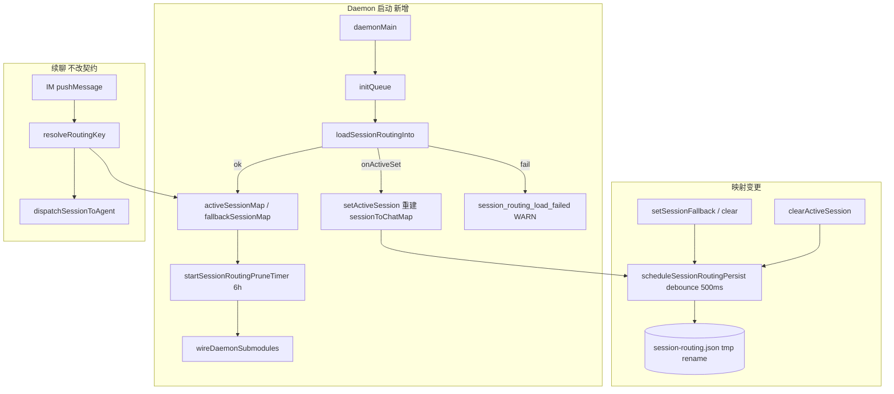

# Agent标识跨重启持久化 - 代码评审报告

## 1、审查范围

- **变更类型**: apply 产出的未提交变更（含新建 `daemon-session-routing-persist.ts`）
- **评审等级**: full-review（标准流程、Daemon 调度态持久化、跨重启可靠性）
- **涉及文件**: 7 个（6 个代码 + 本评审文档）
- **设计文档**: `02-design.md`（对照基准）
- **正交排除**: `20260712113344` 工作流恢复不在评审范围
- **CodeGraph**: `setActiveSession` impact 6 符号（`daemon.ts` 模块内）；`loadSessionRoutingInto` 为新符号未入索引

| 文件 | 行数 | 备注 |
|------|------|------|
| `src/daemon/daemon-session-routing-persist.ts` | 251 | 新建 ✅ |
| `src/daemon/daemon-session-routing.ts` | 40 | +wire/persist hook ✅ |
| `src/daemon/daemon-http-routes-session.ts` | 102 | helper 改调 ✅ |
| `src/daemon/daemon-http-routes-types.ts` | 54 | +`clearActiveSession` ✅ |
| `src/daemon/daemon.ts` | 1885 | 批2 历史超限；本变更 +29 行接线 |
| `src/daemon/AGENTS.md` | 171 | session-routing 持久化节 ✅ |

## 2、严重（必须处理）

无

## 3、警告（建议处理）

1. **`buildSnapshot` 写盘时全量刷新 `lastTouchedAt`**
   - 位置: `src/daemon/daemon-session-routing-persist.ts:137-152`
   - 说明: 设计 §5 约定「写映射时更新」单条目 `lastTouchedAt`；实现中任意一次 debounce 写盘会将**全部** active/fallback 条目的 `lastTouchedAt` 设为 `Date.now()`。load 时 prune 与「手动改磁盘后重启」验收仍成立；但运行期若其他 chat 有活动，长期未用的映射可能因连带写盘而延迟过期。评分 ~75，记 `accepted_debt`（P2 可接受，见 manifest R2）。
   - Ponytail: `shrink:` 写盘仅 touch 脏键 → 保留磁盘 per-entry 时间；`net: ~-8 lines`（需脏集追踪，非本变更必做）

2. **`daemon.ts` 仍远超 300 行**
   - 位置: `src/daemon/daemon.ts`（1885 行）
   - 说明: AGENTS 单文件 ≤300；02 §2 已明确持久化逻辑必须拆至新文件，本变更仅增启动 load / prune 定时器 / `clearActiveSession` 等薄接线。属批2 queue/channel/logging 遗留债务，非本变更引入。评分 ~75，记 `accepted_debt`（manifest R1）。

3. **02 §8.2 / 01 端到端场景未在评审环境手动回归**
   - 位置: kill Daemon 续聊、损坏 JSON、TTL 磁盘篡改、fallback 跨重启
   - 说明: `npm run build` 通过；代码路径与 S1～S9 一致；跨进程行为建议 archive 前 checklist 点验。评分 ~50，记入 §7，不阻断。

## 4、设计偏差

1. **TTL `lastTouchedAt` 更新粒度**
   - 设计预期: 02 §5「写映射时更新」per-entry `lastTouchedAt`；03 T1「条目写盘时更新 `lastTouchedAt`」。
   - 实际实现: `buildSnapshot` 在每次 persist 时为**所有**在册条目写入同一 `now`。
   - 影响: 运行期 6h prune 对「无活动但同进程内其他 chat 有写盘」的条目可能不过期；重启 load prune 不受影响。已接受为债务 R2。

2. **冷启动 load 经 `setActiveSession` 回调**
   - 设计预期: 02 §6 步骤 2「遍历 active 调用 `setActiveSession` 重建 `sessionToChatMap`」。
   - 实际实现: 一致；副作用为每条恢复映射打 INFO 日志并 debounce 调度一次写盘（内容通常与磁盘相同）。
   - 影响: 可观测性略噪、多余一次 I/O；功能正确。评分 <75，不单独开 review。

无其他与 02-design 实质偏差。HTTP 契约、IM、orchestrator、`sessionAgentPhaseMap` 不持久化均符合设计。

## 5、验收标准检查

### 01-proposal §六

| 编号 | 验收条件 | 状态 |
|------|---------|------|
| 1 | 仅重启 Daemon 后同 chat 仍路由原 Agent 与工作区 | ✅ 代码：`loadSessionRoutingInto` + `resolveRoutingKey` 读 `activeSessionMap`；⏳ E2E 待手动 |
| 2 | 无静默换 workspace | ✅ 路由恢复含 `::workspaceDir`；⏳ E2E 待手动 |
| 3 | 持久化损坏时降级且可理解提示 | ✅ `session_routing_load_failed` WARN + 空映射启动；launch 失败沿用 orchestrator notify |
| 4 | TTL 过期后不误用旧映射 | ✅ load 时 `pruneExpiredEntries`；⚠️ 运行期 prune 见 R2 债务 |
| 5 | 不涉及 IM 改造与全量会话库 | ✅ |

### 03-tasks

| 任务 | 验收条件 | 状态 |
|------|---------|------|
| T1 | v1 schema load/save/prune/debounce/原子写/容错 | ✅ |
| T1 | 单文件 ≤300、无 Service 类、无新 npm | ✅（251 行） |
| T1 | Ponytail：无未批准抽象 | ✅ |
| T2 | `daemonMain` 在 `wireDaemonSubmodules` 前 load | ✅ L1783-1791 |
| T2 | load 失败 WARN `session_routing_load_failed` | ✅ |
| T2 | `setActiveSession` 末尾 schedule persist | ✅ L814 |
| T2 | `sessionAgentPhaseMap` 不持久化 | ✅ |
| T2 | `daemon.ts` ≤300 或符合拆分规矩 | ⚠️ accepted_debt R1 |
| T3 | HTTP 改调 helper；`rg fallbackSessionMap.(set\|delete)` 零命中 | ✅ |
| T3 | `clearActiveSession` + DELETE persist | ✅ |
| T3 | HTTP 契约不变 | ✅ |
| T4 | 6h `startSessionRoutingPruneTimer` + `.unref()` | ✅ |
| T4 | load prune 日志 `session_routing_pruned` | ✅ L1787-1788 |
| T4 | 02 §8.2 范围内项 | ✅ 代码层；⏳ E2E 待手动 |

### 02 §8.2 工程补充

| 项 | 状态 |
|----|------|
| kill Daemon 后 `resolveRoutingKey` 命中原 sessionKey | ✅ 代码；⏳ E2E |
| GET active-sessions 与磁盘一致（flush 后） | ✅ `flushSessionRoutingPersist` 导出 |
| 损坏 JSON 启动不崩 + WARN | ✅ |
| TTL 磁盘篡改后重启不命中 | ✅ load prune |
| fallback 跨 Daemon 重启 | ✅ fallback 同文件持久化 |
| `sessionAgentPhaseMap` 重启为空 | ✅ 未写盘 |
| Ponytail 无未批准依赖 | ✅ |

## 6、调用链与回归风险

| 回归点 | 风险 | 缓解 |
|--------|------|------|
| debounce 窗口内 Daemon 崩溃丢末次映射 | 低 | 02 §8.1 已接受（P2） |
| `APP_DATA_DIR` 未设置 | 低 | 读/写跳过 + stderr WARN，内存路由仍工作 |
| load 回调触发多余写盘 | 低 | 与磁盘内容通常一致 |
| 与 `sdk-active-runs.json` 双写 agentId | 无 | 设计边界：仅 chatId→sessionKey |
| 正交变更 `20260712113344` | 无 | 无共享状态 |

## 7、遗留债务

- **R1** `daemon.ts` 1885 行：批2 拆分跟进，本变更已把持久化逻辑拆至 `daemon-session-routing-persist.ts`。
- **R2** 写盘全量刷新 `lastTouchedAt`：运行期 TTL 精度弱化；升级路径为脏键 touch 或 persist 前仅更新变更键。
- **E2E 手动**：01 §六、02 §8.2 kill-Daemon / 损坏 JSON / TTL 篡改建议在 archive checklist 点验一次。
- **KB 同步**：archive 时按 02 §10 更新 `02-多会话模型.md`、`02-HTTP与MCP服务.md`（本评审不写业务 KB）。

## 8、修复任务建议

| 问题 ID | 建议动作 | 关联任务 |
|---------|----------|----------|
| R1 | 批2 继续拆 `daemon.ts` queue/channel 域 | 独立变更 |
| R2 | 可选：`buildSnapshot` 仅更新变更条目 `lastTouchedAt`；或 `ponytail:` 注释标明上限 | T-FIX-01（可选） |
| — | E2E 点验 | archive checklist |

## 9、结论

**通过**，可进入 `/kb-archive`。

- 实现与 02-design / 03-tasks 主路径一致，T11 持久化闭环（load + debounce save + TTL prune + 损坏降级）已落盘。
- 无 `open` 阻断项；R1/R2 已记 `accepted_debt`。
- `npm run build` 通过；Ponytail：**Lean already. Ship.**（单文件 persist、注入式 `wireSessionRoutingPersist`、无新依赖）。
