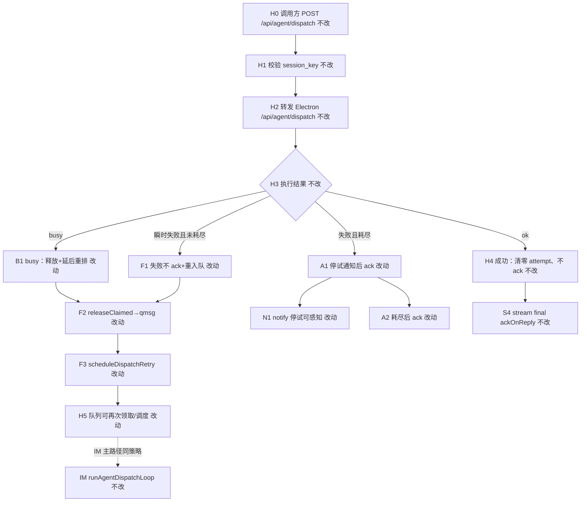
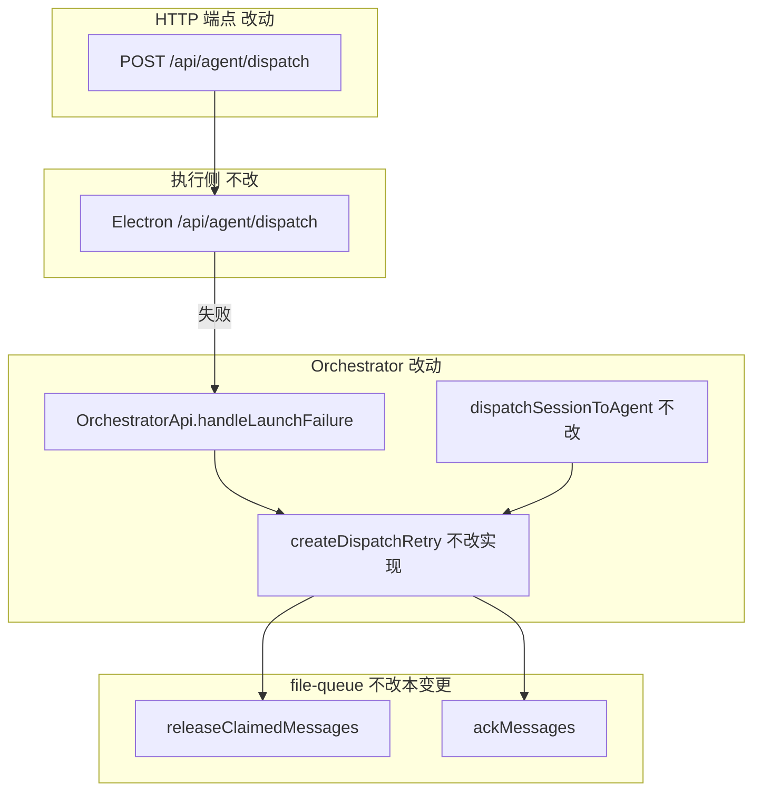

# HTTP dispatch失败重入队对齐 - 实现设计

> **业务 PRD**：见同目录 `01-proposal.md`（验收标准以 01 为准）
> **父债**：`20260711232817-dispatch失败重入队与ack策略` D1 — 本变更**必须关闭**，不得再标 accepted_debt / 范围外

## 一、业务流程与改动范围

> 业务口径以 `01-proposal.md` §四场景 S1～S5 与 §六验收为准；下图以 **HTTP dispatch 旁路**（MCP / 工作流 / 外部调用 `POST /api/agent/dispatch`）为主视角，并与 IM Orchestrator launch 策略对称。

### （一）业务流程图

**图例**：`不改` 行为与现网一致；`改动` 需改代码/接线；`新增` 本变更无新模块文件；`删除` 移除 HTTP 旁路「失败即 ack / busy 仅 timer 不 release」旧路径。

### （二）流程步骤与改动对照

| 步骤 ID | 业务含义 | 改动 | 落点（模块/文件） | 01 验收关联 |
|---------|----------|------|-------------------|-------------|
| H0 | MCP / 工作流 / 外部经 Daemon 调用 `POST /api/agent/dispatch` | 不改 | `src/daemon/daemon-http-routes-orchestrator.ts`；`electron/agent/cursor-sdk/agent-sdk-http.ts` | R6；01 §七 |
| H1 | 校验 `session_key`、组装 body（含可选 `message_ids`） | 不改 | `daemon-http-routes-orchestrator.ts` L106–121 | R6 |
| H2 | `forwardElectronAgentApi("/api/agent/dispatch", …)` 交给执行侧 | 不改 | `daemon-orchestrator.ts` `forwardElectronAgentApi`；HTTP 路由经 deps 注入 | S4；R5 |
| H3 | 判定 `result.ok` / busy / 其它失败 | 不改 | 同上；`parseBusyRetryDelayMs` | S1～S3 |
| H4 | **成功**：不提前 ack；清零 session 重试计数 | 改动 | `daemon-http-routes-orchestrator.ts` 成功分支调用 `clearDispatchRetryAttempt`；`daemon-orchestrator.ts` 暴露 `clearAttempt` | §6.1.3；S4；R5 |
| F1 | **非 busy 失败**：禁止未耗尽时 `ackMessages` | 改动 | `daemon-http-routes-orchestrator.ts` 删除 L128–135 直接 notify+ack；改调 `handleLaunchFailure` | R1；§6.1.1；S1 |
| F2 | 失败后 `.claimed` → `.qmsg`（重入队） | 改动 | 复用 `src/bridge/file-queue.ts` `releaseClaimedMessages`（父债已实现）；经 `handleLaunchFailure` 调用 | R1；R2；S1 |
| F3 | 有限次延后重调度（`MAX_DISPATCH_RETRIES=3`；退避 600/1200/2400ms） | 改动 | 复用 `src/daemon/daemon-orchestrator-retry.ts` `handleLaunchFailure` / `scheduleDispatchRetry`；日志 `dispatch_retry_scheduled` | R2；R3；S1；S5 |
| B1 | **busy**：释放 + `scheduleBusyRetry`（非仅 timer） | 改动 | 同上；busy 走 `handleLaunchFailure` 且 `busyDelayMs>0`；日志 `agent_busy_requeue` | R4；§6.1.4；S3 |
| A1 | 重试耗尽：可感知停试（通知含「已停止自动重试」） | 改动 | `daemon-orchestrator-retry.ts` `handleLaunchFailure` 耗尽分支（已存在）；HTTP 路由改调同一符号 | §6.1.2；S2；R3 |
| A2 | 耗尽后 `ackMessages` 明确放弃（非静默） | 改动 | 同上；日志 `dispatch_retry_exhausted` | R3；S2 |
| H5 | 释放后任务可再次被调度（HTTP 与 IM 共用 session attempt Map） | 改动 | `daemon-orchestrator.ts` 将 `handleLaunchFailure` / `clearAttempt` 透出 `OrchestratorApi` → `daemon.ts` → `HttpRoutesDeps` | §6.2.1；S5 |
| S4 | 成功最终 ack：stream `final` / `ackOnReply` | 不改 | `daemon.ts` `ackOnReply`；`daemon-presentation-stream.ts` | §6.1.3；R5 |
| S5 | HTTP 与 IM 同类条件下释放/重试/停试/ack 语义一致 | 改动 | HTTP 与 `dispatchSessionToAgent` 共用同一 `createDispatchRetry` 实例与常量 | §6.2.1；R7 |
| DEL-1 | 删除 HTTP 旁路「非 busy 失败 → 直接 ack」 | 删除 | `daemon-http-routes-orchestrator.ts` L127–135 | R7；父债 D1 |
| DEL-2 | 删除 HTTP busy「仅 `scheduleBusyRetry`、无 release」 | 删除 | 同上 L125–126 独立 busy 分支 | R4；S3 |

### （三）改动汇总

- **改动**：
  - `src/daemon/daemon-http-routes-orchestrator.ts`：`POST /api/agent/dispatch` 失败路径改调 `handleLaunchFailure`；成功路径 `clearDispatchRetryAttempt`。
  - `src/daemon/daemon-orchestrator.ts`：`OrchestratorApi` 透出 `handleLaunchFailure`、`clearDispatchRetryAttempt`（包装 `dispatchRetry`）。
  - `src/daemon/daemon-http-routes-types.ts`：`HttpRoutesDeps` 增加上述两符号。
  - `src/daemon/daemon.ts`：`createAdminApiHandler` 接线 orchestrator 透出方法。
  - `src/daemon/AGENTS.md`：登记 HTTP dispatch 与 launch 共用 retry 策略、日志关键字。
- **新增**：无新源文件；不新建平行 retry 抽象。
- **删除**：HTTP 路由内联「失败即 ack」「busy 无 release」分支（父债 D1 清偿）。
- **不改（显式列出）**：
  - `src/bridge/file-queue.ts` 存储形态与 `ackMessages` 语义（整体拆分归变更 #3「消息队列模块拆分」）。
  - `daemon-orchestrator-retry.ts` 常量/退避/日志关键字（父债已定稿，本变更只复用）。
  - IM `dispatchSessionToAgent` / MergeBatch / 卡片 UI。
  - 对外 HTTP 路径、字段、状态码形状（01 R6）。
  - Electron SDK Run 内 `retry-policy.ts`。

## 二、整体思路

**根因**（见 01 §一；父债 `05-summary.md` §2 D1；CodeGraph 核实）：父变更已在 IM `dispatchSessionToAgent` 接入 `createDispatchRetry` → `handleLaunchFailure`，但 `daemon-http-routes-orchestrator.ts` 的 `POST /api/agent/dispatch` 仍保留旧语义——非 busy 失败 `notifySessionUser` 后 `ackMessages`；busy 仅 `scheduleBusyRetry` 且不 `releaseClaimedMessages`，消息停在 `.claimed` 导致无法再次 claim。MCP / 工作流等经 HTTP 旁路触发的任务因此静默丢失，与 IM 主路径可靠性割裂。

**方案要点**（见 01 R1～R7）：

1. **策略 SSOT 复用**：HTTP 失败/busy 与 IM launch 共用 `daemon-orchestrator-retry.ts` 的 `handleLaunchFailure` 与同一 session 级 `attemptBySession` Map，保证 S5 语义与次数/退避一致（`MAX_DISPATCH_RETRIES=3`，`DISPATCH_BACKOFF_MS=[600,1200,2400]`）。
2. **失败默认释放**：可重试路径 `releaseClaimedMessages` + `scheduleDispatchRetry`；禁止未耗尽 ack。
3. **busy 不吞**：busy 与瞬时失败收敛到同一 `handleLaunchFailure` 分支（`busyDelayMs` 取自 `parseBusyRetryDelayMs`）。
4. **耗尽可感知**：`dispatch_retry_exhausted` 日志 + 通知「已停止自动重试」+ 再 ack。
5. **成功边界**：HTTP `result.ok` 时 `clearAttempt`，不 ack；最终 ack 仍仅 `ackOnReply` / stream final（S4）。
6. **契约不变**：HTTP 响应仍 `deps.json(res, result, result.ok ? 200 : 400)`，不增删字段（R6）。
7. **与 #3 边界**：仅改 HTTP 路由调用点与 orchestrator API 透出；不拆 `file-queue.ts` 文件结构。

**最小方案三问（Ponytail）**：

1. **能否复用现有模块/符号？** 能。`releaseClaimedMessages`、`createDispatchRetry`、`handleLaunchFailure`、`parseBusyRetryDelayMs`、`scheduleBusyRetry` 均已由父债实现；本变更仅将 HTTP 路由从「内联 ack」改为调用 orchestrator 已持有的 retry 实例，避免第二套计数器或新文件。
2. **拟新增抽象/依赖是否被 01 要求？** 否。不引入新 npm 包、不建 `HttpDispatchRetryMiddleware`、不抽跨路由通用层。YAGNI：01 验收的是行为对齐，非新框架；`HttpRoutesDeps` 增加两个函数指针属必要接线，非产品级抽象。
3. **能否合并到已有文件？** 能。逻辑落在 `daemon-http-routes-orchestrator.ts`（主改）与 `daemon-orchestrator.ts`（API 透出）+ `daemon.ts`（deps 一行接线）。`daemon-orchestrator-retry.ts` 保持 ≤300 行不扩 scope；若路由文件逼近上限，仅拆失败处理为同目录小函数，不预建「HTTP 专用 retry 模块」。

## 三、分层设计

- **端点层**：`daemon-http-routes-orchestrator.ts` — 失败策略从 inline 改为 deps 回调。
- **服务层**：`daemon-orchestrator-retry.ts` 仍为 dispatch 失败策略 SSOT；IM 与 HTTP 共享实例。
- **数据层**：`.qmsg` / `.claimed` 文件语义不变；无 DB。

## 四、接口设计

**对外 HTTP**：无契约形状变更（01 R6）。仍 `POST /api/agent/dispatch`，body `{ session_key, task_text, message_ids? }`，响应 `{ ok, error? }` 与现网状态码规则一致；**仅**失败/busy 时队列侧行为变化。

**对内新增 deps（TypeScript）**：

| 符号 | 入参 | 出参 | 说明 |
|------|------|------|------|
| `handleLaunchFailure` | `{ sessionKey, messageIds, error?, busyDelayMs }` | `Promise<"retried" \| "exhausted">` | 与 IM 路径相同；由 `OrchestratorApi` 透出 |
| `clearDispatchRetryAttempt` | `sessionKey: string` | `void` | HTTP 成功时清零 attempt |

**HTTP 失败分支伪契约**（实现须遵守，与 IM 一致）：

| 条件 | 队列动作 | 通知 | 重调度 | HTTP 响应 |
|------|----------|------|--------|-----------|
| `result.ok` | 不 ack | 无 | 无；`clearAttempt` | 200 + `ok:true` |
| 失败且 attempt &lt; max | `releaseClaimedMessages` | 非 busy：每次失败 notify（`stopProgress` 默认 false） | `scheduleDispatchRetry` | 400 + `ok:false`（形状不变） |
| 失败且 attempt ≥ max | notify 后 `ackMessages` | 必须（含停试语义，`stopProgress=true`） | 否 | 400 + `ok:false` |
| agent busy | 同可重试失败 | 不发失败文案 | 是（`retry_after` 或默认退避） | 400 + `ok:false` |

## 五、数据结构

无持久化 schema / 配置文件变更。

**进程内状态**（已有，HTTP 与 IM 共用）：

| 结构 | 位置 | 说明 |
|------|------|------|
| `attemptBySession` | `daemon-orchestrator-retry.ts` | session 级重试计数；HTTP dispatch 失败递增，成功或耗尽 ack 后清零 |
| `timerBySession` | 同上 | 延后 `scheduleAgentDispatch` |

**常量**（复用父债，本变更不修改）：

- `MAX_DISPATCH_RETRIES = 3`
- `DISPATCH_BACKOFF_MS = [600, 1200, 2400]`

## 六、实现步骤

1. **API 透出（H5）**：在 `daemon-orchestrator.ts` 的 `OrchestratorApi` 增加 `handleLaunchFailure`、`clearDispatchRetryAttempt`；return 对象绑定 `dispatchRetry` 方法。（步骤 H5、S5）
2. **Deps 接线**：`daemon-http-routes-types.ts` 声明；`daemon.ts` `createAdminApiHandler` 从 `orchestratorApi` 注入。（步骤 H5）
3. **DEL-1 / DEL-2 / F1 / B1**：改写 `daemon-http-routes-orchestrator.ts` `POST /api/agent/dispatch`：`!result.ok` 时统一 `await deps.handleLaunchFailure({ sessionKey: session_key, messageIds: ids, error: result.error, busyDelayMs: deps.parseBusyRetryDelayMs(result.error) })`；删除 inline `ackMessages` 与独立 busy-only 分支。（步骤 F1、B1、DEL-1、DEL-2）
4. **H4 / S4**：`result.ok` 分支调用 `deps.clearDispatchRetryAttempt(session_key)`；保持 `deps.json(res, result, …)` 不变。（步骤 H4、S4）
5. **文档**：`src/daemon/AGENTS.md` 补充「HTTP dispatch 与 launch 共用 `handleLaunchFailure`」及日志关键字。（步骤 R7）
6. **自检**：对照 01 §6.1 与 §八·（二）工程验收项；确认 IM 与 HTTP 同 session 共享 attempt 与日志。（步骤 §6.2）

## 七、参考实现

CodeGraph（`projectPath=/home/suveng/doger/cursor-claw`）与源码核实：

| 符号 | 路径 | 与本变更关系 |
|------|------|----------------|
| `tryHandleOrchestratorRoute` / `POST /api/agent/dispatch` | `src/daemon/daemon-http-routes-orchestrator.ts:106` | **主改点**：失败 inline ack → `handleLaunchFailure` |
| `createDispatchRetry` / `handleLaunchFailure` | `src/daemon/daemon-orchestrator-retry.ts:21` | **复用 SSOT**；不改实现 |
| `dispatchSessionToAgent` 失败分支 | `src/daemon/daemon-orchestrator.ts:256` | **对齐参考**；IM 已接线 |
| `releaseClaimedMessages` | `src/bridge/file-queue.ts:543` | 重入队原语（父债）；本变更不改编排 |
| `ackMessages` | `src/bridge/file-queue.ts:334` | 耗尽/成功 ack；勿改语义 |
| `HttpRoutesDeps` | `src/daemon/daemon-http-routes-types.ts` | 扩展 deps |
| `createAdminApiHandler` 接线 | `src/daemon/daemon.ts:1684` | 注入新 API |
| 父债 D1 差异表 | `knowledge/变更/归档/…/05-summary.md` §2 | 本变更关闭项 |

## 八、技术影响

### （一）影响范围

- **涉及模块**：`daemon-http-routes-orchestrator.ts`、`daemon-orchestrator.ts`（API 透出）、`daemon-http-routes-types.ts`、`daemon.ts`（接线）、`daemon/AGENTS.md`。
- **接口/proto 变更**：无对外 breaking；对内 `HttpRoutesDeps` + `OrchestratorApi` 扩展。
- **数据变更**：无；共用进程内 attempt Map。
- **风险**：
  - **attempt 共享**：同 session 先 HTTP dispatch 失败再 IM launch（或反之）共用计数——属 S5 预期；须在验收中覆盖。
  - **message_ids 为空**：HTTP 调用方未传 id 时 release/ack 为 no-op，但重试仍可发生；与现网一致，不扩 scope 修调用方。
  - **重复执行**：须保证 `result.ok` 后不 release、不二次轰炸（S4）。
  - **与 #3 并行**：仅触达调用点，不移动 `file-queue.ts` 符号定义，降低合并冲突。

### （二）工程补充验收项

- [ ] **ST-H1（对齐 01 §6.1.1）**：人为制造 HTTP dispatch 可恢复失败后，对应 `message_ids` 的 `.claimed` 回到 `.qmsg`，且日志出现 `dispatch_retry_scheduled`，无需手动重发即可再次调度。
- [ ] **ST-H2（对齐 01 §6.1.2）**：连续失败至上限后出现 `dispatch_retry_exhausted`，通知含「已停止自动重试」，且此后无该 session 自动重调度轰炸。
- [ ] **ST-H3（对齐 01 §6.1.3）**：HTTP dispatch 成功后任务仅由 stream final / `ackOnReply` 最终 ack，无重复执行。
- [ ] **ST-H4（对齐 01 §6.1.4）**：busy 场景下出现 `agent_busy_requeue`，磁盘 `.claimed→.qmsg`，容量恢复后可再调度。
- [ ] **ST-H5（对齐 01 §6.2.1 / S5）**：同 session、同类失败条件下，对比 IM `dispatchSessionToAgent` 与 HTTP 路由日志关键字与 attempt 行为一致（`MAX_DISPATCH_RETRIES`、退避序列相同）。
- [ ] **ST-H6（对齐 01 §6.2.2）**：HTTP 响应 JSON 形状与状态码规则与改前一致（仅行为变）。
- [ ] **ST-H7（对齐 01 §6.3）**：改动文件 ≤300 行或已拆分；关键分支中文注释；`tsc --noEmit` 通过。

## 九、知识库影响

- `knowledge/工程平台/Daemon守护进程/02-HTTP与MCP服务.md` — **高**：须写入 HTTP dispatch 失败/busy 与 IM 对齐后的 release / 有限重试 / 耗尽 ack 语义（父债仅 IM）。
- `knowledge/工程平台/Daemon守护进程/01-概览.md` §九 — **中**：补充「HTTP 旁路已与 launch 共用 retry」；关闭「HTTP 失败即丢」限制。
- `knowledge/业务域/消息桥接/04-消息队列与路由.md` — **中**：§三/§九 区分 IM launch 与 HTTP dispatch **共用** `handleLaunchFailure`，更新源码锚点。
- `knowledge/变更/归档/20260711232817-dispatch失败重入队与ack策略/05-summary.md` D1 — archive 时标 **已清偿**（本变更 ID）。
- 两级索引：`知识索引.md` / 领域 `00-README` 无需增删入口。

## 十、知识库更新计划

### （一）必须更新

- `knowledge/工程平台/Daemon守护进程/02-HTTP与MCP服务.md` — `POST /api/agent/dispatch` 失败策略：release + 有限重试 + 耗尽停试 ack；日志 `dispatch_retry_scheduled` / `dispatch_retry_exhausted` / `agent_busy_requeue`。
- `knowledge/工程平台/Daemon守护进程/01-概览.md` §九 — 移除 HTTP 旁路「失败即 ack」残留描述。
- `knowledge/业务域/消息桥接/04-消息队列与路由.md` — HTTP 与 IM 共用 retry；`releaseClaimedMessages` 适用场景含 HTTP dispatch。

### （二）可能更新（视实现结果）

- `knowledge/业务域/消息桥接/01-概览.md` §九 — 若仍有「须手动重发」HTTP 特例表述。
- `knowledge/业务域/Agent调度/` 相关概览 — 划界「队列恢复在 Daemon Orchestrator + HTTP 路由共用 retry」一句。
- 父债归档 `05-summary.md` reviews D1 — 迁移时更新为 closed_by 本变更 ID。

### （三）不需要更新

- 飞书/微信通道 UI 文档。
- `file-queue` 整体拆分方案（变更 #3 负责）。
- Engine Port / RunLifecycle 正文。
- `knowledge/知识索引.md` 入口结构。
