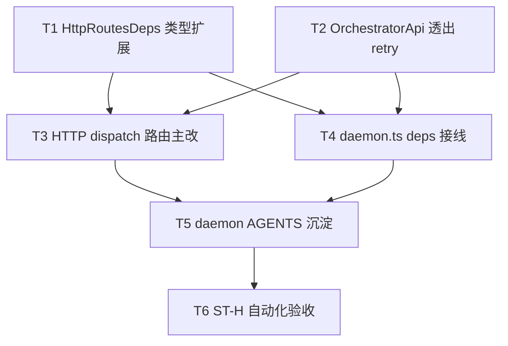

# HTTP dispatch失败重入队对齐 - 任务分解

> **来源**：`/kb-plan`（基于 `01-proposal.md`、`02-design.md`）
> **任务数**：6（T1–T6）
> **与变更 #3 划界**：本变更**不拆** `src/bridge/file-queue.ts`、不移动队列存储形态；file-queue 整体拆分归 `20260712145152-消息队列模块拆分`。
> **Ponytail**：**禁止**新建 HTTP 专用 retry 模块；**复用** `daemon-orchestrator-retry.ts` 既有 `handleLaunchFailure` / `clearAttempt`，本变更**不设**独立任务改其实现。

## 一、执行计划

### （一）依赖图



**CodeGraph 核实**（`projectPath=/home/suveng/doger/cursor-claw`）：

| 符号/文件 | 现状 | 任务 |
|-----------|------|------|
| `tryHandleOrchestratorRoute` / `POST /api/agent/dispatch` | `daemon-http-routes-orchestrator.ts:106`；失败 L122–136 内联 `ackMessages` / 仅 `scheduleBusyRetry` | T3 |
| `createDispatchRetry` / `handleLaunchFailure` | `daemon-orchestrator-retry.ts:21`；IM 已用 | **复用**，无独立实现任务 |
| `dispatchSessionToAgent` 失败分支 | `daemon-orchestrator.ts:258` 已调 `dispatchRetry.handleLaunchFailure` | T3 对齐参照 |
| `OrchestratorApi` | `daemon-orchestrator.ts:56`；return L285–297 **未**透出 `handleLaunchFailure` / `clearAttempt` | T2 |
| `HttpRoutesDeps` | `daemon-http-routes-types.ts:9`；无 retry 回调字段 | T1 |
| `createAdminApiHandler` 接线 | `daemon.ts:1684`；未注入 retry 方法 | T4 |
| `OrchestratorApi` impact | 波及 `daemon.ts` `wireDaemonSubmodules` / `orchestratorApi` | T2、T4 |

**01 验收追溯**：

| 01 验收 | 主责任务 |
|---------|----------|
| §6.1.1 失败可重试 / R1 R2 S1 | T3、T6（ST-H1） |
| §6.1.2 耗尽可感知 / R3 S2 | T3、T6（ST-H2） |
| §6.1.3 成功最终 ack / R5 S4 | T3、T6（ST-H3） |
| §6.1.4 busy 可再调度 / R4 S3 | T3、T6（ST-H4） |
| §6.2.1 IM/HTTP 语义一致 / R7 S5 | T2、T3、T6（ST-H5） |
| §6.2.2 契约形状不变 / R6 | T3、T6（ST-H6） |
| §6.3 工程规范 | T3–T5、T6（ST-H7） |

**02 §六步骤对齐**：T2→步骤 1；T1+T4→步骤 2；T3→步骤 3–4；T5→步骤 5；T6→步骤 6。

### （二）分组调度

| 轮次 | 任务 | 说明 |
|------|------|------|
| **第一轮（并行）** | T1、T2 | 不同文件：`daemon-http-routes-types.ts` vs `daemon-orchestrator.ts` |
| **第二轮（并行，建议先 T4 后 T3）** | T4、T3 | 不同文件；T1 新增 **必填** deps 字段后须 T4 补齐 `createAdminApiHandler` 对象字面量，`tsc` 方可绿 |
| **第三轮** | T5 | 依赖 T3+T4 行为定稿 |
| **第四轮** | T6 | 对照 `06-automation-test.md`（占位）执行 ST-H*；不阻塞 T1–T5 代码合入 |

**同文件冲突（禁止并行 apply）**：

| 文件 | 任务（顺序） |
|------|----------------|
| `daemon-http-routes-types.ts` | T1 |
| `daemon-orchestrator.ts` | T2 |
| `daemon-http-routes-orchestrator.ts` | T3 |
| `daemon.ts` | T4 |
| `src/daemon/AGENTS.md` | T5 |

**明确不做**：`daemon-orchestrator-retry.ts`（父债 SSOT）、`file-queue.ts`（归变更 #3）。

## 二、任务清单

## T1: HttpRoutesDeps 扩展 retry 回调类型

### 背景

HTTP 路由须经 deps 调用与 IM 相同的 `handleLaunchFailure` / `clearDispatchRetryAttempt`，避免路由层直接 import orchestrator 造成环引。本任务仅在共享类型文件声明两个函数指针，为 T3 消费与 T4 注入提供契约。

### 上下文文件

- CodeGraph: `HttpRoutesDeps` `tryHandleOrchestratorRoute` — deps 类型与 dispatch 路由落点
- 必读: `src/daemon/daemon-http-routes-types.ts` — 现有 `HttpRoutesDeps` 全文字段
- 必读: `src/daemon/daemon-orchestrator-retry.ts` — `handleLaunchFailure` 入参/返回（L54–59、L95）
- 参考: `src/daemon/daemon-orchestrator.ts` — IM 路径 `dispatchRetry.handleLaunchFailure` 调用（L258–263）

### 实现范围

- 修改: `src/daemon/daemon-http-routes-types.ts` —
  - 增加 `handleLaunchFailure: (opts: { sessionKey: string; messageIds: string[]; error?: string; busyDelayMs: number }) => Promise<"retried" | "exhausted">`
  - 增加 `clearDispatchRetryAttempt: (sessionKey: string) => void`
  - 中文注释：与 IM launch 共用同一 retry 实例；HTTP 成功时清零 attempt
- 不改: 其他 deps 字段；不新建类型文件；不修改 `daemon-orchestrator-retry.ts`

### 接口契约

- `HttpRoutesDeps.handleLaunchFailure` — 语义同 `createDispatchRetry` 导出之 `handleLaunchFailure`
- `HttpRoutesDeps.clearDispatchRetryAttempt` — 语义同 `clearAttempt(sessionKey)`

### 验收标准

- [ ] `HttpRoutesDeps` 含上述两字段，签名与 `daemon-orchestrator-retry.ts` 一致（02 §四）
- [ ] 无新 npm 依赖、无 `HttpDispatchRetryMiddleware` 等未批准抽象（Ponytail；01 §6.3）
- [ ] 关键字段含中文注释

### 依赖

- 前置任务: 无
- 后续任务: T3、T4

---

## T2: OrchestratorApi 透出 handleLaunchFailure 与 clearDispatchRetryAttempt

### 背景

父债已在 `createOrchestrator` 内构造 `dispatchRetry`，IM `dispatchSessionToAgent` 已调用 `handleLaunchFailure`，但 `OrchestratorApi` 未对外暴露。HTTP 旁路须经 orchestrator 共用**同一** `attemptBySession` Map（S5），本任务在接口与 return 对象绑定 `dispatchRetry` 方法，不改 retry 实现。

### 上下文文件

- CodeGraph: `OrchestratorApi` `createOrchestrator` `dispatchRetry` — impact 波及 `daemon.ts`
- 必读: `src/daemon/daemon-orchestrator.ts` — `OrchestratorApi`（L56–74）、`createDispatchRetry`（L87–94）、return（L285–297）、IM 失败分支（L256–263）
- 必读: `src/daemon/daemon-orchestrator-retry.ts` — 工厂返回 `{ clearAttempt, handleLaunchFailure, ... }`
- 参考: `src/daemon/daemon.ts` — `orchestratorApi` 使用点（约 L1379、L1684+）

### 实现范围

- 修改: `src/daemon/daemon-orchestrator.ts` —
  - `OrchestratorApi` 增加：
    - `handleLaunchFailure`（同上 T1 签名）
    - `clearDispatchRetryAttempt: (sessionKey: string) => void`
  - `return` 对象绑定：`dispatchRetry.handleLaunchFailure`、`dispatchRetry.clearAttempt`（对外命名 `clearDispatchRetryAttempt`）
  - 中文注释说明 HTTP 与 IM 共用实例
- 不改: `daemon-orchestrator-retry.ts` 实现；`dispatchSessionToAgent` 逻辑（已对齐）

### 接口契约

- `OrchestratorApi.handleLaunchFailure(opts) => Promise<"retried" | "exhausted">`
- `OrchestratorApi.clearDispatchRetryAttempt(sessionKey: string) => void`

### 验收标准

- [ ] `createOrchestrator` 返回对象含两新方法，委托同一 `dispatchRetry` 实例（02 步骤 H5、S5）
- [ ] IM `dispatchSessionToAgent` 行为无回归（01 §6.2.1 基线）
- [ ] 本文件仍 ≤300 行或已按既有模式拆分（01 §6.3.2）
- [ ] 无新抽象层、无改 `file-queue.ts`（Ponytail；与 #3 边界）

### 依赖

- 前置任务: 无
- 后续任务: T3、T4

---

## T3: HTTP dispatch 失败/busy 路径改调 handleLaunchFailure

### 背景

`POST /api/agent/dispatch`（L106–143）在 `!result.ok` 时仍走旧语义：busy 仅 `scheduleBusyRetry` 不 release；非 busy 直接 `notifySessionUser` + `ackMessages`（DEL-1/DEL-2）。本任务删除内联 ack/busy-only 分支，改调 deps 回调，与 IM launch 策略对称；成功分支补 `clearDispatchRetryAttempt`。

### 上下文文件

- CodeGraph: `tryHandleOrchestratorRoute` `POST /api/agent/dispatch` — 主改 L106–143
- 必读: `src/daemon/daemon-http-routes-orchestrator.ts` — 全文；重点 dispatch 分支 L106–143
- 必读: `src/daemon/daemon-orchestrator.ts` — IM 失败路径参照（L256–263）
- 必读: `src/daemon/daemon-orchestrator-retry.ts` — 行为表：release、退避、`dispatch_retry_exhausted` 文案
- 参考: `knowledge/变更/归档/20260711232817-dispatch失败重入队与ack策略/05-summary.md` — 父债 D1 差异

### 实现范围

- 修改: `src/daemon/daemon-http-routes-orchestrator.ts` —
  - **删除** L122–136：独立 busy-only `scheduleBusyRetry`、非 busy 直接 `ackMessages`（DEL-1、DEL-2）
  - `!result.ok` 时统一：
    ```typescript
    await deps.handleLaunchFailure({
      sessionKey: session_key,
      messageIds: Array.isArray(body.message_ids) ? body.message_ids : [],
      error: result.error,
      busyDelayMs: deps.parseBusyRetryDelayMs(result.error),
    });
    ```
    保留 `dispatch_failed` WARN 日志
  - `result.ok` 时：调用 `deps.clearDispatchRetryAttempt(session_key)`；**不** ack；保持 `deps.json(res, result, result.ok ? 200 : 400)`（R6）
  - 关键分支中文注释
- 不改: `ackOnReply` / stream final；不 import `file-queue`；不修改 `daemon-orchestrator-retry.ts`

### 接口契约

- 失败/busy 队列侧行为与 02 §四「HTTP 失败分支伪契约」表一致
- 对外 HTTP 响应形状不变：`{ ok, error? }` + 200/400 规则（01 R6）

### 验收标准

- [ ] 可恢复 HTTP dispatch 失败后 `.claimed→.qmsg`，日志 `dispatch_retry_scheduled`，策略窗口内可再调度（01 §6.1.1；02 ST-H1）
- [ ] 连续失败至上限：`dispatch_retry_exhausted`、通知含「已停止自动重试」，之后无自动重调度轰炸（01 §6.1.2；ST-H2）
- [ ] `result.ok` 后不 release、不提前 ack；最终 ack 仍仅 stream final / `ackOnReply`（01 §6.1.3；ST-H3）
- [ ] busy：`agent_busy_requeue` + release，容量恢复后可再调度（01 §6.1.4；ST-H4）
- [ ] 与 IM 同类失败共享 `MAX_DISPATCH_RETRIES=3` 与退避序列（01 §6.2.1；ST-H5）
- [ ] HTTP JSON 形状与状态码与改前一致（01 §6.2.2；ST-H6）
- [ ] 文件 ≤300 行；`tsc --noEmit` 通过（01 §6.3；ST-H7）
- [ ] 无未批准新抽象/新依赖（Ponytail）

### 依赖

- 前置任务: T1、T2（类型与 orchestrator API）；**合入前须 T4 已完成**（deps 接线，否则 `createAdminApiHandler` 缺字段）
- 后续任务: T5、T6

---

## T4: daemon.ts 注入 HttpRoutesDeps retry 回调

### 背景

`createAdminApiHandler`（`daemon.ts:1684`）须将 T2 透出的 `handleLaunchFailure` / `clearDispatchRetryAttempt` 注入 `HttpRoutesDeps`，完成 orchestrator → HTTP 路由闭包，关闭父债 D1 HTTP 旁路空洞。

### 上下文文件

- CodeGraph: `createAdminApiHandler` `orchestratorApi` — 接线落点 L1684–1728
- 必读: `src/daemon/daemon.ts` — `createAdminApiHandler({...})` 对象字面量全段
- 必读: `src/daemon/daemon-http-routes-types.ts` — T1 新增字段
- 必读: `src/daemon/daemon-orchestrator.ts` — T2 透出方法名

### 实现范围

- 修改: `src/daemon/daemon.ts` — 在 `createAdminApiHandler` 参数对象增加：
  - `handleLaunchFailure: (opts) => orchestratorApi.handleLaunchFailure(opts)`
  - `clearDispatchRetryAttempt: (sk) => orchestratorApi.clearDispatchRetryAttempt(sk)`
  - 一行中文注释：HTTP dispatch 与 IM 共用 retry
- 不改: `wireDaemonSubmodules` 其他逻辑；`file-queue` import；队列模块结构

### 接口契约

- `HttpRoutesDeps` 两新字段由 `orchestratorApi` 同名方法满足（02 步骤 2）

### 验收标准

- [ ] `createAdminApiHandler` 对象字面量含 T1 全部必填字段，`tsc --noEmit` 通过（ST-H7）
- [ ] 运行时 HTTP dispatch 可调通 `handleLaunchFailure`（与 T3 联调）
- [ ] 无 02/03 未要求的新依赖或中间层（Ponytail）

### 依赖

- 前置任务: T1、T2
- 后续任务: T5、T6

---

## T5: daemon/AGENTS.md 登记 HTTP dispatch retry 对齐

### 背景

知识库与源码约定须反映 HTTP 旁路已与 IM launch 共用 `handleLaunchFailure`，并登记可检索日志关键字，供运维区分「重试中 / busy 待调度 / 已停试」（01 R7；02 步骤 5）。

### 上下文文件

- 必读: `src/daemon/AGENTS.md` — 「Orchestrator 调度」节（约 L79+）
- 必读: `src/daemon/daemon-http-routes-orchestrator.ts` — T3 后 dispatch 行为
- 参考: `knowledge/变更/进行中/20260712144755-HTTP dispatch失败重入队对齐/02-design.md` §十·（一）— archive 知识库清单（本任务仅 AGENTS）

### 实现范围

- 修改: `src/daemon/AGENTS.md` —
  - 在 Orchestrator/HTTP 相关节补充：`POST /api/agent/dispatch` 失败/busy 与 `dispatchSessionToAgent` **共用** `handleLaunchFailure` / 同一 session attempt Map
  - 登记日志关键字：`dispatch_retry_scheduled`、`dispatch_retry_exhausted`、`agent_busy_requeue`、`dispatch_failed`
  - 明确：HTTP 失败禁止未耗尽 `ackMessages`；成功不提前 ack；**不**记载 file-queue 拆分（归 #3）
- 不改: `daemon-orchestrator-retry.ts`；业务域 knowledge 正文（归 archive / kb-librarian）

### 接口契约

- 文档陈述与 02 §四行为表、§八·（二）ST-H* 一致

### 验收标准

- [ ] AGENTS 含 HTTP dispatch retry 对齐说明与日志关键字（02 步骤 5；01 R7）
- [ ] 未引入「HTTP 失败即 ack」旧描述
- [ ] 无预建通用层文档（Ponytail）

### 依赖

- 前置任务: T3、T4
- 后续任务: T6

---

## T6: ST-H 自动化验收（对照 06 占位）

### 背景

02 §八·（二）定义 ST-H1～ST-H7 工程补充验收，覆盖 01 §6.1–6.3。本任务在实现合入后执行自动化/半自动脚本验收，用例细节写入或引用同目录 `06-automation-test.md`（**本任务不要求编写 06 全文**，可引用占位节）。

### 上下文文件

- 必读: `knowledge/变更/进行中/20260712144755-HTTP dispatch失败重入队对齐/01-proposal.md` — §六验收
- 必读: `knowledge/变更/进行中/20260712144755-HTTP dispatch失败重入队对齐/02-design.md` — §八·（二）ST-H1～ST-H7
- 参考: `knowledge/变更/进行中/20260712144755-HTTP dispatch失败重入队对齐/06-automation-test.md` — 占位（若不存在则 `/kb-test` 阶段补全）
- 参考: `knowledge/变更/归档/20260711232817-dispatch失败重入队与ack策略/06-automation-test.md` — IM 路径验收模式参照

### 实现范围

- 执行（非本变更代码任务）：按 ST-H 清单验证 T1–T5 合入结果
  - **ST-H1**：可恢复失败 → `.claimed→.qmsg` + `dispatch_retry_scheduled`
  - **ST-H2**：耗尽 → `dispatch_retry_exhausted` + 停试通知
  - **ST-H3**：成功仅 final/`ackOnReply` ack
  - **ST-H4**：busy → `agent_busy_requeue` + release
  - **ST-H5**：同 session IM vs HTTP attempt/退避一致
  - **ST-H6**：HTTP 响应形状不变
  - **ST-H7**：`tsc --noEmit`、行数与中文注释
- 产出：在 `06-automation-test.md` 或测试报告记录 pass/fail（由 `/kb-test` 主责时可移交）

### 接口契约

- 验收条目与 02 §八·（二）逐条对应，可追溯 01 §6.1–6.3

### 验收标准

- [ ] ST-H1～ST-H7 全部有执行记录（pass 或 documented fail + 跟进任务）
- [ ] 任一 ST-H 失败则变更不得 archive 为完成（01 §6 硬门槛）
- [ ] 验收过程不修改 `file-queue.ts` 结构（#3 边界）
- [ ] 无新增未批准依赖（Ponytail）

### 依赖

- 前置任务: T5
- 后续任务: 无（下一步 `/kb-test` 或 `/kb-archive`）
