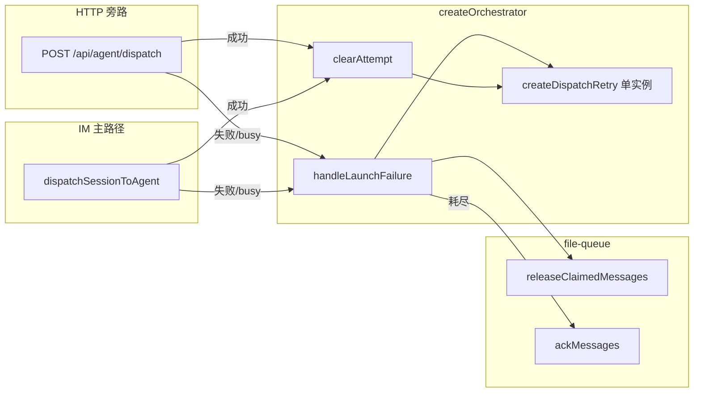

# HTTP dispatch失败重入队对齐 - 代码评审报告

## 1、审查范围

- **变更类型**: apply 产出的未提交变更（`git diff`）
- **评审等级**: focused-review（单端 daemon 可靠性对齐；无 proto/DB 变更）
- **涉及文件**: 5 个源码/约定文件 + 1 份评审报告
  - `src/daemon/daemon-http-routes-orchestrator.ts`（主改）
  - `src/daemon/daemon-orchestrator.ts`（API 透出）
  - `src/daemon/daemon-http-routes-types.ts`（deps 类型）
  - `src/daemon/daemon.ts`（接线）
  - `src/daemon/AGENTS.md`（约定登记）
- **设计文档**: `02-design.md`（对照基准）
- **父债**: `20260711232817-dispatch失败重入队与ack策略` D1（HTTP 旁路）— 本实现已清偿，**不得**再标 `accepted_debt`

## 2、严重（必须处理）

无

## 3、警告（建议处理）

无（评分 ≥75 项）

**Ponytail 精简检查**（focused Agent #3，不阻断）：

1. **Lean already. Ship.** — 未新建 HTTP 专用 retry 模块；失败路径复用 `daemon-orchestrator-retry.ts` `handleLaunchFailure`，与 `02` §2 最小方案三问一致。
2. **shrink:** `HttpRoutesDeps.scheduleBusyRetry` — T3 后 HTTP dispatch 路由已不再调用，仅经 deps 注入保留；可在后续清理变更中从 `HttpRoutesDeps` / `daemon.ts` 接线移除（评分 50，非本期范围）。
3. **native:** 抽出 `DispatchLaunchFailureOpts` / `DispatchLaunchFailureResult` 共享类型 — 避免 orchestrator 与 types 重复签名，行数净增可接受，非未批准抽象。

## 4、设计偏差

无

实现与 `02-design.md` 逐步对照：

| 设计步骤 | 预期 | 实际 | 结论 |
|---------|------|------|------|
| DEL-1/DEL-2 | 删除 HTTP 内联 `ackMessages` 与 busy-only `scheduleBusyRetry` | `daemon-http-routes-orchestrator.ts` 失败分支仅调 `handleLaunchFailure` | ✅ |
| F1/B1 | `!result.ok` 统一 `handleLaunchFailure` + `parseBusyRetryDelayMs` | 与 IM 路径入参结构一致 | ✅ |
| H4/S4 | `result.ok` 时 `clearDispatchRetryAttempt`，不 ack | 成功分支已接线 | ✅ |
| H5/S5 | OrchestratorApi 透出同一 `dispatchRetry` 实例 | `handleLaunchFailure` / `clearDispatchRetryAttempt` 绑定 `dispatchRetry` | ✅ |
| R6 | HTTP 响应形状不变 | 仍 `deps.json(res, result, result.ok ? 200 : 400)` | ✅ |

**说明**：IM `dispatchSessionToAgent` 失败前仍 `sessionAgentPhaseMap.delete`；HTTP 旁路不经 claim/phase 门控，未删 phase 属既有架构差异，非本变更引入，与 `02` 范围一致。

## 5、验收标准检查

| 任务 | 验收条件 | 状态 |
|------|---------|------|
| T1 | `HttpRoutesDeps` 含 `handleLaunchFailure` / `clearDispatchRetryAttempt`，签名与 retry 模块一致 | ✅ 静态核对 |
| T1 | 无未批准抽象；中文注释 | ✅ |
| T2 | `OrchestratorApi` 透出两方法，委托同一 `dispatchRetry` | ✅ |
| T2 | IM `dispatchSessionToAgent` 仍调 `dispatchRetry.handleLaunchFailure`（L252） | ✅ 无回归 |
| T2 | `daemon-orchestrator.ts` ≤300 行 | ✅ 294 行 |
| T3 | 删除内联 ack / busy-only 分支 | ✅ diff 确认 |
| T3 | 失败统一 `handleLaunchFailure`；成功 `clearDispatchRetryAttempt` | ✅ |
| T3 | `tsc --noEmit` 通过 | ✅ |
| T3 | `daemon-http-routes-orchestrator.ts` ≤300 行 | ✅ 148 行 |
| T4 | `createAdminApiHandler` 注入两回调 | ✅ `daemon.ts` L1715–1717 |
| T5 | `AGENTS.md` 登记共用 retry、日志关键字、ack 规矩 | ✅ |
| T6 | ST-H1～ST-H7 自动化/半自动执行记录 | ⏳ 待 `/kb-test`（`06-automation-test.md` 尚未落盘） |

**01 §6.1 运行时验收**（ST-H1～ST-H4、S5）：静态评审无法替代；已纳入 T6，由 `/kb-test` 执行。

## 6、调用链与回归风险

| 回归点 | 风险 | 评审结论 |
|--------|------|----------|
| IM launch 失败重试语义 | 中 | 未改 `dispatchSessionToAgent` 失败分支逻辑，仅 API 透出 |
| 同 session HTTP↔IM 共用 `attemptBySession` | 低（设计预期 S5） | 两入口绑定同一 `dispatchRetry` 实例 |
| HTTP 无 `message_ids` 时 release/ack no-op | 低 | `02` §八·（一）已记载；行为与改前一致 |
| 成功路径重复执行 | 低 | 成功仅 `clearAttempt`，不 release/ack |
| `scheduleBusyRetry` deps 冗余 | 极低 | HTTP 路由不再直调；不影响运行时 |

CodeGraph：索引未命中 `handleLaunchFailure` / `createDispatchRetry`（工厂闭包符号）；已用源码 + grep 核对调用链，与上表一致。

## 7、遗留债务

无

父债 D1（HTTP 旁路「失败即 ack / busy 不 release」）已由本变更代码清偿；**禁止**在 `reviews` 中登记 `accepted_debt`。

## 8、修复任务建议

无 open 问题，无需 `T-FIX-*`。

| 问题 ID | 建议动作 | 关联任务 |
|---------|----------|----------|
| — | — | — |

## 9、结论

**通过**，可进入 `/kb-test`。

- T1–T5 实现与 `02-design.md` / `03-tasks.md` 一致；`tsc --noEmit` 通过；父债 D1 已清偿。
- T6（ST-H1～ST-H7 运行时验收）仍为 `pending`，须在 `/kb-test` 补全 `06-automation-test.md` 并执行后再 `/kb-archive`。
- 评审等级：**focused-review**；严重 0、警告（≥75）0；Ponytail：**Lean already. Ship.**
