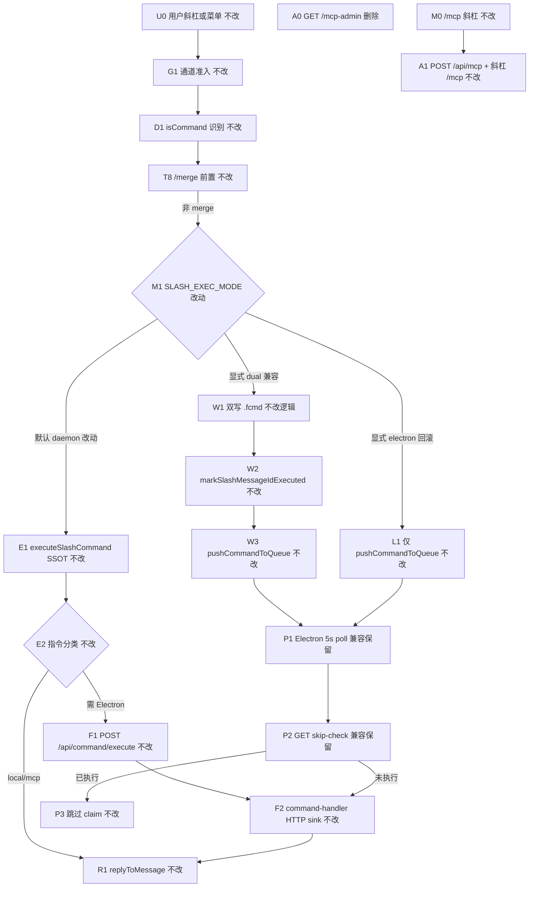
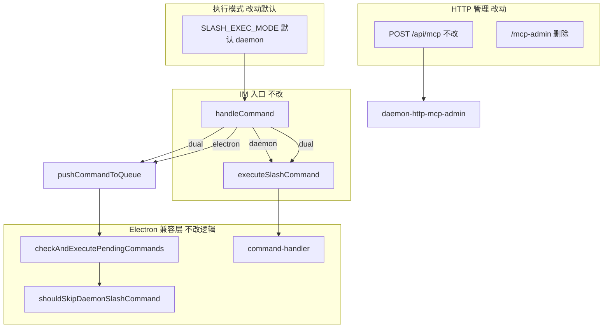

# 斜杠执行模式稳态收尾 - 实现设计

> **业务 PRD**：见同目录 `01-proposal.md`（验收标准以 01 为准）
> **父变更**：`20260712113307-控制层HTTP化与斜杠去Electron依赖`（已归档；步骤 9「迁移收尾」由本变更清偿）
> **业务流程口径**：01 §四 场景 S1～S5、§五 R1～R7、§六验收 6.1～6.3

## 一、业务流程与改动范围

> 业务口径以 `01-proposal.md` §四 / §五 / §六 为准；下图覆盖默认稳态（daemon）、可选 dual 兼容、旧 `/mcp-admin` 收尾与 poll 去重路径界定。

### （一）业务流程图

**图例**：`不改` 行为与父变更归档后一致；`改动` 默认/文档/废弃结论；`删除` 移除旧入口；`兼容保留` 仅 `dual|electron` 显式开启时生效。

### （二）流程步骤与改动对照

| 步骤 ID | 业务含义 | 改动 | 落点（模块/文件） | 01 验收关联 |
|---------|----------|------|-------------------|-------------|
| U0 | 飞书/微信斜杠或菜单 | 不改 | `feishu-event-handlers.ts`；`daemon.ts` 通道回调 | 6.2 功能集不变 |
| G1 | 群聊 @ / 私聊绑定 | 不改 | `daemon.ts` 入站门控 | 6.2 |
| D1 | `isCommand` + `COMMANDS` | 不改 | `daemon.ts` | 6.1.1 |
| T8 | `/merge` Daemon 内闭环 | 不改 | `daemon.ts` `handleCommand` 前置 | 与 T8 划界 |
| M1 | **默认**斜杠执行模式为 daemon | 改动 | `daemon.ts` `getSlashExecMode`；`daemon-manager.ts` `resolveSlashExecMode` | R1；6.1.1 |
| E1 | Daemon SSOT 即时执行 | 不改 | `daemon-slash-executor.ts` `executeSlashCommand` | 6.1.1 |
| F1/F2 | Electron 指令 HTTP 同步 | 不改 | `daemon-orchestrator.ts`；`command-handler.ts` `runWithHttpCommandResultSink` | 6.1.1；S5 |
| W1～W3 | dual 双写 + dedup | 不改逻辑；**非默认** | `daemon.ts` `handleCommand` L1396-1399 | R2；6.1.3 |
| P1～P3 | poll + skip-check 去重 | 兼容保留；**daemon 默认不走** | `daemon-manager.ts`；`daemon.ts` skip-check 包装 | R3/R4；6.1.2 |
| L1 | electron 回滚仅入队 | 不改 | `daemon.ts` `handleCommand` L1379-1382 | R2 可选兼容 |
| A0 | 旧 MCP Admin 端点 `/mcp-admin` | 删除 | `daemon-http-server.ts`；`daemon.ts` 启动日志 | R5；6.1.4 |
| A1 | 正式 MCP 管理入口 | 不改 | `daemon-http-admin-content.ts` `/api/mcp`；`daemon-slash-mcp.ts` | R5；6.1.4 |
| M0 | 斜杠 `/mcp` | 不改 | `daemon-slash-executor.ts` → `executeSlashMcp` | 6.2 |
| DOC | 默认与文档一致 | 改动 | `src/daemon/AGENTS.md`；知识库 Daemon/Agent 域 | R6；6.3 |

### （三）改动汇总

- **改动**：
  - `SLASH_EXEC_MODE` **默认值** `dual` → **`daemon`**（Daemon 与 Electron 两侧解析函数同步；非法 env 回退 **`daemon`**）。
  - 运维文档：`dual`/`electron` 标注为**显式兼容/回滚**，非开箱默认。
  - **移除** HTTP `/mcp-admin` StreamableHTTP 端点；启动日志不再宣称双 MCP 服务并存。
  - `workspace-injector.ts`：停止向 `mcp.json` 注入 `cursor-claw-admin` → `/mcp-admin`（注入已 no-op，清理残留键 SSOT）。
  - poll 去重（`/commands*`、`skip-check`、`executed-ids`）：代码保留，注释与 KB 标明 **仅 dual|electron**。
- **不改**：
  - `executeSlashCommand` 指令集、`POST /api/command/execute` 契约、`command-handler.ts` 语义。
  - IM 入队、MergeBatch、Presentation、消息队列 `.qmsg` 语义。
  - `/mcp` Agent MCP 工具（send_text 等）与 `POST /api/mcp` CRUD/enable/disable/info。
- **删除**：
  - `/mcp-admin` 路由及 `createAdminMcpServer` 监听分支（`manage_*` 不再经 MCP StreamableHTTP 暴露）。

## 二、整体思路

**根因**（见 01 §一；CodeGraph + 源码核实）：父变更 T10 已将斜杠 SSOT 迁至 Daemon（`executeSlashCommand`，`daemon-slash-executor.ts:95`），但 **`getSlashExecMode` 默认仍为 `dual`**（`daemon.ts:106`），`handleCommand` 在 dual 下仍 **双写 `.fcmd`**（L1396-1399）并依赖 Electron poll + `GET /commands/skip-check`（`daemon-manager.ts:925-970`）防重复。运维观感为「文档称 Daemon SSOT，现场仍迁移期双写」。另 T10 遗留 **`/mcp-admin`** 与 `/api/mcp` 双入口（`daemon-http-server.ts:68`；KB `02-HTTP与MCP服务.md` §五仍标废弃中）。

**方案要点**（追溯 01 R1～R7）：

1. **默认稳态（R1/R6）**：开箱 `SLASH_EXEC_MODE=daemon`；斜杠经 `executeSlashCommand` 一次执行、**不写 `.fcmd`**，无需 dual 即可可用（01 S1）。
2. **dual 可选（R2/R3）**：保留三态枚举；`dual` 仅 env 显式开启，行为与父变更 T-FIX-03 一致（双写 + skip-check）；关闭 env 即回 daemon。
3. **无默认双写（R4）**：daemon 默认下 Eliminate poll 主路径对斜杠的重复 claim；poll 代码路径保留供 electron 回滚与 dual 兼容。
4. **旧 admin 结论（R5）**：产品结论为 **移除 `/mcp-admin`**；正式管理路径为 **`POST /api/mcp`**（HTTP）与 **`/mcp` 斜杠**（IM）；`manage_*` MCP 工具随 admin 端点一并退役（Agent `/mcp` send_* 保留）。
5. **与相邻变更划界**：HTTP dispatch 重入队（`20260712144755`，已合入 `2157eb1`）不改斜杠路径；消息队列拆分（`20260712145152`）不拆 `handleCommand`；implement 时 **`daemon.ts` 须与 #1 已合入 wiring 协调**，避免覆盖 `handleAdminApiRef` skip-check 包装（L1733-1749）。

**最小方案三问（Ponytail）**：

1. **能否复用现有模块/符号？** 能。复用 `executeSlashCommand`、`handleCommand` 三态分支、`markSlashMessageIdExecuted`、`shouldSkipDaemonSlashCommand`、父债 `command-executor`/`runWithHttpCommandResultSink`；**不**新建执行模式状态机或配置服务。
2. **拟新增抽象/依赖是否被 01 要求？** 否。仅改 env 默认值、删除 `/mcp-admin` 路由分支、注释与 KB；不引入 Feature Flag 框架、不建 `SlashExecModeService`、无新 npm 包。
3. **能否合并到已有文件？** 能。默认改 `daemon.ts` + `daemon-manager.ts` 各一行；`/mcp-admin` 删 `daemon-http-server.ts` 分支；injector 删 admin URL；**不**为稳态收尾预建新模块（`daemon.ts` 行数已高，本变更**不**扩 scope 做批2 拆分）。

## 三、分层设计

- **配置层**：进程 env `SLASH_EXEC_MODE`；默认 `daemon`；Dual/Electron 文档化。
- **Daemon 控制层**：`handleCommand` 路由不变；默认停写 `.fcmd`。
- **Electron 执行层**：poll 与 HTTP command execute 共用 `command-handler`；dual 时 skip-check 仍生效。
- **HTTP 暴露层**：管理走 REST `/api/mcp`；移除 legacy MCP admin transport。

## 四、接口设计

### 环境变量（改动）

| 变量 | 值 | 默认（改后） | 说明 |
|------|-----|--------------|------|
| `SLASH_EXEC_MODE` | `daemon` \| `dual` \| `electron` | **`daemon`** | 非法值回退 **`daemon`**（改前回退 `dual`） |

### 斜杠主路径（不改契约）

- Daemon 内：`executeSlashCommand` → 本地 / `executeSlashMcp` / `forwardElectronCommandApi("/api/command/execute", …)`。
- Electron：`POST /api/command/execute` → `runWithHttpCommandResultSink` → 各 `handleFeishu*Command`（`command-handler.ts:24-46`）。

### 遗留 poll HTTP（dual|electron 兼容，daemon 默认不使用）

| 方法 | 路径 | daemon 默认 | dual/electron |
|------|------|-------------|---------------|
| GET | `/commands` | 无斜杠 `.fcmd` | 列队 |
| POST | `/commands/claim` | 同上 | claim |
| GET | `/commands/skip-check?messageId=` | 无调用 | claim 前去重 |
| GET | `/commands/executed-ids` | 无调用 | 5s 批量缓存 |
| POST | `/cmd/result` | poll 路径不用 | Electron 回报 |

### MCP 端点（改动）

| 路径 | 改后 | 说明 |
|------|------|------|
| `/mcp` | **保留** | Agent 工具 send_text/image/file + workflow |
| `/mcp-admin` | **删除**（404 或 410 + JSON 指引 `/api/mcp`） | 01 R5；不再注册 `createAdminMcpServer` |
| `POST /api/mcp` | **保留** | list/add/delete/enable/disable/info SSOT |

## 五、数据结构

无表/字段/持久化模型变更。

**进程内（dual 兼容期保留）**：

| 结构 | 键 | 说明 |
|------|-----|------|
| `slashExecutedMessageIds` | `messageId` → ts | 60s TTL；**仅 dual poll skip-check 使用** |
| `cachedDaemonSlashExecutedIds` | Set | Electron 侧批量缓存（`daemon-manager.ts:889`） |

**`.fcmd`（dual|electron 才写入）**：字段不变；daemon 默认不产生斜杠 `.fcmd`。

## 六、实现步骤

1. **D1**：`daemon.ts` `getSlashExecMode` 默认与非法回退改为 `daemon`；启动日志 `SLASH_EXEC_MODE=` 可观测。（步骤 M1）
2. **D2**：`daemon-manager.ts` `resolveSlashExecMode` 同步默认/回退。（步骤 M1）
3. **D3**：`handleCommand` / poll 相关注释标明 dual-only；确认 daemon 默认不触发 `pushCommandToQueue`（逻辑已满足，补注释 + 自检）。（步骤 W1、P1）
4. **A0**：`daemon-http-server.ts` 移除 `/mcp-admin` 分支；`daemon.ts` 启动日志改为仅 `/mcp` + `/api/mcp` 指引。（步骤 A0）
5. **A1**：`workspace-injector.ts` 自 `buildMcpServers` 移除 `cursor-claw-admin`；`CLAW_MCP_KEYS` 保留 cleanup 以清历史残留。（步骤 A0）
6. **DOC**：更新 `src/daemon/AGENTS.md` 与知识库默认模式、双写说明、`/mcp-admin` 废弃结论。（步骤 DOC、R6）
7. **验收**：默认 daemon 飞书 `/status` ≤3s 单回复；显式 `dual` 仍 skip-check；`/mcp-admin` 不可达；对照 01 §6.1 与 §八·（二）。（步骤 ST-*）

## 七、参考实现

CodeGraph（`projectPath=/home/suveng/doger/cursor-claw`）与源码核实：

| 符号 | 路径 | 与本变更关系 |
|------|------|----------------|
| `getSlashExecMode` | `src/daemon/daemon.ts:105` | **主改**：默认 `dual`→`daemon` |
| `handleCommand` | `src/daemon/daemon.ts:1359` | 三态路由 SSOT；默认不再 dual 双写 |
| `markSlashMessageIdExecuted` / `isSlashMessageIdExecuted` | `src/daemon/daemon.ts:123-140` | dual dedup；daemon 默认仍调用 mark（无害） |
| skip-check 包装 | `src/daemon/daemon.ts:1733-1749` | dual 专用 HTTP；与 #1 合入点 **冲突敏感** |
| `executeSlashCommand` | `src/daemon/daemon-slash-executor.ts:95` | SSOT；不改 |
| `runWithHttpCommandResultSink` | `electron/scheduling/command-handler.ts:24` | HTTP sink；不改 |
| `resolveSlashExecMode` | `electron/daemon/daemon-manager.ts:891` | **主改**：默认同步 |
| `shouldSkipDaemonSlashCommand` | `electron/daemon/daemon-manager.ts:925` | dual claim 前去重；不改 |
| `checkAndExecutePendingCommands` | `electron/daemon/daemon-manager.ts:949` | poll 主路径；dual/electron 兼容 |
| `/commands` 路由 | `src/daemon/daemon-http-non-api-routes.ts:170` | 遗留 poll；注释 dual-only |
| `/mcp` \| `/mcp-admin` | `src/daemon/daemon-http-server.ts:68` | **删 admin 分支** |
| `createAdminMcpServer` | `src/daemon/daemon-http-mcp.ts:97` | admin 工具注册；随路由删除不再监听 |
| `registerAdminTools` / `manage_mcp` | `src/daemon/server-admin.ts:53` | 仍供内部参考；不再经 `/mcp-admin` 暴露 |
| `buildMcpServers` | `electron/agent/shared/workspace-injector.ts:33` | 移除 admin URL |
| 父债步骤 9 | 归档 `02-design.md` §六步骤 9 | 本变更清偿项 |

## 八、技术影响

### （一）影响范围

- **涉及模块**：`src/daemon/daemon.ts`、`daemon-http-server.ts`、`daemon-http-mcp.ts`（引用清理）、`AGENTS.md`；`electron/daemon/daemon-manager.ts`；`electron/agent/shared/workspace-injector.ts`；知识库 Daemon/Agent/Electron 域。
- **接口变更**：删除 `/mcp-admin`；无 proto；`SLASH_EXEC_MODE` 默认语义变更（**非 breaking**：显式设 `dual` 行为不变）。
- **数据变更**：无；daemon 默认减少 `.fcmd` 写入。
- **风险**：
  - **环境仍设 dual**：行为与现网相同；文档须强调显式开关。
  - **依赖 `/mcp-admin` 的外部 MCP 客户端**：移除后 404；须 KB 指向 `/api/mcp`。
  - **`daemon.ts` 合并冲突**：与 HTTP dispatch（#1）、队列拆分并行时以 skip-check 包装与 orchestrator deps 为协调点。
  - **electron 回滚**：保留 `SLASH_EXEC_MODE=electron` 全量 poll。

### （二）工程补充验收项

- [ ] **ST-S1（01 §6.1.1 / R1）**：未设置 env 时 Daemon 启动日志 `SLASH_EXEC_MODE=daemon`；飞书发 `/status`，Electron 未 claim，≤3s 单条回复。
- [ ] **ST-S2（01 §6.1.2 / R4）**：默认配置连发 `/status` 或 IM+菜单同指令，无重复 `reportCommandResult` / 双回复。
- [ ] **ST-S3（01 §6.1.3 / R2）**：显式 `SLASH_EXEC_MODE=dual` 时双写 + skip-check 仍有效；改回 `daemon` 后无新斜杠 `.fcmd`。
- [ ] **ST-S4（01 §6.1.4 / R5）**：`GET/POST /mcp-admin` 返回 404 或 410 且 body 指引 `/api/mcp`；`/mcp ls` 与 `POST /api/mcp` list 仍可用。
- [ ] **ST-S5（01 S5 / R1）**：Electron 未运行时 `/help` 可回复；`/stop` 返回「应用未运行」类文案。
- [ ] **ST-S6（01 §6.3）**：改动文件 ≤300 行或已拆分；关键分支中文注释；`tsc --noEmit` 通过。
- [ ] **ST-S7（父债回归）**：`/merge` 与 `/status` 同会话连发无交叉污染；菜单 `cmd_status` 不经 poll。

## 九、知识库影响

- `knowledge/工程平台/Daemon守护进程/01-概览.md` — **高**：默认 `SLASH_EXEC_MODE=daemon`；dual 改可选。
- `knowledge/工程平台/Daemon守护进程/02-HTTP与MCP服务.md` — **高**：移除 `/mcp-admin`；poll/skip-check 标 dual-only。
- `knowledge/业务域/Agent调度/04-远程指令.md` — **中**：默认模式与双写说明。
- `knowledge/工程平台/Electron桌面应用/04-配置与更新.md` — **中**：T10 `/mcp-admin` 废弃关闭。
- 父变更归档 `05-summary.md` §2 差异表「默认 dual」— archive 后由本变更 summary 关闭。

## 十、知识库更新计划

### （一）必须更新

- `knowledge/工程平台/Daemon守护进程/01-概览.md` — §五/§六/§九：默认 daemon；dual 显式兼容。
- `knowledge/工程平台/Daemon守护进程/02-HTTP与MCP服务.md` — §二/§五：删除 `/mcp-admin`；`/api/mcp` + 斜杠为管理 SSOT；skip-check 仅 dual。
- `knowledge/业务域/Agent调度/04-远程指令.md` — §一/§九：默认稳态与 poll 降级说明。

### （二）可能更新（视实现结果）

- `knowledge/工程平台/Electron桌面应用/04-配置与更新.md` — admin HTTP 化 T10 收尾表述。
- `knowledge/业务域/消息桥接/02-飞书通道.md` — 若 help/运维文案提及执行模式。
- `src/daemon/AGENTS.md` — 默认模式与 `/mcp-admin` 移除（implement 必改，archive 时可同步 KB）。

### （三）不需要更新

- `knowledge/知识地图.md` — 入口未变。
- IM 协议、MergeBatch、Presentation 专文 — 无行为变更。
