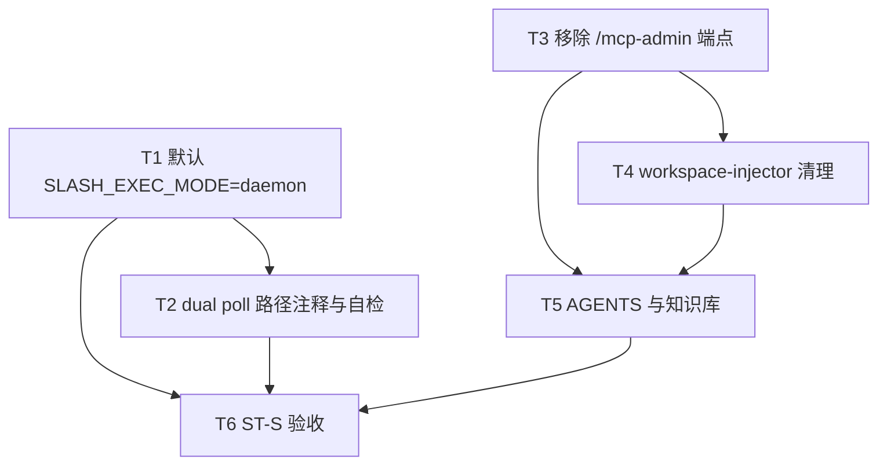

# 斜杠执行模式稳态收尾 - 任务分解

> **来源**：`/kb-plan`（基于 `01-proposal.md`、`02-design.md`）
> **任务数**：6（T1–T6）
> **父变更**：`20260712113307-控制层HTTP化与斜杠去Electron依赖` 步骤 9 迁移收尾
> **并行划界**：HTTP dispatch（#1 已合入 `2157eb1`）apply 时 **`daemon.ts` 须协调** skip-check 包装；消息队列拆分（`20260712145152`）不拆本变更范围
> **Ponytail**：**禁止**新建执行模式服务/中间层；**仅**改 env 默认、删 `/mcp-admin`、注释与 KB

## 一、执行计划

### （一）依赖图

**CodeGraph 核实**（`projectPath=/home/suveng/doger/cursor-claw`）：

| 符号/文件 | 现状 | 任务 |
|-----------|------|------|
| `getSlashExecMode` | `daemon.ts:106` 默认 `dual` | T1 |
| `resolveSlashExecMode` | `daemon-manager.ts:892` 默认 `dual` | T1 |
| `handleCommand` dual 双写 | `daemon.ts:1396-1399` | T2 注释；T6 验收 |
| skip-check 包装 | `daemon.ts:1733-1749` | T2；**与 #1 冲突敏感** |
| `/mcp-admin` 路由 | `daemon-http-server.ts:68` | T3 |
| `buildMcpServers` admin URL | `workspace-injector.ts:38` | T4 |
| `executeSlashCommand` | `daemon-slash-executor.ts:95` | **不改** |
| `command-handler` HTTP sink | `command-handler.ts:24` | **不改** |

**01 验收追溯**：

| 01 验收 | 主责任务 |
|---------|----------|
| §6.1.1 默认 daemon / R1 | T1、T6（ST-S1） |
| §6.1.2 无双写重复 / R4 | T1、T2、T6（ST-S2） |
| §6.1.3 dual 可选 / R2 R3 | T2、T6（ST-S3） |
| §6.1.4 旧 admin 结论 / R5 | T3、T4、T5、T6（ST-S4） |
| S5 Electron 未就绪 / R1 | T6（ST-S5） |
| §6.3 工程规范 / R6 | T1–T5、T6（ST-S6） |

**02 §六步骤对齐**：T1→步骤 1–2；T2→步骤 3；T3→步骤 4；T4→步骤 5；T5→步骤 6；T6→步骤 7。

### （二）分组调度

| 轮次 | 任务 | 说明 |
|------|------|------|
| **第一轮（并行）** | T1、T3 | 不同文件：`daemon.ts`+`daemon-manager.ts` vs `daemon-http-server.ts` |
| **第二轮（并行）** | T2、T4 | T2 注释；T4 injector（依赖 T3 定稿废弃结论） |
| **第三轮** | T5 | 依赖 T1–T4 行为定稿 |
| **第四轮** | T6 | ST-S* 实机/契约验收 |

**同文件冲突（禁止并行 apply）**：

| 文件 | 任务（顺序） | 备注 |
|------|----------------|------|
| `src/daemon/daemon.ts` | T1 → T2 | 与 #1 `2157eb1` 合入时 **rebase 后**再改 |
| `electron/daemon/daemon-manager.ts` | T1 → T2 | 历史超限文件；最小 diff |
| `src/daemon/daemon-http-server.ts` | T3 | — |
| `electron/agent/shared/workspace-injector.ts` | T4 | — |
| `src/daemon/AGENTS.md` + 知识库 | T5 | — |

**明确不做**：`daemon-slash-executor.ts`、`command-handler.ts` 业务语义、`file-queue.ts`、HTTP dispatch retry 逻辑。

## 二、任务清单

## T1: 默认 SLASH_EXEC_MODE 切到 daemon

### 背景

父变更归档 summary 记录设计步骤 9 未做：现网默认仍为 `dual`，新装/重启后仍双写。01 R1/R6 要求开箱即 daemon 稳态。

### 上下文文件

- 必读: `src/daemon/daemon.ts` — `getSlashExecMode`（L105-109）、`daemonMain` 启动日志（L1760）
- 必读: `electron/daemon/daemon-manager.ts` — `resolveSlashExecMode`（L891-895）、`wireSlashPollSkipChecker`（L912）
- 参考: 父归档 `05-summary.md` §2「默认 dual」差异行

### 实现范围

- `getSlashExecMode`：`process.env.SLASH_EXEC_MODE ?? "daemon"`；非法值回退 `daemon`
- `resolveSlashExecMode`：与 Daemon 侧语义一致
- 更新两处函数上方中文注释（迁移期默认 dual → 稳态默认 daemon）
- **禁止**修改 `handleCommand` 三态分支逻辑（仅默认 env 变化）

### 接口契约

- 环境变量 `SLASH_EXEC_MODE`：`daemon` | `dual` | `electron`；**未设置时 = `daemon`**
- 显式 `dual`/`electron` 行为与父变更归档后一致

### 验收标准

- [ ] 未设 env 启动 Daemon，日志含 `SLASH_EXEC_MODE=daemon`（ST-S1）
- [ ] 飞书 `/status` 默认配置 ≤3s 单回复，Electron 未 claim（ST-S1、01 §6.1.1）
- [ ] 显式 `SLASH_EXEC_MODE=dual` 仍双写 `.fcmd`（ST-S3）
- [ ] 无 02/03 未要求的抽象层或未批准新依赖（Ponytail）

### 依赖

无

---

## T2: dual poll 去重路径注释与 daemon 默认自检

### 背景

01 R3/R4：poll / skip-check 可整段标注「仅兼容」；daemon 默认不得与双写主路径并存。代码已满足（daemon 不写 fcmd），须注释 + 静态确认。

### 上下文文件

- 必读: `src/daemon/daemon.ts` — `handleCommand`（L1359-1400）、skip-check 包装（L1733-1749）
- 必读: `electron/daemon/daemon-manager.ts` — `shouldSkipDaemonSlashCommand`、`checkAndExecutePendingCommands`
- 必读: `src/daemon/daemon-http-non-api-routes.ts` — `/commands*`（L170-188）

### 实现范围

- 在 `handleCommand` dual 分支、`skip-check`/`executed-ids` 包装、`daemon-http-non-api-routes` `/commands` 路由处补中文注释：**仅 dual|electron 斜杠兼容**
- 确认 `wireSlashPollSkipChecker` 在 daemon 模式清除 checker（已有逻辑，注释即可）
- **禁止**删除 poll 实现（electron 回滚仍需要）

### 接口契约

- 无对外 HTTP 形状变更

### 验收标准

- [ ] 默认 daemon 下飞书连发 `/status` 无双回复（ST-S2）
- [ ] `dual` 模式 skip-check 仍跳过已执行 messageId（ST-S3；可对照父债 S7 用例）
- [ ] 注释覆盖 M1/W1/P1/P2/P3 落点
- [ ] Ponytail：无新模块

### 依赖

T1

---

## T3: 移除 /mcp-admin HTTP 端点

### 背景

01 R5：T10 旧管理入口须有废弃/移除结论。`/api/mcp` 与斜杠 `/mcp` 已是 SSOT；`/mcp-admin` StreamableHTTP 与 `manage_*` 造成双入口观感。

### 上下文文件

- 必读: `src/daemon/daemon-http-server.ts` — L68-79 `/mcp` vs `/mcp-admin`
- 必读: `src/daemon/daemon-http-mcp.ts` — `createAdminMcpServer`
- 必读: `src/daemon/daemon.ts` — 启动日志「MCP 服务已就绪」（约 L1857）

### 实现范围

- 删除 `pathname === "/mcp-admin"` 分支；保留 `/mcp` Agent MCP
- 启动日志改为仅声明 `/mcp`（Agent 工具）+ 管理走 `/api/mcp` 或斜杠 `/mcp`
- 若 `createAdminMcpServer` 仅被 admin 路由使用，删除未使用 import/export（或保留函数供将来内联测试，但**不得**再监听）
- 可选：对 `/mcp-admin` 返回 410 JSON `{ error, hint: "请使用 POST /api/mcp 或 IM /mcp" }`（implement 二选一，须 ST-S4 可测）

### 接口契约

- `/mcp`：不变
- `/mcp-admin`：**不可再建立 MCP session**（404 或 410）

### 验收标准

- [ ] `curl /mcp-admin` 非 200 MCP 握手（ST-S4）
- [ ] `/mcp ls`（斜杠）与 `GET /api/mcp` 仍可用（ST-S4）
- [ ] 启动日志无「/mcp + /mcp-admin」双就绪误导文案
- [ ] Ponytail：不新建 admin 网关层

### 依赖

无（可与 T1 并行）

---

## T4: workspace-injector 停止注入 cursor-claw-admin

### 背景

`buildMcpServers` 仍指向 `${base}/mcp-admin`（`workspace-injector.ts:38`）。移除端点后须停止注入，避免用户 `mcp.json` 残留无效 admin 条目。

### 上下文文件

- 必读: `electron/agent/shared/workspace-injector.ts` — `buildMcpServers`、`CLAW_MCP_KEYS`、`removeClawMcpKeys`
- 参考: `electron/agent/shared/AGENTS.md` — 注入已 no-op 说明

### 实现范围

- `buildMcpServers` 仅保留 `cursor-claw` → `/mcp`
- `CLAW_MCP_KEYS` 仍含 `cursor-claw-admin` 供 **cleanup** 删除历史键
- 中文注释说明 admin 管理改 `/api/mcp`

### 接口契约

- `buildMcpServers()` 返回 `{ "cursor-claw": { url } }` only

### 验收标准

- [ ] 新注入（若手动触发 cleanup/build）不再含 `cursor-claw-admin`
- [ ] `removeClawMcpKeys` 仍可清理旧 admin 键
- [ ] Ponytail：最小 diff

### 依赖

T3

---

## T5: AGENTS 与知识库默认稳态同步

### 背景

01 R6：文档与默认一致。02 §十 列必须更新 KB 三文件 + daemon AGENTS。

### 上下文文件

- 必读: `src/daemon/AGENTS.md` — `SLASH_EXEC_MODE` 段（约 L108）
- 必读: `knowledge/工程平台/Daemon守护进程/01-概览.md`、`02-HTTP与MCP服务.md`
- 必读: `knowledge/业务域/Agent调度/04-远程指令.md`
- 可选: `knowledge/工程平台/Electron桌面应用/04-配置与更新.md`

### 实现范围

- `AGENTS.md`：默认 `daemon`；dual 显式兼容；删除 `/mcp-admin` 表述
- KB 三文件：默认模式、poll/skip-check dual-only、`/mcp-admin` 已移除、管理 SSOT
- **禁止**改业务代码

### 接口契约

- 无

### 验收标准

- [ ] KB 与代码默认一致（ST-S6 文档项）
- [ ] 02 §十（一）三文件均已更新
- [ ] 单文件 ≤3000 字符（KB 规范）

### 依赖

T1、T3、T4

---

## T6: ST-S 工程验收与父债回归

### 背景

覆盖 01 §6.1–6.3 与 02 §八·（二）ST-S1～ST-S7；含父债 `/merge`、菜单 poll 回归。

### 上下文文件

- 必读: 同目录 `01-proposal.md` §六
- 参考: 父归档 `06-automation-test.md` S1/S7 用例
- 参考: 父归档 `auto_test/run-slash-control-contract.mts`（若存在则扩展默认 daemon case）

### 实现范围

- 执行 ST-S1～ST-S7 清单（实机或契约脚本）
- 必要时在同目录 `06-automation-test.md` **占位**（`/kb-test` 阶段再填；本任务可仅记录手工结果）
- **禁止**为验收新建业务模块

### 接口契约

- 无代码契约变更

### 验收标准

- [ ] ST-S1～ST-S7 全部勾选或记录失败原因
- [ ] 默认 daemon：无斜杠 `.fcmd` 新增（检查 queue 目录）
- [ ] `tsc --noEmit` 通过（ST-S6）
- [ ] Ponytail：验收不引入新依赖

### 依赖

T1、T2、T5
