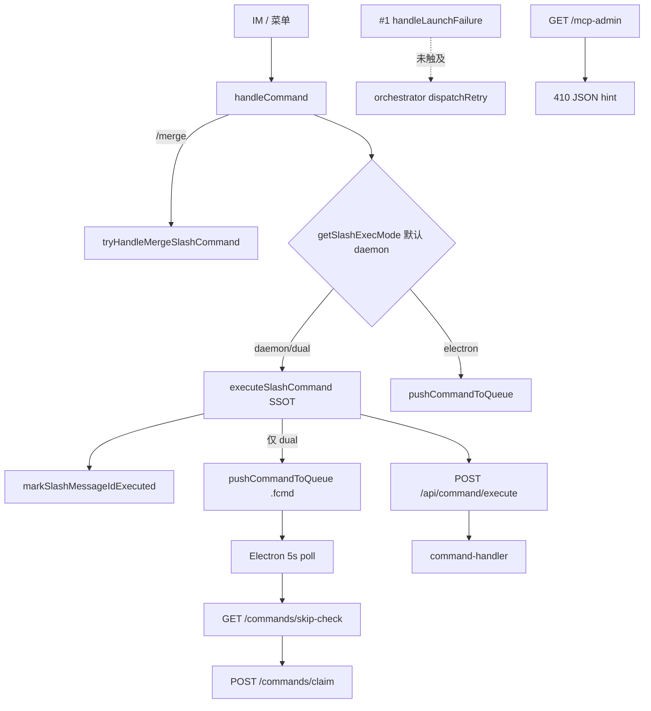

# 斜杠执行模式稳态收尾 - 代码评审报告

## 1、审查范围

- **变更类型**: apply 产出的未提交变更（`stage=applied`）
- **评审等级**: focused-review（env 默认切换 + HTTP 端点移除 + 文档同步；无 proto/DB/权限）
- **涉及文件**: 9 个（代码 6 + KB 3；`src/daemon/AGENTS.md`）
- **设计文档**: `02-design.md`（对照基准）
- **评审方法**: git diff + CodeGraph `codegraph_explore`（poll/skip-check 链）+ 父变更 #1 `2157eb1` `daemon.ts` 接线复核

## 2、严重（必须处理）

无

## 3、警告（建议处理）

无

## 4、设计偏差

无

- **M1**：`getSlashExecMode` / `resolveSlashExecMode` 默认与非法回退均已改为 `daemon`，与 `02` §一·（三）一致。
- **A0**：`/mcp-admin` 不再建立 MCP session，返回 410 + JSON 指引；`/mcp` 与 `POST /api/mcp` 保留。
- **T4**：`buildMcpServers` 仅注入 `cursor-claw`；`CLAW_MCP_KEYS` 仍含 `cursor-claw-admin` 供 cleanup。
- **可选 KB**：`knowledge/工程平台/Electron桌面应用/04-配置与更新.md` 仍写「`/mcp-admin` 待 T10 废弃」——属 `02` §十·（二）可能更新项，不阻断本变更 archive。

## 5、验收标准检查

| 任务 | 验收条件 | 状态 |
|------|---------|------|
| T1 | 未设 env 默认 `daemon`；非法回退 `daemon` | ✅ diff 已改 |
| T1 | 显式 `dual` 仍双写 `.fcmd` | ✅ `handleCommand` 逻辑未改 |
| T1 | Ponytail 无新抽象 | ✅ |
| T2 | dual 分支 / skip-check / `/commands*` 注释 dual-only | ✅ |
| T2 | 默认 daemon 不写 fcmd | ✅ 静态确认 |
| T2 | `wireSlashPollSkipChecker` daemon 清除 checker | ✅ 既有逻辑 |
| T3 | `/mcp-admin` 410 非 MCP 握手 | ✅ |
| T3 | `/mcp` 保留；启动日志无双 MCP 误导 | ✅ |
| T3 | `createAdminMcpServer` 不再监听 | ✅ import 已移除 |
| T4 | `buildMcpServers` 无 admin URL | ✅ |
| T4 | `removeClawMcpKeys` 仍可清历史 admin 键 | ✅ |
| T5 | `src/daemon/AGENTS.md` 默认 daemon | ✅ |
| T5 | KB 三文件（Daemon×2 + Agent调度）已更新 | ✅ |
| T6 | ST-S1～S7 实机/契约 | ⚠️ `tsc --noEmit` 通过；运行时 smoke 待 `/kb-test` |
| T6 | 父债 `/merge`、菜单 poll 回归 | ⚠️ 静态无回归点；实机待 ST-S7 |
| §八·（二） | #1 `2157eb1` skip-check + dispatchRetry 无覆盖 | ✅ 见 §6 |
| §八·（二） | `daemon-http-admin-crud` `?? "dual"` | ✅ 见 manifest R-01 false_positive |

## 6、调用链与回归风险

| 回归点 | 结论 |
|--------|------|
| #1 `2157eb1` `handleLaunchFailure` / `clearDispatchRetryAttempt`（`daemon.ts:1715-1717`） | ✅ 本 diff 未修改；skip-check 包装（L1733-1749）仅注释更新 |
| 默认斜杠双写 | ✅ daemon 默认跳过 `pushCommandToQueue` |
| dual 显式 env | ✅ 双写 + skip-check 路径保留 |
| MCP 外部客户端仍连 `/mcp-admin` | ⚠️ 410；KB 已指向 `/api/mcp` |
| `daemon.ts` 行数 1888 | ⚠️ 历史超限；`02` Ponytail 明确不扩 scope 拆分 |

## 7、遗留债务

无

## 8、修复任务建议

| 问题 ID | 建议动作 | 关联任务 |
|---------|----------|----------|
| — | 无 open 问题 | — |

## 9、结论

**通过**，可进入 `/kb-archive`。

默认 `SLASH_EXEC_MODE=daemon`、poll 路径注释与 `/mcp-admin` 移除均符合 `01`/`02`/`03`；父变更 #1 HTTP dispatch 接线无回归。builder 关注的 `daemon-http-admin-crud.ts` `?? "dual"` 已复核为 false_positive（见 manifest）。ST-S 实机项留 `/kb-test` 阶段勾选。
