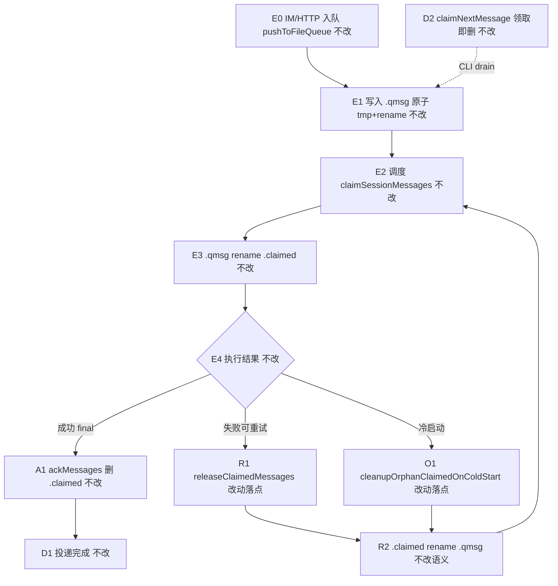
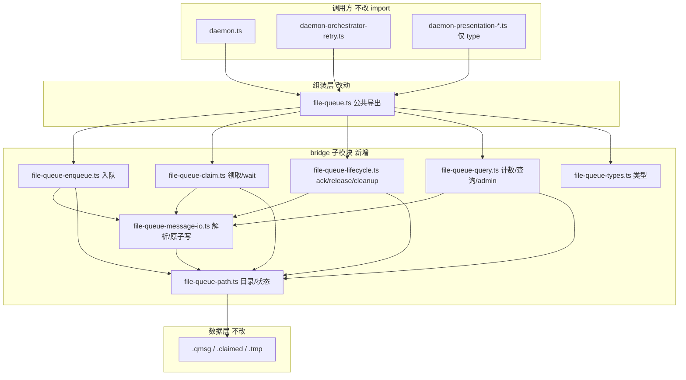

# 消息队列模块拆分 - 实现设计

> **业务 PRD**：见同目录 `01-proposal.md`（验收标准以 01 为准）
> **依赖**：`20260712144755-HTTP dispatch失败重入队对齐` 已 archived（`2157eb1`）；`releaseClaimedMessages` / `ackMessages` 语义已定稿，本变更**仅搬移结构、不改策略**
> **与 #2 划界**：斜杠收尾不改 `file-queue`；本变更与 #2 无硬冲突，apply 可并行

## 一、业务流程与改动范围

> 业务口径以 `01-proposal.md` §四场景 S1～S5 与 §六验收为准；下图以 **IM 可靠投递主路径**（入队 → claim → 执行 → ack / release）为主视角。

### （一）业务流程图

**图例**：`不改` 对外语义与现契约一致；`改动` 仅源码模块边界/文件落点变化；`新增` 本变更新建 `file-queue-*.ts` 子模块；`删除` 从 `file-queue.ts` 搬移实现体（**不删**对外导出符号）。

### （二）流程步骤与改动对照

| 步骤 ID | 业务含义 | 改动 | 落点（模块/文件） | 01 验收关联 |
|---------|----------|------|-------------------|-------------|
| E0 | 通道/Daemon 入队 | 不改语义 | `pushToFileQueue` → `file-queue-enqueue.ts`；`daemon.ts` `pushMessage` 调用点不变 | R2；S1 |
| E1 | 磁盘原子写入 `.qmsg` | 不改 | `file-queue-message-io.ts` 封装 tmp+rename；`file-queue-path.ts` 目录解析 | R4；§6.1.3 |
| E2 | Orchestrator 领取会话消息 | 不改 | `claimSessionMessages` → `file-queue-claim.ts` | R2；S1 |
| E3 | rename `.qmsg→.claimed` | 不改 | 同上；并发 rename 失败忽略策略保留 | R3；S1 |
| A1 | 成功回复 ack（删 ≤cutoff 的 `.claimed`） | 不改 | `ackMessages` → `file-queue-lifecycle.ts` | R3；S3 |
| R1 | 失败重入队 release（`.claimed→.qmsg`） | 不改语义 | `releaseClaimedMessages` → `file-queue-lifecycle.ts`（与 #1 archived 对齐） | R3；S2 |
| R2 | 释放后可再次 claim | 不改 | `daemon-orchestrator-retry.ts` 调用 `releaseClaimedMessages` **不改** | S2 |
| O1 | 冷启动 orphan `.claimed` 还原 | 不改 | `cleanupOrphanClaimedOnColdStart` → `file-queue-lifecycle.ts`；`daemon.ts` `initQueue` 调用不变 | R3；S1 |
| O2 | 遗留 `.tmp` 清理 | 不改 | `cleanupStaleMessages` → `file-queue-lifecycle.ts` | R4 |
| Q1 | 排队计数/管理面查询 | 不改 | `getSessionUnclaimedCount` 等 → `file-queue-query.ts` | R2；S4 |
| D2 | CLI drain `claimNextMessage`（领即删） | 不改 | `file-queue-claim.ts` | R2 |
| S4 | 单文件 ≤300 行 | 新增+改动 | `src/bridge/file-queue-*.ts` 子模块；`file-queue.ts` 瘦身为组装入口 | R5；§6.2 |
| EXP | 对外 import 路径 | 不改 | 调用方仍 `../bridge/file-queue.js`；**禁止** barrel `index.ts` | R2；01 §七 |

### （三）改动汇总

- **改动**：
  - `src/bridge/file-queue.ts`：由 584 行单体瘦身为组装入口（导出公共 API，委托子模块）。
  - 新建 `file-queue-path.ts`、`file-queue-types.ts`、`file-queue-message-io.ts`、`file-queue-enqueue.ts`、`file-queue-claim.ts`、`file-queue-lifecycle.ts`、`file-queue-query.ts`。
  - `src/bridge/AGENTS.md`：更新文件队列子模块职责表与阅读路径。
- **新增**：上述 7 个子模块文件（职责拆分，无新对外符号）。
- **删除**：无文件删除；自 `file-queue.ts` 搬移实现体。
- **不改（显式列出）**：
  - `.qmsg` / `.claimed` / `.tmp` 磁盘格式与目录布局（`APP_DATA_DIR/file-queue/<sessionHash>/`）。
  - 全部对外导出函数名、入参、返回值语义（`pushToFileQueue`、`claimSessionMessages`、`ackMessages`、`releaseClaimedMessages` 等）。
  - `daemon.ts` / `daemon-orchestrator.ts` / `daemon-orchestrator-retry.ts` **import 路径**（仍 `file-queue.js`）。
  - 重试次数、ack 时机、退避策略（归 orchestrator-retry，本变更不触）。
  - IM 协议、HTTP 契约、MergeBatch 逻辑。

## 二、整体思路

**根因**（见 01 §一；`src/bridge/file-queue.ts` 现 584 行）：claim、ack、release、入队、查询、清理与持久化原语交织于单文件，超过 ≤300 行规范，评审与回归面过大；父变更 #1 已在同一文件落地 `releaseClaimedMessages`，继续叠加可靠性改动风险升高。

**方案要点**（见 01 R1～R6）：

1. **按职责垂直切**：路径/状态、消息 IO 原语、入队、领取、生命周期（ack+release+cleanup）、查询/admin——六块 + 类型文件，对应可独立评审边界。
2. **对外零契约变更**：`file-queue.ts` 保留为**唯一公共 import 路径**（参照 `daemon.ts` 薄组装模式）；子模块仅域内 `./file-queue-*.js` 互引，**禁止** `index.ts` barrel 与旧路径 re-export shim（`bridge/AGENTS.md`）。
3. **行为等价搬移**：纯剪切+委托，不改 rename 原子性、dedup、`matchesSafeId` cutoff、orphan 双份处理等分支。
4. **与 #1 衔接**：`releaseClaimedMessages`（L543–583）与 `ackMessages`（L334–367）迁入 `file-queue-lifecycle.ts` 时保持注释与分支一一对应；`daemon-orchestrator-retry.ts` 零改动。
5. **行数合规**：每子模块目标 ≤250 行留缓冲；`file-queue.ts` 组装层目标 ≤80 行。
6. **回归硬门槛**：S1–S3 行为契约 + 现有持久化数据无迁移。

**最小方案三问（Ponytail）**：

1. **能否复用现有模块？** 能。不新建队列引擎或存储抽象；仅在同目录拆 `file-queue-*.ts`。
2. **拟新增抽象是否被 01 要求？** 否。不引入 `IQueueStore`、不建跨进程队列；`file-queue-message-io.ts` 仅为共享 parse/write 原语，非产品级框架。
3. **能否合并到已有文件？** 不能合并回单体——01 明确要求拆分合规；合并 query+cleanup 可酌情，但 claim 与 lifecycle 须分文件以降低 ack/release 回归面。

## 三、分层设计

- **组装层**：`file-queue.ts` — 初始化、`export` 重导出；调用方无感。
- **领域子模块**：按 claim / ack / release / 持久化 / 查询 五职责切分（cleanup 归 lifecycle）。
- **数据层**：文件系统布局与 JSON 消息体不变。

## 四、接口设计

**对外公共 API（`file-queue.ts` 导出，签名与现网一致）**：

| 符号 | 职责 | 迁入子模块 |
|------|------|------------|
| `initFileQueue` / `getQueueDir` | 初始化与目录 | `file-queue-path.ts` |
| `pushToFileQueue` | 入队 | `file-queue-enqueue.ts` |
| `claimNextMessage` / `claimSessionMessages` / `waitForSessionMessages` | 领取 | `file-queue-claim.ts` |
| `ackMessages` / `releaseClaimedMessages` | 确认与失败释放 | `file-queue-lifecycle.ts` |
| `cleanupStaleMessages` / `cleanupOrphanClaimedOnColdStart` | 清理 | `file-queue-lifecycle.ts` |
| `getSessionPendingCount` / `getSessionUnclaimedCount` / `listUnclaimedMessages` / `getEarliestMessageTime` / `getQueueLength` / `getQueueMessages` / `deleteQueueMessage` / `getDistinctSessions` / `replaceSessionUnclaimedMessages` | 查询与管理 | `file-queue-query.ts` |
| `QueueMessage` / `QueueMessageMeta` / `QueueMessageView` / `QueueSessionInfo` | 类型 | `file-queue-types.ts` |

**域内新增（非对外）**：

| 符号 | 模块 | 说明 |
|------|------|------|
| `getQueueDirInternal` / `getSessionDir` / `listSessionDirs` / `sanitizeSessionDir` | `file-queue-path.ts` | 共享目录解析；`queueDir` 模块内聚 |
| `parseMessageFile` / `matchesSafeId` / `fileTimestamp` / `writeMessageAtomically` | `file-queue-message-io.ts` | 解析与原子写原语 |

**HTTP / IM 契约**：无变更（01 R6）。

## 五、数据结构

无 schema 变更。

**磁盘（不变）**：

| 扩展名 | 含义 |
|--------|------|
| `.qmsg` | 待领取 |
| `.claimed` | 已领取待 ack |
| `.tmp` | 写入中断孤儿（`cleanupStaleMessages` 清理） |

**JSON 消息体字段（不变）**：`text`、`messageId`、`timestamp`、`source`、`sessionKey`、`meta`（含 `chatType`、`senderOpenId` 等）；兼容顶层旧 `chatType`/`senderOpenId`。

**进程内状态（不变）**：模块级 `queueDir` 字符串，由 `initFileQueue` 设置。

## 六、实现步骤

1. **T1 路径与类型（S4）**：新建 `file-queue-path.ts`、`file-queue-types.ts`；搬移 `initFileQueue`、`getQueueDir`、session 目录 helper 与全部 interface。（步骤 PATH、TYPES）
2. **T2 消息 IO 原语（E1）**：新建 `file-queue-message-io.ts`；搬移 `parseMessageFile`、`matchesSafeId`、`fileTimestamp`；抽取 push/replace 共用的 tmp+rename 写盘函数。（步骤 IO）
3. **T3 入队（E0–E1）**：新建 `file-queue-enqueue.ts`；搬移 `pushToFileQueue` 与 dedup 逻辑。（步骤 E0）
4. **T4 领取（E2–E3、D2）**：新建 `file-queue-claim.ts`；搬移 `claimNextMessage`、`claimSessionMessages`、`hasPendingMessages`、`waitForSessionMessages`。（步骤 E2、D2）
5. **T5 生命周期（A1、R1、O1–O2）**：新建 `file-queue-lifecycle.ts`；搬移 `ackMessages`、`releaseClaimedMessages`、`cleanupStaleMessages`、`cleanupOrphanClaimedOnColdStart`。（步骤 A1、R1、O1）
6. **T6 查询（Q1）**：新建 `file-queue-query.ts`；搬移计数、列表、admin 视图、`replaceSessionUnclaimedMessages`。（步骤 Q1）
7. **T7 组装收敛（EXP、S4）**：瘦身 `file-queue.ts` 为 export 组装；确认 `daemon.ts` 等调用方 import **零变更**；`tsc --noEmit`。（步骤 EXP）
8. **T8 文档（S4）**：更新 `src/bridge/AGENTS.md` 子模块表。（步骤 S4）
9. **T9 回归（S1–S3）**：执行 ST-Q* 验收（见 §八·（二））。（步骤 §6.1）

## 七、参考实现

CodeGraph 与源码核实（`src/bridge/file-queue.ts`，2026-07-12）：

| 符号 | 行号 | 职责 | 目标子模块 |
|------|------|------|------------|
| `initFileQueue` / `getQueueDir` | L10–20 | 队列根目录 | `file-queue-path.ts` |
| `pushToFileQueue` | L45–78 | 入队+dedup | `file-queue-enqueue.ts` |
| `claimNextMessage` | L137–162 | drain 领即删 | `file-queue-claim.ts` |
| `claimSessionMessages` | L267–300 | poll 路径领取 | `file-queue-claim.ts` |
| `waitForSessionMessages` | L306–326 | 阻塞领取 | `file-queue-claim.ts` |
| `ackMessages` | L334–367 | 成功确认删除 | `file-queue-lifecycle.ts` |
| `releaseClaimedMessages` | L543–583 | 失败重入队 | `file-queue-lifecycle.ts` |
| `cleanupOrphanClaimedOnColdStart` | L512–535 | 冷启动回收 | `file-queue-lifecycle.ts` |
| `cleanupStaleMessages` | L488–505 | tmp 清理 | `file-queue-lifecycle.ts` |
| `getSessionUnclaimedCount` 等 | L173–485 | 查询/admin | `file-queue-query.ts` |
| `matchesSafeId` / `parseMessageFile` | L106–130 | 共享原语 | `file-queue-message-io.ts` |

**调用链（不改）**：

| 调用方 | 符号 |
|--------|------|
| `daemon.ts` L19–39 | 全量 import `file-queue.js` |
| `daemon-orchestrator.ts` L41–49 | deps 注入 `claimSessionMessages`、`ackMessages`、`releaseClaimedMessages` |
| `daemon-orchestrator-retry.ts` L66、L91 | `releaseClaimedMessages`、`ackMessages` |
| `daemon.ts` L981 | `cleanupOrphanClaimedOnColdStart` in `initQueue` |

## 八、技术影响

### （一）影响范围

- **涉及模块**：`src/bridge/file-queue.ts` + 新建 7 个 `file-queue-*.ts`；`src/bridge/AGENTS.md`。
- **接口/proto 变更**：无对外 breaking；import 路径保持 `../bridge/file-queue.js`。
- **数据变更**：无；现网 `.qmsg`/`.claimed` 直接兼容。
- **风险**：
  - **隐性行为漂移**：搬移时误改 `ackMessages` cutoff 或 `release` 双份分支 → 用 ST-Q2/ST-Q3 硬验收。
  - **环引**：子模块禁止互引 claim↔lifecycle；共享仅经 path/io/types。
  - **与 #2 并行**：#2 不改 file-queue；冲突风险低。
  - **行数反弹**：组装时勿把逻辑塞回 `file-queue.ts`。

### （二）工程补充验收项

- [ ] **ST-Q1（对齐 01 §6.1.1 / S1）**：拆分后入队 → `claimSessionMessages` → 成功 `ackMessages` 全链路可用；`.qmsg` 数量与改前一致。
- [ ] **ST-Q2（对齐 01 §6.1.1 / S2）**：对已 claim 的 `message_ids` 调 `releaseClaimedMessages` 后磁盘 `.claimed→.qmsg`，可再次 `claimSessionMessages` 领取同 id。
- [ ] **ST-Q3（对齐 01 §6.1.2 / S3）**：`ackMessages` 仅删目标 id 及更早 `.claimed`；未投递 `.qmsg` 不被误删；重复 ack 返回空数组。
- [ ] **ST-Q4（对齐 01 §6.1.3 / R4）**：用拆分前遗留的 `.qmsg`/`.claimed` 目录直接启动，无需迁移脚本即可读写。
- [ ] **ST-Q5（对齐 01 §6.2 / S4）**：`file-queue.ts` 及全部 `file-queue-*.ts` 均 ≤300 行；`wc -l` 可证。
- [ ] **ST-Q6（对齐 01 §6.3）**：关键分支保留中文注释；`tsc --noEmit` 通过；无新 npm 依赖。
- [ ] **ST-Q7（对齐 R2）**：`daemon.ts` 等对 `file-queue.js` 的 import 列表无路径变更（允许行号变化）。

## 九、知识库影响

- `knowledge/业务域/消息桥接/04-消息队列与路由.md` §九 — **高**：「`file-queue.ts` 超 300 行待拆」待关闭；补充子模块职责与源码锚点。
- `knowledge/业务域/消息桥接/01-概览.md` — **中**：若架构图仍标单体 file-queue。
- `src/bridge/AGENTS.md` — **高**（apply 任务 T8）：子模块清单与「不负责」边界。
- `knowledge/工程平台/Daemon守护进程/01-概览.md` — **低**：仅引用路径，语义不变。
- 父债 #1 归档文档 — **不需要**回改（release 语义已记载）。

## 十、知识库更新计划

### （一）必须更新

- `knowledge/业务域/消息桥接/04-消息队列与路由.md` — §二/§五/§九：拆分后子模块表（path/enqueue/claim/lifecycle/query）；关闭「待拆」TODO；`releaseClaimedMessages`/`ackMessages` 锚点改指向 `file-queue-lifecycle.ts`。
- `src/bridge/AGENTS.md` — 文件队列节：子模块职责、阅读顺序、≤300 行约束。

### （二）可能更新（视实现结果）

- `knowledge/业务域/消息桥接/01-概览.md` §二架构图 — 若仍绘单体 `file-queue`。
- `knowledge/业务域/消息桥接/00-README.md` — 增加子模块阅读路径一句。

### （三）不需要更新

- HTTP dispatch / orchestrator-retry 策略正文（语义未变）。
- IM 协议、飞书/微信通道文档。
- `daemon-orchestrator-retry.ts` 源码（零改动）。
- `knowledge/知识索引.md` 入口结构。
