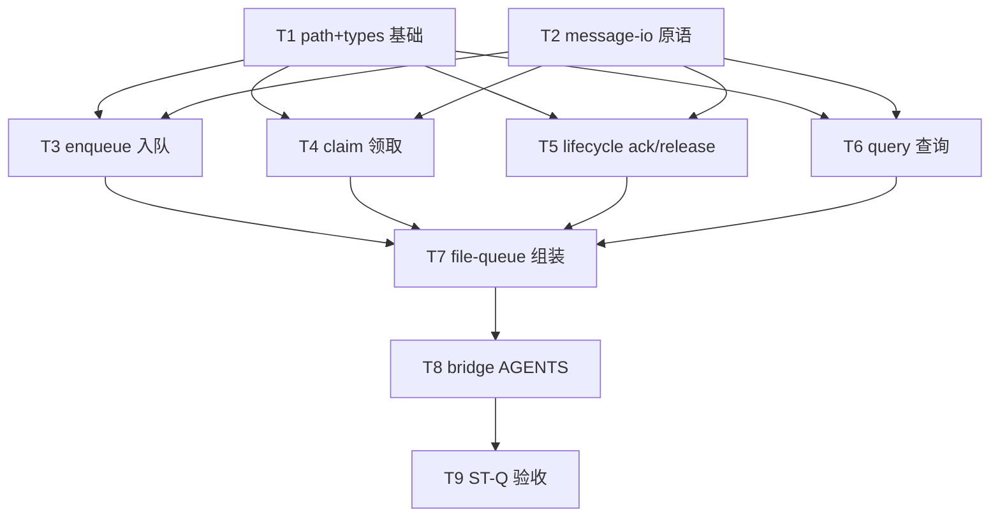

# 消息队列模块拆分 - 任务分解

> **来源**：`/kb-plan`（基于 `01-proposal.md`、`02-design.md`）
> **任务数**：9（T1–T9）
> **依赖前提**：`20260712144755-HTTP dispatch失败重入队对齐` 已 archived；`releaseClaimedMessages` / `ackMessages` 以现网 `file-queue.ts` 为准
> **Ponytail**：**禁止**新建 `IQueueStore` / 分布式队列抽象；**禁止** barrel `index.ts`；调用方 import 路径保持 `../bridge/file-queue.js`

## 一、执行计划

### （一）依赖图

**CodeGraph / 源码核实**（`src/bridge/file-queue.ts`）：

| 符号/区域 | 行号 | 任务 |
|-----------|------|------|
| `initFileQueue` / session 目录 helper | L10–43 | T1 |
| `QueueMessage*` interfaces | L80–98、L401–459 | T1 |
| `parseMessageFile` / `matchesSafeId` | L100–130 | T2 |
| `pushToFileQueue` | L45–78 | T3 |
| `claimNextMessage` / `claimSessionMessages` / `waitForSessionMessages` | L137–326 | T4 |
| `ackMessages` / `releaseClaimedMessages` / cleanup | L334–367、L488–583 | T5 |
| 计数/查询/replace | L173–257、L369–485 | T6 |
| `daemon.ts` import | L18–39 | T7 验证零变更 |
| `daemon-orchestrator-retry.ts` | L66、L91 | **不改** |

**01 验收追溯**：

| 01 验收 | 主责任务 |
|---------|----------|
| §6.1.1 行为回归 / R2 S1 | T3–T7、T9（ST-Q1） |
| §6.1.1 失败 release / R3 S2 | T5、T7、T9（ST-Q2） |
| §6.1.2 ack 不退化 / S3 | T5、T7、T9（ST-Q3） |
| §6.1.3 格式兼容 / R4 | T1–T7、T9（ST-Q4） |
| §6.2 结构合规 / R5 S4 | T1–T8、T9（ST-Q5） |
| §6.3 工程规范 | T1–T8、T9（ST-Q6） |
| 对外 import 不变 / R2 | T7、T9（ST-Q7） |

**02 §六步骤对齐**：T1→步骤 1；T2→步骤 2；T3→3；T4→4；T5→5；T6→6；T7→7；T8→8；T9→9。

### （二）分组调度

| 轮次 | 任务 | 说明 |
|------|------|------|
| **第一轮（并行）** | T1、T2 | 不同文件：`file-queue-path.ts`+`types` vs `file-queue-message-io.ts` |
| **第二轮（并行）** | T3、T4、T5、T6 | 四文件互不 import；均依赖 T1+T2 |
| **第三轮** | T7 | **冲突**：`file-queue.ts` 须等 T3–T6 搬移完成再瘦身组装 |
| **第四轮** | T8 | 依赖 T7 定稿子模块名 |
| **第五轮** | T9 | 对照 `06-automation-test.md`（`/kb-test` 可补全文） |

**同文件冲突（禁止并行 apply）**：

| 文件 | 任务（顺序） |
|------|----------------|
| `src/bridge/file-queue.ts` | T3–T6 搬出 → T7 组装（T3–T6 改新文件，T7 改本体） |
| `src/bridge/AGENTS.md` | T8 |

**明确不做**：`daemon-orchestrator-retry.ts`、`daemon-http-routes-*.ts`、队列策略常量、磁盘格式迁移。

## 二、任务清单

## T1: file-queue-path 与 file-queue-types 基础模块

### 背景

拆分须先确立共享目录状态与类型定义，供 enqueue/claim/lifecycle/query 复用。`queueDir` 模块内聚于 path 子模块，避免各文件重复读写全局。

### 上下文文件

- 必读: `src/bridge/file-queue.ts` — L1–43（init/path）、L80–98 与 L401–459（types）
- 必读: `02-design.md` §三、§四域内符号表
- 参考: `src/bridge/AGENTS.md` — 禁止 barrel、`.js` 后缀 import

### 实现范围

- 新增: `src/bridge/file-queue-path.ts` —
  - `POLL_INTERVAL_MS`、`STALE_TMP_MS` 常量
  - `initFileQueue`、`getQueueDir`
  - `sanitizeSessionDir`、`getSessionDir`、`listSessionDirs`（域内 export）
  - 中文注释：目录布局 `APP_DATA_DIR/file-queue/<hash>/`
- 新增: `src/bridge/file-queue-types.ts` —
  - `QueueMessageMeta`、`QueueMessage`、`QueueMessageView`、`QueueSessionInfo`
- 不改: `file-queue.ts` 对外签名（T7 统一组装）

### 接口契约

- `initFileQueue(): string` — 行为同现网；未设 `APP_DATA_DIR` 抛错
- 类型字段与现 `file-queue.ts` export 完全一致

### 验收标准

- [ ] 两文件均 ≤300 行（02 ST-Q5）
- [ ] `tsc --noEmit` 通过（可先不被引用，或 T7 前局部编译）
- [ ] 关键符号含中文注释（01 §6.3）

### 依赖

- 前置任务: 无
- 后续任务: T3、T4、T5、T6、T7

---

## T2: file-queue-message-io 解析与原子写原语

### 背景

`pushToFileQueue`、`replaceSessionUnclaimedMessages`、`parseMessageFile` 共用 JSON 解析、safeId 匹配与 tmp+rename 写盘；抽取 IO 层避免 claim/ack/release 三处复制粘贴，降低搬移时语义漂移风险。

### 上下文文件

- 必读: `src/bridge/file-queue.ts` — L100–130、L63–74（写盘模式）、L240–252（replace 写盘）
- 必读: `02-design.md` §五 JSON 字段、§七 `matchesSafeId` 表
- 参考: T1 产出之 `file-queue-types.ts`

### 实现范围

- 新增: `src/bridge/file-queue-message-io.ts` —
  - `fileTimestamp`、`matchesSafeId`、`parseMessageFile`（搬移，逻辑一字不差）
  - `writeMessageAtomically(dir, filename, data)` — 封装 tmp+rename（供 T3/T6 复用）
  - import `./file-queue-types.js`、`./file-queue-path.js`（仅类型/目录参数）
- 不改: 旧格式兼容分支（顶层 `chatType`/`senderOpenId` 收进 meta）

### 接口契约

- `parseMessageFile(filePath): QueueMessage | null` — 与现网一致
- `matchesSafeId(filename, safeId): boolean` — 精确 safeId 段匹配，禁止 endsWith 歧义

### 验收标准

- [ ] 文件 ≤300 行（ST-Q5）
- [ ] `parseMessageFile` 对旧格式样例（顶层 chatType）行为不变（ST-Q4）
- [ ] 中文注释说明 safeId 匹配规则

### 依赖

- 前置任务: T1（types）
- 后续任务: T3、T4、T5、T6、T7

---

## T3: file-queue-enqueue 入队模块

### 背景

`pushToFileQueue` 是 IM 入队唯一写盘入口（`daemon.ts` `pushMessage`）。搬移至独立文件后须保留 messageId dedup、`skipDedup`、meta 合并等行为。

### 上下文文件

- 必读: `src/bridge/file-queue.ts` — L45–78
- 必读: `src/daemon/daemon.ts` — `pushMessage` 调用 `pushToFileQueue`（约 L1044）
- 参考: T1 `file-queue-path.ts`、T2 `writeMessageAtomically`

### 实现范围

- 新增: `src/bridge/file-queue-enqueue.ts` — 搬移 `pushToFileQueue` 全文
- 修改: `src/bridge/file-queue.ts` — 删除已搬移实现（T7 改为 re-export）；**本任务可先留 stub 或待 T7 一并收敛**
- 不改: 函数签名与返回值语义

### 接口契约

- `pushToFileQueue(text, messageId?, source?, sessionKey?, skipDedup?, meta?): boolean`
- dedup：同 session 下已有同 safeId 的 `.qmsg`/`.claimed` 时返回 `false`

### 验收标准

- [ ] 入队后磁盘出现 `.qmsg`，内容 JSON 字段齐全（ST-Q1）
- [ ] 同 `messageId` 重复入队返回 `false`（行为回归）
- [ ] 文件 ≤300 行（ST-Q5）

### 依赖

- 前置任务: T1、T2
- 后续任务: T7、T9

---

## T4: file-queue-claim 领取模块

### 背景

`claimSessionMessages` 是 Orchestrator 主路径领取原语（rename 不删）；`claimNextMessage` 供 drain 领即删；`waitForSessionMessages` 阻塞 poll。三者共享 `hasPendingMessages`，须与 ack/release 分文件以降低回归面（01 R1）。

### 上下文文件

- 必读: `src/bridge/file-queue.ts` — L137–171、L267–326
- 必读: `src/daemon/daemon-orchestrator.ts` — `claimSessionMessages` deps（L41、L194）
- 参考: `knowledge/业务域/消息桥接/04-消息队列与路由.md` §三 claim 规则

### 实现范围

- 新增: `src/bridge/file-queue-claim.ts` —
  - `claimNextMessage`、`claimSessionMessages`、`hasPendingMessages`（域内）、`waitForSessionMessages`
  - 保留并发 rename 失败 `continue` / 忽略策略
- 不改: 「领取不删、靠 ack 确认」语义

### 接口契约

- `claimSessionMessages(filterSessionKey?): QueueMessage[]` — 升序 timestamp；含历史 `.claimed`
- `claimNextMessage(filterSessionKey?): QueueMessage | null` — 领即删，仅 drain 场景

### 验收标准

- [ ] `claimSessionMessages` 后 `.qmsg` 变 `.claimed`，消息体可读（ST-Q1）
- [ ] 并发双 claim 不双投（rename 原子性，行为与改前一致）
- [ ] 文件 ≤300 行（ST-Q5）

### 依赖

- 前置任务: T1、T2
- 后续任务: T7、T9

---

## T5: file-queue-lifecycle ack / release / cleanup 模块

### 背景

`ackMessages` 与 `releaseClaimedMessages` 是可靠性核心（#1 archived 已接线 orchestrator-retry）；`cleanupOrphanClaimedOnColdStart` 在 `daemon.ts` `initQueue` 调用。三者共享 `.claimed↔.qmsg` rename 与双份异常处理，须完整搬移注释与分支。

### 上下文文件

- 必读: `src/bridge/file-queue.ts` — L334–367、L488–583
- 必读: `src/daemon/daemon-orchestrator-retry.ts` — L66 `releaseClaimedMessages`、L91 `ackMessages`
- 必读: `src/daemon/daemon.ts` — L981 `cleanupOrphanClaimedOnColdStart`
- 参考: `knowledge/变更/归档/20260712144755-HTTP dispatch失败重入队对齐/02-design.md` — release 与 ack 划界

### 实现范围

- 新增: `src/bridge/file-queue-lifecycle.ts` —
  - `ackMessages`、`releaseClaimedMessages`、`cleanupStaleMessages`、`cleanupOrphanClaimedOnColdStart`
  - 保留「勿与 ack 混淆」类中文注释
- 不改: `daemon-orchestrator-retry.ts`；cutoff 仅删 `.claimed` 不碰 `.qmsg`

### 接口契约

- `ackMessages(messageId, filterSessionKey?): string[]` — 删 ≤cutoff 的 `.claimed`；找不到返回 `[]`
- `releaseClaimedMessages(messageIds, filterSessionKey?): string[]` — `.claimed→.qmsg`；目标 `.qmsg` 已存在则删孤儿 claimed
- `cleanupOrphanClaimedOnColdStart(): number` — 冷启动全量还原；返回回收条数

### 验收标准

- [ ] `releaseClaimedMessages` 后指定 id 回到 `.qmsg` 且可再 claim（ST-Q2）
- [ ] `ackMessages` 不误删未 claim 的 `.qmsg`；重复 ack 返回 `[]`（ST-Q3）
- [ ] 冷启动 recycle 与改前条数/磁盘状态一致（ST-Q4）
- [ ] 文件 ≤300 行（ST-Q5）

### 依赖

- 前置任务: T1、T2
- 后续任务: T7、T9

---

## T6: file-queue-query 查询与管理模块

### 背景

排队计数（`getSessionUnclaimedCount`）、管理面列表（`getQueueMessages`）、合并编辑（`replaceSessionUnclaimedMessages`）与核心 claim/ack 路径解耦，便于独立评审与后续演进。

### 上下文文件

- 必读: `src/bridge/file-queue.ts` — L173–257、L369–485
- 必读: `src/daemon/AGENTS.md` — F1 仅计 `.qmsg`；`getSessionUnclaimedCount` 口径
- 参考: `daemon.ts` — `getFileQueueLength`、`listUnclaimedMessages` 等 import

### 实现范围

- 新增: `src/bridge/file-queue-query.ts` — 搬移：
  - `getSessionPendingCount`、`getSessionUnclaimedCount`、`listUnclaimedMessages`
  - `getEarliestMessageTime`、`getQueueLength`、`getQueueMessages`、`deleteQueueMessage`
  - `getDistinctSessions`、`replaceSessionUnclaimedMessages`
- 不改: `.claimed` 不计入 unclaimed 口径

### 接口契约

- `getSessionUnclaimedCount(sessionKey): number` — 仅 `.qmsg`
- `getSessionPendingCount(sessionKey): number` — `.qmsg` + `.claimed`
- `replaceSessionUnclaimedMessages` — 仅删 `.qmsg`，不动 `.claimed`

### 验收标准

- [ ] 计数与改前同会话磁盘文件数一致（ST-Q1）
- [ ] `replaceSessionUnclaimedMessages` 不触碰 `.claimed`（行为回归）
- [ ] 文件 ≤300 行（ST-Q5）

### 依赖

- 前置任务: T1、T2
- 后续任务: T7、T9

---

## T7: file-queue.ts 组装收敛与调用方零变更

### 背景

`file-queue.ts` 须瘦身为唯一公共入口：从子模块 import 并 `export` 全部对外符号，使 `daemon.ts` 等 **无需改 import 路径**。禁止留空 re-export shim 于其他路径；本文件为 canonical 模块。

### 上下文文件

- 必读: T1–T6 全部产出文件
- 必读: `src/daemon/daemon.ts` — L18–39 import 列表（须逐项仍可从 `file-queue.js` 解析）
- 必读: `src/bridge/AGENTS.md` — 禁止 barrel `index.ts`
- 参考: `02-design.md` §四对外 API 表

### 实现范围

- 修改: `src/bridge/file-queue.ts` —
  - 删除已搬移至子模块的实现体
  - `export { … } from "./file-queue-*.js"` 或薄包装保持命名稳定
  - `export type { … } from "./file-queue-types.js"`
  - 确保无业务逻辑残留（目标 ≤80 行，硬上限 300）
- 不改: `daemon.ts` / `daemon-orchestrator.ts` / `daemon-presentation-*.ts` 的 import 路径与符号名

### 接口契约

- `file-queue.js` 导出集合与拆分前 **完全一致**（02 §四表）

### 验收标准

- [ ] `daemon.ts` 等对 `../bridge/file-queue.js` import **无路径变更**（ST-Q7）
- [ ] `tsc --noEmit` 全仓通过（ST-Q6）
- [ ] `file-queue.ts` ≤300 行，建议 ≤80 行（ST-Q5）
- [ ] 子模块间无环引（claim 不 import lifecycle，反之亦然）

### 依赖

- 前置任务: T3、T4、T5、T6（T1、T2 已合入）
- 后续任务: T8、T9

---

## T8: bridge/AGENTS.md 登记子模块职责

### 背景

源码约定须反映拆分后阅读路径与「负责/不负责」边界，供后续 reliability 改动与 code review 检索（02 §十·（一））。

### 上下文文件

- 必读: `src/bridge/AGENTS.md` — 「文件队列」节
- 必读: T7 定稿后的子模块文件名
- 参考: `02-design.md` §三 分层图

### 实现范围

- 修改: `src/bridge/AGENTS.md` —
  - 子模块表：path / types / message-io / enqueue / claim / lifecycle / query
  - 明确 lifecycle 含 ack、release、冷启动 recycle、tmp 清理
  - 明确 **禁止** 用 `.claimed` 推断 Agent processing（口径不变）
  - 登记对外仍只 import `file-queue.js`
- 不改: 业务域 `knowledge/业务域/**` 正文（归 archive / kb-librarian）

### 接口契约

- 文档与 02 §四、§八·（二）ST-Q* 一致

### 验收标准

- [ ] AGENTS 含子模块清单与职责一句式说明
- [ ] 无「单体 file-queue 待拆」残留表述
- [ ] 无预建 `IQueueStore` 等未批准抽象（Ponytail）

### 依赖

- 前置任务: T7
- 后续任务: T9

---

## T9: ST-Q 行为回归验收

### 背景

02 §八·（二）定义 ST-Q1～ST-Q7，覆盖 01 §6.1–6.3 与结构合规。实现合入后须执行并可追溯 pass/fail；用例细节可写入 `06-automation-test.md`（本任务可引用占位，全文由 `/kb-test` 补全）。

### 上下文文件

- 必读: `01-proposal.md` — §六验收
- 必读: `02-design.md` — §八·（二）ST-Q1～ST-Q7
- 参考: `knowledge/变更/归档/20260712144755-HTTP dispatch失败重入队对齐/06-automation-test.md` — 队列相关用例模式
- 参考: 同目录 `06-automation-test.md`（若不存在则 `/kb-test` 创建）

### 实现范围

- 执行（非代码主责，可含 `auto_test/` 脚本）：
  - **ST-Q1**：入队→claim→ack 主路径
  - **ST-Q2**：release 后再 claim
  - **ST-Q3**：ack cutoff 与重复 ack
  - **ST-Q4**：遗留磁盘数据兼容
  - **ST-Q5**：全文件 `wc -l` ≤300
  - **ST-Q6**：`tsc --noEmit`、中文注释
  - **ST-Q7**：调用方 import 路径不变
- 产出：验收记录写入 `06-automation-test.md` 或测试报告

### 接口契约

- 条目与 02 §八·（二）逐条对应

### 验收标准

- [ ] ST-Q1～ST-Q7 均有执行记录（pass 或 documented fail）
- [ ] 任一 ST-Q 失败则变更不得 archive（01 §6 硬门槛）
- [ ] 验收过程不修改 orchestrator 重试策略（Ponytail）

### 依赖

- 前置任务: T8
- 后续任务: 无（下一步 `/kb-test` 或 `/kb-revise-apply`）
