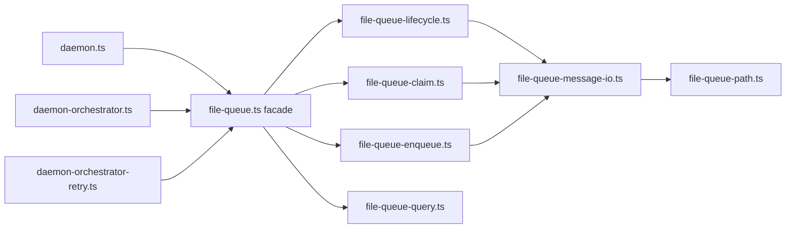

# 消息队列模块拆分 - 代码评审报告

## 1、审查范围

- **变更类型**: apply 产出的未提交变更（`file-queue.ts` 瘦身 + 7 个子模块新建）
- **评审等级**: focused-review（结构拆分、ack/release 关键路径；无 proto/多端契约变更）
- **涉及文件**: 9 个源码文件 + `src/bridge/AGENTS.md` + 本评审文档
- **设计文档**: `02-design.md`（对照基准）；父债 `#1 HTTP dispatch失败重入队对齐` 的 release/ack 语义为硬约束

| 文件 | 行数 | 角色 |
|------|------|------|
| `src/bridge/file-queue.ts` | 40 | 薄组装 re-export |
| `src/bridge/file-queue-path.ts` | 55 | 目录/常量 |
| `src/bridge/file-queue-types.ts` | 41 | 类型 |
| `src/bridge/file-queue-message-io.ts` | 53 | 解析/原子写 |
| `src/bridge/file-queue-enqueue.ts` | 44 | 入队 |
| `src/bridge/file-queue-claim.ts` | 115 | 领取 |
| `src/bridge/file-queue-lifecycle.ts` | 148 | ack/release/cleanup |
| `src/bridge/file-queue-query.ts` | 196 | 查询/管理 |

## 2、严重（必须处理）

无

## 3、警告（建议处理）

无

**Ponytail 精简轴（Agent #6）**：`Lean already. Ship.`

- `writeMessageAtomically` 为 `02` T2 批准之 IO 原语抽取，非未授权框架层
- 未引入 `IQueueStore`、barrel `index.ts` 或新 npm 依赖
- 子模块 7+1 切分与 `02` §二最小方案三问一致
- `net: Lean already. Ship.`

## 4、设计偏差

无

实现与 `02-design.md` §三～§四 分层、符号落点、对外 export 表一致；`daemon-orchestrator-retry.ts` 零改动符合划界。

## 5、验收标准检查

| 任务 | 验收条件 | 状态 |
|------|---------|------|
| T1 | path/types ≤300 行；符号与注释齐全 | ✅ |
| T1 | `tsc --noEmit` 可编译 | ✅ |
| T2 | message-io ≤300；`matchesSafeId`/`parseMessageFile` 逻辑等价 | ✅ |
| T3 | `pushToFileQueue` dedup/写盘语义等价 | ✅ |
| T4 | claim 三函数 + rename 并发策略保留 | ✅ |
| T4 | claim 不 import lifecycle（无环引） | ✅ |
| T5 | **ackMessages** cutoff 仅删 `.claimed`；重复 ack 返回 `[]` | ✅（diff 逐行对照） |
| T5 | **releaseClaimedMessages** rename + 双份删孤儿 claimed | ✅（diff 逐行对照） |
| T5 | 冷启动 recycle / tmp 清理逻辑等价 | ✅ |
| T6 | 计数口径（unclaimed 仅 `.qmsg`）；replace 不动 `.claimed` | ✅ |
| T7 | `file-queue.ts` ≤80 行目标（实际 40）；全量 re-export | ✅ |
| T7 | 调用方仍 `../bridge/file-queue.js` | ✅（grep 核实 daemon 域） |
| T7 | `tsc --noEmit` 全仓通过 | ✅ |
| T8 | AGENTS 子模块表 + lifecycle 划界 + 无「待拆」残留 | ✅ |
| T9 | ST-Q1～ST-Q7 执行记录 | ⏳ 待 `/kb-test`（manifest T9=pending） |

**ack/release 语义核对摘要**（拆分前后唯一差异为 `queueDir` → `getQueueDir()` 访问器，行为等价）：

| 符号 | 核对项 | 结论 |
|------|--------|------|
| `ackMessages` | safeId 匹配、`cutoff` 删 ≤ts 的 `.claimed`、不碰 `.qmsg` | 无漂移 |
| `releaseClaimedMessages` | 按 id rename；目标 `.qmsg` 已存在则 `unlink` 孤儿 claimed | 无漂移 |
| `cleanupOrphanClaimedOnColdStart` | 全量 recycle，双份处理同构 release | 无漂移 |

## 6、调用链与回归风险

| 回归点 | 风险 | 缓解 |
|--------|------|------|
| ack cutoff 误删 | 低 | 逻辑一字不差搬移；T9 ST-Q3 待执行 |
| release 与 ack 混用 | 低 | lifecycle 同文件 + AGENTS 划界注释保留 |
| 调用方 import 断裂 | 极低 | facade 全量 re-export；tsc 已通过 |
| 子模块环引 | 无 | claim↔lifecycle 无互引 |
| 遗留磁盘数据 | 低 | 无 schema 变更；ST-Q4 待 T9 |

## 7、遗留债务

无（`reviews[]` 零 open/accepted_debt；代码无未说明 `ponytail:` 注释债）

**归档前待办（非评审 open 项）**：T9 ST-Q1～ST-Q7 行为回归须由 `/kb-test` 落盘 `06-automation-test.md`。

## 8、修复任务建议

| 问题 ID | 建议动作 | 关联任务 |
|---------|----------|----------|
| — | 无 open 问题 | — |

## 9、结论

**通过**（代码评审），`reviews` 零阻断项；ack/release 语义无漂移，Ponytail 无未说明债。

**可进入** `/kb-test` 执行 T9（ST-Q1～ST-Q7）后 `/kb-archive`；T9 未完成前不宜归档。
