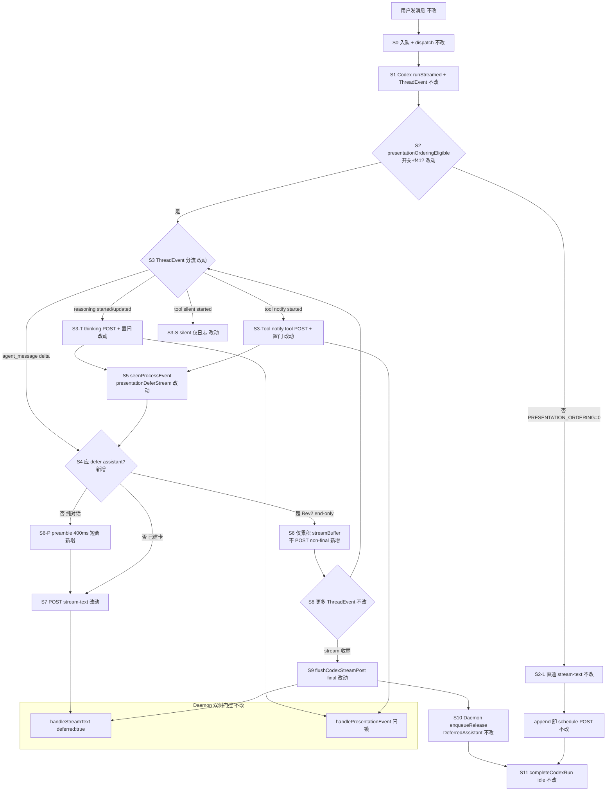
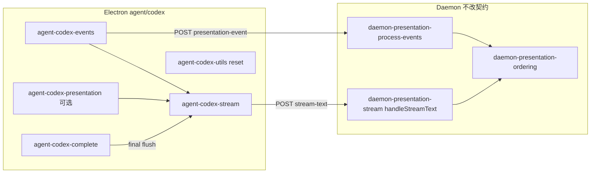

# Codex展示排序接入 - 实现设计

> **业务 PRD**：见同目录 `01-proposal.md`（验收标准以 01 为准）
> **对齐基线**：`knowledge/变更/归档/20260712113320-OpenCode展示排序接入/`（OpenCode 已落地 Rev2 end-only 路径）

## 一、业务流程与改动范围

> 业务口径以 `01-proposal.md` §五功能需求 R1–R5、§六验收标准为准；下图由 R1–R5 与 OpenCode/Cursor 已落地 defer 链归纳。

### （一）业务流程图

**图例**：`不改` 行为与现网一致；`改动` 需改代码/配置；`新增` 新节点或新分支；`删除` 本期无删除项。

### （二）流程步骤与改动对照

| 步骤 ID | 业务含义 | 改动 | 落点（模块/文件） | 01 验收关联 |
|---------|----------|------|-------------------|-------------|
| S0 | 用户消息入队、Daemon dispatch → Codex launch/dispatch | 不改 | `src/daemon/daemon-orchestrator.ts`；`electron/agent/codex/agent-codex-sdk.ts` | 验收 6.2 Cursor 无回归前置 |
| S1 | Codex `runStreamed` + `ThreadEvent` 流 | 不改 | `electron/agent/codex/agent-codex-events.ts` `streamCodexEvents` | — |
| S2 | `presentationOrderingEligible` = `PRESENTATION_ORDERING` + `f41Stream` | 改动 | `electron/agent/codex/agent-codex-utils.ts` `presentationOrderingEligible`（已有定义，接入消费） | 验收 6.2；R4 |
| S2-L | 开关关闭：assistant delta 立即 `scheduleCodexStreamPost` | 不改 | `appendCodexStreamDelta` 在 `shouldDefer` 为 false 时行为与现网一致 | 验收 6.2 |
| S3-T | `reasoning` item.started/updated → `markCodexProcessEventSeen` + POST thinking | 改动 | `agent-codex-events.ts` `handleItemStarted`/`handleItemUpdated`；`agent-codex-stream.ts` `markCodexProcessEventSeen` | 验收 6.1；R1、R3 |
| S3-Tool | notify 级 tool（`command_execution`/`mcp_tool_call`）→ 置闩 + POST presentation-event | 改动 | `agent-codex-events.ts`；`src/shared/sdk-tool-presentation-tier.ts` `resolveSdkToolPresentationTier` | 验收 6.1；R1、R3 |
| S3-S | silent tool → 仅 `lastTool`/日志，不置闩不 POST | 改动 | `agent-codex-events.ts` `handleItemStarted` tool 分支 | R3；对称 OpenCode/Cursor |
| S4 | `shouldDeferCodexAssistantPost` 判定 defer | 新增 | `electron/agent/codex/agent-codex-stream.ts`（或 `agent-codex-presentation.ts`） | 验收 6.1；R1、R2 |
| S5 | 过程可见时置 `seenProcessEvent` + `presentationDeferStream` | 改动 | `markCodexProcessEventSeen` 对齐 `markOpencodeProcessEventSeen` | R2 |
| S6 | 含过程 Run：non-final 不 POST stream-text，仅写 buffer | 新增 | `appendCodexStreamDelta`；`doFlushCodexStreamPost` 增加 defer/end-only 早退 | 验收 6.1；R1 |
| S6-P | 纯对话：首包 400ms preamble 等待过程事件 | 新增 | `scheduleCodexPreambleRelease`（对称 OpenCode） | 验收 6.1；R2 |
| S7 | 非 defer 路径 POST `/api/stream-text`；daemon 可返 `deferred:true` | 改动 | `postCodexStreamText` 已有 `deferred` 处理；配合 S6 减少无效 POST | R1 |
| S8 | tool/thinking 过程卡由 Daemon 处理（里程碑/CardKit） | 不改 | `src/daemon/daemon-presentation-process-events.ts` | 验收 6.1；R3 |
| S9 | Run 收尾 `flushCodexStreamPost(true)` 为含过程场景唯一 assistant IM 出站 | 改动 | `agent-codex-complete.ts` `completeCodexRun`（补 timer 清链与 defer 一致性） | 验收 6.1；R1 |
| S10 | Daemon `handleStreamText` final + `presentationProcessActive` → `enqueueReleaseDeferredAssistantStream` | 不改 | `src/daemon/daemon-presentation-stream.ts`；`daemon-presentation-ordering-release.ts` | 验收 6.1；R2 |
| S11 | 终态 notify / `reportSessionAgentPhase(idle)` / RunGuard | 不改 | `agent-codex-complete.ts`；`engine-port-adapter.ts` | 验收 6.2；R4 |
| X-POST | 移除 `postCodexPresentationEvent` 飞书早退，保证 Daemon 双侧闩 | 改动 | `agent-codex-stream.ts` `postCodexPresentationEvent` | 验收 6.1；R3（对称 OpenCode） |
| X-RESET | `resetCodexRunPresentationState` 清 streamPostTimer/Chain | 改动 | `agent-codex-utils.ts`（对称 OpenCode reset，避免 import 循环） | R4 |

### （三）改动汇总

- **改动**：`electron/agent/codex/agent-codex-stream.ts`（defer 门控、`markCodexProcessEventSeen`、移除 presentation-event 飞书早退）、`electron/agent/codex/agent-codex-events.ts`（tool 分级、置闩顺序）、`electron/agent/codex/agent-codex-complete.ts`（收尾 timer/链）、`electron/agent/codex/agent-codex-utils.ts`（reset 补 timer/链）
- **新增（按需）**：`shouldDeferCodexAssistantPost`、`shouldEndOnlyCodexAssistantDefer`、`scheduleCodexPreambleRelease`；超 300 行时拆 `agent-codex-presentation.ts`
- **不改（显式列出）**：Daemon `handleStreamText` / `createPresentationOrdering` / MergeBatch / F1 门控；Codex Port/RunLifecycle；Cursor/OpenCode 引擎；微信通道；队列模块（与 #5 可并行）

## 二、整体思路

**根因**（见 01 §一）：Codex 已具备 `presentationOrderingEligible`、`seenProcessEvent`、`postCodexStreamText` 对 `deferred:true` 的处理，以及 Daemon 侧通用 ordering 门控，但 **Electron 流式出站未接入 defer 链**——`appendCodexStreamDelta` 在过程事件后仍立即 `scheduleCodexStreamPost`，`markCodexProcessEventSeen` 未置 `presentationDeferStream`、未受 ordering 门控，`doFlushCodexStreamPost` 无 Rev2 end-only 早退，`postCodexPresentationEvent` 仍飞书早退阻断 Daemon 双侧闩（CodeGraph：`appendCodexStreamDelta` @ `agent-codex-stream.ts:186`；对照 `shouldDeferOpencodeAssistantPost` @ `agent-opencode-stream.ts:117`）。

**方案要点**（对齐 OpenCode 已归档 Rev2 end-only，参照 `electron/agent/opencode/agent-opencode-stream.ts` 与 Cursor `sdk-run-presentation.ts`）：

1. **双侧门控**：Electron 侧 non-final 禁止 POST；Daemon 侧 `presentationProcessActive` 时返回 `{ deferred: true }`（已存在，Codex 须触发 POST 时机对齐）。
2. **过程闩**：thinking / notify 级 tool 调用 `markCodexProcessEventSeen`（含 `presentationDeferStream=true`）；silent tool 不置闩。
3. **Release 唯一路径**：含过程 Run 仅在 `flushCodexStreamPost(true)`（`completeCodexRun` 收尾）释放 assistant IM；禁止 mid-run release（Rev2）。
4. **presentation-event 必达 Daemon**：移除 `postCodexPresentationEvent` 的 `feishuSuppressesProcessKind` 早退（对称 OpenCode/CC），由 Daemon 做里程碑/CardKit 降级与 `presentationProcessActive` 置位。
5. **回滚**：`PRESENTATION_ORDERING=0` 时 `presentationOrderingEligible` 为 false，全链早退，行为回现网直通。

**最小方案三问（Ponytail）**：

1. **能否复用现有模块/符号？** 能。以 OpenCode 归档实现 + `sdk-run-presentation.ts` 为模板，复用 `presentationOrderingEligible`（`agent-codex-utils.ts`）、`resolveSdkToolPresentationTier`、Daemon ordering API；不新建 Presentation 子系统。
2. **拟新增抽象是否 PRD 要求？** 否。仅增 3–4 个私有判定函数（`shouldDefer*` / `shouldEndOnly*` / `schedulePreambleRelease`），不引入四引擎共用 Orchestrator。
3. **能否合并到已有文件？** 优先合并。`agent-codex-stream.ts` 当前约 234 行，增补 defer 链后预计接近 300 行；若超限则拆 `agent-codex-presentation.ts`（对称 OpenCode/CC），**不**预建四引擎共用抽象层。

## 三、分层设计

- **端点层**：沿用 `POST /api/stream-text`、`POST /api/presentation-event`；无新路由。
- **服务层**：Codex Electron 负责 ThreadEvent→defer 判定与是否 POST；Daemon 负责 CardKit 首建门控、deferred 释放、飞书里程碑降级（已实现）。
- **数据层**：内存 `CodexSessionAgent` 字段 `seenProcessEvent`/`presentationDeferStream`（已有）；Daemon `SessionProgressState` 编排字段（已有）；无持久化变更。

## 四、接口设计

无新增 HTTP 路由与 proto 变更。沿用契约：

| 端点 | Codex 侧变更 | 说明 |
|------|--------------|------|
| `POST /api/stream-text` | Electron 减少含过程场景下的 non-final POST；仍处理 `deferred:true` 响应 | 对称 OpenCode `postOpencodeStreamText` |
| `POST /api/presentation-event` | 飞书通道亦 POST（由 Daemon 抑制呈现，仍置 ordering 闩） | 对称 OpenCode `postOpencodePresentationEvent` |

## 五、数据结构

无表/持久化变更。会话内存字段（已存在于 `CodexSessionAgent`）：

| 字段 | 用途 |
|------|------|
| `seenProcessEvent` | 本 Run 已见 thinking/notify-tool |
| `presentationDeferStream` | Daemon 曾返回 `deferred:true` 或过程闩已置 |
| `streamBuffer` / `streamPostChain` / `streamPostTimer` | assistant 累积与串行 POST |
| `thinkingOpen` / `toolPresentationOutboundIds` | 过程卡 PATCH 游标 |

Daemon `SessionProgressState` 编排字段由既有 presentation-event/stream-text 维护，本变更不扩展。

## 六、实现步骤

1. **步骤 S5/X-POST**：改造 `markCodexProcessEventSeen`——增加 `presentationOrderingEligible` 门控，置 `seenProcessEvent` + `presentationDeferStream` + `clearCodexStreamPostTimer`；`postCodexPresentationEvent` 移除飞书早退。
2. **步骤 S3-S/S3-Tool**：`handleItemStarted` tool 分支接入 `resolveSdkToolPresentationTier`：`command_execution`/`mcp_tool_call` 经 `resolveToolName` 得 toolName 后分级；notify 走现有 POST+置闩；silent 仅 `lastTool`/日志。reasoning 分支保持置闩+POST（T1 门控后受益）。
3. **步骤 S4–S7**：在 `agent-codex-stream.ts`（或 `agent-codex-presentation.ts`）实现 `shouldDeferCodexAssistantPost`、`shouldEndOnlyCodexAssistantDefer`、`scheduleCodexPreambleRelease`；改造 `appendCodexStreamDelta` 与 `doFlushCodexStreamPost` non-final 早退（对照 `agent-opencode-stream.ts:116-236`）。
4. **步骤 S9/X-RESET**：`completeCodexRun` 收尾前 `clearCodexStreamPostTimer`、final flush 后 `streamPostChain = undefined`；`resetCodexRunPresentationState` 对称清 timer/链（避免 utils import stream 循环）。
5. **步骤 S2-L**：手工验证 `PRESENTATION_ORDERING=0` 时函数早退，行为与变更前一致。
6. **回归**：四引擎 Port 归档用例 + Codex 多 tool Run 飞书私聊与 OpenCode/Cursor 并排对比（见 §八·（二））。

## 七、参考实现

CodeGraph 命中符号（`projectPath=/home/suveng/doger/cursor-claw`）：

| 角色 | 符号 | 路径 |
|------|------|------|
| **对照 SSOT（OpenCode 已落地）** | `shouldDeferOpencodeAssistantPost` / `markOpencodeProcessEventSeen` / `appendOpencodeStreamDelta` | `electron/agent/opencode/agent-opencode-stream.ts` |
| **对照（Cursor Rev2）** | `shouldDeferAssistantPost` / `markProcessEventSeen` | `electron/agent/cursor-sdk/sdk-run-presentation.ts` |
| **Codex 流式入口（待改）** | `appendCodexStreamDelta` / `markCodexProcessEventSeen` / `postCodexPresentationEvent` | `electron/agent/codex/agent-codex-stream.ts` |
| **Codex 事件映射（待改）** | `handleItemStarted` / `handleItemUpdated` / `handleCodexEvent` | `electron/agent/codex/agent-codex-events.ts` |
| **eligible 判定（已有）** | `presentationOrderingEligible` | `electron/agent/codex/agent-codex-utils.ts:144` |
| **Run 收尾（待核对）** | `completeCodexRun` | `electron/agent/codex/agent-codex-complete.ts:46` |
| **Daemon defer/release** | `handleStreamText` / `enqueueReleaseDeferredAssistantStream` | `src/daemon/daemon-presentation-stream.ts`；`daemon-presentation-ordering-release.ts` |
| **tool 分级 SSOT** | `resolveSdkToolPresentationTier` | `src/shared/sdk-tool-presentation-tier.ts` |
| **归档基线** | OpenCode 设计/任务 | `knowledge/变更/归档/20260712113320-OpenCode展示排序接入/` |

## 八、技术影响

### （一）影响范围

- **涉及模块**：`electron/agent/codex/`（stream、events、complete、utils；可选 presentation）；**不涉及** Daemon 主链改动（仅消费既有 ordering API）。
- **接口/proto 变更**：无。
- **数据变更**：无。
- **风险**：
  - **飞书双侧闩**：若保留 `postCodexPresentationEvent` 早退，Daemon 无法置 `presentationProcessActive`，final release 可能失效——本设计要求移除早退（步骤 1）。
  - **文件行数**：`agent-codex-stream.ts` 增补后须 ≤300 行，超限拆 `agent-codex-presentation.ts`。
  - **ThreadEvent 语义**：Codex `reasoning`/`command_execution`/`mcp_tool_call` 与 OpenCode SSE part 映射须保持同等置闩口径；`file_change` 不参与 ordering；未知 item 仍 WARN 不崩溃。
  - **Cursor 回归**：共用 Daemon ordering 路径时须验收 Cursor 场景不变（硬门槛 R4）。
  - **异常终态**：`turn.failed` / stream 异常须经 `completeCodexRun` final flush 或 failure notify，避免 deferred 缓冲泄漏。

### （二）工程补充验收项

- [ ] `PRESENTATION_ORDERING=0` 重启后 Codex 多 tool Run 与变更前时间轴一致，无卡死、无丢终态
- [ ] 飞书私聊 Codex Run：tool 执行中无 assistant 单独成卡；idle 后正文完整释放
- [ ] 与 OpenCode/Cursor 同 prompt 并排：过程在上、结论在下体感一致
- [ ] silent tool（如 read 类 mcp）不触发 defer；notify tool（shell/command_execution）触发 defer
- [ ] `presentation_order_violation` 日志无新增异常峰值
- [ ] 四引擎 Port 回归：`engine-port-adapter` 终态契约无变更；Cursor 展示排序场景无回归

## 九、知识库影响

- `knowledge/业务域/Agent调度/08-CodexSDK执行引擎.md` — §八/§九 须归档补充 Codex 已接入 ordering 口径（高）
- `src/shared/AGENTS.md` — presentation gate 段「Codex/OpenCode 仍早退」须在 archive 改为 Codex 已对齐（中）
- `knowledge/业务域/消息桥接/02-飞书通道.md` — 四引擎 ordering 口径表（中，视正文是否记载差异）
- `electron/agent/codex/AGENTS.md` — 代码侧 SSOT 补充 Presentation defer 链（implement/archive 同步）
- `knowledge/业务域/Agent调度/09-OpenCodeSDK执行引擎.md` — §九「Codex ordering 不在本引擎范围」archive 时改交叉引用（低）

## 十、知识库更新计划

### （一）必须更新

- `knowledge/业务域/Agent调度/08-CodexSDK执行引擎.md` — 补充 Presentation defer/Rev2 end-only 与参考文件
- `electron/agent/codex/AGENTS.md` — Presentation 时序编排段落（archive 时由 kb-librarian 或 builder 同步）

### （二）可能更新（视实现结果）

- `src/shared/AGENTS.md` — Codex presentation-event 飞书早退已移除
- `knowledge/业务域/消息桥接/02-飞书通道.md` — 四引擎 presentation-event POST 口径表
- `knowledge/业务域/Agent调度/09-OpenCodeSDK执行引擎.md` — 交叉引用「Codex 已对齐」

### （三）不需要更新

- Daemon 工程平台分区正文（行为未改，仅 Codex 客户端接入）
- Proto / Flutter / Quasar 分区
- OpenCode 归档变更目录（仅作基线引用）
- 微信通道文档（01 非目标）
