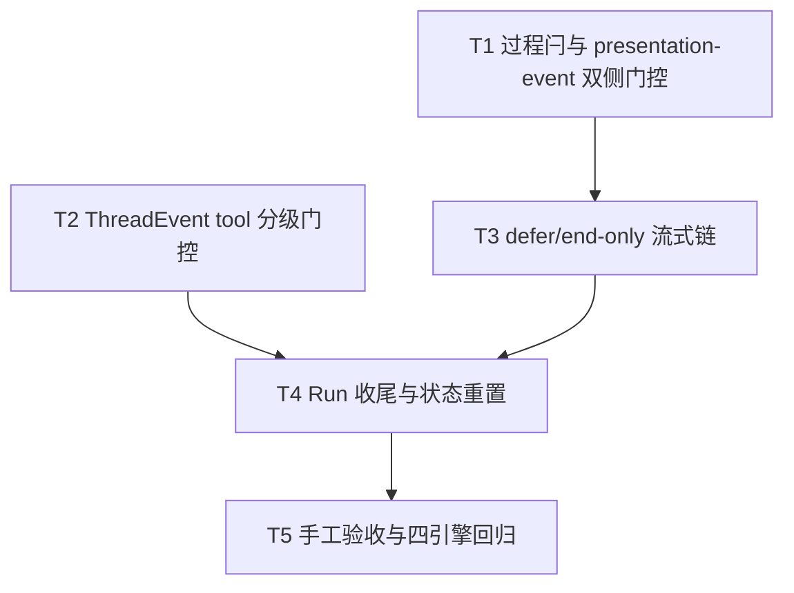

# Codex展示排序接入 - 任务分解

> **来源**：`/kb-plan`（基于 `01-proposal.md`、`02-design.md`）
> **任务数**：5（T1–T5）
> **Daemon 划界**：本变更**不得**修改 `src/daemon/daemon-presentation-*.ts`、`daemon.ts` ordering 主链；仅消费既有 `POST /api/stream-text` 与 `POST /api/presentation-event` 契约。
> **对齐基线**：OpenCode 归档 `20260712113320-OpenCode展示排序接入`（T1–T4 结构对称）

## 一、执行计划

### （一）依赖图



```
T1 ──→ T3 ──┐
            ├──→ T4 ──→ T5
T2 ─────────┘
```

**CodeGraph 文件依赖边**（`projectPath=/home/suveng/doger/cursor-claw`）：

| 源符号/文件 | 依赖/波及 | 任务 |
|-------------|-----------|------|
| `markCodexProcessEventSeen` | `agent-codex-stream.ts:203`；仅置 `seenProcessEvent`，缺 `presentationDeferStream` 与 `presentationOrderingEligible` 门控 | T1 |
| `postCodexPresentationEvent` | `agent-codex-stream.ts:56`；`feishuSuppressesProcessKind` 早退阻断 Daemon 双侧闩 | T1 |
| `handleItemStarted` | `agent-codex-events.ts:54`；tool 分支未分级，一律置闩+POST | T2 |
| `appendCodexStreamDelta` | `agent-codex-stream.ts:186`；无 defer，直接 `scheduleCodexStreamPost` | T3 |
| `doFlushCodexStreamPost` | `agent-codex-stream.ts:109`；无 `shouldDefer*` / `shouldEndOnly*` 早退 | T3 |
| `shouldDeferOpencodeAssistantPost`（对照 SSOT） | `agent-opencode-stream.ts:117` | T3 |
| `resolveSdkToolPresentationTier` | `src/shared/sdk-tool-presentation-tier.ts:23` | T2 |
| `completeCodexRun` | `agent-codex-complete.ts:46`；缺 `clearCodexStreamPostTimer` 与 `streamPostChain` 清链 | T4 |
| `resetCodexRunPresentationState` | `agent-codex-utils.ts:149`；未清 `streamPostTimer`/`streamPostChain` | T4 |
| `presentationOrderingEligible` | `agent-codex-utils.ts:144`；已有定义，本变更仅接入消费 | T1、T3 |

**01 验收追溯**：

| 01 验收 | 主责任务 |
|---------|----------|
| AC1 顺序对齐（tool 开始/结束/进度与 OpenCode 一致） | T1、T2、T3 |
| AC2 进度可读（无抢屏乱序） | T1–T4、T5 |
| AC3 飞书/IM 通道顺序与主引擎一致 | T1–T4、T5 |
| AC4 Cursor 无回归 | T5 |
| AC5 范围克制（无模板大改/微信） | 全任务边界 |

**02 §六步骤对齐**：T1→步骤 1（S5/X-POST）；T2→步骤 2（S3-S/S3-Tool）；T3→步骤 3（S4–S7）；T4→步骤 4（S9/X-RESET）；T5→步骤 5–6（S2-L + 回归）。

### （二）分组调度

| 轮次 | 并行任务 | 说明 |
|------|----------|------|
| **第一轮** | T1、T2 | 不同文件；T1 改 `agent-codex-stream.ts` 闩锁与早退；T2 改 `agent-codex-events.ts` tool 分级 |
| **第二轮** | T3 | 依赖 T1；独占 `agent-codex-stream.ts`（或新建 `agent-codex-presentation.ts`）defer 链 |
| **第三轮** | T4 | 依赖 T2、T3；改 `agent-codex-complete.ts` + `agent-codex-utils.ts` reset |
| **第四轮** | T5 | 依赖 T4；纯手工验收，不写业务代码 |

**同文件冲突清单（须串行）**：

| 文件 | 涉及任务（顺序） |
|------|------------------|
| `electron/agent/codex/agent-codex-stream.ts` | T1 → T3（当前约 234 行；T3 增补后须 ≤300 行，超限拆 `agent-codex-presentation.ts`） |
| `electron/agent/codex/agent-codex-events.ts` | T2 |
| `electron/agent/codex/agent-codex-complete.ts` | T4 |
| `electron/agent/codex/agent-codex-utils.ts` | T4 |

**与并行变更 #5（消息队列模块拆分）**：无文件交集，design/plan 可并行；implement 期无冲突。

## 二、任务清单

## T1: 过程闩对齐与 presentation-event 飞书早退移除

### 背景

Codex 的 `markCodexProcessEventSeen` 仅置 `seenProcessEvent`，未置 `presentationDeferStream`、未受 `presentationOrderingEligible` 门控；`postCodexPresentationEvent` 对飞书通道 `feishuSuppressesProcessKind` 早退，导致 Daemon 无法置 `presentationProcessActive`，双侧门控失效。本任务是 defer 链（T3）与 Daemon release（T4）的前置，对应设计步骤 S5、X-POST。对称 OpenCode T1（`agent-opencode-stream.ts`）。

### 上下文文件

- CodeGraph: `markCodexProcessEventSeen` — 对比 `markOpencodeProcessEventSeen` @ `agent-opencode-stream.ts:251`
- CodeGraph: `postCodexPresentationEvent` — 调用方 `handleItemStarted`、`closeCodexThinkingIfOpen`
- 必读: `electron/agent/codex/agent-codex-stream.ts` — `markCodexProcessEventSeen`、`postCodexPresentationEvent` 现网实现
- 必读: `electron/agent/opencode/agent-opencode-stream.ts` — OpenCode 已落地对称实现
- 必读: `electron/agent/codex/agent-codex-utils.ts` — `presentationOrderingEligible`
- 参考: `src/shared/feishu-presentation-gate.ts` — `feishuSuppressesProcessKind` 语义（理解「呈现抑制 ≠ ordering defer」）

### 实现范围

- 修改: `electron/agent/codex/agent-codex-stream.ts` — `markCodexProcessEventSeen`：
  - **增加** `presentationOrderingEligible(session)` 门控；不满足时直接 return（S2-L 回滚路径）
  - 门控通过后：`seenProcessEvent = true`、`presentationDeferStream = true`、`clearCodexStreamPostTimer(session)`
  - 更新 JSDoc：阐明与 OpenCode `markOpencodeProcessEventSeen` 对称，飞书里程碑降级在 Daemon 侧
- 修改: `electron/agent/codex/agent-codex-stream.ts` — `postCodexPresentationEvent`：
  - **移除** `feishuSuppressesProcessKind(resolveChannelType(...), event.kind)` 早退（约第 61 行）
  - 飞书私聊亦 POST `/api/presentation-event`，由 Daemon 做里程碑抑制与 ordering 闩
  - **保留** lock 缺失、HTTP 失败等既有错误处理
  - **移除** 不再使用的 `feishu-presentation-gate` import（若已无引用）
- 不改: `appendCodexStreamDelta`、`doFlushCodexStreamPost`（归 T3）

### 接口契约

- `markCodexProcessEventSeen(session: CodexSessionAgent): void` — ordering 开启且 f41 时置双侧闩；否则 no-op
- `postCodexPresentationEvent(...): Promise<void>` — 不再因飞书抑制跳过 POST；载荷契约不变

### 验收标准

- [ ] `presentationOrderingEligible === false`（`PRESENTATION_ORDERING=0` 或非 f41）时 `markCodexProcessEventSeen` 无副作用（01 AC4、02 §八·（二）第 1 项）
- [ ] ordering 开启：thinking/tool 调用 `markCodexProcessEventSeen` 后 `seenProcessEvent === true` 且 `presentationDeferStream === true`（R2、R3）
- [ ] 飞书私聊：`postCodexPresentationEvent` 对 thinking/tool 仍发起 HTTP POST（可用 mock 或日志验证请求发出）
- [ ] `closeCodexThinkingIfOpen` 经 `postCodexPresentationEvent` 发送 thinking final 时不再被飞书早退拦截
- [ ] 无 `02`/`03` 未要求的抽象层、trait/mixin 中间层或未批准的新依赖（Ponytail 口径）

### 依赖

- 前置任务: 无
- 后续任务: T3

---

## T2: ThreadEvent tool 分支接入 resolveSdkToolPresentationTier

### 背景

Codex `handleItemStarted` 的 `command_execution`/`mcp_tool_call` 分支对所有工具一律 `markCodexProcessEventSeen` + POST presentation-event，未区分 notify/silent 级，导致 read 类 mcp 工具误触发 defer（与 OpenCode/Cursor 不对称）。本任务接入 `resolveSdkToolPresentationTier`，对应设计步骤 S3-S、S3-Tool。对称 OpenCode T2。

### 上下文文件

- CodeGraph: `handleItemStarted` — tool 分支与 `markCodexProcessEventSeen` 调用序
- CodeGraph: `resolveSdkToolPresentationTier` — `src/shared/sdk-tool-presentation-tier.ts`
- 必读: `electron/agent/codex/agent-codex-events.ts` — `handleItemStarted` reasoning/tool 分支全文
- 必读: `electron/agent/opencode/agent-opencode-events.ts` — OpenCode 已落地 tool 分级范例
- 参考: `electron/agent/cursor-sdk/sdk-run-stream.ts` — tool_call 分级消费范例

### 实现范围

- 修改: `electron/agent/codex/agent-codex-events.ts` — `handleItemStarted` tool 分支（`command_execution` / `mcp_tool_call`）：
  - 经 `resolveToolName(session, item)` 得 toolName，再 `resolveSdkToolPresentationTier(toolName)` 得 `notify` | `silent`
  - **notify**：保持现有行为——`flushCodexLog`、`closeCodexThinkingIfOpen`、`lastTool`、`markCodexProcessEventSeen`、`toolPresentationOutboundIds?.delete`、`postCodexPresentationEvent(started)`
  - **silent**：仅更新 `session.lastTool` + `pushUiLog`；**不**调用 `markCodexProcessEventSeen`、**不** POST presentation-event
- 修改: `handleItemStarted` reasoning 分支——保持 `markCodexProcessEventSeen` + POST（T1 门控后自动受益）；顺序不变：先置闩再 POST
- 不改: `handleItemUpdated` reasoning 分支（仍置闩+POST，不额外分级）；tool `completed` 终态 POST 逻辑（仍 POST final，不额外置闩）
- 不改: `agent-codex-stream.ts` defer 链（归 T3）

### 接口契约

- 依赖 `resolveSdkToolPresentationTier(toolName: string): "notify" | "silent"` — 自 `src/shared/sdk-tool-presentation-tier.ts` 导入，不复制白名单
- notify tool `started` 仍 POST `{ kind: "tool", tool_status: "started", final: false }`

### 验收标准

- [ ] notify 级 tool（如 shell/command_execution）`started` 仍触发 `markCodexProcessEventSeen` + presentation-event POST（01 AC1/AC3、R3）
- [ ] silent 级 tool（如 read 类 mcp）`started` **不**调用 `markCodexProcessEventSeen`、**不** POST presentation-event，但 `lastTool` 仍更新（02 §八·（二）第 4 项）
- [ ] reasoning item.started 行为与变更前一致且经 T1 门控（仍置闩 + POST）
- [ ] 未知 item 类型仍 WARN 不崩溃（02 §八·（一）ThreadEvent 语义风险）
- [ ] 无 `02`/`03` 未要求的抽象层、trait/mixin 中间层或未批准的新依赖（Ponytail 口径）

### 依赖

- 前置任务: 无（与 T1 并行；notify 路径依赖 T1 闩锁语义在 T3 前落地，T2 单独可测 silent 不置闩）
- 后续任务: T4

---

## T3: Codex defer/end-only 流式出站链

### 背景

`appendCodexStreamDelta` 在过程事件后仍立即 `scheduleCodexStreamPost`，`doFlushCodexStreamPost` 无 Rev2 end-only 早退，是 assistant 抢首屏的根因。本任务对称 OpenCode 已落地实现，对应设计步骤 S4–S7。

### 上下文文件

- CodeGraph: `appendCodexStreamDelta` / `doFlushCodexStreamPost` — 与 `shouldDeferOpencodeAssistantPost` 对照
- 必读: `electron/agent/opencode/agent-opencode-stream.ts` — `shouldDeferOpencodeAssistantPost`（117）、`shouldEndOnlyOpencodeAssistantDefer`（124）、`scheduleOpencodePreambleRelease`（138）、`appendOpencodeStreamDelta`（225）、`doFlushOpencodeStreamPost`（148–177）
- 必读: `electron/agent/codex/agent-codex-stream.ts` — 全文（T1 已改闩锁与早退）
- 必读: `electron/agent/codex/agent-codex-utils.ts` — `presentationOrderingEligible`
- 参考: `electron/agent/cursor-sdk/sdk-run-presentation.ts` — Cursor Rev2 SSOT

### 实现范围

- 修改或新建（单文件 ≤300 行约束）：
  - **优先**在 `electron/agent/codex/agent-codex-stream.ts` 内联实现；
  - 若增补后 **>300 行**，将 defer 判定与 preamble 拆至 `electron/agent/codex/agent-codex-presentation.ts` 并自 `agent-codex-stream.ts` 导入（对称 OpenCode/CC，不建四引擎共用层）
- 新增私有函数（命名对称 OpenCode，Codex 前缀）：
  - `shouldDeferCodexAssistantPost(session)` — 对齐 `shouldDeferOpencodeAssistantPost`
  - `shouldEndOnlyCodexAssistantDefer(session)` — 对齐 `shouldEndOnlyOpencodeAssistantDefer`（Rev2 end-only）
  - `isAwaitingFirstCodexProcessEvent(session)` — 纯对话 preamble 判定
  - `scheduleCodexPreambleRelease(session)` — 400ms 短窗，常量复用 `STREAM_POST_INTERVAL_MS`
- 修改: `appendCodexStreamDelta`：
  - 累积 `streamBuffer` 后，若 `shouldDeferCodexAssistantPost` 为 true 则 return（仅写 buffer）
  - 若 `isAwaitingFirstCodexProcessEvent` 则 `scheduleCodexPreambleRelease` 后 return
  - 否则 `scheduleCodexStreamPost(session, false)`
  - **保留** `isFeishuPlainAssistantReply` 早退
- 修改: `doFlushCodexStreamPost`：
  - non-final：若 `shouldDeferCodexAssistantPost` 或 `shouldEndOnlyCodexAssistantDefer` 为 true 则 return（不 POST）
  - final 路径不变，仍经 `postCodexStreamText` 处理 `deferred:true` → 设 `presentationDeferStream`
- **禁止** mid-run release 等价物（Rev2 end-only；release 仅 T4 final flush）
- 不改: `postCodexPresentationEvent`（T1 已完成）

### 接口契约

- `shouldDeferCodexAssistantPost(session): boolean` — T4 可读 session 状态验证；无对外 HTTP 变更
- `appendCodexStreamDelta(session, delta)` — ordering+含过程时仅累积 buffer；纯对话经 preamble 后 POST
- `doFlushCodexStreamPost(session, final)` — non-final 含过程场景 no-op POST

### 验收标准

- [ ] ordering 开启 + 已见 thinking/notify-tool：`appendCodexStreamDelta` 不触发 non-final `scheduleCodexStreamPost`（01 AC1、R1/R2）
- [ ] 纯对话（无过程事件）：首包经 400ms preamble 后正常 POST，体感不劣于现网 400ms 节流（01 AC2 前置、02 §八·（二）第 3 项）
- [ ] `doFlushCodexStreamPost(..., false)` 在 `shouldEndOnlyCodexAssistantDefer` 为 true 时不 POST（Rev2 end-only）
- [ ] `PRESENTATION_ORDERING=0` 时上述函数均早退，行为与变更前时间轴一致（01 AC4、02 §八·（二）第 1 项）
- [ ] 主改文件（含可选 `agent-codex-presentation.ts`）各 ≤300 行
- [ ] 无 `02`/`03` 未要求的抽象层、trait/mixin 中间层或未批准的新依赖（Ponytail 口径）

### 依赖

- 前置任务: T1
- 后续任务: T4

---

## T4: Run 收尾 final flush 与 presentation 状态重置一致性

### 背景

含过程 Run 的 assistant IM 唯一出站须在 `flushCodexStreamPost(true)`（Run 收尾）；`completeCodexRun` 已有 final flush，须在 defer 链（T3）落地后补 timer 清链与 `resetCodexRunPresentationState` 对称清零，异常终态不泄漏 deferred 缓冲。对应设计步骤 S9、X-RESET。对称 OpenCode T4。

### 上下文文件

- CodeGraph: `completeCodexRun` — `flushCodexStreamPost(true)` 调用条件
- 必读: `electron/agent/codex/agent-codex-complete.ts` — `completeCodexRun` 全文
- 必读: `electron/agent/opencode/agent-opencode-complete.ts` — OpenCode 已落地收尾（`clearOpencodeStreamPostTimer` + 清链）
- 必读: `electron/agent/codex/agent-codex-stream.ts` — `flushCodexStreamPost`、`clearCodexStreamPostTimer`（T3 完成后）
- 必读: `electron/agent/codex/agent-codex-utils.ts` — `resetCodexRunPresentationState`
- 参考: `electron/agent/opencode/agent-opencode-utils.ts` — `resetOpencodeRunPresentationState` timer/链清零范例

### 实现范围

- 修改: `electron/agent/codex/agent-codex-complete.ts` — `completeCodexRun`：
  - final flush **前**调用 `clearCodexStreamPostTimer(session)`（对称 OpenCode）
  - 确认含过程 defer 场景下 `flushCodexStreamPost(session, true)` 仍为**唯一** assistant IM 出站（条件 `f41Stream && (streamBuffer.trim() || outboundMessageId)` 保持或按 T3 微调）
  - final flush **后**置 `session.streamPostChain = undefined`（对称 OpenCode）
  - **禁止**新增 mid-run release 调用
  - `turn.failed` / stream 异常 / abort 路径仍保证 final flush 或 failure notify，避免 buffer 泄漏
- 修改: `electron/agent/codex/agent-codex-utils.ts` — `resetCodexRunPresentationState`：
  - 对称 OpenCode：清 `streamPostTimer`（内联 `clearTimeout`，**不** import stream 防循环依赖）与 `streamPostChain = undefined`
  - 确认已清零 `seenProcessEvent`、`presentationDeferStream`、`streamBuffer`、`outboundMessageId`
- 不改: `engine-port-adapter.ts` 终态模板；Daemon release 链

### 接口契约

- `completeCodexRun(...)` — 幂等；defer 链下 final flush 触发 Daemon `enqueueReleaseDeferredAssistantStream`（消费方不变）
- `resetCodexRunPresentationState(session)` — 新 Run 开始前闩锁、buffer、timer/链归零

### 验收标准

- [ ] 含过程多 tool Run：idle 后 `completeCodexRun` 触发一次 final assistant IM，正文完整（01 AC2、02 §八·（二）第 2 项）
- [ ] `turn.failed` / stream 异常 / abort 后无 deferred buffer 常驻泄漏；终态 notify 仍到达（01 AC4、R5）
- [ ] 新 Run dispatch 前 `seenProcessEvent`/`presentationDeferStream` 均为 false；timer/链已清
- [ ] `engine-port-adapter` 终态契约无签名/语义变更（02 §八·（二）第 6 项）
- [ ] 无 `02`/`03` 未要求的抽象层、trait/mixin 中间层或未批准的新依赖（Ponytail 口径）

### 依赖

- 前置任务: T2、T3
- 后续任务: T5

---

## T5: 手工验收与四引擎 Port 回归

### 背景

设计步骤 S2-L 与 §八·（二）要求环境级验证：排序开关回滚、飞书/Codex 多 tool 场景、与 OpenCode/Cursor 并排对比、可观测日志与四引擎 Port 无回归。本任务不写代码，汇总前序任务交付物的端到端验收。

### 上下文文件

- 必读: 同目录 `01-proposal.md` §六验收标准
- 必读: 同目录 `02-design.md` §八·（二）工程补充验收项
- 参考: `knowledge/变更/归档/20260712113320-OpenCode展示排序接入/` — 对齐基线验收场景
- 参考: `knowledge/变更/归档/20260711232258-四引擎 Engine Port 与 RunLifecycle 抽象/` — Port 回归用例
- 参考: `electron/agent/codex/AGENTS.md` — 实现后须同步 Presentation 段落（归 `/kb-archive`，本任务仅记录 gaps）

### 实现范围

- 无代码变更
- 执行并记录以下场景（可截图或简短结论写入 `04-review.md` 预备，本任务不强制写 review）：
  1. `PRESENTATION_ORDERING=0` 重启 → Codex 多 tool Run 时间轴与变更前一致
  2. `PRESENTATION_ORDERING=1` 飞书私聊 Codex：tool 中无 assistant 单独成卡；idle 后正文完整
  3. 同 prompt Codex vs OpenCode/Cursor 并排：过程在上、结论在下
  4. silent tool（read 类 mcp）不 defer；notify tool（shell）defer
  5. 日志检索 `presentation_order_violation` 无异常峰值
  6. 四引擎 Port launch/dispatch/终态 smoke；**Cursor 展示排序场景无回归**

### 接口契约

- 无新增接口；验收产出为可勾选 checklist 结论

### 验收标准

- [x] 01 §六全部验收项均可勾选通过（或标明阻塞项与日志依据）
- [x] 02 §八·（二）六项工程补充验收均可勾选通过
- [x] 发现实现缺口时开新 `T-FIX-*` 或 `/kb-revise`，不在本任务内改代码
- [x] 无 `02`/`03` 未要求的抽象层、trait/mixin 中间层或未批准的新依赖（Ponytail 口径）

### 依赖

- 前置任务: T4
- 后续任务: 无（完成后可 `/kb-revise-apply` → `/kb-test` → `/kb-archive`）
