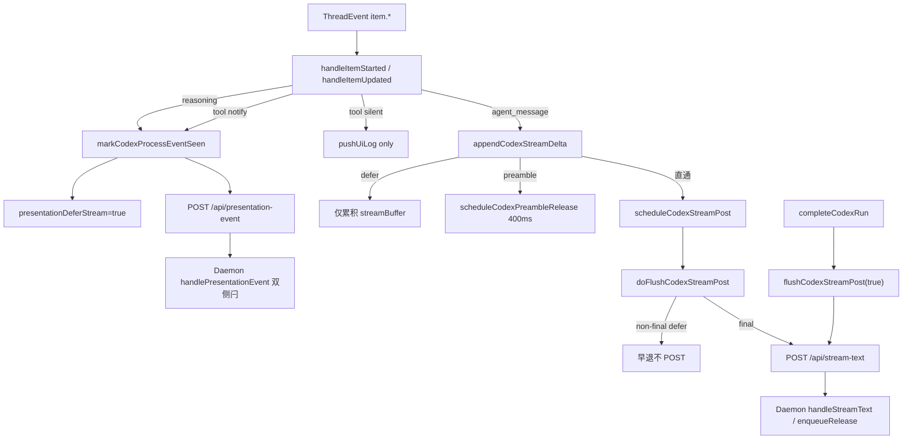

# Codex展示排序接入 - 代码评审报告

## 1、审查范围

- **变更类型**: apply 产出的未提交变更（T1–T4 代码实现）
- **评审等级**: focused-review（局部 Electron Codex Presentation 改动，无 proto/DB/资金/权限路径）
- **涉及文件**: 5 个（`agent-codex-stream.ts`、`agent-codex-events.ts`、`agent-codex-complete.ts`、`agent-codex-utils.ts`、`electron/agent/codex/AGENTS.md`）
- **设计文档**: `02-design.md`（对照 OpenCode 归档基线 `20260712113320-OpenCode展示排序接入`）
- **Daemon 划界**: `git diff -- src/daemon/` 无改动；`daemon-presentation-*.ts` 未触及
- **评审方法**: `git diff electron/agent/codex/` + CodeGraph `codegraph_impact(markCodexProcessEventSeen)`（6 symbols）+ 逐行对照 `agent-opencode-stream.ts` SSOT

## 2、严重（必须处理）

无

## 3、警告（建议处理）

无

**Ponytail 精简**：`Lean already. Ship.`

- defer 链内联 `agent-codex-stream.ts`（275 行，≤300），未预建 `agent-codex-presentation.ts` 或四引擎共用层，符合 `02` §二 最小方案三问。
- **升级路径已保留**：`02`/`03` 约定增补后 >300 行时拆 `agent-codex-presentation.ts`（对称 OpenCode/CC）；当前余量 25 行，无需本变更拆分。
- `shouldDeferCodexAssistantPost` / `shouldEndOnlyCodexAssistantDefer` 与 OpenCode/Cursor 同名双函数对称保留，非本变更新增抽象。
- `resetCodexRunPresentationState` 内联清 timer/链以避免与 stream 循环依赖，注释合理，非过度封装。

## 4、设计偏差

无

实现与 `02-design.md` S2–S9、X-POST、X-RESET 步骤一致：

- **T1**：`markCodexProcessEventSeen` 增加 `presentationOrderingEligible` 门控并置 `presentationDeferStream`；`postCodexPresentationEvent` 移除飞书 `feishuSuppressesProcessKind` 早退，移除对应 import。
- **T2**：`handleItemStarted` tool 分支接入 `resolveSdkToolPresentationTier`，notify/silent 分流对称 OpenCode/Cursor；reasoning 分支仍先置闩再 POST。
- **T3**：`shouldDefer*` / `shouldEndOnly*` / `isAwaitingFirst*` / `scheduleCodexPreambleRelease` 内联 stream；`appendCodexStreamDelta` 与 `doFlushCodexStreamPost` non-final 早退符合 Rev2 end-only。
- **T4**：`completeCodexRun` 收尾前 `clearCodexStreamPostTimer`、final flush 后 `streamPostChain = undefined`；`resetCodexRunPresentationState` 补全 timer/链与 defer 闩锁字段清零。

未引入 design 未要求的 Daemon 改动、新 HTTP 路由或四引擎共用 Orchestrator。

## 5、验收标准检查

| 任务 | 验收条件 | 状态 |
|------|---------|------|
| T1 | `PRESENTATION_ORDERING=0` 时 `markCodexProcessEventSeen` 无副作用 | ✅ 门控 `presentationOrderingEligible` 早退 |
| T1 | ordering 开启置 `seenProcessEvent` + `presentationDeferStream` | ✅ `agent-codex-stream.ts:243-247` |
| T1 | 飞书私聊 presentation-event 仍 POST | ✅ 移除 `feishuSuppressesProcessKind` 早退 |
| T1 | `closeCodexThinkingIfOpen` 不经飞书拦截 | ✅ 同上 |
| T1 | 无未批准抽象/依赖 | ✅ |
| T2 | notify tool 置闩 + POST | ✅ events notify 分支 |
| T2 | silent tool 不置闩、不 POST | ✅ events silent 分支仅 `pushUiLog` |
| T2 | reasoning 行为一致且受益 T1 门控 | ✅ `reasoning` 分支仍 `markCodexProcessEventSeen` |
| T2 | 未知 item WARN 不崩溃 | ✅ 未改未知分支逻辑 |
| T3 | 含过程场景 non-final 不 `scheduleCodexStreamPost` | ✅ `appendCodexStreamDelta` defer 早退 |
| T3 | 纯对话 400ms preamble | ✅ `scheduleCodexPreambleRelease` |
| T3 | `doFlushCodexStreamPost` non-final end-only 早退 | ✅ 164-166 行 |
| T3 | `PRESENTATION_ORDERING=0` 全链早退 | ✅ 各函数首行 `presentationOrderingEligible` |
| T3 | 主改文件 ≤300 行 | ✅ stream 275 行 |
| T4 | final flush 为含过程 Run 唯一 assistant IM 出站 | ✅ `completeCodexRun` + Rev2 注释 |
| T4 | 异常终态无 buffer 泄漏路径 | ✅ final flush / lifecycle 分支保留 |
| T4 | 新 Run 前闩锁归零 | ✅ `resetCodexRunPresentationState` |
| T4 | Port 终态契约无变更 | ✅ 未改 `engine-port-adapter.ts` |
| T5 | 01 §六五项验收 | ⏳ 运行时项，归 T5/`/kb-test`（非代码阻断） |
| T5 | 02 §八·（二）六项工程补充验收 | ⏳ 同上 |
| T5 | 四引擎 Port smoke | ⏳ 同上 |

T1–T4 静态验收项均已满足；T5 为环境级手工回归，不在本 focused-review 债务口径内。

## 6、调用链与回归风险

| 回归点 | 风险 | 缓解 |
|--------|------|------|
| `PRESENTATION_ORDERING=0` 回滚路径 | 低 | 全链 `presentationOrderingEligible` 早退，静态对齐 OpenCode |
| 飞书私聊过程卡重复/里程碑 | 低 | 呈现抑制改由 Daemon 处理；与 OpenCode/CC 对称 |
| silent tool 误 defer | 低 | `resolveSdkToolPresentationTier` SSOT 白名单 |
| preamble 与过程事件竞态 | 低 | timer 内二次 `shouldDefer` 检查；对称 OpenCode |
| 下一 Run 串 POST | 低 | `completeCodexRun` 清 timer + `streamPostChain=undefined`；`resetCodexRunPresentationState` 同步 |
| Cursor/OpenCode/Port | 低 | 变更范围仅 `electron/agent/codex/`；Daemon ordering 主链未改 |
| stream 文件膨胀 | 低 | 当前 275 行；>300 可拆 `agent-codex-presentation.ts`（设计已约定） |

CodeGraph 影响面：`markCodexProcessEventSeen` 波及 `handleItemStarted`、`handleItemUpdated`、`handleCodexEvent`（6 symbols），与 design 预期一致，无意外上游调用方。

## 7、遗留债务

无（open 0 / accepted_debt 0）

## 8、修复任务建议

| 问题 ID | 建议动作 | 关联任务 |
|---------|----------|----------|
| — | 无 open 代码问题 | — |
| — | T5 手工验收 checklist 执行后勾选 `03-tasks.md` T5，再 `/kb-test` → `/kb-archive` | T5 |

## 9、结论

**通过**（T1–T4 代码实现评审无阻断项，可标记 `reviewed`）。

- **可 archive 前置**：T5 运行时验收与 `02` §十 知识库同步须在 `/kb-archive` 由 librarian 完成；本评审不记 accepted_debt。
- **Daemon 契约**：仅消费既有 `POST /api/stream-text` 与 `POST /api/presentation-event`，双侧门控由 Daemon 侧既有实现承接。
- **对齐基线**：与 OpenCode 归档 Rev2 end-only 路径结构对称，满足 01 R1–R5 与 03 T1–T4 静态验收。
