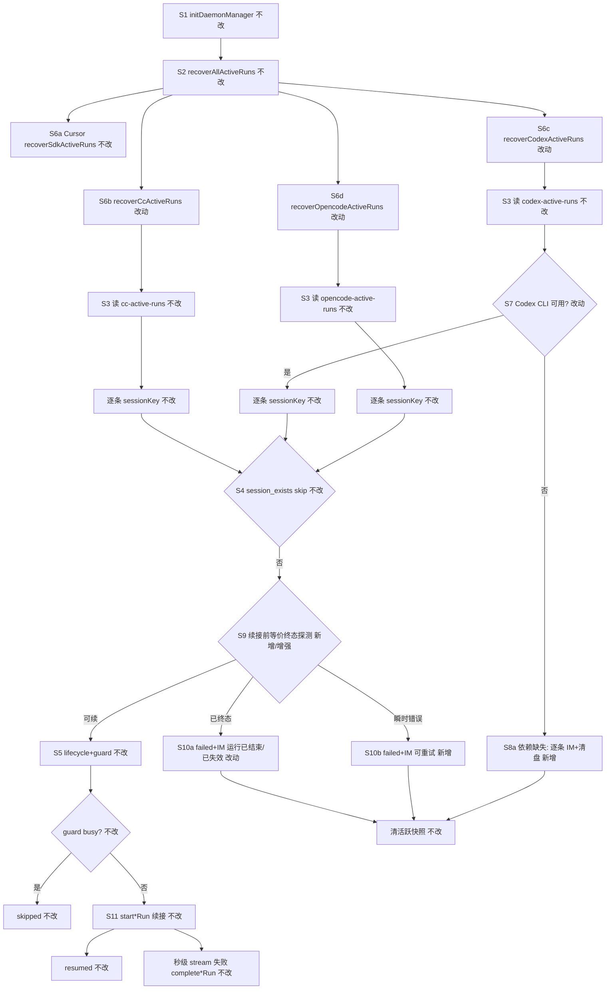
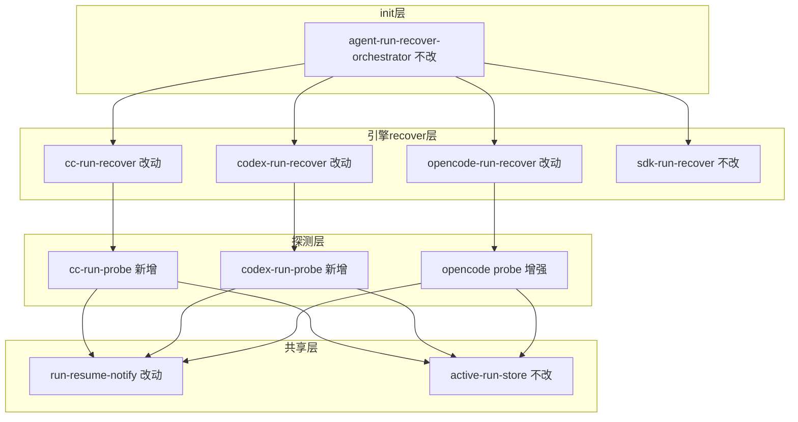

# 三引擎续接终态hardening - 实现设计

> **业务 PRD**：见同目录 `01-proposal.md`（验收标准以 01 为准）
> **父变更**：`20260712113332-非Cursor引擎主进程续接`（已归档；本变更为其上 hardening）
> **业务流程口径**：01 §四 场景 S1～S7、§五 R1～R6、§六验收 6.1～6.3

## 一、业务流程与改动范围

> 业务口径以 `01-proposal.md` §四 / §五 / §六 为准；下图覆盖主进程 init 后三引擎 recover 主路径、终态/依赖探测分支与失败通知路径。Cursor `getRun` 路径**不改**（R5）。

### （一）业务流程图

**图例**：`不改` 行为与父变更归档后一致；`改动` 增强探测/通知/分类；`新增` 新分支（依赖缺失逐条可感知）；`删除` 本变更无删除路径。

### （二）流程步骤与改动对照

| 步骤 ID | 业务含义 | 改动 | 落点（模块/文件） | 01 验收关联 |
|---------|----------|------|-------------------|-------------|
| S1 | Electron 重启、Daemon 仍运行 | 不改 | `electron/daemon/daemon-manager.ts` | 场景前提 |
| S2 | `recoverAllActiveRuns` 四引擎编排 | 不改 | `electron/agent/shared/agent-run-recover-orchestrator.ts` | R4；6.2.1 |
| S3 | 读三引擎活跃 Run 快照 | 不改 | `*-run-persistence.ts`、`active-run-store.ts` | R4 |
| S4 | `session_exists` / guard busy skip | 不改 | 各 `*-run-recover.ts` | 6.2.1 |
| S5 | `lifecycle.resume` + `enterGuardWithLifecycle` | 不改 | `run-lifecycle.ts`、`agent-run-guard.ts` | R4 |
| S6a | Cursor `Agent.getRun` 终态探测 | **不改** | `electron/agent/cursor-sdk/sdk-run-recover.ts` | R5；6.2.2 |
| S7 | Codex CLI 依赖门禁 | 改动 | `electron/agent/codex/codex-run-recover.ts` L72–76 | R2；6.1.2；S3 |
| S8a | 依赖缺失逐条 IM + 清盘 | 新增 | `codex-run-recover.ts`；复用 `run-resume-notify.ts` | R2；6.1.2 |
| S9-CC | CC 续接前等价探测 | 新增 | `electron/agent/claude-code/cc-run-probe.ts`（新建）；挂接 `cc-run-recover.ts` | R1；6.1.1；S2 |
| S9-Codex | Codex 续接前等价探测 | 新增 | `electron/agent/codex/codex-run-probe.ts`（新建）；挂接 `codex-run-recover.ts` | R1；6.1.1；S2 |
| S9-OC | OpenCode 探活增强与分类对齐 | 改动 | `electron/agent/opencode/opencode-run-recover.ts` `probeOpencodeRecoverTarget` | R1；R5 三引擎口径；6.1.1 |
| S10a | 终态/不可恢复失败 IM | 改动 | `run-resume-notify.ts`；各 recover catch 分支 | R1；R3；6.1.3 |
| S10b | 可重试失败 IM 文案区分 | 新增 | `run-resume-notify.ts` `ResumeFailureCategory` | R3；6.1.3；S4 |
| S11 | 续接成功 `start*Run` 主路径 | 不改 | `agent-claude-sdk.ts`、`agent-codex-sdk.ts`、`agent-opencode-sdk.ts` | 6.2.1 |
| — | IM 入队 / dispatch / Port | 不改 | `daemon.ts`、`engine-port-adapter.ts` | R6；6.2.3 |
| — | Agent 路由跨重启持久化 | 不改（并行变更职责） | 路由持久化变更目录 | S7；6.3 |

### （三）改动汇总

- **改动**：
  - Codex recover：**移除** CLI 不可用时的函数级静默早退；改为遍历盘记录、逐条 `notifyResumeFailure`（不可恢复）+ `clearCodexActiveRun`。
  - 三引擎 recover：续接前增加/对齐**等价终态探测**（OpenCode 已有 `session.get`，增强失败分类；CC/Codex 新建 `*-run-probe.ts`）。
  - `run-resume-notify.ts`：扩展 `ResumeFailureCategory`（`retryable` | `unrecoverable`），用户可见 IM 文案区分下一步（重试 vs 新任务）。
- **新增**：
  - `cc-run-probe.ts`、`codex-run-probe.ts`（单文件 ≤300 行；探测逻辑不塞 recover 主文件）。
  - shared 内联类型 `ResumeFailureCategory` 与 `classifyResumeFailure` 辅助（置于 `run-resume-notify.ts` 或同目录小文件，**不**新建 Notifier 服务层）。
- **不改（显式）**：
  - Cursor `sdk-run-recover.ts` 的 `Agent.getRun` 终态分支与计数语义。
  - `agent-run-recover-orchestrator.ts` 调用顺序与 try/catch 隔离。
  - IM 入队、消息队列、工作流 Gateway、四引擎 Port 六能力。
  - 正常续接成功路径（S11）与 `userStopped` 过滤逻辑。

## 二、整体思路

**根因**（见 01 §一；父变更 `05-summary.md` §2 设计差异）：

1. 三引擎 recover **无** Cursor 式 `Agent.getRun`；引擎侧已结束 Run 可能先 `resumed++`，依赖 stream 秒级失败收尾，产品侧长期观感像「还在跑」。
2. Codex `checkCodexCliAvailable()` 失败时 **整函数早退**（`codex-run-recover.ts:72–76`），无 IM、快照滞留（父债 T-FIX-01）。
3. `notifyResumeFailure` 仅统一文案「请重新发送消息继续」，**不可区分**可重试与不可恢复（`run-resume-notify.ts:7–13`）。

**方案要点**（追溯 01 R1–R6）：

1. **等价终态探测（R1）**：不移植 Cursor `getRun`；按引擎能力在 **enterGuard 之前** 探测：
   - **OpenCode**：沿用 `client.session.get`（`opencode-run-recover.ts:103–116`），失败映射 `unrecoverable` +「会话已失效」。
   - **Codex**：`codex-run-probe.ts` 在 CLI 可用前提下 `resumeThread(codexSessionId)` 或 SDK 等价调用捕获「thread/session 不存在或已结束」类错误 → `unrecoverable` +「运行已结束」；**禁止**为探测单独 `runStreamed` 全量任务。
   - **CC**：`cc-run-probe.ts` 在存在 `ccSessionId` 时做 **轻量 resume 探活**（实现时以 SDK 行为为准：优先只读/最短 query；若 SDK 无只读 API 则捕获 resume 拒绝错误）→ 终态则 failed+IM，**不**进入 `startCcQuery`。
2. **依赖缺失可感知（R2）**：Codex CLI 缺失时对每条 recoverable 记录：`clear*ActiveRun` + `notifyResumeFailure(..., unrecoverable, reason=未检测到 Codex CLI…)`；日志保留 `[recover]` 汇总 `failed=N`。
3. **失败可区分（R3）**：`ResumeFailureCategory` 驱动 IM 尾句——`retryable`：「请稍后重新发送消息重试」；`unrecoverable`：「请重新发送消息开始新任务」。分类 SSOT 在 shared，各引擎 recover 只传 `(reason, category)`。
4. **入口兼容（R4）**：探测失败走与现网相同的 `clear*ActiveRun` + 一次 IM（`stop_progress: true`），不改变 orchestrator 与 guard skip 语义。
5. **Cursor 零回归（R5）**：`sdk-run-recover.ts` **不修改**业务分支；若 `notifyResumeFailure` 签名扩展，Cursor 调用处仅补默认 `category`（与现网语义等价 `unrecoverable`）。

**最小方案三问（Ponytail）**：

1. **能否复用现有符号？** 能。复用 `notifyResumeFailure`、`clear*ActiveRun`、`probeOpencodeRecoverTarget` 骨架、父变更 recover 步骤 S4/S5/S11；Cursor `getRun` 作**参考语义**不复用实现。
2. **新增抽象是否被 01 要求？** `ResumeFailureCategory` 被 R3 隐含要求；引擎探测拆 `*-run-probe.ts` 仅为 ≤300 行文件约束，**不**引入跨引擎 Probe 接口/trait 或新 npm 依赖。
3. **能否合并到已有文件？** Codex CLI 修复可 inline `codex-run-recover.ts`；CC/Codex 探测逻辑预计各 +40～80 行，recover 文件已 130～194 行，**须**拆 `*-run-probe.ts` 避免超限。

## 三、分层设计

- **端点层**：无新增 HTTP/IPC。
- **服务层**：各 `recover*ActiveRuns` 在 guard 前调用 probe；失败统一 `notifyResumeFailure(sessionKey, reason, category)`。
- **数据层**：仍用四份 `*-active-runs.json`；探测失败即 `clear*ActiveRun`，不新增字段（分类仅用于 IM/日志）。

## 四、接口设计

无新增对外 HTTP/IPC。进程内扩展：

| 符号 | 签名要点 | 说明 |
|------|----------|------|
| `ResumeFailureCategory` | `"retryable" \| "unrecoverable"` | shared 类型 SSOT |
| `notifyResumeFailure` | `(sessionKey, reason, category?)` | `category` 默认 `unrecoverable` 保 Cursor 兼容 |
| `classifyResumeFailure` | `(engine, errorDetail) → { reason, category }` | 各引擎 catch 与 probe 共用映射 |
| `probeCcRecoverTarget` | `(record) => Promise<void>` | 终态/不可恢复则 throw；可续接 no-op |
| `probeCodexRecoverTarget` | `(record) => Promise<void>` | 同上；CLI 由 recover 外层保证 |
| `probeOpencodeRecoverTarget` | 现有函数 | 增强 throw 消息与分类一致性 |

**错误语义**：

| 场景 | category | 用户 reason 示例 |
|------|----------|------------------|
| 引擎 Run/Session 已结束 | unrecoverable | 运行已结束 / 会话已失效 |
| CLI/二进制/embedded server 缺失 | unrecoverable | 未检测到 Codex CLI… / OpenCode 服务不可用 |
| 网络/瞬时 SDK 错误 | retryable | 会话恢复失败（可重试） |
| guard busy / session_exists | — | **不** IM（与现网一致） |

## 五、数据结构

**无**持久化 schema 变更。新增/扩展仅 TypeScript 类型：

| 名称 | 位置 | 说明 |
|------|------|------|
| `ResumeFailureCategory` | `run-resume-notify.ts` | 失败分类枚举 |
| `ResumeFailureInfo` | 同上（可选内联） | `{ reason: string; category: ResumeFailureCategory }` |

各引擎 `*ActiveRunRecord` 字段不变。

## 六、实现步骤

1. **（S10b）** 扩展 `run-resume-notify.ts`：`ResumeFailureCategory`、`classifyResumeFailure` 骨架、分类 IM 尾句；`sdk-run-recover.ts` 补默认参数（行为不变）。
2. **（S7/S8a）** 改 `codex-run-recover.ts`：CLI 不可用时遍历 `listRecoverableCodexRuns`，逐条 notify+clear；汇总 `failed` 计数。
3. **（S9-Codex）** 新建 `codex-run-probe.ts`，`recoverCodexActiveRuns` guard 前 `await probeCodexRecoverTarget(record)`。
4. **（S9-CC）** 新建 `cc-run-probe.ts`，挂接 `cc-run-recover.ts`；实现时验证 Claude SDK 最轻探活手段（文档化于 AGENTS）。
5. **（S9-OC）** 增强 `opencode-run-recover.ts`：统一 `classifyResumeFailure`；server 不可达区分 retryable/unrecoverable。
6. **（回归）** 三引擎 + Cursor 对照验收（见 §八·（二））；更新各引擎 `AGENTS.md` recover 小节。

## 七、参考实现

CodeGraph / 源码命中（`projectPath=/home/suveng/doger/cursor-claw`）：

| 符号 | 路径 | 用途 |
|------|------|------|
| `recoverSdkActiveRuns` + `Agent.getRun` | `electron/agent/cursor-sdk/sdk-run-recover.ts:68–80` | 终态语义参照（**不改**） |
| `notifyResumeFailure` | `electron/agent/shared/run-resume-notify.ts:10` | R2/R3 扩展点 |
| `recoverCodexActiveRuns` CLI 早退 | `electron/agent/codex/codex-run-recover.ts:72–76` | S7 必改 |
| `probeOpencodeRecoverTarget` | `electron/agent/opencode/opencode-run-recover.ts:109–116` | S9-OC 基线 |
| `resolveCodexThread` / `resumeThread` | `electron/agent/codex/agent-codex-sdk.ts:89–99` | Codex 探活参考 |
| `buildQueryOptions` resume | `electron/agent/claude-code/cc-query-options.ts:34` | CC 探活参考 |
| `recoverAllActiveRuns` | `electron/agent/shared/agent-run-recover-orchestrator.ts` | 编排不改 |
| 父变更设计差异 | `knowledge/变更/归档/20260712113332-非Cursor引擎主进程续接/05-summary.md` §2 | 根因 SSOT |

## 八、技术影响

### （一）影响范围

- **涉及模块**：`electron/agent/shared/run-resume-notify.ts`；`claude-code/cc-run-recover.ts` + `cc-run-probe.ts`；`codex/codex-run-recover.ts` + `codex-run-probe.ts`；`opencode/opencode-run-recover.ts`；Cursor `sdk-run-recover.ts` 仅签名兼容（可选 1 行）。
- **接口/proto 变更**：无。
- **数据变更**：无；探测失败加速 `clear*ActiveRun`，减少快照滞留。
- **风险**：
  - CC/Codex SDK **可能无**只读终态 API；探活过严可能误杀可续接 Run（缓解：验收 6.2.1 成功续接硬门槛；探活失败且不确定时偏 `retryable` 并仍尝试 recover——**待实现时逐引擎标定**）。
  - Codex 逐条 IM 在 CLI 长期缺失且多 session 时可能多条通知（可接受：R2 要求可感知；非成功路径刷屏）。
  - 与「Agent标识跨重启持久化」并行：本变更**不写**路由/绑定盘；仅只读 `sessionKey` 发 IM。

### （二）工程补充验收项

- [ ] Codex CLI 人为移除/改名：`recoverCodexActiveRuns` 日志 `failed≥1`，每条活跃 session 有 IM，`*-active-runs.json` 对应项清除。
- [ ] OpenCode `opencodeSessionId` 失效：IM 含「会话已失效」类文案，`category=unrecoverable`。
- [ ] 模拟瞬时网络错误（或 mock throw）：IM 尾句含「重试」语义，`category=retryable`。
- [ ] 三引擎成功续接主路径：重启后无需用户重发即可继续（6.2.1）。
- [ ] Cursor 重启续接：与父变更归档行为一致（6.2.2）。
- [ ] `notifyResumeFailure` 每条失败 session 仍仅一次 IM（`stop_progress: true`）。
- [ ] 新增/改动单文件 ≤300 行；代码含中文注释。

## 九、知识库影响

| 文档 | 影响 |
|------|------|
| `knowledge/业务域/Agent调度/07-ClaudeCodeSDK执行引擎.md` | 中：§二 recover 探活与失败分类 |
| `knowledge/业务域/Agent调度/08-CodexSDK执行引擎.md` | 中：§二 CLI 缺失 recover 通知；探活 |
| `knowledge/业务域/Agent调度/09-OpenCodeSDK执行引擎.md` | 低～中：§二 探活与分类对齐 |
| `knowledge/业务域/Agent调度/03-启动与自动重连.md` | 低：S7 三引擎终态 hardening 一句 |
| `knowledge/业务域/Agent调度/10-SDK上下文保护与失败归因.md` | 低：`notifyResumeFailure` 分类说明 |
| `knowledge/业务域/Agent调度/06-CursorSDK执行引擎.md` | 低：注明 Cursor 终态探测未改、三引擎等价口径 |

## 十、知识库更新计划

### （一）必须更新

- `07-ClaudeCodeSDK执行引擎.md` — recover 探活与可重试/不可恢复 IM 口径；§十 变更记录。
- `08-CodexSDK执行引擎.md` — CLI 缺失不再静默早退；§十 变更记录。
- `03-启动与自动重连.md` — §二 S7 补充三引擎终态 hardening（一句 + 链到 07–09）。

### （二）可能更新（视实现结果）

- `09-OpenCodeSDK执行引擎.md` — 探活与分类细节。
- `10-SDK上下文保护与失败归因.md` — `ResumeFailureCategory` 与四引擎 notify 对称表。
- `01-概览.md` — §五 关键约束若续接表述需对齐。

### （三）不需要更新

- `04-远程指令.md`、`05-定时任务.md` — 不在 01 范围。
- `knowledge/工程平台/**` — 无 Daemon HTTP/客户端结构变更。
- IM 入队/消息队列相关文档 — R6 明确不改。
