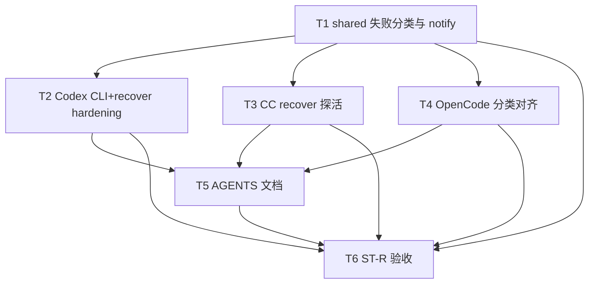

# 三引擎续接终态hardening - 任务分解

> **来源**：`/kb-plan`（基于 `01-proposal.md`、`02-design.md`）
> **任务数**：6（T1–T6）
> **父变更**：`20260712113332-非Cursor引擎主进程续接`（已归档）
> **并行划界**：与 #3「Codex展示排序接入」无文件冲突；与「Agent标识跨重启持久化」职责分离（路由 vs Run 终态）

## 一、执行计划

### （一）依赖图

**CodeGraph 核实**（`projectPath=/home/suveng/doger/cursor-claw`）：

| 符号/文件 | 现状 | 任务 |
|-----------|------|------|
| `notifyResumeFailure` | `run-resume-notify.ts:10` 无 category | T1 |
| `recoverCodexActiveRuns` CLI 早退 | `codex-run-recover.ts:72–76` | T2 |
| `recoverCcActiveRuns` | `cc-run-recover.ts` 无探活 | T3 |
| `probeOpencodeRecoverTarget` | `opencode-run-recover.ts:109` | T4 |
| `recoverSdkActiveRuns` + `getRun` | `sdk-run-recover.ts:68–80` | **不改**（T6 回归） |
| `recoverAllActiveRuns` | `agent-run-recover-orchestrator.ts` | **不改** |

**01 验收追溯**：

| 01 验收 | 主责任务 |
|---------|----------|
| §6.1.1 终态可观测 / R1 | T3、T4、T6（ST-R1） |
| §6.1.2 依赖缺失有通知 / R2 | T2、T6（ST-R2） |
| §6.1.3 失败可区分 / R3 | T1、T2–T4、T6（ST-R3） |
| §6.2.1 既有续接不冲突 / R4 | T2–T4、T6（ST-R4） |
| §6.2.2 Cursor 无回归 / R5 | T6（ST-R5） |
| §6.2.3 非目标未扩大 / R6 | T6（ST-R6） |

**02 §六步骤对齐**：T1→步骤 1；T2→步骤 2–3；T3→步骤 4；T4→步骤 5；T5→步骤 6；T6→步骤 6 回归。

### （二）分组调度

| 轮次 | 任务 | 说明 |
|------|------|------|
| **第一轮** | T1 | shared 契约，阻塞 T2–T4 |
| **第二轮（并行）** | T2、T3、T4 | 不同引擎目录，无同文件冲突 |
| **第三轮** | T5 | 依赖 T2–T4 行为定稿 |
| **第四轮** | T6 | ST-R* 契约/手工验收 |

**同文件冲突（禁止并行 apply）**：

| 文件 | 任务（顺序） | 备注 |
|------|----------------|------|
| `electron/agent/shared/run-resume-notify.ts` | T1 | T2–T4 仅调用 |
| `electron/agent/codex/codex-run-recover.ts` | T2 | 与 `codex-run-probe.ts` 同任务 |
| `electron/agent/claude-code/cc-run-recover.ts` | T3 | 与 `cc-run-probe.ts` 同任务 |
| `electron/agent/opencode/opencode-run-recover.ts` | T4 | — |

**明确不做**：`agent-run-recover-orchestrator.ts` 编排、`sdk-run-recover.ts` 业务逻辑、IM 入队、Daemon dispatch。

## 二、任务清单

## T1: shared 续接失败分类与 notify 扩展

### 背景
R3 要求区分可重试与不可恢复失败；三引擎 recover 与 Cursor 共用 `notifyResumeFailure`，须先定 shared 类型与 IM 文案契约。

### 上下文文件
- CodeGraph: `notifyResumeFailure` — 定位调用方
- 必读: `electron/agent/shared/run-resume-notify.ts` — 扩展点
- 必读: `electron/agent/cursor-sdk/sdk-run-recover.ts` — 兼容默认 category
- 参考: `knowledge/变更/进行中/20260712145449-三引擎续接终态hardening/02-design.md` §四

### 实现范围
- 修改: `electron/agent/shared/run-resume-notify.ts` — 新增 `ResumeFailureCategory`、`classifyResumeFailure`（基础映射）；`notifyResumeFailure(sessionKey, reason, category?)` 第三参默认 `unrecoverable`；按 category 切换 IM 尾句（重试 vs 新任务）
- 修改: `electron/agent/cursor-sdk/sdk-run-recover.ts` — 仅补全调用参数或依赖默认值，**不改** `getRun` 分支逻辑

### 接口契约
- `export type ResumeFailureCategory = "retryable" | "unrecoverable"`
- `export function classifyResumeFailure(engine: "cc" | "codex" | "opencode", detail: string): { reason: string; category: ResumeFailureCategory }`
- `export async function notifyResumeFailure(sessionKey: string, reason: string, category?: ResumeFailureCategory): Promise<void>`

### 验收标准
- [ ] `category=retryable` IM 含「重试」语义；`unrecoverable` 含「新任务」语义
- [ ] Cursor `sdk-run-recover` 编译通过且 notify 行为与改前等价（默认 unrecoverable）
- [ ] 日志仍含 `[recover] notifyResumeFailure sessionKey=… reason=…`
- [ ] 无 `02`/`03` 未要求的抽象层或未批准新依赖

### 依赖
- 前置任务: 无
- 后续任务: T2、T3、T4、T6

## T2: Codex recover 依赖缺失与终态探活

### 背景
父变更 accepted_debt：CLI 不可用静默早退、无 IM。本任务清偿 S7/S8a，并加 Codex 续接前等价探测（S9-Codex）。

### 上下文文件
- CodeGraph: `recoverCodexActiveRuns` `checkCodexCliAvailable` — 早退与探活挂接
- 必读: `electron/agent/codex/codex-run-recover.ts`
- 必读: `electron/agent/codex/agent-codex-sdk.ts` `resolveCodexThread`
- 必读: `electron/agent/shared/run-resume-notify.ts`（T1 产出）
- 参考: `knowledge/变更/归档/20260712113332-非Cursor引擎主进程续接/05-summary.md` §2

### 实现范围
- 新建: `electron/agent/codex/codex-run-probe.ts` — `probeCodexRecoverTarget(record)`，终态 throw
- 修改: `electron/agent/codex/codex-run-recover.ts` — 移除 L72–76 整函数早退；CLI 缺失时遍历记录 notify+clear；guard 前 `await probeCodexRecoverTarget`；catch 用 `classifyResumeFailure`

### 接口契约
- `export async function probeCodexRecoverTarget(record: CodexActiveRunRecord): Promise<void>` — 可续接 no-op；不可恢复 throw Error

### 验收标准
- [ ] CLI 缺失：每条 recoverable 记录有 IM（`unrecoverable`），盘记录清除，`failed` 计数正确
- [ ] 有效 CLI + 失效 thread：不进入 `startCodexRun`，IM「运行已结束」类，`unrecoverable`
- [ ] 成功续接主路径仍可用（6.2.1）
- [ ] `codex-run-recover.ts` + `codex-run-probe.ts` 各 ≤300 行；中文注释

### 依赖
- 前置任务: T1
- 后续任务: T5、T6

## T3: CC recover 续接前等价探活

### 背景
CC recover 无终态探测，引擎已结束 Run 可能误报 resumed。须在 guard 前轻量探活，对齐 OpenCode/Cursor 产品观感。

### 上下文文件
- CodeGraph: `recoverCcActiveRuns` `buildQueryOptions` resume
- 必读: `electron/agent/claude-code/cc-run-recover.ts`
- 必读: `electron/agent/claude-code/cc-query-options.ts`
- 必读: `electron/agent/shared/run-resume-notify.ts`（T1）

### 实现范围
- 新建: `electron/agent/claude-code/cc-run-probe.ts` — `probeCcRecoverTarget(record)`
- 修改: `electron/agent/claude-code/cc-run-recover.ts` — guard 前 await probe；失败路径 classify + notify

### 接口契约
- `export async function probeCcRecoverTarget(record: CcActiveRunRecord): Promise<void>`

### 验收标准
- [ ] 存在 `ccSessionId` 且 SDK 判定不可续：failed+IM+clear，不调用 `startCcQuery`
- [ ] 无 `ccSessionId` 或探活通过：原续接路径不变
- [ ] 不误伤正常重启续接（6.2.1）；文件 ≤300 行

### 依赖
- 前置任务: T1
- 后续任务: T5、T6

## T4: OpenCode recover 分类与探活对齐

### 背景
OpenCode 已有 `probeOpencodeRecoverTarget`，但失败分类与三引擎口径未统一；须接入 T1 分类与 IM 文案。

### 上下文文件
- CodeGraph: `probeOpencodeRecoverTarget` `recoverOpencodeActiveRuns`
- 必读: `electron/agent/opencode/opencode-run-recover.ts`
- 必读: `electron/agent/shared/run-resume-notify.ts`（T1）

### 实现范围
- 修改: `electron/agent/opencode/opencode-run-recover.ts` — catch/probe 失败统一 `classifyResumeFailure`；「会话已失效」→ `unrecoverable`；server 瞬时不可达 → `retryable`（实现时按错误串标定）

### 接口契约
- 沿用 `probeOpencodeRecoverTarget`；无新导出要求

### 验收标准
- [ ] 失效 `opencodeSessionId`：IM 与 ST-R1 一致
- [ ] 成功续接路径不变
- [ ] 文件仍 ≤300 行

### 依赖
- 前置任务: T1
- 后续任务: T5、T6

## T5: 引擎 AGENTS 补充 recover hardening

### 背景
代码侧 AGENTS 为 implement SSOT；须记录探活文件与失败分类，供 archive 前 kb-librarian 对齐。

### 上下文文件
- 必读: `electron/agent/claude-code/AGENTS.md`
- 必读: `electron/agent/codex/AGENTS.md`
- 必读: `electron/agent/opencode/AGENTS.md`
- 必读: `electron/agent/shared/AGENTS.md`

### 实现范围
- 修改: 上述 AGENTS — 各增一小节：`*-run-probe`、CLI 缺失 notify、`ResumeFailureCategory` 消费约定；注明 Cursor recover 未改

### 接口契约
- 无代码接口

### 验收标准
- [ ] 四份 AGENTS 提及本变更边界，不扩 scope 到 IM 入队
- [ ] 与 T2–T4 实现一致

### 依赖
- 前置任务: T2、T3、T4
- 后续任务: T6

## T6: ST-R 契约与回归验收

### 背景
覆盖 01 §六与 02 §八·（二）工程补充项；确认 Cursor 无回归、三引擎口径对齐。

### 上下文文件
- 必读: `knowledge/变更/进行中/20260712145449-三引擎续接终态hardening/01-proposal.md` §六
- 必读: `knowledge/变更/进行中/20260712145449-三引擎续接终态hardening/02-design.md` §八·（二）
- 参考: `electron/agent/cursor-sdk/sdk-run-recover.ts` — 对照回归

### 实现范围
- 新建（可选）: `knowledge/变更/进行中/20260712145449-三引擎续接终态hardening/06-automation-test.md` 场景 ST-R1～ST-R6 清单
- 执行: `npx tsc --noEmit`；手工或脚本验证 ST-R*

### 接口契约
- 无

### 验收标准
- [ ] ST-R1：三引擎「引擎已结束+有快照」不长期误报运行中
- [ ] ST-R2：Codex CLI 缺失有 IM
- [ ] ST-R3：可区分 retryable vs unrecoverable 文案
- [ ] ST-R4：成功续接主路径可用
- [ ] ST-R5：Cursor recover 行为与父变更一致
- [ ] ST-R6：未改 IM 入队/队列/Gateway
- [ ] `tsc --noEmit` 通过

### 依赖
- 前置任务: T1、T2、T3、T4、T5
- 后续任务: 无
