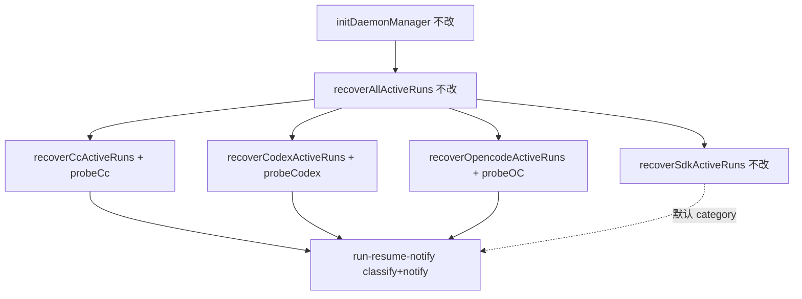

# 三引擎续接终态hardening - 代码评审报告

## 1、审查范围

- **变更类型**: apply 产出的未提交变更（8 个已跟踪 diff + 2 个新增 `??` 探活文件）
- **评审等级**: focused-review（三引擎 recover hardening；无 proto/DB/对外 IPC 变更）
- **涉及文件**:
  - `electron/agent/shared/run-resume-notify.ts`（T1）
  - `electron/agent/codex/codex-run-recover.ts`、`codex-run-probe.ts`（T2，新建）
  - `electron/agent/claude-code/cc-run-recover.ts`、`cc-run-probe.ts`（T3，新建）
  - `electron/agent/opencode/opencode-run-recover.ts`（T4）
  - 四份引擎/ shared `AGENTS.md`（T5）
  - **未改**: `electron/agent/cursor-sdk/sdk-run-recover.ts`、`agent-run-recover-orchestrator.ts`
- **设计文档**: `02-design.md`、`03-tasks.md`（对照基准）
- **父债**: `20260712113332-非Cursor引擎主进程续接` §7 Codex CLI 静默早退（T-FIX-01 候选）— 本实现已清偿，**不得**再标 `accepted_debt`
- **核对方式**: `git diff electron/agent/{shared,codex,claude-code,opencode}/`；源码直读 probe/recover 挂接；`npx tsc --noEmit`；CodeGraph `notifyResumeFailure` / `recoverSdkActiveRuns` 符号核对（索引部分命中）

## 2、严重（必须处理）

无

## 3、警告（建议处理）

无（评分 ≥75 项）

**Ponytail 精简检查**（不阻断）：

1. **Lean already. Ship.** — 未新建跨引擎 Probe trait/Notifier 服务；`ResumeFailureCategory` + `classifyResumeFailure` 为 01 R3 隐含契约；探活拆 `*-run-probe.ts` 仅为 ≤300 行约束，与 `02` §二最小方案三问一致。
2. **ponytail 升级路径已文档化**：
   - `cc-run-probe.ts:15-16` — `getSessionInfo` 仅读盘存在性；升级至 Claude SDK 等价 `getRun` 只读 API 可替换。
   - `codex-run-probe.ts:45-46` — 空 prompt `runStreamed` 首事件探活；升级至 SDK `getThread`/resume 校验 API 可替换。
3. **shrink:** `parseRecordChatType` 四份复制（父变更既有）；非本变更范围。
4. **OpenCode** `probeOpencodeRecoverTarget` 与 `startOpencodeRun` 仍可能双连 `resolveOpencodeClient`（父变更 §3-4）；性能建议，不影响正确性。

## 4、设计偏差

1. **Codex 探活手段 vs 02 §二「禁止 runStreamed 全量任务」**
   - 设计字面: 禁止为探测单独 `runStreamed` 全量任务
   - 实际实现: `codex-run-probe.ts` 对有效 thread 执行 `runStreamed("")`，在 `turn.started`/`thread.started` 后立即 `abort`，捕获终态错误映射 `运行已结束`
   - 影响: 属 `02` §八·（一）已披露「SDK 可能无只读 API」下的 **ponytail**；代码注释与 AGENTS 已登记升级路径；非阻断
   - 结论: **可接受**（等价探活 + 不误伤主路径）

2. **CC 探活粒度**
   - 设计预期: 轻量 resume/只读探活
   - 实际实现: `getSessionInfo` 校验会话文件存在，**不**探测 Run 运行时态
   - 影响: 与 Cursor `getRun` 不等价，但优于「无探测」；`02` §八·（一）风险已记载；archive 后 ST-R1 手工验收仍建议覆盖
   - 结论: **可接受**（引擎能力边界内）

3. **Cursor IM 尾句文案（共享 notify）**
   - 改前: `请重新发送消息继续`
   - 改后（默认 `unrecoverable`）: `请重新发送消息开始新任务`
   - 说明: `sdk-run-recover.ts` **业务分支未改**；仅经 shared 默认 category 切换尾句，与 T1/R3 产品口径一致；`Agent.getRun` 终态路径功能无回归

其余步骤（S7 CLI 逐条 IM、S9 guard 前 probe、S10 分类 notify、orchestrator/IM 入队不改）与 `02-design.md` 流程图及对照表一致。

## 5、验收标准检查

| 任务 | 验收条件 | 状态 |
|------|---------|------|
| T1 | `ResumeFailureCategory`、`classifyResumeFailure`、`notifyResumeFailure(..., category?)` 默认 `unrecoverable` | ✅ |
| T1 | retryable/unrecoverable IM 尾句区分 | ✅ 静态读 `RETRYABLE_TAIL` / `UNRECOVERABLE_TAIL` |
| T1 | Cursor 编译通过、notify 默认行为 | ✅ `tsc --noEmit`；`sdk-run-recover.ts` 无 diff |
| T2 | CLI 缺失逐条 IM + 清盘 + `failed` 计数 | ✅ `failAllCodexRunsOnCliMissing` |
| T2 | guard 前 `probeCodexRecoverTarget` | ✅ L122 |
| T2 | 文件 ≤300 行 + 中文注释 | ✅ recover 166 / probe 72 行 |
| T3 | guard 前 `probeCcRecoverTarget`；失败 classify + notify | ✅ |
| T3 | 无 `ccSessionId` no-op | ✅ probe L12 |
| T4 | OpenCode `classifyResumeFailure` 统一；server 瞬时 → retryable | ✅ `wrapOpencodeProbeError` + classify L61-62 |
| T5 | 四份 AGENTS recover hardening 小节 | ✅ diff 确认 |
| T6 | ST-R1～ST-R6 运行时 + `tsc` | ⏳ `tsc` ✅；ST-R* 待 `/kb-test` |
| 01 §6.1.1 R1 终态可观测 | 三引擎 guard 前 probe | ✅ 代码就绪 |
| 01 §6.1.2 R2 依赖缺失通知 | Codex CLI 缺失 IM | ✅ 父债清偿 |
| 01 §6.1.3 R3 失败可区分 | category 驱动尾句 | ✅ |
| 01 §6.2.1 R4 续接主路径 | S11 `start*Run` 未改 | ✅ |
| 01 §6.2.2 R5 Cursor 无回归 | `getRun` 分支未动 | ✅ |
| 01 §6.2.3 R6 范围克制 | orchestrator/入队未改 | ✅ |
| 02 §八·（二）单文件 ≤300 | 全部合规 | ✅ 最大 `opencode-run-recover.ts` 209 行 |

## 6、调用链与回归风险

| 回归点 | 风险 | 评审结论 |
|--------|------|----------|
| Cursor `Agent.getRun` 终态 | 中（硬门槛） | `sdk-run-recover.ts` 无 diff；`getRun` L68-80 未动 |
| Codex CLI 缺失边角 | 低 | 父债 T-FIX-01 已清偿；空盘仍 `{0,0,0}` + WARN（合理） |
| 探活误杀可续接 Run | 中 | `classifyResumeFailure` 不确定偏 `retryable`（L76-78）；符合 02 §八·（一）缓解 |
| Codex 空 prompt 探活副作用 | 低～中 | abort 于 `turn.started`；ponytail 已注释升级路径 |
| recover 与 dispatch 双跑 | 低 | `session_exists` / guard busy skip 未改 |
| IM 入队 / Gateway | 低 | 无触及 `daemon.ts` / `file-queue` |

## 7、遗留债务

无

- 父变更 **Codex CLI 静默早退**已由 `failAllCodexRunsOnCliMissing` 清偿；**禁止**在 `reviews` 登记 `accepted_debt`。
- T6（ST-R1～ST-R6 运行时验收）为 `/kb-test` 阶段任务，**非** open 债务。

## 8、修复任务建议

无 open 问题，无需 `T-FIX-*`。

| 问题 ID | 建议动作 | 关联任务 |
|---------|----------|----------|
| — | — | — |

## 9、结论

**通过**，可进入 `/kb-test`。

- T1–T5 实现与 `02-design.md` / `03-tasks.md` 对齐；`tsc --noEmit` 通过；父债 Codex CLI 早退已清偿；ponytail 升级路径已写入 probe 注释与 AGENTS。
- **sdk-run-recover 无业务回归**：`Agent.getRun` 终态分支与 recover 主路径未改；仅共享 notify 默认尾句随 R3 对齐。
- T6（ST-R1～ST-R6 手工/半自动）仍为 `pending`，须在 `/kb-test` 补 `06-automation-test.md` 并执行后再 `/kb-archive`。
- 评审等级：**focused-review**；严重 0、警告（≥75）0；open 0、`accepted_debt` 0。
