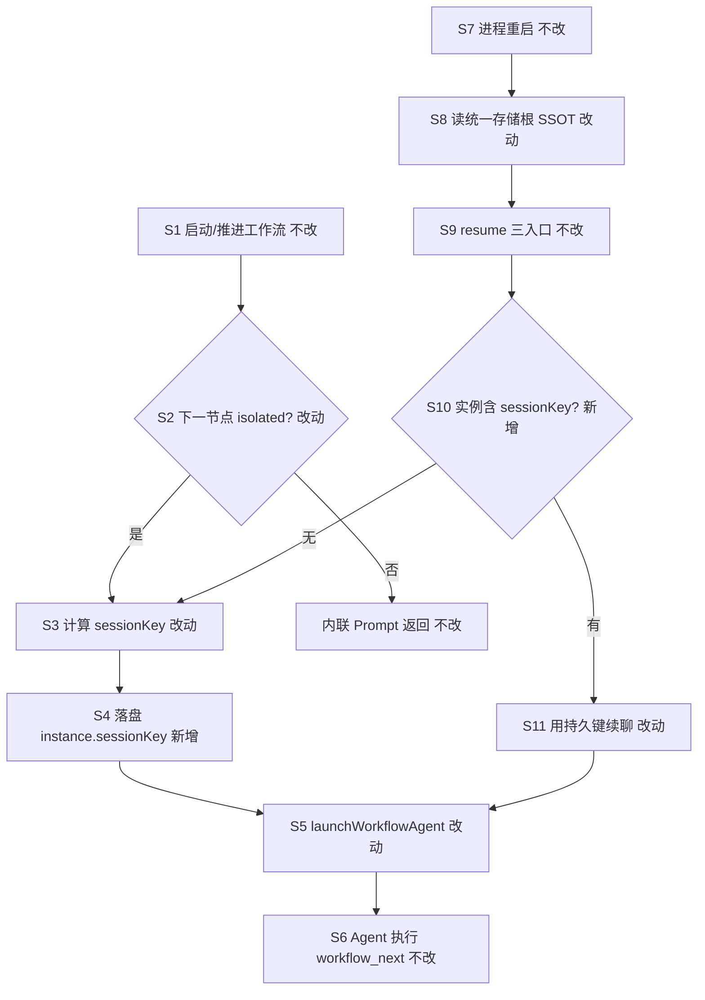
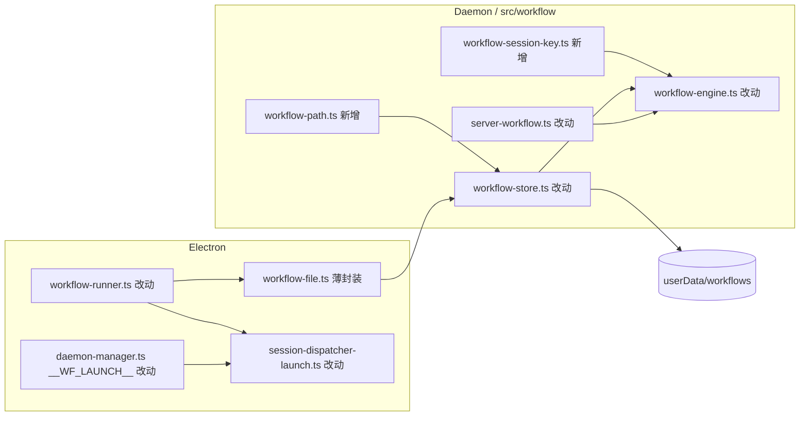

# 工作流会话键与存储统一 - 实现设计

> **业务 PRD**：见同目录 `01-proposal.md`（验收标准以 01 为准）
> **父变更**：`20260712113344-工作流恢复入口与信号接口`（已归档；本变更在其 resume 三入口之上统一数据/存储）
> **并行变更**：与 `20260712145827-多引擎MCP设置实质化`（#6）**无文件冲突**；与 `20260712113356-Agent标识跨重启持久化` 职责分离（IM chatId 路由 vs 工作流实例 `sessionKey`）

## 1、业务流程与改动范围

> 业务口径以 `01-proposal.md` §四场景 S1～S5、§五 R1～R6、§六验收 1～6 为准；下图覆盖 isolated 节点启动、sessionKey 落盘、双端读盘与 resume 复用主路径。

### 1.1 业务流程图

**图例**：`不改` 行为与父变更归档后一致；`改动` 在既有节点补持久化/读盘；`新增` 新分支；`删除` 无。

### 1.2 流程步骤与改动对照

| 步骤 ID | 业务含义 | 改动 | 落点（模块/文件） | 01 验收关联 |
|---------|----------|------|-------------------|-------------|
| S1 | `createInstance` / `startWorkflow` / `handleNext` | 不改 | `src/workflow/workflow-engine.ts` | R4 |
| S2 | isolated 节点判定 | 改动（落盘时机） | `workflow-engine.ts` `handleNext`/`handleReject`/`resumeWorkflow` | R1 |
| S3 | 生成 `{chatId}::wf_{instanceId}_{nodeId}` | 改动（抽取 SSOT） | 新建 `src/workflow/workflow-session-key.ts`；对齐 `session-dispatcher-launch.ts` L138 | R1、R3 |
| S4 | `saveInstance` 写入 `sessionKey` | 新增 | `workflow-engine.ts`；`workflow-store.ts` | R1；验收 1 |
| S5 | Electron/Daemon 启动 Agent | 改动（可传入持久键） | `electron/session/session-dispatcher-launch.ts`；`workflow-runner.ts`；`server-workflow.ts` `emitLaunch` | R4；验收 3 |
| S6 | Agent `workflow_next` / `workflow_reject` | 不改 | `server-workflow.ts` MCP 工具 | R4；验收 3 |
| S7 | Electron 重启或 Daemon 单独重启 | 不改 | `recoverStaleInstances`（仍标 paused） | 验收 1 前置 |
| S8 | 双端读同一 `workflows/` 根 | 改动 | 新建 `src/workflow/workflow-path.ts`；`workflow-store.ts`；`electron/workflow/workflow-file.ts` | R2；验收 2、6 |
| S9 | UI / 斜杠 / HTTP resume | 不改 | `workflow-runner.ts` `resumeWorkflowInstance`；`server-workflow.ts` `resumeWorkflowAndEmit` | R4；验收 3 |
| S10 | 恢复时读实例 JSON | 新增 | `getInstance` 经统一 store | 验收 1 |
| S11 | resume 复用 `inst.sessionKey` | 新增 | `launchWorkflowAgent` 增 `sessionKey?`；runner + `daemon-manager` `__WF_LAUNCH__` | 验收 1 |
| M1 | 遗留双目录对齐（若有） | 新增 | `workflow-path.ts` `migrateLegacyWorkflowDirIfNeeded` | R2；验收 2 |
| B1 | IM `session-routing.json` 映射 | **不改** | `daemon-session-routing-persist.ts`（归档 `20260712113356`） | R5；验收 5 |
| NG | Gateway / YAML 引擎 / create·update 扩面 | 不改 | — | R6；验收 4 |

### 1.3 改动汇总

- **新增**：
  - `src/workflow/workflow-path.ts` — 运行时解析 `APP_DATA_DIR/workflows`（lazy，非模块顶常量）。
  - `src/workflow/workflow-session-key.ts` — `buildWorkflowSessionKey` / `persistInstanceSessionKey`。
  - 可选一次性迁移：旧 `electron/workflow-file` 孤立目录 → SSOT（仅当检测到分叉且 SSOT 为空）。
- **改动**：
  - `workflow-store.ts`：路径改 lazy；`saveInstance` 序列化保留 `sessionKey`。
  - `workflow-engine.ts`：isolated / resume 路径在 `saveInstance` 前写入 `sessionKey`。
  - `electron/workflow/workflow-file.ts`：改为薄封装，内部委托 `workflow-store`（消除双实现）。
  - `workflow-runner.ts`：**统一**从 `workflow-file`（或 store）读写；修复现网混用 `workflow-file` + `workflow-store`（L4–6）。
  - `session-dispatcher-launch.ts` `launchWorkflowAgent`：支持 `sessionKey?` 覆盖；成功后回调或调用方落盘。
  - `server-workflow.ts` `emitLaunch` payload 可携带 `sessionKey`（Daemon→Electron 信号对齐）。
- **删除**：无（`workflow-file.ts` 保留为 Electron 侧 import 稳定点，不删文件）。
- **不改（显式列出）**：
  - resume 三入口授权与 HTTP 契约；`manage_workflows` action 集合；分支 Gateway；YAML 引擎；`session-routing.json` 职责。

## 2、整体思路

**根因**（CodeGraph + `knowledge/业务域/工作流/02-定义与实例.md` §二、`03-节点执行与流转.md` §九核实）：

1. **`sessionKey` 未持久**：`WorkflowInstance.sessionKey` 类型存在（`workflow-types.ts:44`），但 `launchWorkflowAgent` 仅在内存生成键（`session-dispatcher-launch.ts:138`），引擎 `handleNext` isolated 分支（`workflow-engine.ts:276`）未 `saveInstance` 更新。
2. **存储双路径**：Daemon `workflow-store.ts` 用 `APP_DATA_DIR`（模块加载时常量）；Electron `workflow-file.ts` 用 `app.getPath("userData")`；`workflow-runner.ts` 混用两者（定义走 file、实例走 store），存在模块加载早于 `initDaemonManager` 设 `APP_DATA_DIR`（`daemon-manager.ts:1214`）时路径为空的风险。
3. **字段未统一写回**：知识库已记「`sessionKey` 类型字段引擎未统一更新」（`02-定义与实例.md` §九）。

**方案要点**（追溯 01 R1～R6）：

1. **存储 SSOT（R2）**：`workflow-path.ts` 在每次 IO 前 `resolveWorkflowRoot()` → `path.join(process.env.APP_DATA_DIR || "", "workflows")`；Electron 在 `initDaemonManager` 已设 `APP_DATA_DIR=userData`，与 Daemon 子进程 env（`daemon-manager.ts:600`）一致。`workflow-file.ts` 不再独立实现 CRUD。
2. **sessionKey 持久（R1）**：isolated 推进/resume 时计算键并 `saveInstance`；`launchWorkflowAgent` 优先 `inst.sessionKey`，无则计算并回写。
3. **与 Agent 路由分工（R5）**：工作流键形如 `chatId::wf_*`，**不**写入 `session-routing.json`；IM 续聊路由仍归归档 `20260712113356`，本变更仅保证工作流实例 JSON 为会话绑定真相。
4. **resume 兼容（R4）**：父变更 `resumeWorkflowInstance` / `resumeWorkflowAndEmit` 不改入口，仅底层读盘与 launch 参数增强。

**最小方案三问（Ponytail）**：

1. **能否复用现有模块？** 能。复用 `workflow-definition-store` 模式、`workflow-store` CRUD、`launchWorkflowAgent`、`resumeWorkflow`；不新建 WorkflowRepository 层。
2. **新增抽象是否 PRD 要求？** 仅两个小文件（`workflow-path.ts`、`workflow-session-key.ts`），各 ≤300 行；不引入 ORM、不新增 npm 包。
3. **能否合并到已有文件？** `workflow-store.ts` 已近 100 行，路径逻辑拆 `workflow-path.ts` 是为修模块顶常量 bug；`workflow-file.ts` 保留薄 re-export 避免 Electron 大面积改 import。

## 3、分层设计

- **数据层**：`workflow-path` + `workflow-store` 单点 IO；实例 JSON 含 `sessionKey?: string`。
- **引擎层**：isolated/resume 写 `sessionKey` 后 `saveInstance`。
- **端点层**：runner / `__WF_LAUNCH__` / MCP 不改对外契约，仅内部读盘与 launch 参数。

## 4、接口设计

| 变更 | 说明 |
|------|------|
| `launchWorkflowAgent` | 增可选 `sessionKey?: string`；缺省时 `buildWorkflowSessionKey` |
| `emitLaunch` stdout payload | 增可选 `sessionKey` 字段（Electron 解析后传入 launch） |
| `POST /api/workflow-signal` | **无**变更（仍调 `resumeWorkflowAndEmit`） |
| IPC `workflow:*` | **无**变更 |
| `manage_workflows` | **无**新增 action（R6） |

## 5、数据结构

**WorkflowInstance**（`workflow-types.ts`，无破坏性变更）：

- `sessionKey?: string` — isolated 节点 Agent 绑定键；resume 后须可读。
- 磁盘路径：`{APP_DATA_DIR}/workflows/instances/{id}.json`（SSOT）。
- **不**新增 `session-routing.json` 字段；**不**改 `sdk-active-runs.json`。

**迁移**：若检测到 `{userData}/workflows/instances` 有文件而 SSOT 目录空（历史分叉），一次性复制 instances/definitions 至 SSOT 并打 WARN 日志（幂等）。

## 6、实现步骤

1. **步骤 1（S8）**：新增 `workflow-path.ts`，`workflow-store.ts` 改 lazy 路径。
2. **步骤 2（S8/M1）**：`workflow-file.ts` 委托 store；runner/command-handler/daemon-manager 统一 import。
3. **步骤 3（S3/S4）**：新增 `workflow-session-key.ts`；引擎 isolated/resume 写 `sessionKey`。
4. **步骤 4（S5/S11）**：`launchWorkflowAgent` + `emitLaunch` + runner/daemon-manager 传持久键。
5. **步骤 5（M1）**：可选遗留目录迁移与启动日志标明 SSOT 路径。
6. **步骤 6**：契约脚本 `ST-WF*` 覆盖验收 1～3、5、6。

## 7、参考实现

| 符号/路径 | 说明 |
|-----------|------|
| `WorkflowInstance.sessionKey` | `src/workflow/workflow-types.ts:44` |
| `launchWorkflowAgent` | `electron/session/session-dispatcher-launch.ts:133` |
| `handleNext` isolated | `src/workflow/workflow-engine.ts:276` |
| `resumeWorkflow` | `src/workflow/workflow-engine.ts:402` |
| `workflow-store` APP_DATA_DIR | `src/workflow/workflow-store.ts:13`（模块顶常量 — 待修） |
| `workflow-file` userData | `electron/workflow/workflow-file.ts:14` |
| `workflow-runner` 混用 | `electron/workflow/workflow-runner.ts:4-6` |
| `resumeWorkflowAndEmit` | `src/workflow/server-workflow.ts:92` |
| `__WF_LAUNCH__` | `electron/daemon/daemon-manager.ts:649` |
| `session-routing.json` | 归档 `20260712113356` — **本变更不碰** |

## 8、技术影响

### 8.1 影响范围

- **涉及模块**：`src/workflow/*`、`electron/workflow/*`、`electron/session/session-dispatcher-launch.ts`、`electron/daemon/daemon-manager.ts`（`__WF_LAUNCH__` 解析）。
- **接口/proto 变更**：无对外 HTTP/MCP 破坏性变更。
- **数据变更**：实例 JSON 可能新增/更新 `sessionKey` 字段；可选一次性目录迁移。
- **风险**：迁移误拷 — 仅 SSOT 空且 legacy 非空时执行；launch 失败时不应写入错误键（launch 成功后再 persist 或 engine 预写 + launch 用同一键）。

### 8.2 工程补充验收项

- [ ] `workflow-runner` / Daemon MCP `run` / resume 三入口读写的实例文件路径 grep 一致（均为 SSOT 下 `{id}.json`）。
- [ ] 重启 Electron 后 isolated 实例 resume，`sessionKey` 与重启前 JSON 一致且 Agent 列表可见同键。
- [ ] `session-routing.json` 无 `::wf_` 条目（无双写）。
- [ ] `workflow-store.ts` 模块加载时 `APP_DATA_DIR` 为空不导致静默写 `/workflows`（lazy 解析）。

## 9、知识库影响

- `knowledge/业务域/工作流/02-定义与实例.md` — 存储 SSOT、实例含 `sessionKey`。
- `knowledge/业务域/工作流/03-节点执行与流转.md` — 移除「未持久化」限制；补充 resume 复用键。
- `knowledge/业务域/工作流/01-概览.md` — 数据目录单一真相一句。
- `src/workflow/AGENTS.md`、`electron/workflow/AGENTS.md` — 存储与 sessionKey 规矩。
- 两级索引：领域 README 若仍准确则不必动总索引。

## 10、知识库更新计划

### 10.1 必须更新

- `knowledge/业务域/工作流/02-定义与实例.md` §二、§六、§九
- `knowledge/业务域/工作流/03-节点执行与流转.md` §六、§九
- `src/workflow/AGENTS.md`、`electron/workflow/AGENTS.md`

### 10.2 可能更新（视实现结果）

- `knowledge/业务域/工作流/01-概览.md` §五关键约束（存储根）
- `knowledge/业务域/工作流/04-触发与管理入口.md`（若补充运维排障「存储根」一句）

### 10.3 不需要更新

- `knowledge/业务域/Agent调度/*`（resume 入口已归档）
- `knowledge/业务域/消息桥接/*`（队列/路由无变更）
- #6 MCP 设置相关文档
