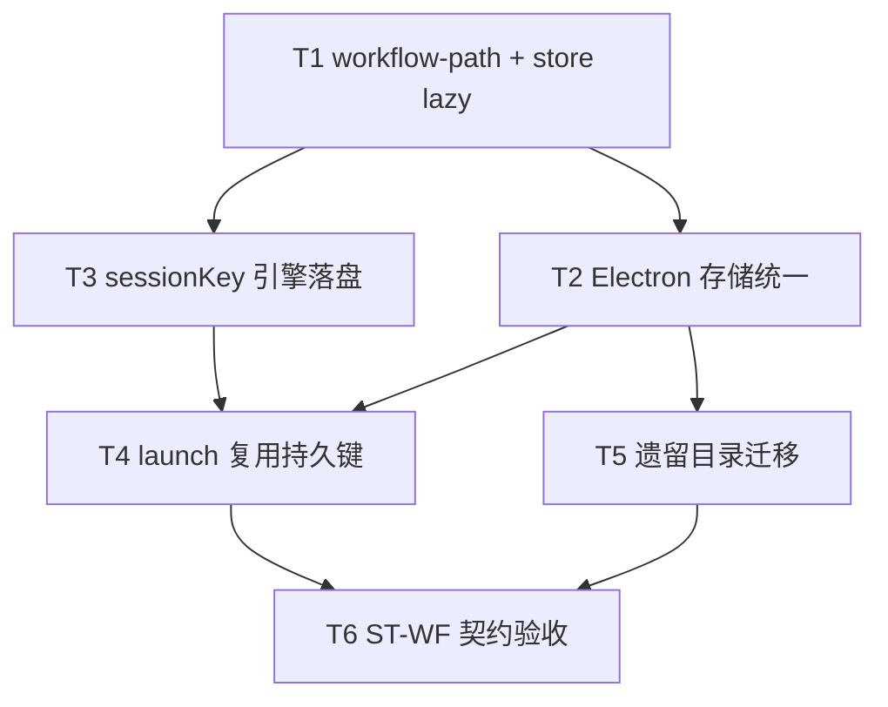

# 工作流会话键与存储统一 - 任务分解

> **来源**：`/kb-plan`（基于 `01-proposal.md`、`02-design.md`）
> **父变更**：`20260712113344-工作流恢复入口与信号接口`（已归档）
> **并行划界**：与 #6「多引擎MCP设置实质化」**无文件冲突**；与 `session-routing.json`（Agent 标识持久化）职责分离

## 1、执行计划

### 1.1 依赖图



**CodeGraph 核实**（`projectPath=/home/suveng/doger/cursor-claw`）：

| 符号/文件 | 现状 | 任务 |
|-----------|------|------|
| `workflow-store` APP_DATA_DIR 模块顶常量 | `workflow-store.ts:13-15` | T1 |
| `workflow-file` 独立 userData 实现 | `workflow-file.ts:14-94` | T2 |
| `workflow-runner` 混用 file+store | `workflow-runner.ts:4-6` | T2 |
| `handleNext` isolated 无 sessionKey 写盘 | `workflow-engine.ts:276` | T3 |
| `launchWorkflowAgent` 仅内存生成键 | `session-dispatcher-launch.ts:138` | T4 |
| `resumeWorkflowAndEmit` | `server-workflow.ts:92` | T4（读盘经 T1/T2） |
| `session-routing.json` | 归档 `20260712113356` | **不改**（T6 断言无双写） |

**01 验收追溯**：

| 01 验收 | 主责任务 |
|---------|----------|
| §六-1 重启可恢复 sessionKey | T3、T4、T6 |
| §六-2 双端同一真相 | T1、T2、T5、T6 |
| §六-3 resume 仍通 | T4、T6 |
| §六-4 非目标未扩大 | T6 |
| §六-5 无双写 | T6 |
| §六-6 运维可识别存储根 | T1、T5、T6 |

### 1.2 分组调度

| 轮次 | 任务 | 说明 |
|------|------|------|
| **第一轮** | T1 | 路径 SSOT，阻塞 store/引擎 |
| **第二轮** | T2、T3 | T2 改 Electron 侧；T3 改引擎，不同目录可并行 |
| **第三轮** | T4、T5 | T4 依赖 T2/T3；T5 依赖 T2 |
| **第四轮** | T6 | 契约与回归 |

**同文件冲突（禁止并行 apply）**：

| 文件 | 任务（顺序） |
|------|----------------|
| `src/workflow/workflow-store.ts` | T1 →（T3 若需小改） |
| `electron/workflow/workflow-file.ts` | T2 |
| `electron/workflow/workflow-runner.ts` | T2 → T4 |
| `src/workflow/workflow-engine.ts` | T3 |
| `electron/session/session-dispatcher-launch.ts` | T4 |
| `src/workflow/server-workflow.ts` | T4 |

**与 #6 冲突文件**：无（#6 触及 Settings/MCP loader，不触及 `src/workflow` / `electron/workflow`）。

## 2、任务清单

## T1: workflow-path 与 store 懒解析

### 背景

`workflow-store.ts` 在模块加载时固化 `APP_DATA_DIR`，早于 `initDaemonManager` 设 env 时会导致路径错误。本任务建立运行时 SSOT 路径解析，是双端统一读盘的基础。

### 上下文文件

- CodeGraph: `workflow-store` `saveInstance` `getInstance` — 存储入口
- 必读: `src/workflow/workflow-store.ts` — 现网 CRUD 与 `APP_DATA_DIR` 常量
- 必读: `electron/daemon/daemon-manager.ts` L600、L1214 — `APP_DATA_DIR` 注入时机
- 参考: `src/workflow/workflow-definition-store.ts` — 外部传入 `WORKFLOW_DIR` 模式

### 实现范围

- 新建: `src/workflow/workflow-path.ts`（≤300 行，中文注释）
  - `resolveWorkflowRoot(): string` — `path.join(process.env.APP_DATA_DIR || "", "workflows")`
  - `resolveInstancesDir()` / `resolveDefinitionsDir()` 辅助
  - `logWorkflowStorageRootOnce()` — 首次 IO 打 INFO 标明 SSOT（验收 6）
- 修改: `src/workflow/workflow-store.ts` — 删除模块顶 `WORKFLOW_DIR` 常量，每次 IO 调 `resolveWorkflowRoot()`；`saveInstance` 保留 `sessionKey` 序列化

### 接口契约

```typescript
export function resolveWorkflowRoot(): string;
export function resolveInstancesDir(): string;
export function resolveDefinitionsDir(): string;
```

### 验收标准

- [ ] `APP_DATA_DIR` 未设置时读写不静默落到错误根目录（空路径应 no-op 或明确错误，与现网 seed 行为对齐）
- [ ] Daemon 子进程与 Electron 主进程解析结果均为 `{userData}/workflows`
- [ ] 单文件 ≤300 行；无新 npm 依赖
- [ ] Ponytail：无未批准抽象层

### 依赖

- 前置任务: 无
- 后续任务: T2, T3, T5

---

## T2: Electron 存储层统一与 runner 混用修复

### 背景

`workflow-file.ts` 与 `workflow-store.ts` 双实现导致运维双目录；`workflow-runner.ts` 定义用 file、实例用 store。本任务让 Electron 侧委托统一 store，修复混用。

### 上下文文件

- 必读: `electron/workflow/workflow-file.ts` — 待瘦身
- 必读: `electron/workflow/workflow-runner.ts` L4-6 — 混用点
- 必读: `electron/daemon/daemon-manager.ts` — workflow IPC import `workflow-file`
- 必读: `electron/scheduling/command-handler.ts` — `/workflow` import
- 必读: `src/workflow/workflow-path.ts` — T1 产出

### 实现范围

- 修改: `electron/workflow/workflow-file.ts` — 改为 re-export / 薄包装 `workflow-store`（保留 API 面：`listInstances`、`getInstance` 等）
- 修改: `electron/workflow/workflow-runner.ts` — **统一** `getInstance`/`createInstance` 路径经 `workflow-file`→store；移除对 `workflow-store` 直接 import
- 核对: `command-handler.ts`、`daemon-manager.ts` import 仍可用 `workflow-file`，行为与 Daemon `workflow-store` 一致

### 接口契约

- `workflow-file.ts` 导出符号名**不变**（`getInstance`、`saveInstance`、`listDefinitions` 等）
- 所有实例 JSON 读写路径 = `resolveInstancesDir()`

### 验收标准

- [ ] grep 确认 Electron 工作流实例不再直接 import `../../src/workflow/workflow-store`（runner 路径）
- [ ] UI `/workflow run` 与 Daemon MCP `run` 创建的实例在同一 `{userData}/workflows/instances/` 可见（01 验收 2）
- [ ] 定义 CRUD 仍正常（`definitions/` 同根）
- [ ] Ponytail：不新建第二套 CRUD 实现

### 依赖

- 前置任务: T1
- 后续任务: T4, T5

---

## T3: sessionKey 计算与引擎落盘

### 背景

isolated 节点切换 Agent 时须将 `sessionKey` 写入实例 JSON，否则重启/resume 无法复用绑定。本任务在引擎层统一计算并 `saveInstance`。

### 上下文文件

- 必读: `src/workflow/workflow-engine.ts` — `handleNext` L276、`handleReject` L375、`resumeWorkflow` L402
- 必读: `src/workflow/workflow-types.ts` — `WorkflowInstance.sessionKey`
- 必读: `electron/session/session-dispatcher-launch.ts` L138 — 键格式 SSOT
- 参考: `knowledge/业务域/工作流/03-节点执行与流转.md` §五 sessionKey 格式

### 实现范围

- 新建: `src/workflow/workflow-session-key.ts`（≤300 行）
  - `buildWorkflowSessionKey(notifyChatId, instanceId, nodeId): string`
  - `assignInstanceSessionKey(inst, nodeId): WorkflowInstance` — 写 `sessionKey` 并返回
- 修改: `workflow-engine.ts` — isolated 返回前、`resumeWorkflow` 对 isolated 节点：调用 assign + `saveInstance`
- **不**改 `handleNext` 非 isolated 分支；**不**清 sessionKey 于 completed（可选保留末键供排障）

### 接口契约

```typescript
export function buildWorkflowSessionKey(
  notifyChatId: string | undefined,
  instanceId: string,
  nodeId: string,
): string;

export function assignInstanceSessionKey(
  inst: WorkflowInstance,
  nodeId: string,
): WorkflowInstance;
```

键格式：`{notifyChatId||"wf"}::wf_{instanceId}_{nodeId}`（与现网 launch 一致）

### 验收标准

- [ ] isolated `handleNext` 后磁盘 JSON 含正确 `sessionKey`（01 验收 1）
- [ ] `resumeWorkflow` 对 isolated 当前节点写入/刷新 `sessionKey`
- [ ] 非 isolated 流转不强制写 `sessionKey`
- [ ] Ponytail：逻辑集中在 `workflow-session-key.ts`，引擎仅调用

### 依赖

- 前置任务: T1
- 后续任务: T4

---

## T4: launch 链路复用持久 sessionKey

### 背景

父变更 resume 三入口已通，但 launch 仍每次重新生成键。本任务让 `launchWorkflowAgent`、runner、Daemon `__WF_LAUNCH__` 优先使用实例已持久键。

### 上下文文件

- 必读: `electron/session/session-dispatcher-launch.ts` `launchWorkflowAgent`
- 必读: `electron/workflow/workflow-runner.ts` `runWorkflowDefinition`、`resumeWorkflowInstance`
- 必读: `src/workflow/server-workflow.ts` `emitLaunch`、`resumeWorkflowAndEmit`
- 必读: `electron/daemon/daemon-manager.ts` `__WF_LAUNCH__` 解析 L649

### 实现范围

- 修改: `launchWorkflowAgent` — 增 `sessionKey?: string`；缺省 `buildWorkflowSessionKey`；**不**在此写盘（由 T3 或 launch 成功后 runner 回写，择一 SSOT，避免双写）
- 修改: `workflow-runner.ts` — run/resume 调 launch 时传 `fresh.sessionKey`（若存在）
- 修改: `server-workflow.ts` `emitLaunch` — payload 增 `sessionKey`（从 instance 读）；`respondEngineResult` isolated 分支 emit 前实例已含键（T3）
- 修改: `daemon-manager.ts` — 解析 `__WF_LAUNCH__` 时透传 `sessionKey` 给 `launchWorkflowAgent`

### 接口契约

```typescript
export async function launchWorkflowAgent(p: {
  instanceId: string; nodeId: string; nodeName: string;
  prompt: string; workingDirectory: string;
  notifyChatId?: string; model?: string;
  sessionKey?: string; // 新增：优先使用实例持久键
}): Promise<{ ok: boolean; error?: string }>;
```

### 验收标准

- [ ] resume 三入口（UI/斜杠/HTTP）对含 `sessionKey` 的 paused 实例启动后 Agent 使用同键（01 验收 1、3）
- [ ] Daemon `__WF_LAUNCH__` 与 Electron 本地 run 行为一致
- [ ] 无 `manage_workflows` 新 action；无 Gateway（01 验收 4）
- [ ] Ponytail：不新增 LaunchOrchestrator 类

### 依赖

- 前置任务: T2, T3
- 后续任务: T6

---

## T5: 遗留双目录一次性迁移

### 背景

历史环境可能存在仅 `workflow-file` 旧路径有数据、SSOT 为空的分叉。本任务幂等对齐，满足运维单一真相（01 验收 2、6）。

### 上下文文件

- 必读: `src/workflow/workflow-path.ts` — T1
- 必读: `electron/workflow/workflow-file.ts` — T2 之后形态
- 参考: `02-design.md` §5 迁移策略

### 实现范围

- 修改: `workflow-path.ts` 或 `workflow-store.ts` — `migrateLegacyWorkflowDirIfNeeded()`
  - 条件：SSOT `instances/` 为空 **且** legacy 路径（`app.getPath("userData")/workflows` 在 Electron；Daemon 侧仅日志提示）有 `*.json`
  - 动作：复制 `instances/`、`definitions/` 至 SSOT（不删除 legacy，打 WARN 供运维确认）
- 调用点：`initDaemonManager` `seedBuiltins` 前或 `workflow-store` 首次 `listInstances`（择一，document in AGENTS）

### 接口契约

```typescript
export function migrateLegacyWorkflowDirIfNeeded(): { migrated: boolean; from?: string; to?: string };
```

### 验收标准

- [ ] 重复调用 `migrated: false`（幂等）
- [ ] 迁移后 Daemon/Electron 列表实例一致
- [ ] 日志含 `workflow_storage_root=` 与迁移 WARN 文案（中文）
- [ ] Ponytail：无后台定时迁移服务

### 依赖

- 前置任务: T2
- 后续任务: T6

---

## T6: ST-WF 契约验收与 AGENTS 同步

### 背景

沉淀可重复验收，覆盖 01 §六与 02 §8.2；更新域内 AGENTS 规矩供 archive 消费。

### 上下文文件

- 必读: `01-proposal.md` §六验收
- 必读: `02-design.md` §8.2
- 参考: 归档 `20260712113344` 的 `auto_test/run-workflow-resume-contract.mts` 模式

### 实现范围

- 新建: `auto_test/run-workflow-session-storage-contract.mts` + `.sh`
- 新建: `06-automation-test.md`（ST-WF1～WF6 用例表）
- 修改: `src/workflow/AGENTS.md`、`electron/workflow/AGENTS.md` — 存储 SSOT、sessionKey 持久、与 `session-routing` 边界
- 断言: `session-routing.json` 不含 `::wf_` 键（01 验收 5）

### 接口契约

- 契约脚本退出码 0 = 通过；覆盖：路径一致、sessionKey 落盘、resume 读键、非目标未扩

### 验收标准

- [x] ST-WF1 isolated 后 JSON 含 `sessionKey`
- [x] ST-WF2 SSOT 路径在 Electron/Daemon 一致
- [x] ST-WF3 resume 模拟读持久键（可 mock launch）
- [x] ST-WF4 无 Gateway/YAML/create 扩面 grep 回归
- [x] ST-WF5 `session-routing.json` 无工作流键双写
- [x] ST-WF6 日志/辅助函数可输出存储根路径
- [x] Ponytail：契约不引入新测试框架

### 依赖

- 前置任务: T4, T5
- 后续任务: 无（`/kb-apply` 入口）
