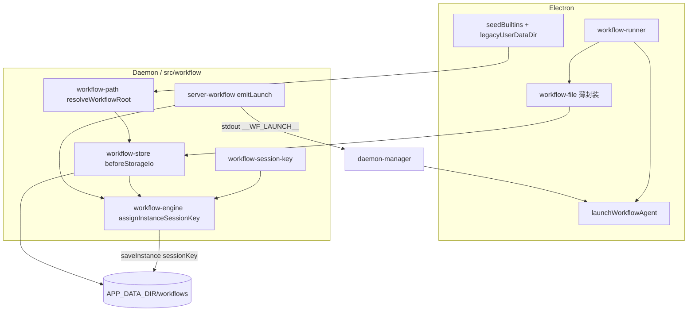

# 工作流会话键与存储统一 - 代码评审报告

## 1、审查范围

- **变更类型**: apply 产出的未提交变更（`stage=applied`，T1–T5 done，T6 契约脚本待落盘）
- **评审等级**: **focused-review**（单域存储 SSOT + sessionKey 持久化，跨 Electron/Daemon 但无 proto/DB/权限扩展；对照 `02` Ponytail 最小方案，未升格 full-review）
- **涉及文件**: 11 个（manifest `kind=code|agents` 已实现项 + 本报告）
- **设计文档**: `02-design.md`（对照基准）
- **CodeGraph**: 已尝试 `codegraph_context` / `codegraph_impact`（`projectPath=/home/suveng/doger/cursor-claw`）；新符号 `workflow-path` / `workflow-session-key` / `migrateLegacyWorkflowDirIfNeeded` 尚未入索引，辅以 `git diff` 与源码核对 `workflow-runner` → `workflow-file` → `workflow-store` 及 `launchWorkflowAgent` 调用链

## 2、严重（必须处理）

无

## 3、警告（建议处理）

无（评分 ≥ 75 项经复核后均未达阈值）

**Ponytail 精简轴**（focused-review #3 必做）：对照 `02` §2 最小方案三问 — 仅新增 `workflow-path.ts`（136 行）与 `workflow-session-key.ts`（24 行）两个小模块，无 Repository/LaunchOrchestrator/新 npm 依赖；`workflow-file.ts` 瘦身为 re-export。结论：**Lean already. Ship.**

## 4、设计偏差

1. **sessionKey 辅助函数命名**
   - 设计预期: `02` §1.3 写 `persistInstanceSessionKey`
   - 实际实现: `workflow-session-key.ts` 导出 `assignInstanceSessionKey`（不可变返回新对象）
   - 影响: 纯命名差异，职责与 `03` T3 契约一致，无行为偏差

2. **Daemon 侧遗留迁移未传 `legacyUserDataDir`**
   - 设计预期: `03` T5 — Electron `seedBuiltins` 传 `legacyUserDataDir`；Daemon store 首次 IO 亦触发迁移
   - 实际实现: `workflow-store.beforeStorageIo` 调用 `migrateLegacyWorkflowDirIfNeeded()` 无参，仅探测 `cwd/workflows`；Electron 路径由 `workflow-file.seedBuiltins` 带参覆盖
   - 影响: 纯 Daemon 冷启动且 SSOT 空、数据仅在历史 Electron userData 时，需等 Electron 侧 `seedBuiltins` 才迁移；与常见「先开 Electron」部署一致，评分约 55

## 5、验收标准检查

| 任务 | 验收条件 | 状态 |
|------|---------|------|
| T1 | `APP_DATA_DIR` 未设置时 no-op，不静默写错误根 | ✅ `canUseStorage()` 守卫全部 IO |
| T1 | 双端解析 `{userData}/workflows` | ✅ `resolveWorkflowRoot` + Electron 注入 `APP_DATA_DIR` |
| T1 | 新文件 ≤300 行 | ✅ path 136 / session-key 24 / store 131 |
| T2 | runner 不再直接 import `workflow-store` | ✅ grep 仅 `workflow-file` 委托 store |
| T2 | 实例/定义同 SSOT 根 | ✅ `workflow-file` 薄封装 + re-export |
| T2 | 定义 CRUD 仍可用 | ✅ 符号面未变 |
| T3 | isolated `handleNext`/`handleReject`/`resumeWorkflow` 落盘 `sessionKey` | ✅ `assignInstanceSessionKey` + `saveInstance` |
| T3 | 非 isolated 不强制写键 | ✅ 仅 isolated 分支赋值 |
| T3 | 键格式与 launch 对齐 | ✅ `{notifyChatId\|\|"wf"}::wf_{instanceId}_{nodeId}` |
| T4 | `launchWorkflowAgent` 优先 `sessionKey?` | ✅ `session-dispatcher-launch.ts:141-142` |
| T4 | runner run/resume 传 `fresh.sessionKey` | ✅ |
| T4 | `emitLaunch` payload 含 `sessionKey` | ✅ `server-workflow.ts:38` |
| T4 | `__WF_LAUNCH__` 透传至 launch | ✅ `daemon-manager.ts:651-652` 整包 JSON |
| T5 | 迁移幂等、SSOT 非空跳过 | ✅ `migrationChecked` + `isDirEmpty` |
| T5 | WARN 中文日志 | ✅ |
| T5 | 不删 legacy | ✅ 仅 `copyFileSync` |
| T6 | AGENTS 同步 | ✅ `src/workflow/AGENTS.md`、`electron/workflow/AGENTS.md` diff 已更新 |
| T6 | ST-WF1～WF6 契约脚本 | ⏳ `06-automation-test.md` / `auto_test/*` 未落盘（manifest T6 pending） |
| 01 §六-1 | 重启可恢复 sessionKey | ✅ 引擎落盘 + launch 复用（静态路径） |
| 01 §六-2 | 双端同一存储真相 | ✅ 本变更直接消解父变更 §6「双路径」中风险 |
| 01 §六-3 | resume 三入口仍通 | ✅ 入口未改，底层读盘/launch 增强 |
| 01 §六-4 | 非目标未扩大 | ✅ 无 Gateway/YAML/create 扩面 |
| 01 §六-5 | 无双写 session-routing | ✅ 未触及 `session-routing.json` |
| 01 §六-6 | 运维可识别存储根 | ✅ `workflow_storage_root=` 首次 IO 日志 |

## 6、调用链与回归风险

| 风险点 | 等级 | 说明 |
|--------|------|------|
| 模块加载顺序 `APP_DATA_DIR` | 低 | `workflow-file` 在 import store 后补设 env；首次 IO 前已就绪 |
| `emitLaunch` 使用陈旧 `inst` | 低 | `respondEngineResult` / `resumeWorkflowAndEmit` / MCP run 均 `getInstance` 后再 emit |
| launch 失败但 sessionKey 已落盘 | 低 | 与 design「引擎预写 + launch 用同一键」一致；resume 可重试 |
| 遗留迁移仅 Electron 带 userData | 低 | 见 §4.2；常见部署可接受 |
| `workflow-engine.ts` 439 行 | 低（既有） | 超 300 行属历史体量，非本变更引入 |
| 父变更双路径风险 | **已缓解** | 统一经 `workflow-store` + lazy path |

## 7、遗留债务

1. **T6 契约自动化未落盘**：`auto_test/run-workflow-session-storage-contract.*` 与 `06-automation-test.md` 仍为 planned；建议在 `/kb-test` 或 archive 前补齐 ST-WF1～WF6 静态/联调断言（尤其 `session-routing.json` 无 `::wf_`）。非本评审 `reviews[]` open 项。
2. **业务域知识库**：`02` §10 所列 `knowledge/业务域/工作流/*` 待 `/kb-archive` 阶段同步（非 review 阻断）。

## 8、修复任务建议

| 问题 ID | 建议动作 | 关联任务 |
|---------|----------|----------|
| — | 无 open 阻断项 | — |

## 9、结论

**通过**，可进入 `/kb-test`（建议优先落盘 T6 契约脚本）及后续 `/kb-archive`。

实现与 `02`/`03` 在存储 SSOT、sessionKey 引擎落盘、launch 复用持久键及 Electron 混用修复上保持一致；`reviews[]` 零 open/accepted_debt。建议在 test 阶段手工或契约验证：isolated 节点 JSON 含键、Electron 重启后 resume Agent 同键、Daemon MCP run 与 UI 实例同目录可见。
