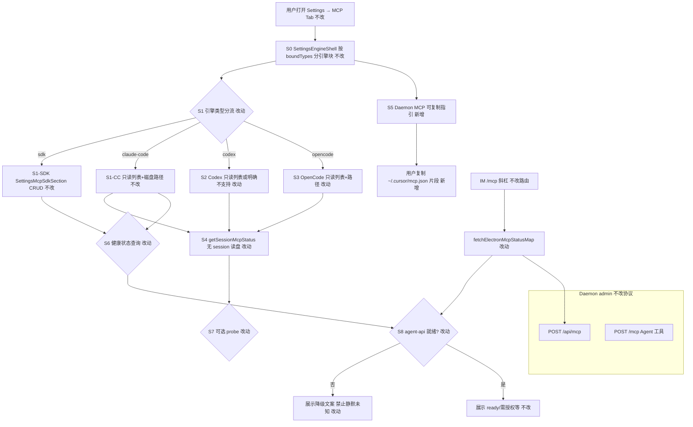
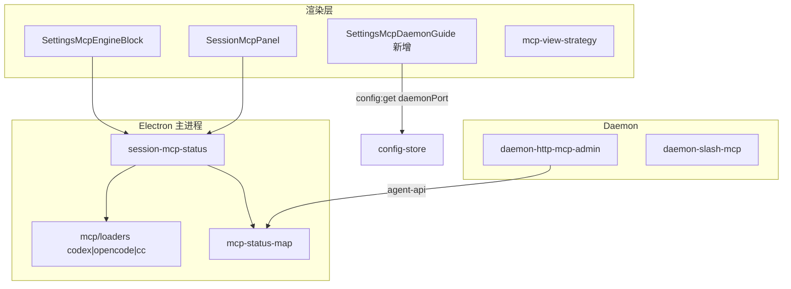

# 多引擎MCP设置实质化 - 实现设计

> **业务 PRD**：见同目录 `01-proposal.md`（验收标准以 01 为准）
> **前置依赖**：`20260712144931-斜杠执行模式稳态收尾`（已归档；`/mcp-admin` 移除、`buildMcpServers` 仅 `cursor-claw`→`/mcp`）

## 一、业务流程与改动范围

> 业务口径以 `01-proposal.md` §四场景 S1–S5、§五 R1–R6、§六验收为准。

### （一）业务流程图

**图例**：`不改` 行为与现网一致；`改动` 需改代码/配置；`新增` 新节点或新分支；`删除` 本期无删除项。

### （二）流程步骤与改动对照

| 步骤 ID | 业务含义 | 改动 | 落点（模块/文件） | 01 验收关联 |
|---------|----------|------|-------------------|-------------|
| S0 | Settings MCP Tab 经 `SettingsEngineShell` 按通道绑定引擎分块 | 不改 | `src/renderer/pages/Settings.tsx`；`SettingsEngineShell.tsx` | R4 |
| S1-SDK | SDK 引擎 MCP CRUD（global/project） | 不改 | `SettingsMcpSdkSection.tsx`；`mcp-manager.ts` | R1（SDK 已实质化） |
| S1-CC | Claude Code 只读磁盘列表 | 不改 | `SettingsMcpEngineBlock.tsx` `SettingsMcpCcReadonly` | R1 |
| S2 | Codex：占位 → 只读列表 + TOML 路径说明；或明确「Settings 不支持编辑」 | 改动 | `SettingsMcpEngineBlock.tsx`；`mcp-view-strategy.ts` | 验收 6.1.1；R1 |
| S3 | OpenCode：占位 → 只读列表 + JSON 路径说明 | 改动 | `SettingsMcpEngineBlock.tsx`；`mcp-view-strategy.ts` | 验收 6.1.1；R1 |
| S4 | 无活跃 session 时按 `engineType` 读 Codex/OpenCode 磁盘配置 | 改动 | `electron/session/session-mcp-status.ts`（超限拆 `session-mcp-disk-fallback.ts`） | R1；S1/S2 |
| S5 | 产品内可复制 Cursor→Daemon MCP 片段（含端口与 admin 入口说明） | 新增 | `SettingsMcpDaemonGuide.tsx`；挂 `SettingsMcpEngineBlock` 或 Shell | 验收 6.1.3；R3 |
| S6 | Settings/Session 列表健康列展示 | 改动 | `SessionMcpPanel.tsx`（空 status 降级文案）；SDK 区若展示健康则对齐 | 验收 6.1.2；R2 |
| S7 | Codex/OpenCode 磁盘列表首版可不 probe（`source:disk`）；有 session 时沿用引擎注入快照（后续可选） | 改动 | `session-mcp-status.ts`；`mcp-status-map.ts` 已支持 `engineType` 缓存键 | R2 边界 |
| S8 | agent-api 未就绪时健康探测失败 | 改动 | `src/daemon/daemon-http-mcp-admin.ts`；`daemon-slash-mcp.ts`；`electron/scheduling/command-handler.ts` | 验收 6.1.2；R2 |
| S9 | Daemon MCP 协议与 `/mcp`、`POST /api/mcp` 路由 | 不改 | `daemon-http-mcp.ts` `createAdminMcpServer`；`server-admin.ts` | R6 |
| S10 | 自动写盘注入 MCP（launch 路径） | 不改（已 no-op） | `workspace-injector.ts` `injectMcpGlobal` | R3（指引替代自动写盘） |
| DOC | 工程平台 KB 与 AGENTS 口径 | 改动 | `knowledge/工程平台/Electron桌面应用/04-配置与更新.md` 等（archive 主消费） | 验收 6.1.4；R5 |

### （三）改动汇总

- **改动**：`session-mcp-status.ts`（codex/opencode 读盘分支）、`SettingsMcpEngineBlock.tsx`、`mcp-view-strategy.ts`、健康文案三处（daemon admin / slash / command-handler）、`SessionMcpPanel.tsx` 空 status 展示
- **新增**：`SettingsMcpDaemonGuide.tsx`（可复制 `mcp.json` 片段 + admin 入口说明）；可选 `src/shared/mcp-health-label.ts`（纯函数 SSOT，避免三处漂移）
- **不改（显式列出）**：Daemon MCP 协议、`createAdminMcpServer` 函数体、`SettingsMcpSdkSection` CRUD 逻辑、SDK/CC 既有只读块、`workspace-injector` 自动注入（保持 no-op）、微信通道、整页 Settings 布局

## 二、整体思路

**根因**（见 01 §一）：多引擎 Settings MCP 区仍分三档——SDK 可 CRUD、CC 只读、Codex 静默占位、OpenCode 仅路径文案；`getSessionMcpStatus` 仅覆盖 CC/SDK session 路径，Codex/OpenCode 无 session 时恒空态；健康链路在 `agent-api-port.json` 不可读时 `formatMcpHealthLabel` 仍输出「未知」，`healthError` 未上浮为用户可读句（CodeGraph：`formatMcpHealthLabel` @ `daemon-http-mcp-admin.ts:74`；`SettingsMcpCodexPlaceholder` @ `SettingsMcpEngineBlock.tsx:108`；`readCodexMcpServers` @ `codex-mcp-loader.ts:175`）。

**方案要点**：

1. **引擎能力分档（对齐 PRD R1）**：SDK 维持 CRUD；CC/Codex/OpenCode Settings **首版统一只读展示**——复用 `getAgentMcpStatus("", …, engineType, workspaceDir)` + 既有 loader（`cc-mcp-loader` / `codex-mcp-loader` / `opencode-mcp-loader`），路径说明写入 `mcp-view-strategy`；Codex 从 `supported:false` 改为 `supported:true`（仅展示，TOML 编辑仍引导用户改文件，文案标明「设置页不提供 TOML 编辑」）。
2. **健康降级（R2）**：抽取或内联统一 `formatMcpHealthDisplay(status?, healthError?)`——有 `healthError` 时优先展示「暂不可查（{reason}）」；无 status 且无 error 时展示「暂不可查（依赖未就绪）」；**禁止**单独「未知」。`buildMcpServerInfo` / 斜杠 `/mcp` / `command-handler` 三处对齐。
3. **Daemon 指引（R3）**：新增可复制区，内容对称 `buildMcpServers()`：`cursor-claw` → `http://127.0.0.1:{daemonPort}/mcp`（端口读 `config:get` `daemonPort`）；脚注说明管理工具走 IM `/mcp` 或 HTTP `POST /api/mcp`（`/mcp-admin` 已废弃，见依赖 #2）。
4. **与稳态收尾衔接（S5）**：不恢复 `/mcp-admin` 注入；`CLAW_MCP_KEYS` cleanup 语义不变。

**最小方案三问（Ponytail）**：

1. **能否复用现有模块？** 能。读盘复用三 loader；Settings 复用 CC 只读 UI 模式；健康转发复用 `fetchElectronMcpStatusMap`→`POST /api/mcp/status-map`。
2. **拟新增抽象是否 PRD 要求？** 否。仅可选 `src/shared/mcp-health-label.ts` 纯函数（≤40 行）防三处文案漂移；不建「多引擎 Settings 策略类」。
3. **能否合并到已有文件？** 优先。Codex/OpenCode 块并入 `SettingsMcpEngineBlock.tsx`；`session-mcp-status.ts` 已近 300 行，新增分支后若超限拆 `session-mcp-disk-fallback.ts`，不预建通用 MCP 仓储层。

## 三、分层设计

- **端点层**：无新 HTTP 路由；沿用 `agent:mcp-status` IPC、`POST /api/mcp/status-map`。
- **服务层**：`getSessionMcpStatus` 增 codex/opencode 无 session 分支；健康文案纯函数。
- **数据层**：磁盘 — `~/.codex/config.toml`、`{ws}/.codex/config.toml`；`~/.config/opencode/opencode.json`、`{ws}/opencode.json`；SDK 仍 `~/.cursor/mcp.json`。

## 四、接口设计

| 接口 | 变更 | 说明 |
|------|------|------|
| `agent:mcp-status` IPC | 扩展 | `engineType` 支持 `codex`/`opencode` 无 session 读盘；返回 `source:"disk"` |
| `POST /api/mcp/status-map` | 不改 | Daemon 转发 agent-api；失败时响应含 `error` 中文 |
| `config:get` | 不改 | 渲染层读 `daemonPort` 生成指引片段 |
| `listMcpForWorkspace` | 不改 | SDK Settings CRUD 沿用 |
| `mcp:status-map` | 不改 | 可选后续 Settings SDK 健康列 |

无新增 IPC；无 proto 变更。

## 五、数据结构

- **McpServerEntry**：不扩展字段；Codex/OpenCode 条目 `source` 仍为 `global`/`project`。
- **AgentMcpStatusResult**：不变；`statusMap` 在 disk 路径可为空或仅含 `disabled`。
- **健康展示**：`buildMcpServerInfo.health` 字符串语义变更（含降级原因），`healthError` 保留供详情。

## 六、实现步骤

1. **步骤 1（S8）**：统一健康展示纯函数；改 `daemon-http-mcp-admin`、`daemon-slash-mcp`、`command-handler` 三处。
2. **步骤 2（S4/S7）**：`getSessionMcpStatus` 增加 `engineType===codex|opencode` 无 session 读盘；文件超限则拆分 fallback 模块。
3. **步骤 3（S2/S3/S6）**：`mcp-view-strategy` 更新 Codex 文案；`SettingsMcpEngineBlock` 替换 Codex/OpenCode 占位为只读块（对称 CC）。
4. **步骤 4（S5）**：新增 `SettingsMcpDaemonGuide` 并挂到 MCP Tab（SDK 块上方或 Shell 公共区）。
5. **步骤 5（S6）**：`SessionMcpPanel` 空 `statusMap` 时展示降级提示（非「—」静默）。
6. **步骤 6（DOC）**：更新相关 `AGENTS.md`；archive 时由 librarian 合并工程平台 KB。

## 七、参考实现

| 符号/路径 | 用途 |
|-----------|------|
| `SettingsMcpEngineBlock` `SettingsMcpCcReadonly` | CC 只读模板 |
| `readCodexMcpServers` `codex-mcp-loader.ts:175` | Codex 磁盘合并 |
| `readOpencodeMcpServers` `opencode-mcp-loader.ts:50` | OpenCode 磁盘合并 |
| `getSessionMcpStatus` `session-mcp-status.ts:225` | 展示层统一入口 |
| `fetchElectronMcpStatusMap` `daemon-http-mcp-admin.ts:129` | Daemon→agent-api 健康 |
| `buildMcpServers` `workspace-injector.ts:34` | 指引片段 SSOT |
| `formatMcpHealthLabel` `daemon-http-mcp-admin.ts:74` | 待改「未知」口径 |
| `createAdminMcpServer` `daemon-http-mcp.ts:97` | admin MCP（不改协议） |
| `resolveWorkspaceKey` `mcp-status-map.ts:13` | engineType 缓存键（probe 可选） |

## 八、技术影响

### （一）影响范围

- **涉及模块**：Electron session/mcp、renderer Settings/MCP、Daemon admin/slash、scheduling command-handler。
- **接口/proto 变更**：无。
- **数据变更**：无持久化 schema 变更；仅 UI 读盘展示。
- **风险**：`session-mcp-status.ts` 行数临界（~299 行）——拆分不当易环引；Codex TOML 无 Settings 编辑需文案清晰避免用户误以为可 CRUD；`daemonPort` 与实跑 Daemon 不一致时指引需提示「以 Settings 通用页端口为准」。

### （二）工程补充验收项

- [ ] `agent-api-port.json` 缺失或 port=0 时，`/mcp ls` 与 `POST /api/mcp` info 健康列含可读中文原因，**无单独「未知」**
- [ ] Settings Codex/OpenCode 块展示至少一条磁盘配置或空态路径引导，**无**「尚未支持」静默占位
- [ ] 可复制指引一键复制后粘贴为合法 `mcp.json` 片段（含 `cursor-claw` url）
- [ ] `session-mcp-status.ts` 及新增文件均 ≤300 行；改动含中文注释
- [ ] 显式 `SLASH_EXEC_MODE` 与 `/mcp-admin` 410 行为无回归（依赖 #2）

## 九、知识库影响

- `knowledge/工程平台/Electron桌面应用/04-配置与更新.md` — 注入废弃 + Daemon 指引入口（高）
- `knowledge/工程平台/Electron桌面应用/03-渲染端界面.md` — Settings MCP 多引擎分块（中）
- `knowledge/工程平台/Daemon守护进程/02-HTTP与MCP服务.md` — 健康降级文案、`/api/mcp`（中）
- `knowledge/业务域/Agent调度/` 各引擎 MCP 子模块 — Codex/OpenCode 配置路径（低～中，视 archive 范围）
- 两级索引：仅 archive 后 README 引用失真时更新

## 十、知识库更新计划

### （一）必须更新

- `knowledge/工程平台/Electron桌面应用/04-配置与更新.md` — 手动 MCP 指引、多引擎 Settings 能力表
- `knowledge/工程平台/Electron桌面应用/03-渲染端界面.md` — Settings MCP Tab 引擎块说明

### （二）可能更新（视实现结果）

- `knowledge/工程平台/Daemon守护进程/02-HTTP与MCP服务.md` — `/mcp` 健康降级字段
- `electron/session/AGENTS.md`、`src/renderer/components/AGENTS.md`、`src/daemon/AGENTS.md` — implement 轮同步（非业务域正文）

### （三）不需要更新

- `knowledge/知识索引.md` — 无新领域入口
- Daemon MCP 协议正文 — 无协议变更
- 微信通道相关文档
